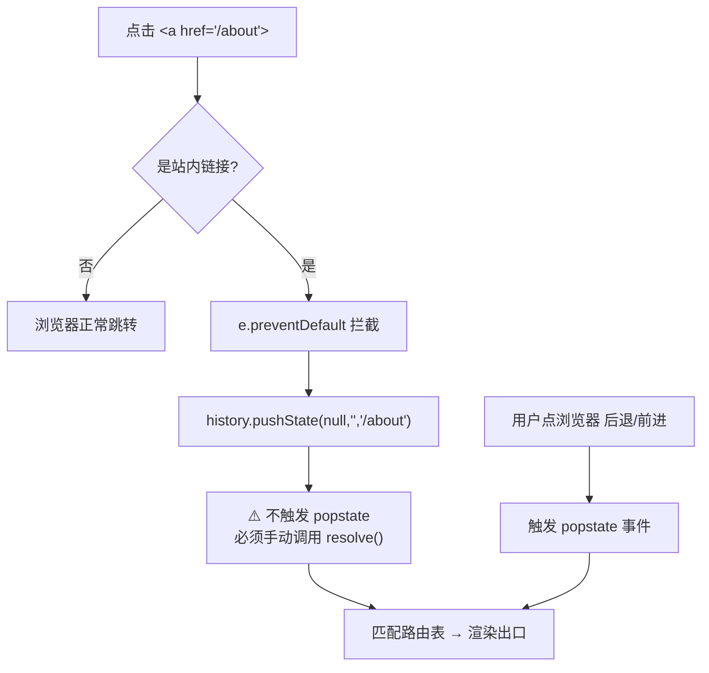

# 03 · History 路由原理 + 手写实现（History Router）

> History 路由用 HTML5 History API 的 `history.pushState()` 修改 URL 而**不刷新**页面，得到没有 `#` 的「干净 URL」（如 `/about`）。代价是：直接访问 / 刷新子路由时服务器必须把请求回退到 `index.html`（见 `04`），否则 404。

## 📖 知识讲解

### 核心 API（对照 MDN History API）

| API | 说明 |
| --- | --- |
| `history.pushState(state, unused, url)` | **新增**一条历史记录并把 URL 改为 `url`，**不刷新页面**。`state` 可存任意可序列化数据，`unused` 是历史遗留参数（传 `''`），`url` 必须**同源** |
| `history.replaceState(state, unused, url)` | 与 pushState 相同，但**替换**当前记录而非新增（用于重定向、不留历史） |
| `window.onpopstate` | **用户点击浏览器前进/后退**、或调用 `history.back()/forward()/go()` 时触发。可从 `event.state` 取出当时存的数据 |
| `history.back() / forward() / go(n)` | 编程式前进后退，会触发 `popstate` |
| `history.state` / `history.length` | 当前记录的 state / 历史栈长度 |

### 关键陷阱：pushState 不会触发 popstate ⚠️

这是 history 路由与 hash 路由**最本质的区别**（已对照 MDN 确认）：

- `pushState()` / `replaceState()` **只改 URL，不触发任何事件**。
- 只有**前进/后退**（用户点按钮或 `back/forward/go`）才触发 `popstate`。

所以手写 history 路由时，光监听 `popstate` **不够** —— 你自己调用 `pushState` 后，必须**手动**再调一次渲染函数。这就是为什么框架都把「pushState + 渲染」封装成一个 `push()` 方法。

```js
push(path) {
  history.pushState(null, '', path); // ① 改 URL（不触发事件）
  this.resolve();                    // ② 必须手动渲染
}
```

### 拦截 `<a>` 链接

history 模式下 `<a href="/about">` 是**真实链接**，直接点会让浏览器发请求刷新。所以必须全局拦截：`e.preventDefault()` 后改用 `router.push()`。（Vue Router 的 `<RouterLink>`、React Router 的 `<Link>` 内部就是干这件事。）

## 🔄 流程图 / 原理图



## 💻 代码说明

`index.html` 手写了 `HistoryRouter`，核心逻辑：

```js
class HistoryRouter {
  constructor(outlet) {
    this.routes = {};
    this.outlet = outlet;
    // 只监听 popstate（前进/后退）。pushState 不会进这里，需手动渲染。
    window.addEventListener('popstate', () => this.resolve());
    // 全局拦截站内 <a>，改用 pushState 导航
    document.addEventListener('click', (e) => {
      const a = e.target.closest('a[data-link]');
      if (!a) return;
      e.preventDefault();                 // 阻止真实跳转
      this.push(a.getAttribute('href'));
    });
  }
  on(path, handler) { this.routes[path] = handler; return this; }
  resolve() {
    const path = location.pathname;       // history 模式读 pathname（不是 hash）
    const handler = this.routes[path] || this.routes['*'];
    this.outlet.innerHTML = handler ? handler() : '404';
  }
  push(path) {
    history.pushState(null, '', path);    // 改 URL 不刷新
    this.resolve();                       // ⚠️ pushState 不触发事件，手动渲染
  }
}
```

## ▶️ 运行方式

> ⚠️ **history 路由必须通过本地服务器访问**，不能直接双击 `file://` 打开 —— 因为 `pushState` 在 `file://` 下改路径会触发 `SecurityError`，且刷新会真的去找文件。这恰好印证了「history 模式依赖服务器」。

在本模块目录起一个静态服务器（任选其一）：

```bash
# Python3
python3 -m http.server 8080
# 或 Node（npx serve 会自动把所有路径回退到 index.html，更贴近生产）
npx serve -s . -l 8080
```

然后浏览器打开 `http://localhost:8080/`：

- 点导航：URL 变成 `/about`（**没有 #**），页面不刷新。
- 点浏览器「后退/前进」：触发 `popstate`，正确回到上一路由。
- 用 `python -m http.server` 时**刷新 `/about` 会 404**（它按文件找），这正是要在 `04` 里用 nginx `try_files` 回退解决的问题；`npx serve -s` 已自动回退，刷新不会 404。

## ⚠️ 常见坑 / 最佳实践

- **pushState 不触发 popstate** —— 手写路由最容易踩的坑，务必手动渲染。
- `pushState` 的 `url` 必须**同源**，否则抛 `SecurityError`（安全限制，防伪造地址栏）。
- 第二个参数 `title` 现代浏览器忽略，规范里叫 `unused`，传 `''` 即可。
- 生产部署**必须**配置服务器回退（`try_files ... /index.html`），否则用户刷新子路由或直接访问就 404 —— 详见 `04-hash-vs-history`。

## 🔗 官方文档

- MDN History API：https://developer.mozilla.org/zh-CN/docs/Web/API/History_API
- MDN `History.pushState()`：https://developer.mozilla.org/zh-CN/docs/Web/API/History/pushState
- MDN `popstate` 事件：https://developer.mozilla.org/zh-CN/docs/Web/API/Window/popstate_event
- Vue Router `createWebHistory`：https://router.vuejs.org/zh/api/#createwebhistory
