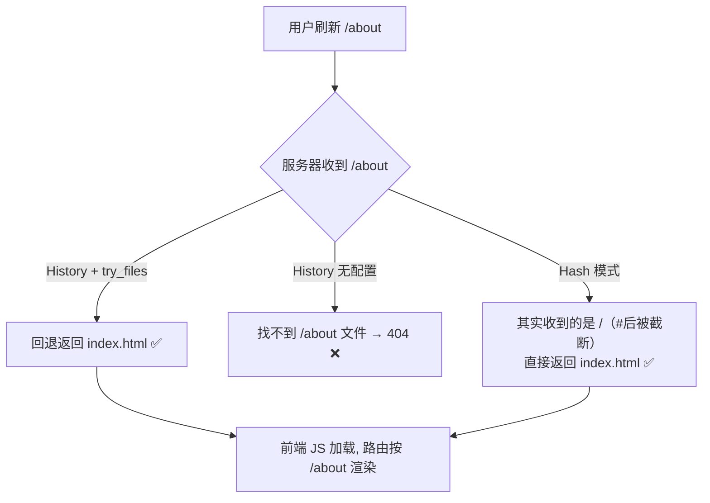

# 04 · Hash vs History 对比 + 部署差异（Hash vs History & Deploy）

> 两种前端路由模式殊途同归（都是「改 URL 不刷新地渲染」），但机制、URL 形态、SEO、**部署要求**差别明显。核心结论：**hash 零服务器配置；history URL 干净但必须让服务器把所有路径回退到 `index.html`**。

## 📖 知识讲解

### 全面对比

| 维度 | Hash 模式 | History 模式 |
| --- | --- | --- |
| URL 形态 | `example.com/#/about` 带 `#` | `example.com/about` 干净 |
| 底层 API | `location.hash` + `hashchange` | `history.pushState` + `popstate` |
| 变化是否发请求 | `#` 后内容**不发**给服务器 | 首次/刷新时 pathname **会**发给服务器 |
| 感知变化 | `hashchange`（赋值也触发） | `popstate`（仅前进后退；pushState 需手动渲染） |
| 服务器配置 | **不需要**，天然刷新不 404 | **必须**回退到 index.html，否则刷新 404 |
| SEO | 较差（`#` 后不被索引） | 较好（每个 URL 是真实路径，配合 SSR 最佳） |
| 兼容性 | 极好（老 IE 也支持） | IE10+ |
| 适用 | 后台管理、静态托管、内嵌页 | 面向用户/需 SEO 的站点 |

### 为什么 history 模式刷新会 404 ❗

访问 `example.com/about` 并按刷新时，浏览器把**完整路径 `/about` 发给服务器**。服务器上并没有 `about` 这个文件/目录，于是返回 404。而 SPA 的路由表在 **前端 JS** 里，服务器根本不知道 `/about` 是个前端路由。

**解法**：配置服务器 —— 「先找真实文件，找不到就一律返回 `index.html`」。这样浏览器拿到 `index.html`、加载 JS，前端路由再根据当前 URL 渲染 `/about`。

而 hash 模式下，`/about` 藏在 `#` 后面，服务器只看到 `example.com/`，永远返回 index.html，所以**不需要**这层配置。

### 生产部署配置（对照 Vue Router 官方）

**Nginx**（最常用）：

```nginx
location / {
  try_files $uri $uri/ /index.html;
  # 依次尝试：真实文件 → 真实目录 → 都没有就返回 index.html（交给前端路由）
}
```

**Apache** `.htaccess`：

```apache
RewriteEngine On
RewriteBase /
RewriteRule ^index\.html$ - [L]
RewriteCond %{REQUEST_FILENAME} !-f
RewriteCond %{REQUEST_FILENAME} !-d
RewriteRule . /index.html [L]
```

**Node/Express**：

```js
app.use(express.static('dist'));
app.get('*', (req, res) => res.sendFile(path.resolve('dist/index.html')));
```

**开发**：Vite `vite.config.js` 默认已对 history 回退（`historyApiFallback` 行为内建）；`npx serve -s` 的 `-s` 就是 single-page 回退。

## 🔄 流程图 / 原理图



## 💻 代码说明

`index.html` 是一个交互式对比面板：切换「Hash / History」两种模式，直观看到 URL 形态差异、底层 API 差异，并模拟「刷新子路由」在两种模式下服务器分别看到什么。（纯前端演示，不需服务器。）

## ▶️ 运行方式

免构建，浏览器直接打开 `index.html`，点按钮切换模式对比。部署配置部分照抄上面的 nginx/apache 片段到你的服务器即可。

## ⚠️ 常见坑 / 最佳实践

- history 部署忘配 `try_files` → 用户刷新/分享子路由 404，是上线最高频事故之一。
- 子路径部署（如站点在 `example.com/app/`）：Vue 要设 `createWebHistory('/app/')`、Vite 设 `base: '/app/'`，nginx 的 `try_files` 回退目标也要对应 `/app/index.html`。
- 静态托管（GitHub Pages / OSS）不方便配回退时，**用 hash 模式最省事**。
- 需要 SEO / 首屏性能 → history 模式 + SSR（见 `08`）。

## 🔗 官方文档

- Vue Router 服务器配置（HTML5 History 模式）：https://router.vuejs.org/zh/guide/essentials/history-mode.html
- MDN History API：https://developer.mozilla.org/zh-CN/docs/Web/API/History_API
