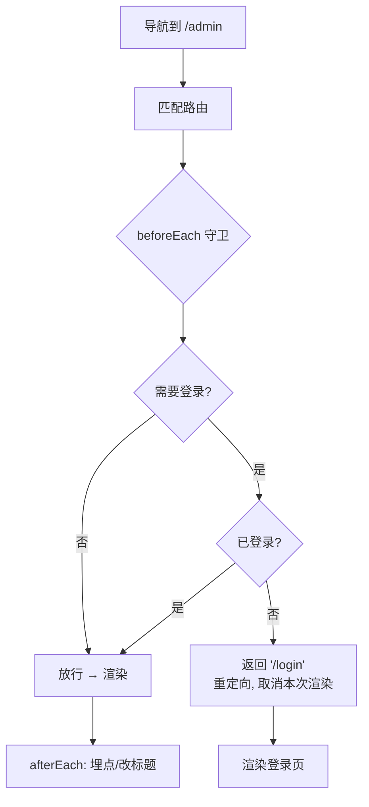

# 05 · 导航守卫 / 权限拦截（Route Guards）

> 导航守卫是「在路由真正切换之前插一段拦截逻辑」的机制：可以放行、重定向、或取消导航。最典型的用途是**登录/权限校验**：未登录访问后台就重定向到登录页。

## 📖 知识讲解

### 守卫的本质

前面手写的路由是「匹配到就直接渲染」。守卫做的是在**「匹配」与「渲染」之间**插入一个钩子：

```
URL 变化 → 匹配路由 → [ 守卫钩子：放行? 重定向? 取消? ] → 渲染 / 跳走
```

守卫函数拿到「要去哪 `to`」「从哪来 `from`」，返回一个决定：

- 返回 `true` / 不返回 → **放行**，正常渲染。
- 返回一个路径（如 `/login`）→ **重定向**到该路径。
- 返回 `false` → **取消**本次导航，停在原地。

### 对照 Vue Router 的守卫模型

Vue Router 提供多级守卫，理解一个就理解全部：

| 守卫 | 触发时机 |
| --- | --- |
| `router.beforeEach((to, from) => ...)` | **全局前置守卫**，每次导航前都跑（最常用于鉴权） |
| `beforeEnter`（路由独享） | 进入某条路由前 |
| `beforeRouteEnter/Update/Leave`（组件内） | 组件级别，如「离开未保存表单时确认」 |
| `router.afterEach` | 导航完成后（常用于埋点、改标题） |

React Router 里没有内置 `beforeEach`，惯用「守卫组件」`<RequireAuth>` 包住受保护路由，未登录则 `<Navigate to="/login">` —— 思想完全一致。

### 常见守卫逻辑：鉴权

```js
router.beforeEach((to) => {
  if (to.meta.requiresAuth && !isLoggedIn()) {
    return '/login';   // 需要登录但没登录 → 重定向
  }
  // 否则放行
});
```

给路由加 `meta: { requiresAuth: true }` 标记哪些页面需要登录，守卫统一拦截。

## 🔄 流程图 / 原理图



## 💻 代码说明

`index.html` 在手写 hash 路由基础上加了一个 `beforeEach` 守卫：

```js
// 路由表带 meta 标记
router.on('/admin', adminView, { requiresAuth: true });

// 全局前置守卫：渲染前先问守卫
router.beforeEach((to) => {
  if (to.meta.requiresAuth && !state.loggedIn) {
    return '/login';               // 未登录 → 重定向到登录页
  }
  return true;                     // 放行
});
```

- 点「登录 / 退出」按钮切换登录态。
- 未登录点「后台(需权限)」→ 被守卫拦截并重定向到登录页。
- 登录后再点 → 正常进入后台。控制台/页面会打印守卫决策过程。

## ▶️ 运行方式

免构建，浏览器直接打开 `index.html`。先在未登录状态点「后台」看被拦截，再点「登录」后重试。

## ⚠️ 常见坑 / 最佳实践

- 守卫里做重定向要**避免死循环**：`/login` 本身不要标 `requiresAuth`，否则无限重定向。
- 异步鉴权（如请求接口验 token）时守卫应支持 `async/await`，等结果再放行。
- 守卫只是**前端体验层拦截**，真正的安全必须由**后端接口鉴权**兜底 —— 前端守卫能被绕过（用户可改 JS）。
- 记录来源：拦截到登录页时把 `to` 存起来（`redirect` 参数），登录成功后跳回原目标页，体验更好。

## 🔗 官方文档

- Vue Router 导航守卫：https://router.vuejs.org/zh/guide/advanced/navigation-guards.html
- React Router 鉴权模式：https://reactrouter.com/start/framework/routing
