# 06 · 动态路由匹配 + 路由懒加载（Dynamic & Lazy Route）

> 动态路由用**一条带参数的规则**（如 `/user/:id`）匹配无数个具体 URL，并把 URL 里的动态段解析成 `params`；路由懒加载让每个路由对应的组件**「用到才下载」**，把大包切成一个个小 chunk，显著减小首屏体积。二者是真实项目里路由表最常用的两个能力。

## 📖 知识讲解

### 一、动态路由：把 `:param` 编译成正则

路由表不可能给每个用户写一行 `/user/1`、`/user/2`…。做法是用**占位符**：`/user/:id`。匹配时把它编译成一个**正则**，动态段变成捕获组：

```
'/user/:id'  ──编译──►  /^\/user\/([^/]+)$/   参数名 keys = ['id']
```

- `:id` → `([^/]+)`：匹配「一段非 `/` 的字符」，正好是一个路径层级。
- 命中后，用捕获组的值按顺序还原成对象：`{ id: '2' }`。
- 记得 `decodeURIComponent`，否则中文/空格参数会是 `%E4%B8%AD` 这种编码。

> Vue Router / React Router 内部也是这么干的（React Router 用 `path-to-regexp` 思路，Vue Router 有自研的路径解析器），只是还支持 `:id?`（可选）、`:id(\\d+)`（自定义正则）、`/:rest*`（通配捕获）等更强的语法。

### 二、路由懒加载：component 从「组件」变成「返回 Promise 的函数」

**非懒加载**（同步）：组件在 app 启动时就全部打进主包 →首屏很大。

```js
{ path: '/settings', component: Settings }          // 直接引用，打进主包
```

**懒加载**（异步）：component 传一个**函数**，进入该路由时才调用它，函数返回一个 `Promise`，`resolve` 出真正的组件。打包器（Vite/webpack）看到 `import()` 就会**自动把它切成单独的 chunk**（代码分割 code-splitting）：

```js
{ path: '/settings', component: () => import('./Settings.vue') } // 用到才下载
```

- 路由器发现 component 是函数 → 先渲染「加载中」占位 → `await` 它 → 拿到组件再渲染。
- 加载过的 chunk 会被浏览器/打包器缓存，第二次进入瞬间完成。
- 本 demo 用 `setTimeout` + Promise **模拟** chunk 下载（因为 `file://` 下真实 `import()` 会被 CORS 拦，双击就打不开了）；在 Vite 项目里把 `fakeChunk(...)` 换成 `() => import('./Settings.vue')` 就是生产写法。

### 三、防竞态（race condition）⚠️

懒加载是异步的：用户可能在 chunk 还没下载完时就点了别的链接。等旧 chunk 回来再渲染就会「渲染错页面」。所以 `await` 回来后要**核对当前 URL 是否还是当初那个**，不是就丢弃结果（demo 里的 `token` 判断）。

## 🔄 流程图 / 原理图

```mermaid
flowchart TD
  A["URL 变化 → path"] --> B[逐条 route 用正则匹配]
  B -->|命中| C[捕获组还原成 params]
  B -->|全不中| Z[渲染 404]
  C --> D{component 是异步函数?}
  D -->|否 · 同步组件| G[直接 render&#40;params&#41;]
  D -->|是 · 懒加载| E[渲染「加载中」占位]
  E --> F["await component&#40;&#41; 下载 chunk"]
  F --> H{URL 还是刚才那个?}
  H -->|否·已切走| Y[丢弃结果·防竞态]
  H -->|是| G
```



```mermaid
graph LR
  subgraph 非懒加载
    M1[主包 main.js<br/>含所有页面] -->|首屏一次下完| B1[慢]
  end
  subgraph 懒加载·代码分割
    M2[主包 main.js] --> C1[home.chunk.js]
    M2 -.用到才下.-> C2[settings.chunk.js]
    M2 -.用到才下.-> C3[user.chunk.js]
    M2 -->|首屏只下主包+home| B2[快]
  end
```

## 💻 代码说明

`index.html` 手写 `MiniRouter`，两处是重点：

```js
// ① 注册时把 :param 编译成正则 + 记录参数名
on(path, component, { lazy = false } = {}) {
  const keys = [];
  const regexStr = path.replace(/:([^/]+)/g, (_, key) => {
    keys.push(key);                 // 记住参数名，如 'id'
    return '([^/]+)';               // 动态段 → 捕获组
  });
  this.routes.push({ regex: new RegExp('^' + regexStr + '$'), keys, component, lazy });
}

// ② 匹配时用捕获组还原 params
match(path) {
  for (const route of this.routes) {
    const m = route.regex.exec(path);
    if (m) {
      const params = {};
      route.keys.forEach((k, i) => (params[k] = decodeURIComponent(m[i + 1])));
      return { route, params };
    }
  }
}

// ③ 懒加载：先 loading，await 出真正的渲染函数，再核对 URL 防竞态
if (route.lazy) {
  this.outlet.innerHTML = '⏳ 加载中…';
  const token = path;
  render = await route.component();
  if (location.hash.slice(1) !== token) return; // 已切走则丢弃
}
```

## ▶️ 运行方式

免构建，直接双击 `index.html`（hash 模式，`file://` 也能跑）。

- 点 `User 1` / `User 2`：URL 变 `#/user/1`、`#/user/2`，页面显示解析出的 `params.id`——**同一条规则**。
- 点 `Settings`：首次进入有约 0.6s「加载中」（模拟下载 chunk），再次进入瞬间完成（缓存）。
- 在真实 Vite/Vue 项目里，把懒加载组件写成 `() => import('./Settings.vue')`，`npm run build` 后能在 `dist/assets/` 看到独立的 `Settings-xxxx.js` chunk。

## ⚠️ 常见坑 / 最佳实践

- **动态段只匹配一层**：`([^/]+)` 不含 `/`，所以 `/user/:id` 匹配不了 `/user/1/posts`。要匹配多层用「通配」`/:path(.*)` 或嵌套路由（见 `07`）。
- **路由顺序有讲究**：静态路由要放在动态路由**前面**。若 `/user/:id` 在 `/user/new` 前面，访问 `/user/new` 会被当成 `id='new'`。
- **懒加载要处理 loading 与 error 态**：网络慢/失败时要有占位和兜底（Vue 的 `defineAsyncComponent`、React 的 `<Suspense>` + `lazy()` 就是干这个）。
- **懒加载的竞态**：异步 `await` 回来务必核对当前路由，否则会「渲染到已离开的页面」。
- 别把「首屏必用」的组件也懒加载——反而多一次请求，得不偿失。懒加载适合**次级/低频**页面（后台设置、详情弹窗等）。

## 🔗 官方文档

- MDN 动态 `import()`：https://developer.mozilla.org/zh-CN/docs/Web/JavaScript/Reference/Operators/import
- Vue Router · 动态路由匹配：https://router.vuejs.org/zh/guide/essentials/dynamic-matching.html
- Vue Router · 路由懒加载：https://router.vuejs.org/zh/guide/advanced/lazy-loading.html
- React Router · Dynamic Segments：https://reactrouter.com/en/main/route/route#dynamic-segments
- React · `lazy` 与代码分割：https://react.dev/reference/react/lazy
