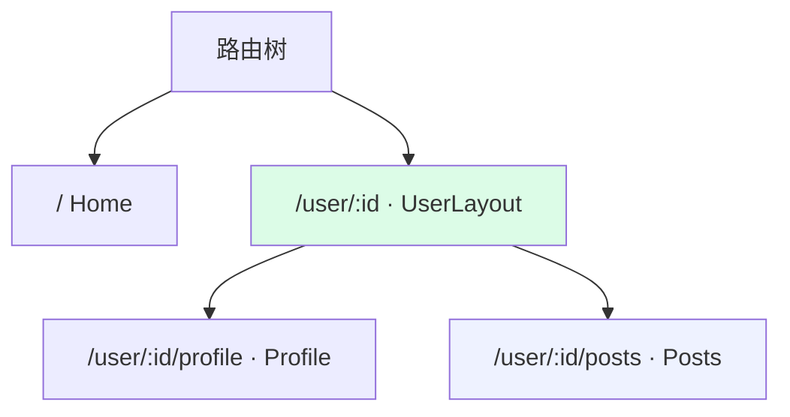
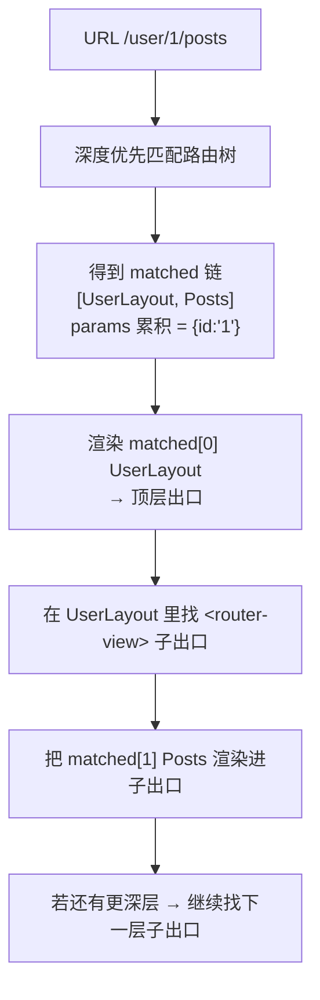

# 07 · 嵌套路由（Nested Route）

> 嵌套路由让**路由表变成一棵树**：一个 URL（如 `/user/1/posts`）匹配的不是「一条规则」，而是「从根到叶的一条链」——外层是布局/框架组件，内层是具体内容。父组件里留一个**子出口 `<router-view>`**，子路由就渲染进去。它让「URL 的层级」和「界面的嵌套结构」一一对应，是后台管理系统「侧边栏 + 内容区」这类布局的标准做法。

## 📖 知识讲解

### 一、路由是一棵树，URL 命中的是一条「链」

普通路由是「一条 URL → 一个组件」的扁平映射；嵌套路由是「一条 URL → 一串组件」：

```
/user/1/posts
   │
   ├─ 命中 /user/:id      → UserLayout（外层布局，含侧栏 + 子出口）
   └─ 命中 .../posts      → Posts（渲染进 UserLayout 的子出口）

匹配结果 matched = [UserLayout, Posts]   ← Vue Router 里就叫 route.matched
```

关键点：切换 `profile` ↔ `posts` 时，**外层 `UserLayout` 不销毁重建、始终在**，只有子出口里的内容变。这正是嵌套路由的价值——公共布局只渲染一次。

### 二、`<router-view>` 到底是什么？

它就是父组件模板里一个**占位插槽**。路由器渲染完父组件后，会去父组件里找这个占位，把「下一层匹配到的组件」塞进去。多层嵌套就是「父的出口里渲染子，子的出口里再渲染孙」，层层往里塞。

本 demo 用 `<div class="child-outlet">` 充当 `<router-view>`：`resolve()` 从外到内遍历 `matched`，每渲染完一层就 `querySelector('.child-outlet')` 找到子出口，把下一层填进去。

### 三、参数会向下继承

子路由的绝对路径 `/user/:id/posts` 仍含父级的 `:id`。匹配时把父层解析出的 `params`（`{id:'1'}`）**累积传给子层**，所以子组件也能拿到 `params.id`。（Vue Router 里父子共享 `route.params`。）

### 四、默认子路由与「空布局」问题

只访问 `/user/1`（不带子路径）时，子出口是空的。真实框架里会配一个**默认子路由**（Vue Router 用 `path: ''` 的 child、React Router 用 `index: true` 的 index route）来填满子出口，避免「进来一片空白」。

## 🔄 流程图 / 原理图



匹配 `/user/1/posts` 时，取出的是加粗的一条链 `UserLayout ➜ Posts`，从外到内渲染：



## 💻 代码说明

`index.html` 手写 `NestedRouter`，两处是重点：

```js
// ① 深度优先匹配，返回从根到叶的链，并逐层累积 params
matchTree(routes, path, parentParams = {}) {
  for (const route of routes) {
    const { regex, keys } = this.compile(route.path); // 注意：正则不加 $，做「前缀匹配」
    const m = regex.exec(path);
    if (!m) continue;
    const params = { ...parentParams };
    keys.forEach((k, i) => (params[k] = m[i + 1]));
    if (m[0] === path) return [{ route, params }];    // 完全吃完 → 叶子命中
    if (route.children) {                             // 还有剩余 → 钻进 children
      const rest = this.matchTree(route.children, path, params);
      if (rest.length) return [{ route, params }, ...rest];
    }
  }
  return [];
}

// ② 从外到内逐层渲染：内层塞进外层的子出口
this.outlet.innerHTML = matched[0].route.component(matched[0].params);
for (let i = 1; i < matched.length; i++) {
  const slot = this.outlet.querySelector('.child-outlet'); // 父组件留的 <router-view>
  slot.innerHTML = matched[i].route.component(matched[i].params);
}
```

> 简化点：真实框架为了「切子路由时父组件不重建」会做 diff/复用；本 demo 每次整块重渲染，够讲清「链式匹配 + 子出口」的原理即可。

## ▶️ 运行方式

免构建，直接双击 `index.html`。

- 点 `User1 · Profile` / `User1 · Posts`：观察**外层绿框（UserLayout）始终不变**，只有内层蓝框（子出口）内容切换。
- 顶部状态栏显示 `matched 链`，能直观看到 `/user/:id ➜ /user/:id/posts` 这条链。
- 切到 `User2` 时 `params.id` 变为 2，父子组件都拿到了新 id。

## ⚠️ 常见坑 / 最佳实践

- **忘了写 `<router-view>` 子出口**：父组件不放出口，子路由「匹配到了却不显示」——嵌套路由最常见的懵逼点。
- **父路由没配默认子路由**：访问 `/user/1`（不带子路径）时子出口空白。用 `path: ''`(Vue) / `index`(React) 填默认内容。
- **子路径写法**：Vue Router 的 child `path` 写**相对**（不带前导 `/`，会自动拼到父路径后）；本 demo 为教学直观写了绝对路径。别把两种写法记混。
- **别为「只是加个头部」而滥用嵌套**：公共头尾用普通布局组件即可；嵌套路由是为「URL 层级 = UI 层级 + 局部切换」而生。

## 🔗 官方文档

- Vue Router · 嵌套路由：https://router.vuejs.org/zh/guide/essentials/nested-routes.html
- Vue Router · `route.matched`：https://router.vuejs.org/zh/api/#matched
- React Router · Nested Routes / Outlet：https://reactrouter.com/en/main/start/concepts#nested-routes
- React Router · `<Outlet>`：https://reactrouter.com/en/main/components/outlet
