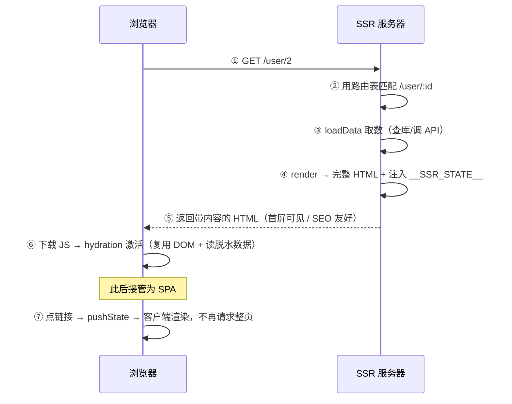
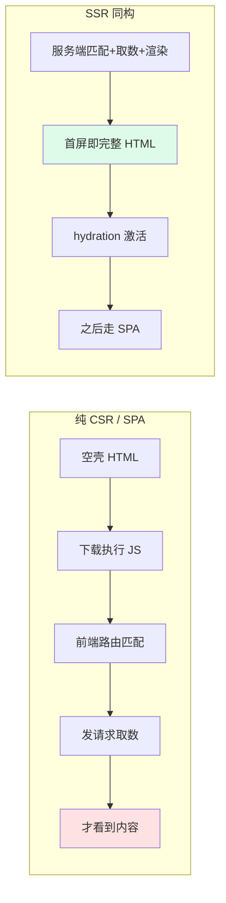

# 08 · SSR 路由（同构路由 · Isomorphic Routing）

> SSR（服务端渲染）路由的核心是**「同一份路由表，服务端和客户端各跑一遍」**：首屏由**服务器**按 URL 匹配路由、直出带内容的完整 HTML（利于 SEO 和首屏速度）；HTML 到达浏览器后**客户端激活（hydration）**，之后的导航又变回前面几章讲的 SPA（`pushState` 不刷新）。因为「服务端和客户端共用同一套路由逻辑」，所以叫**同构 / 通用（isomorphic / universal）路由**。这是 Next.js、Nuxt 的路由基石。

## 📖 知识讲解

### 一、纯 SPA 的两个痛点，SSR 来补

前面 `01~07` 都是纯客户端路由（CSR）。它有两个天生短板：

1. **首屏慢 / 白屏**：服务器返回的是空壳 `index.html`，要等 JS 下载执行、前端路由匹配、（可能还要）发请求取数，用户才看到内容。
2. **SEO 差**：爬虫拿到的 HTML 是空的（`<div id="app"></div>`），看不到内容。

SSR 让**服务器**先干这些活：拿到 URL → 匹配路由 → 取数据 → 把页面**渲染成带内容的 HTML 字符串**直接返回。用户/爬虫第一眼就是完整内容。

### 二、同构路由：一份路由表，两处执行

SSR 的精髓是「**同一份路由定义**」在两端运行：

| 阶段 | 在哪跑 | 干什么 |
| --- | --- | --- |
| 首屏 | **服务端** | 按 `req.url` 匹配路由 → 取数 → 渲染成完整 HTML 返回 |
| 激活 hydration | **客户端** | 复用服务端产出的 DOM，绑定事件、接管状态，让静态页「活过来」 |
| 后续导航 | **客户端** | 用 `pushState` 前端路由切换，不再请求整页（回到 SPA） |

所以路由表必须写成**两端都能用**的形式（不能依赖 `window`/`document` 这类只有浏览器才有的东西，否则服务端会报错）。

### 三、脱水 / 注水（dehydrate / hydrate）⚠️ 关键概念

服务端取好的数据不能白算——要**注入到 HTML 里**带给客户端：

```html
<div id="app">…服务端渲染好的内容…</div>
<script>window.__SSR_STATE__ = {"id":"2","name":"User-2"}</script>   <!-- 脱水：把数据序列化进页面 -->
```

客户端激活时**直接读 `window.__SSR_STATE__`**（注水），**不必再发一次请求**。若不做这一步，客户端会为了「初始化状态」重新请求一遍，既浪费又可能造成「服务端渲染的内容 ≠ 客户端首次渲染」的 hydration 不匹配警告。

### 四、SSR 天然没有「刷新 404」问题

回忆 `03/04`：history 模式的 SPA 刷新子路由会 404，得配 `try_files` 回退。SSR **反过来**——服务器本来就按路径匹配路由，访问/刷新 `/user/2` 时服务端直接匹配并直出，**每条路径都是「真实可响应」的**，不存在刷新 404。

## 🔄 流程图 / 原理图





## 💻 代码说明

`server.js`（零依赖，Node 内置 `http`）完整演示了 SSR 路由三动作：

```js
// ① 服务端用路由表匹配，取数并渲染成完整 HTML 字符串
function renderPage(pathname){
  const hit  = matchRoute(pathname);                       // 同构路由表匹配
  const data = hit && hit.route.loadData ? hit.route.loadData(hit.params) : null; // 服务端取数
  const body = hit ? hit.route.render(hit.params, data) : '404';                  // 渲染片段
  return `... <div id="app">${body}</div>
          <script>window.__SSR_STATE__ = ${JSON.stringify(data)}</script> ...`;   // ② 脱水注入
}

// 每个请求（含刷新子路由）都能匹配并直出 → 无「刷新 404」
http.createServer((req,res)=>{
  const pathname = req.url.split('?')[0];
  const hit = matchRoute(pathname);
  res.writeHead(hit?200:404, {'Content-Type':'text/html; charset=utf-8'});
  res.end(renderPage(pathname));
}).listen(3000);
```

客户端脚本（内嵌在返回的 HTML 里）负责 **③ 激活后接管路由**：读 `__SSR_STATE__`、拦截 `<a>` 改用 `pushState`、监听 `popstate`，之后就是标准 SPA。

> 简化点：真实 SSR（Next/Nuxt）用 React/Vue 的 `renderToString` 在服务端渲染组件树、用 `hydrateRoot`/`createSSRApp` 精确复用 DOM 并绑定事件；本 demo 用字符串模板讲清「同构路由 + 脱水注水 + 激活接管」的骨架即可。

## ▶️ 运行方式

零依赖，**不用 npm install**。需要 Node.js（18/20/22+）：

```bash
cd 20-frontend-routing-principles/08-ssr-routing
node server.js
# 打开 http://localhost:3000/
```

观察重点：

- 打开 `http://localhost:3000/user/2` 后按 **Ctrl+U 看网页源代码**：能直接看到 `User #2`、`User-2` 等文字——证明**首屏 HTML 是服务端渲染好的**（对比纯 SPA 源码只有空 `<div id="app">`）。
- 直接访问 / 刷新 `http://localhost:3000/user/2`：**每次都正常直出，不会 404**（对比 `03` history 模式的刷新 404）。
- 页面加载后点导航：顶部标记从「SSR 直出」变成「CSR history 导航」，DOM 局部更新、**地址栏变化但页面不刷新**——已被客户端接管为 SPA。
- 打开控制台可看到 `[hydration] 客户端激活完成，读到脱水数据 …` 日志。

## ⚠️ 常见坑 / 最佳实践

- **路由/渲染代码不能碰浏览器专属 API**：服务端没有 `window`/`document`/`localStorage`，同构代码里直接用会崩。要用需判断环境或延到客户端。
- **hydration 不匹配（hydration mismatch）**：服务端渲染的 HTML 必须和客户端首次渲染的结果**一致**，否则 React/Vue 会警告并可能丢状态。常见诱因：用了 `Date.now()`、随机数、或客户端才有的数据。用脱水数据保证两端一致。
- **别忘了脱水数据**：不注入 `__SSR_STATE__`，客户端会重复取数，且可能闪一下。
- **SSR ≠ 银弹**：它增加服务器计算成本与部署复杂度。对 SEO/首屏不敏感的后台系统，纯 SPA 反而更简单。现代方案还有 **SSG（静态生成）/ ISR / 流式 SSR / RSC**，按场景选型。

## 🔗 官方文档

- Vue · 服务端渲染 SSR 指南：https://cn.vuejs.org/guide/scaling-up/ssr.html
- React · `renderToString` / 服务端 API：https://react.dev/reference/react-dom/server/renderToString
- React · `hydrateRoot`（注水）：https://react.dev/reference/react-dom/client/hydrateRoot
- Next.js · Routing 基础：https://nextjs.org/docs/app/building-your-application/routing
- Nuxt · Routing：https://nuxt.com/docs/getting-started/routing
