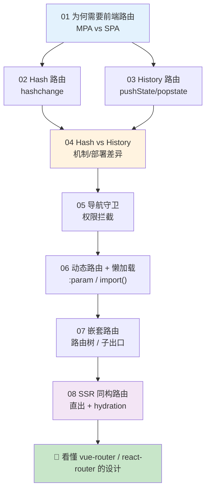
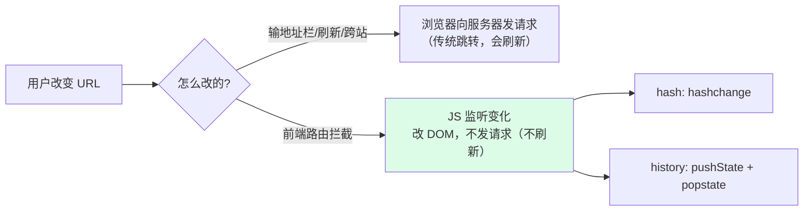

# 20 · 前端路由原理（Frontend Routing Principles）

> 前端路由的本质只有一句话：**监听 URL 变化，不刷新页面地重新渲染**。本工程从「SPA 为什么需要路由」讲起，手写 hash / history 两种 mini-router，讲透二者机制与部署差异，再到导航守卫、动态路由、懒加载、嵌套路由，最后落到 SSR 同构路由。本工程属**「原理」类**：以**手写可运行 demo + 深度文档 + 大量 Mermaid 图**为主，配套一篇《[原理详解.md](./原理详解.md)》把整条路由原理链串起来。全部对照 MDN、Vue Router、React Router 官方文档整理。

---

## 📚 模块索引

| 模块 | 知识点 | 核心内容 | 类型 |
| --- | --- | --- | --- |
| [01-spa-routing-why](./01-spa-routing-why/) | 为何需要路由 🧭 | MPA vs SPA、「改 URL 不刷新」的诉求由来 | 文档 + demo |
| [02-hash-router](./02-hash-router/) | Hash 路由 📊 | `location.hash` + `hashchange`，手写 HashRouter | 文档 + demo |
| [03-history-router](./03-history-router/) | History 路由 📊 | `pushState` + `popstate`，手写 HistoryRouter | 文档 + demo |
| [04-hash-vs-history](./04-hash-vs-history/) | 两种模式对比 📊 | 机制/URL/SEO/**部署差异**、`try_files` 回退 | 文档 + demo |
| [05-route-guards](./05-route-guards/) | 导航守卫 🔐 | 路由拦截、登录/权限校验、重定向 | 文档 + demo |
| [06-dynamic-lazy-route](./06-dynamic-lazy-route/) | 动态路由 + 懒加载 📊 | `:param` 编译正则、`() => import()` 代码分割 | 文档 + demo |
| [07-nested-route](./07-nested-route/) | 嵌套路由 📊 | 路由树、`matched` 链、`<router-view>` 子出口 | 文档 + demo |
| [08-ssr-routing](./08-ssr-routing/) | SSR 同构路由 📊 | 服务端直出、脱水/注水、hydration 接管 | 文档 + node demo |

📊 = 含重点原理图。**建议先通读 [原理详解.md](./原理详解.md) 建立整体框架，再逐模块看手写实现。**

---

## 🗺️ 学习路线

**三阶段建议：**

1. **两种机制（02→03→04）**：吃透 hash 与 history 两条实现路径，以及它们「改 URL 不刷新」的原理和部署代价——这是整个前端路由的地基。
2. **进阶能力（05→06→07）**：守卫、动态匹配、懒加载、嵌套，是真实项目路由表天天要用的四件套。
3. **服务端延伸（08）**：SSR 把路由从纯客户端扩展到「服务端 + 客户端同构」，理解 Next.js / Nuxt 的路由基石。

---

## 🔗 一条 URL 的两条命运

前端路由做的，就是把「本会触发刷新的 URL 变化」拦下来，**改成用 JS 局部重渲染**。

---

## ▶️ 运行说明

| 模块 | 运行方式 |
| --- | --- |
| 01 / 02 / 04 / 05 / 06 / 07 | **hash 模式**，直接双击 `index.html`（`file://` 即可） |
| 03-history-router | **必须本地服务器**：`python3 -m http.server 8080`（history 的 `pushState` 在 `file://` 会报 SecurityError） |
| 08-ssr-routing | **Node 内置 http，零依赖**：`node server.js` → `http://localhost:3000/` |

- 全程**不需要 npm install**：hash demo 免构建，SSR demo 只用 Node 内置模块。
- 建议配合 Chrome DevTools 的 **Network** 面板观察：前端路由切换时**不会有整页文档请求**，这是「不刷新」的最直接证据。

---

## 📖 配套原理长文

👉 **[原理详解.md](./原理详解.md)** —— 本工程核心交付物。从「前端路由的本质」出发，逐一剖析 hash / history 两套机制、逐行拆解一个 60 行的 mini-router 源码、对比 SPA 与 SSR 路由，串起 10+ 张 Mermaid 原理图与常见误区，并对照 vue-router / react-router 的官方设计说明它们「究竟在你写的 `<router-view>` 背后做了什么」。

---

> 📌 所有内容对照 [MDN History API](https://developer.mozilla.org/zh-CN/docs/Web/API/History_API)、[MDN Location](https://developer.mozilla.org/zh-CN/docs/Web/API/Location)、[Vue Router](https://router.vuejs.org/zh/)、[React Router](https://reactrouter.com/) 官方文档整理，各模块 README 末尾附具体链接。
