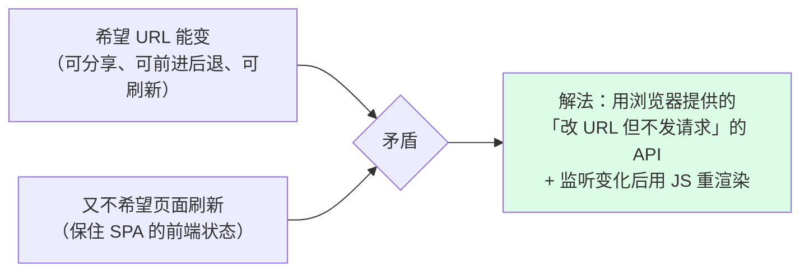
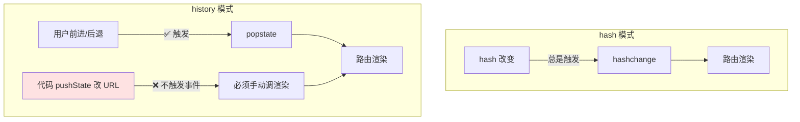
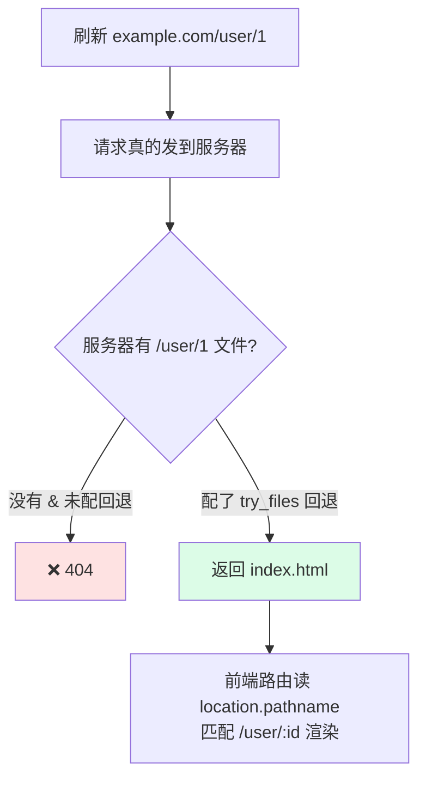
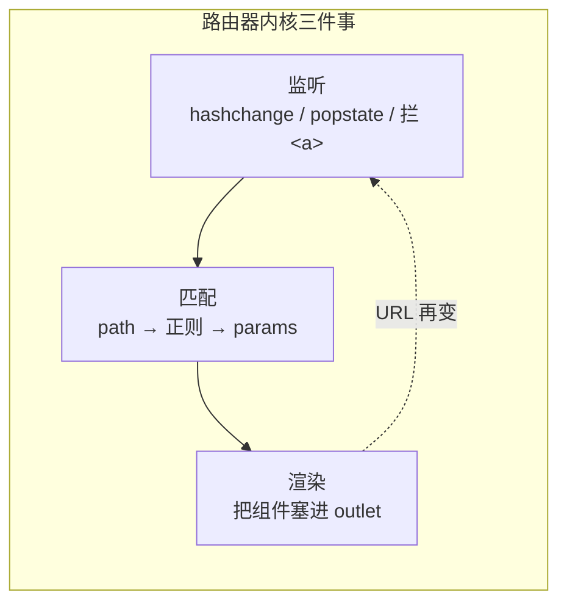
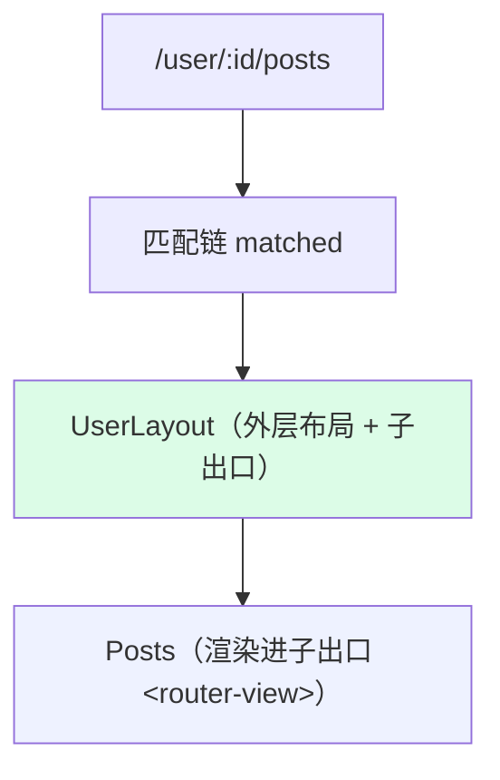
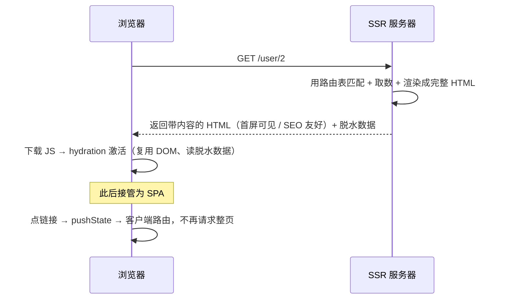

# 前端路由原理详解（Frontend Routing · How & Why）

> 本文是 `20-frontend-routing-principles` 工程的核心交付物。目标不是「怎么用 vue-router」，而是**讲透前端路由的底层机制**：它的本质、hash 与 history 两套实现的原理与取舍、一个可运行 mini-router 的逐行源码剖析、SPA 与 SSR 路由的分野、以及框架背后到底替你做了什么。全文对照 MDN、Vue Router、React Router 官方文档。

---

## 一、本质：前端路由 = 监听 URL 变化，不刷新页面地重新渲染

先厘清「路由（routing）」这个词。在**后端**，路由是「URL → 处理函数」的映射（`GET /user/1` 交给某个 controller）。在**前端**，路由是「URL → 页面组件」的映射，但多了一个苛刻前提：

> **改变 URL 的过程中，浏览器不能向服务器发请求、不能整页刷新。**

为什么这个前提这么关键？因为单页应用（SPA）整个生命周期只加载**一个** HTML。若切页时浏览器像传统多页应用（MPA）那样发请求换文档，那 SPA 的一切前端状态（已加载的 JS、内存里的数据、滚动位置）都会被清空——那就不叫 SPA 了。

所以前端路由要解决的核心矛盾是：



浏览器恰好提供了两组「能改 URL 又不触发请求」的能力，对应前端路由的两种模式：

- **hash 模式**：改 `location.hash`（`#` 后面的部分）。
- **history 模式**：用 HTML5 History API 的 `pushState` / `replaceState`。

前端路由库（vue-router、react-router）本质上就是**围绕这两组 API 的封装**：监听它们 →匹配路由表 →渲染对应组件。下面逐一拆解。

---

## 二、hash 模式的原理

### 2.1 为什么改 hash 不刷新？

URL 里 `#` 后面的部分叫**片段标识符（fragment）**，它的历史用途是「页内锚点定位」（跳到 `id` 对应的元素）。规范规定：**fragment 的变化纯属浏览器内部行为，不会导致浏览器向服务器发新请求**。前端路由「借用」了这个特性——把 `#/about` 当作「路由」，改它既能变 URL、留下历史记录，又不刷新。

而且浏览器为 hash 变化提供了专门的事件 `hashchange`：

```mermaid
sequenceDiagram
  participant U as 用户
  participant B as 浏览器
  participant R as 前端路由
  U->>B: 点击 &lt;a href="#/about"&gt; 或改 location.hash
  B->>B: 更新地址栏 + 压入历史栈（不发请求）
  B->>R: 触发 hashchange 事件
  R->>R: 读 location.hash → 匹配路由表
  R->>R: 更新 DOM（渲染 About 组件）
```

### 2.2 hash 模式的特征

- **零服务器配置**：因为 `#` 后面的内容**根本不会发给服务器**，服务器永远只收到对 `index.html` 的请求。刷新 `example.com/#/about` 时，服务器看到的只是 `example.com/`，稳返回 `index.html`——所以**刷新永不 404**。
- **URL 带 `#`**，不够美观（`example.com/#/user/1`）。
- **SEO 历史上较弱**（`#` 后内容不被视为独立 URL），但对现代爬虫影响已减小。

---

## 三、history 模式的原理

### 3.1 pushState：改 URL 但不刷新的「正规军」

HTML5 History API 提供了 `history.pushState(state, unused, url)`：它能把地址栏改成任意**同源** URL、压入历史栈，**但不发请求、不刷新**。这让 SPA 得到没有 `#` 的「干净 URL」（`example.com/user/1`）。

| API | 作用 | 是否触发 popstate |
| --- | --- | --- |
| `pushState(state, '', url)` | 新增一条历史记录，改 URL，不刷新 | **否** |
| `replaceState(state, '', url)` | 替换当前记录（重定向常用） | **否** |
| `history.back()/forward()/go(n)` | 编程式前进后退 | **是** |
| 用户点浏览器前进/后退按钮 | — | **是** |

### 3.2 关键陷阱：pushState 不触发 popstate ⚠️

这是 history 模式与 hash 模式**最本质的差异**，也是手写路由最容易踩的坑（已对照 MDN 确认）：

- `hashchange`：**只要 hash 变了就触发**，无论是用户点链接还是代码改。所以 hash 路由监听一个事件就够。
- `popstate`：**只有前进/后退才触发**；你自己调 `pushState` 改 URL 时**不触发任何事件**。



所以 history 路由必须把「`pushState` + 渲染」封装成一个 `push()` 方法，改完 URL **手动**再渲染一次。框架的 `<RouterLink>` / `<Link>` 内部就是这么做的。

### 3.3 代价：必须配服务器回退（try_files）

history 模式的 URL 是「真路径」，`#` 不见了。问题来了：用户直接访问或刷新 `example.com/user/1` 时，请求**会真的发到服务器**，服务器去找 `/user/1` 这个文件——找不到 → **404**。

解法：让服务器把「所有前端路由路径」都回退到 `index.html`，交给前端路由再匹配。

```nginx
location / {
  try_files $uri $uri/ /index.html;   # 找不到文件就返回 index.html
}
```



**一句话记牢**：hash 零配置但带 `#`；history URL 干净但**必须配服务器回退**。

---

## 四、mini-router 源码剖析（60 行看懂路由库内核）

下面把一个能同时支持 hash / history 的极简路由器逐段拆开。它去掉了框架的组件系统、响应式等外壳，只留**路由的内核三件事**：`监听 → 匹配 → 渲染`。

```js
class MiniRouter {
  constructor({ mode = 'hash', outlet }) {
    this.mode = mode;               // 'hash' | 'history'
    this.routes = [];               // 路由表：[{ regex, keys, render }]
    this.outlet = outlet;           // 渲染出口 DOM

    if (mode === 'hash') {
      // ① hash：监听 hashchange 就够（任何 hash 变化都触发）
      window.addEventListener('hashchange', () => this.resolve());
    } else {
      // ① history：popstate 只能捕获「前进/后退」；pushState 得手动渲染（见 push）
      window.addEventListener('popstate', () => this.resolve());
    }
    // ② 拦截站内 <a>，阻止默认跳转，改用路由导航
    document.addEventListener('click', (e) => {
      const a = e.target.closest('a[data-link]');
      if (!a) return;
      e.preventDefault();
      this.push(a.getAttribute('href'));
    });
  }

  // ③ 注册路由：把 '/user/:id' 编译成正则 + 参数名
  on(path, render) {
    const keys = [];
    const regexStr = path.replace(/:([^/]+)/g, (_, k) => { keys.push(k); return '([^/]+)'; });
    this.routes.push({ regex: new RegExp('^' + regexStr + '$'), keys, render });
    return this;
  }

  // ④ 读当前路径：两种模式取值不同，这是唯一的分叉
  current() {
    return this.mode === 'hash'
      ? (location.hash.slice(1) || '/')   // '#/about' → '/about'
      : location.pathname;                // '/about'
  }

  // ⑤ 匹配 + 渲染
  resolve() {
    const path = this.current();
    for (const r of this.routes) {
      const m = r.regex.exec(path);
      if (m) {
        const params = {};
        r.keys.forEach((k, i) => (params[k] = decodeURIComponent(m[i + 1])));
        this.outlet.innerHTML = r.render(params);
        return;
      }
    }
    this.outlet.innerHTML = '<h2>404</h2>';
  }

  // ⑥ 编程式导航
  push(path) {
    if (this.mode === 'hash') {
      location.hash = path;               // 触发 hashchange → resolve()（自动）
    } else {
      history.pushState(null, '', path);  // ⚠️ 不触发事件
      this.resolve();                     // 所以手动渲染
    }
  }
}
```

**逐段要点：**

- **①监听**：这是「响应 URL 变化」的入口。hash 靠 `hashchange`（省心），history 靠 `popstate`（只覆盖前进后退）。
- **②拦截 `<a>`**：不拦的话，点链接会走浏览器默认跳转 → 刷新。`preventDefault` + 走 `push` 是所有 `<RouterLink>` 的本质。
- **③注册/编译**：把 `:param` 用正则替换成捕获组，路由匹配的核心就是**字符串 → 正则**。
- **④取值分叉**：hash 与 history 的**唯一实质差别**就在「从哪读当前路径」——`location.hash` vs `location.pathname`。其余逻辑完全共用。这解释了为什么框架能用一个开关切换两种模式。
- **⑤匹配渲染**：遍历路由表，第一个命中的就渲染。真实框架这里换成「渲染组件树 + diff 复用」，但**匹配逻辑是一样的**。
- **⑥导航**：history 模式暴露了那个陷阱——`pushState` 后必须手动 `resolve()`。



> 本工程的 `02` / `03` / `06` / `07` 模块把这套内核分别扩展成了 hash 路由、history 路由、动态+懒加载、嵌套路由的可运行版本。读完这段再回看那些 demo，会发现它们都是这 60 行的变体。

---

## 五、从「匹配一条」到「匹配一棵树」：嵌套路由

普通路由是「URL → 一个组件」的扁平映射。真实应用（尤其后台系统）需要「URL 层级 = 界面嵌套层级」，于是路由表变成**树**，一个 URL 命中的是**从根到叶的一条链**（Vue Router 里叫 `route.matched`）：



`<router-view>` 的本质就是父组件里的一个**占位插槽**：父组件渲染完，路由器把「下一层匹配到的组件」塞进这个占位。切换兄弟子路由时，外层布局**不销毁**、只换子出口内容——这是嵌套路由的核心价值。详见 `07-nested-route`。

---

## 六、路由懒加载：把「一个大包」切成「按需的小包」

默认所有页面组件都打进主包，首屏要下完才能跑。懒加载把 component 从「直接引用」改成「**返回 Promise 的函数**」，打包器（Vite/webpack）见到 `import()` 就自动**代码分割**成独立 chunk，用到才下载：

```js
{ path: '/settings', component: () => import('./Settings.vue') } // 首屏不下，进入才拉
```

路由器发现 component 是异步函数 → 先渲染 loading → `await` 拿到组件再渲染。要点是**防竞态**：`await` 回来后核对当前 URL 是否已切走。详见 `06-dynamic-lazy-route`。

---

## 七、SPA 路由 vs SSR 路由：同一份路由表，跑在两端

前面全是**客户端路由（CSR）**：路由匹配和渲染都在浏览器。它有两个短板——首屏白屏、SEO 弱。**SSR（服务端渲染）路由**用「**同构（isomorphic）**」思路补齐：同一份路由表，服务端先跑一遍出首屏，客户端再接管。



三个关键概念：

- **同构路由**：路由定义两端共用，所以不能依赖 `window`/`document`。
- **脱水/注水（dehydrate/hydrate）**：服务端把取好的数据 `JSON.stringify` 注入 HTML（`window.__SSR_STATE__`），客户端激活时直接读，避免重复请求与 hydration 不匹配。
- **hydration（激活）**：让服务端产出的静态 HTML「活过来」——绑事件、接管状态。

有意思的是 **SSR 天然没有 history 模式的「刷新 404」问题**：服务器本就按路径匹配路由，每条 URL 都是真实可响应的。这与第三节形成对照。详见 `08-ssr-routing`（含零依赖 Node demo）。

---

## 八、对照官方：vue-router / react-router 究竟做了什么

本工程的 mini-router 与生产级框架的关系：

| 能力 | 本工程 mini-router | vue-router / react-router |
| --- | --- | --- |
| 模式切换 | `mode` 读 `hash`/`pathname` | `createWebHashHistory` / `createWebHistory`（Vue）；`createHashRouter` / `createBrowserRouter`（React） |
| 监听 | `hashchange` / `popstate` | 同样封装这两个事件 |
| 路径匹配 | 手写 `:param → 正则` | Vue 自研 path matcher；React 用 path-to-regexp 思路，支持 `:id?`、通配、优先级排序 |
| 链接 | 拦截 `<a data-link>` | `<RouterLink>` / `<Link>`（内部 `preventDefault` + `push`） |
| 出口 | `outlet.innerHTML` | `<RouterView>` / `<Outlet>`，配虚拟 DOM diff 复用组件 |
| 守卫 | 见 `05` | `beforeEach` 等导航守卫 / loader、`<Navigate>` |
| 嵌套 | 见 `07` | `children` 路由 + 多级 `<router-view>` |

结论：**框架没有魔法**。它们在你写的 `<router-view>` 背后做的，正是「监听 URL → 匹配路由表 → 渲染组件」这三件事，只是加上了组件系统、响应式、diff 复用、更强的路径语法和守卫体系。理解了这 60 行，就理解了它们的内核。

---

## 九、常见误区速查

- **「history 模式不用配服务器」**——错。刷新/直接访问子路由会 404，**必须**配 `try_files` 回退（hash 才零配置）。
- **「pushState 会触发 popstate」**——错。只有前进/后退触发；`pushState` 后要手动渲染。这是最高频的手写坑。
- **「hash 模式 SEO 一定不行」**——过时说法。现代爬虫能力增强，但要极致 SEO/首屏仍首选 SSR。
- **「前端路由切换也会发请求」**——不会（这正是它的意义）。DevTools Network 里前端切换**没有整页文档请求**，只有懒加载 chunk 或数据 API。
- **「SSR = 更好，无脑上」**——SSR 增加服务器成本与复杂度、有 hydration 匹配约束。后台系统等对 SEO 不敏感的场景，纯 SPA 更简单。还有 SSG/ISR/流式 SSR/RSC 等按场景选型。
- **「懒加载越多越好」**——首屏必用组件懒加载反而多一次请求。懒加载适合次级/低频页面。

---

## 🔗 参考与官方文档

- MDN · History API：https://developer.mozilla.org/zh-CN/docs/Web/API/History_API
- MDN · `History.pushState()`：https://developer.mozilla.org/zh-CN/docs/Web/API/History/pushState
- MDN · `popstate` 事件：https://developer.mozilla.org/zh-CN/docs/Web/API/Window/popstate_event
- MDN · `hashchange` 事件：https://developer.mozilla.org/zh-CN/docs/Web/API/Window/hashchange_event
- MDN · `Location`：https://developer.mozilla.org/zh-CN/docs/Web/API/Location
- Vue Router · 不同的历史模式：https://router.vuejs.org/zh/guide/essentials/history-mode.html
- Vue Router · 服务端渲染：https://router.vuejs.org/zh/guide/advanced/ssr.html
- React Router · 官方文档：https://reactrouter.com/
- Vue · 服务端渲染 SSR：https://cn.vuejs.org/guide/scaling-up/ssr.html
