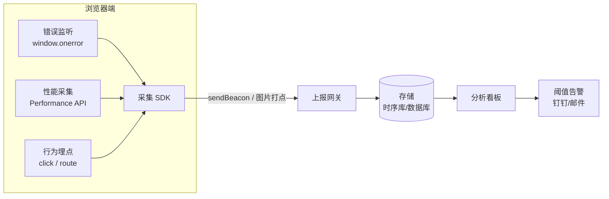
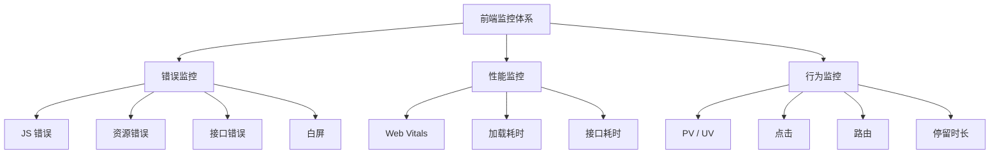

# 01 · 前端监控体系总览（Frontend Monitoring Overview）

> 一句话说明：前端监控就是把线上「错误、性能、行为」三类数据自动采集并上报，让你在用户反馈之前就发现问题。

## 📖 知识讲解

前端监控（Frontend Monitoring / RUM，Real User Monitoring）解决的核心问题是：**代码上线后，你无法知道真实用户端到底发生了什么。** 监控体系把这些「黑盒」变成可观测的数据，通常分为三大类：

| 类别 | 采集什么 | 典型指标 |
| --- | --- | --- |
| **错误监控（Error）** | JS 运行时错误、资源加载错误、接口错误、白屏崩溃 | 错误数、错误率、影响用户数 |
| **性能监控（Performance）** | 页面加载、Web Vitals、资源/接口耗时 | LCP、FID、CLS、首屏时间 |
| **行为监控（Behavior）** | PV/UV、点击、路由跳转、停留时长 | 访问量、漏斗、热力图 |

一套监控系统的通用链路是四步：

1. **采集（采集 SDK）**：在页面里注入 SDK，监听各类事件（`window.onerror`、`PerformanceObserver`、点击等）。
2. **上报（Report）**：把采集的数据发到服务端。首选 `navigator.sendBeacon`（页面卸载也能发），兜底用「图片打点」（`new Image().src = url`，天然跨域、不阻塞）。
3. **存储（Storage）**：服务端接收后写入数据库 / 时序库（如 ClickHouse、InfluxDB）。
4. **分析告警（Analyze & Alert）**：在看板上聚合分析，触发阈值时报警（钉钉 / 邮件 / 短信）。

本模块的 `demo.js` 就是一个「一体化 mini SDK」：它同时挂上三类监听器，把采集到的数据统一交给 `report()` 出口（真实项目里 `report` 内部就是 `sendBeacon`），并渲染到页面「捕获面板」让你直观看到三类监控在工作。

## 🔄 流程图 / 原理图

**监控系统整体架构（采集 → 上报 → 存储 → 告警）：**

**三大类监控关系：**

## 💻 代码说明

- `index.html`：三张全景卡片（纯 HTML/CSS）展示每类监控抓什么，加一个触发错误的按钮和「捕获面板」`
`。
- `demo.js`：
  - `report(type, title, detail)`：统一上报出口，负责 `console.log` + 渲染到面板。
  - **错误监控**：`window.onerror` 捕获全局 JS 错误，按钮点击时故意 `null.foo.bar` 触发。
  - **性能监控**：`load` 事件后用 `performance.getEntriesByType('navigation')` 读真实加载耗时。
  - **行为监控**：`document.addEventListener('click')` 采集一次点击行为。

## ▶️ 运行方式

直接用浏览器打开 `index.html`（`file://` 即可，无需服务器）：

1. 页面加载后，面板会自动出现一条「性能监控」数据。
2. 点击页面任意处，出现「行为监控」数据。
3. 点击「触发一个错误」按钮，出现「错误监控」数据。

同时打开控制台（F12）可看到每条采集的 `console.log`。

## ⚠️ 常见坑 / 最佳实践

- **上报优先用 `navigator.sendBeacon`**：普通 `fetch/XHR` 在页面卸载（`beforeunload`）时可能被浏览器中断，`sendBeacon` 是为「离开页面还要发数据」设计的。
- **别在 `load` 回调里立刻读 `loadEventEnd`**：此时 load 尚未结束，字段可能为 0，需 `setTimeout(fn, 0)` 延后一拍（demo 已处理）。
- **采集要有采样率**：全量上报会打爆服务端，行为/性能数据通常按比例采样。
- **SDK 要「无侵入 + 不影响主流程」**：采集代码自身要 try/catch 包裹，绝不能因为监控 SDK 报错而拖垮业务页面。
- **区分三类不要混淆职责**：错误监控关注「有没有崩」，性能关注「快不快」，行为关注「用户怎么用」。

## 🔗 官方文档

- [MDN · Performance API](https://developer.mozilla.org/zh-CN/docs/Web/API/Performance)
- [MDN · Navigator.sendBeacon()](https://developer.mozilla.org/zh-CN/docs/Web/API/Navigator/sendBeacon)
- [web.dev · Web Vitals](https://web.dev/articles/vitals)
