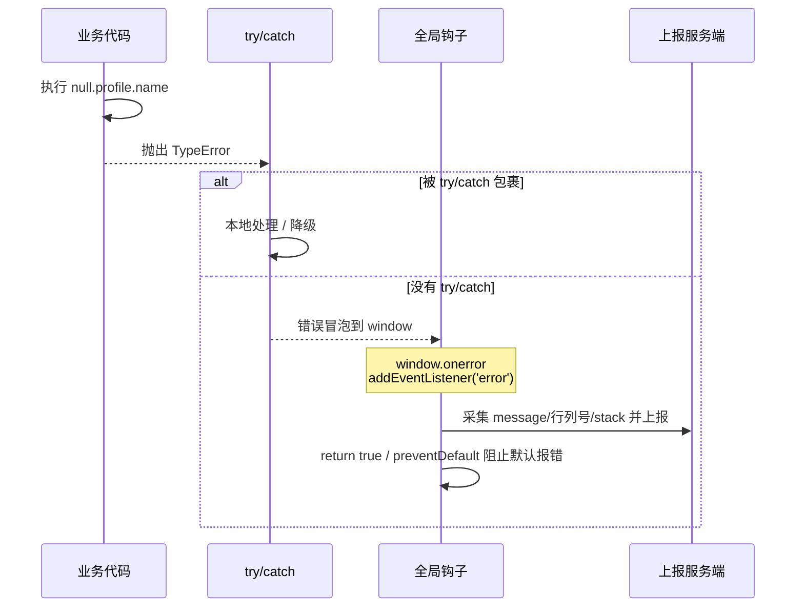
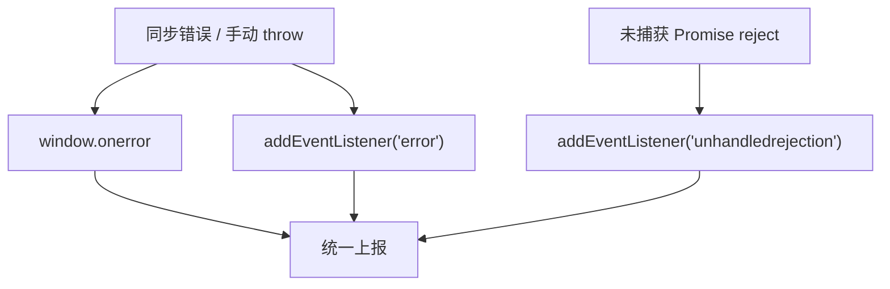

# 02 · JS 错误捕获（JavaScript Error Capture）

> 一句话说明：用三个全局钩子把「同步错误、手动 throw、未捕获 Promise」一网打尽，拿到 message、文件、行列号和 stack。

## 📖 知识讲解

线上 JS 错误的捕获，分为「局部」和「全局」两个层次：

### 1）局部：`try/catch`

只能捕获**同步代码**里、被它包裹的那段错误。缺点明显：
- 无法捕获异步回调（`setTimeout`、事件回调）里的错误；
- 无法捕获 Promise 的 reject；
- 需要手动包裹每一处，无法「兜底全站」。

所以 `try/catch` 用于**关键业务的精细处理**，不能替代全局监控。

### 2）全局：三个钩子

| 钩子 | 能抓什么 | 拿到什么 |
| --- | --- | --- |
| `window.onerror` | JS 运行时错误、手动 throw | `message, source, lineno, colno, error` 五个参数 |
| `window.addEventListener('error', fn)` | 同上（同一批 JS 错误）+ **资源错误（需捕获阶段）** | `ErrorEvent` 对象（`e.message/e.filename/e.lineno/e.error`） |
| `window.addEventListener('unhandledrejection', fn)` | 未处理的 Promise 拒绝 | `e.reason`（reject 的值 / 错误对象） |

### `onerror` 与 `addEventListener('error')` 的区别

- **返回值语义**：`window.onerror` 里 **`return true`** 可以阻止错误抛到控制台默认报错；`addEventListener('error')` 里则用 `e.preventDefault()`。
- **覆盖性**：`window.onerror` 是**单一赋值**，后赋值会覆盖前一个；`addEventListener` 可以**注册多个**互不覆盖，更适合和第三方 SDK 共存。
- **资源错误**：`window.onerror` **抓不到**资源加载错误（img/script/link 失败）；只有 `addEventListener('error', fn, true)` 在**捕获阶段**才能抓到（详见 03 模块）。
- **推荐**：现代项目优先用 `addEventListener('error')` + `unhandledrejection`，`onerror` 作为兼容兜底。

### 3）框架错误边界

框架内部的渲染错误，往往被框架自己吞掉，需要用框架提供的错误边界：

**React（类组件错误边界）：**
```jsx
class ErrorBoundary extends React.Component {
  state = { hasError: false };
  // 渲染阶段捕获错误、更新 state 以渲染降级 UI
  static getDerivedStateFromError(error) {
    return { hasError: true };
  }
  // 上报错误详情与组件栈
  componentDidCatch(error, info) {
    report(error, info.componentStack);
  }
  render() {
    return this.state.hasError ? <h1>页面出错了</h1> : this.props.children;
  }
}
```

**Vue 3（全局错误处理器）：**
```js
const app = createApp(App);
// err：错误对象；instance：出错组件实例；info：Vue 特定的错误来源信息
app.config.errorHandler = (err, instance, info) => {
  report(err, info);
};
```

## 🔄 流程图 / 原理图

**一个 JS 错误如何冒泡到全局捕获：**



**三类错误分别被谁捕获：**



## 💻 代码说明

- `index.html`：三个「制造错误」按钮 + 捕获面板 `<div id="panel">`。
- `demo.js`：
  - `window.onerror`：读取五个固定参数，`return true` 阻止默认报错。
  - `addEventListener('error')`：读 `ErrorEvent`，通过 `e.target !== window` 判断把资源错误让给 03 模块。
  - `unhandledrejection`：读 `e.reason`，`e.preventDefault()` 阻止 "Uncaught (in promise)"。
  - 三个按钮分别制造：`null.profile.name`（同步）、无 `.catch` 的 `reject`（Promise）、`throw new Error`（手动）。

## ▶️ 运行方式

直接用浏览器打开 `index.html`（`file://` 即可）：

1. 点「① 触发同步错误」→ 面板出现被 `onerror` 和 `addEventListener('error')` 捕获的记录；
2. 点「② 触发未捕获 Promise」→ 面板出现 `unhandledrejection` 记录；
3. 点「③ 手动 throw」→ 面板出现全局捕获记录。

每条都带 message、文件、行列号、stack。控制台（F12）同步打印。

## ⚠️ 常见坑 / 最佳实践

- **跨域脚本报错只有 `Script error.`**：加载第三方脚本时若出错，出于安全策略 `onerror` 只能拿到 `Script error.` 没有细节。解决：给 `<script>` 加 `crossorigin="anonymous"`，且服务端返回 `Access-Control-Allow-Origin`。
- **`onerror` 会被覆盖**：多处 `window.onerror = ...` 后者覆盖前者，和第三方监控冲突。多监听场景一律用 `addEventListener`。
- **`unhandledrejection` 别忘了**：只监听 `error` 会漏掉所有 Promise 异常（现代 async/await 代码里占比很高）。
- **`e.reason` 不一定是 Error**：可能被 `reject('字符串')`，没有 `stack`，上报前要判断类型（demo 已处理）。
- **source map**：线上代码是压缩的，行列号无意义，需上传 source map 到监控平台还原源码位置。
- **错误去重与采样**：同一错误可能瞬间触发上千次，上报前要按「message+stack」聚合去重，避免打爆服务端。

## 🔗 官方文档

- [MDN · GlobalEventHandlers.onerror](https://developer.mozilla.org/zh-CN/docs/Web/API/Window/error_event)
- [MDN · unhandledrejection 事件](https://developer.mozilla.org/zh-CN/docs/Web/API/Window/unhandledrejection_event)
- [React · 错误边界](https://zh-hans.react.dev/reference/react/Component#catching-rendering-errors-with-an-error-boundary)
- [Vue 3 · app.config.errorHandler](https://cn.vuejs.org/api/application.html#app-config-errorhandler)
