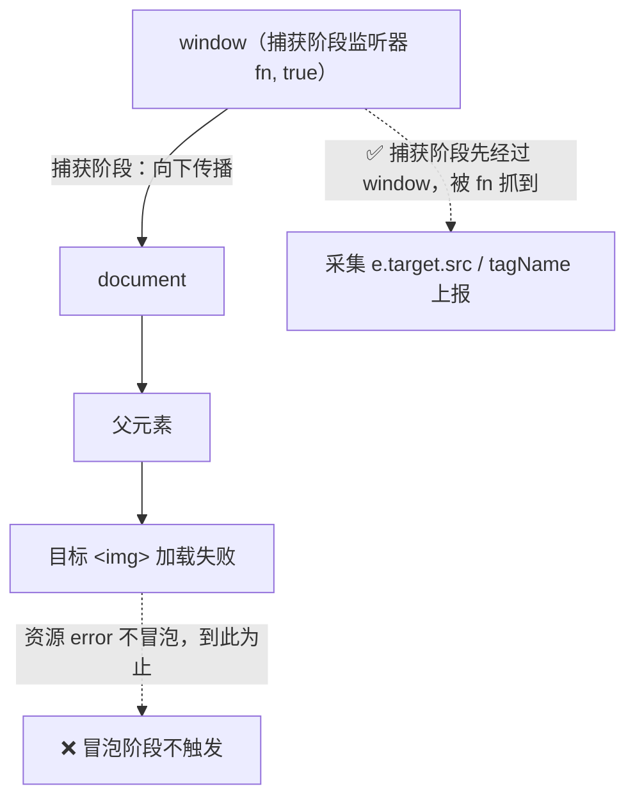
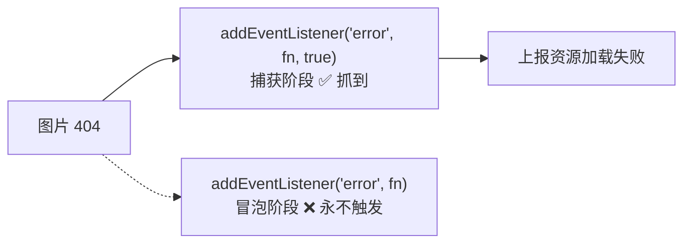

# 03 · 资源加载错误（Resource Loading Error）

> 一句话说明：`img`/`script`/`link` 等资源加载失败的 `error` 事件**不冒泡**，只有在**捕获阶段**监听 `window` 才抓得到——`addEventListener('error', fn, true)`。

## 📖 知识讲解

### 1）为什么资源错误特殊

页面上的错误分两大类，捕获方式完全不同：

| 类型 | 例子 | 事件是否冒泡 | 谁能抓到 |
| --- | --- | --- | --- |
| **JS 运行时错误** | `null.x`、`throw` | 冒泡到 window | `window.onerror`、冒泡/捕获阶段监听都行 |
| **资源加载错误** | 图片 404、脚本 CDN 挂、CSS 丢失 | **不冒泡** | **只有捕获阶段** `addEventListener('error', fn, true)` |

关键在于：**资源的 `error` 事件只在目标元素上派发，不会向上冒泡**。所以：

- `window.onerror = ...` —— 抓不到（它是为 JS 运行时错误设计的，参数是 `message/source/lineno/colno/error`）。
- `window.addEventListener('error', fn)` —— 抓不到（不传第三个参数默认是**冒泡阶段**，而事件根本不冒上来）。
- `window.addEventListener('error', fn, true)` —— **能抓到**（`true` = **捕获阶段**，事件从 `window` 往目标元素传播时会先经过 `window`，于是被截获）。

### 2）捕获阶段（capture）是什么

DOM 事件传播分三个阶段：**捕获（从 window 往下）→ 目标 → 冒泡（从目标往上）**。资源 `error` 事件没有冒泡阶段，但捕获阶段依然会经过 `window`，所以把监听器挂在捕获阶段就能拦到。

### 3）拿到的信息在哪

资源错误的事件对象**没有** `message/lineno/colno`。你要的信息全在 `e.target` 上：

- `e.target.tagName` —— 哪种资源（IMG/SCRIPT/LINK）；
- `e.target.src` 或 `e.target.href` —— 失败的资源 URL；
- 用 `e.target !== window` 来区分「资源错误」还是「JS 错误」。

## 🔄 流程图 / 原理图

**事件三阶段 + 资源 error 只走捕获：**

**两个监听器的对照结果：**

## 💻 代码说明

- `index.html`：三个按钮分别动态插入一张坏图片 / 坏脚本 / 坏样式表（URL 指向 `example.com` 下不存在的文件，必然 404），插入到一个隐藏的 `#sink` 容器里触发加载。
- `demo.js`：
  - **监听器 A（捕获阶段）**：`window.addEventListener('error', fn, true)`。用 `e.target !== window && (e.target.src || e.target.href)` 判定是资源错误，读 `e.target.tagName` 与 URL 上报。
  - **监听器 B（冒泡阶段）**：`window.addEventListener('error', fn)` 不传 `true`，写了同样的判断——但它对资源错误**永不触发**，用于证明「必须捕获阶段」这一结论。
  - 页面加载时先渲染一条对照说明，帮你建立预期。

## ▶️ 运行方式

直接用浏览器打开 `index.html`（`file://` 即可）：

1. 点「① 加载一张坏图片」→ 面板出现一条「捕获阶段 ✅ 抓到」的记录，带 `` 与失败 URL；
2. 点「② 坏脚本」「③ 坏样式表」→ 同样只被捕获阶段抓到；
3. 全程你**不会**看到「冒泡阶段抓到资源错误」，这正是本模块的结论。

控制台（F12）同步打印每条。

## ⚠️ 常见坑 / 最佳实践

- **忘了第三个参数 `true`**：这是最常见的漏采原因——不写 `true` 资源错误全部丢失。
- **和 JS 错误监听混在一起**：同一个 `addEventListener('error')` 既会收到 JS 错误也会收到资源错误，必须用 `e.target !== window` 区分，否则上报数据会串。
- **`img.onerror` 只能覆盖单个元素**：给每个 `` 单独写 `onerror` 无法兜底全站，且动态插入的资源容易漏；捕获阶段全局监听才是「一处兜全站」。
- **跨域脚本细节受限**：跨域 `<script>` 失败同样能被捕获阶段抓到（能拿到 URL），但要拿到脚本内部 JS 错误细节仍需 `crossorigin` + CORS 头（见 02 模块）。
- **区分「加载失败」与「加载慢」**：`error` 只表示彻底失败（404/网络断）。资源加载耗时、慢资源要用 `PerformanceObserver` 的 `resource` 条目（见 05 模块）。
- **重试与降级**：抓到关键资源（如核心 JS）失败后，可结合备用 CDN 重试或提示用户刷新，而非仅上报。

## 🔗 官方文档

- [MDN · error 事件（GlobalEventHandlers / 元素）](https://developer.mozilla.org/zh-CN/docs/Web/API/HTMLElement/error_event)
- [MDN · EventTarget.addEventListener() · useCapture 参数](https://developer.mozilla.org/zh-CN/docs/Web/API/EventTarget/addEventListener#usecapture)
- [MDN · 事件流：捕获、目标、冒泡](https://developer.mozilla.org/zh-CN/docs/Learn/JavaScript/Building_blocks/Events#事件冒泡与捕获)
- [Sentry · Capturing resource loading errors](https://docs.sentry.io/platforms/javascript/)
