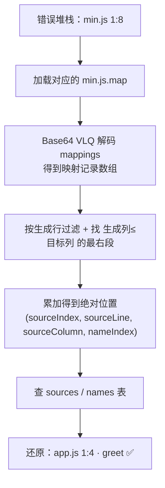
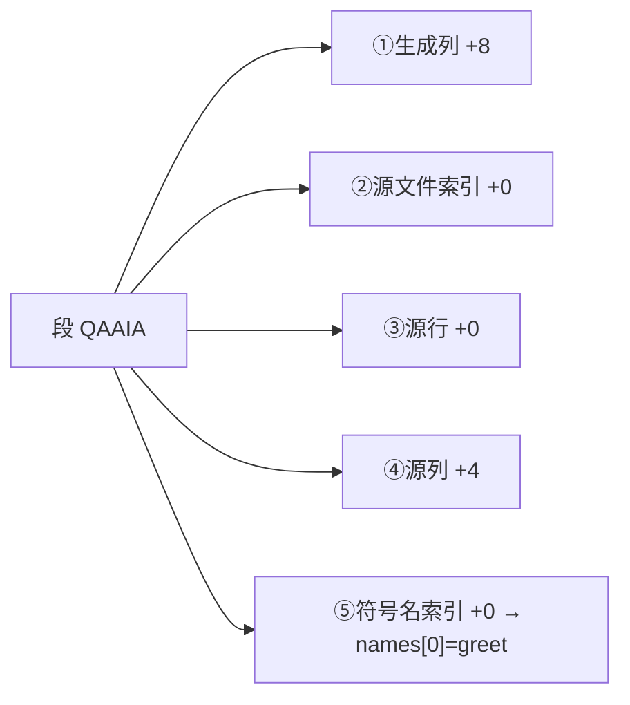

# 04 · SourceMap 还原压缩堆栈（Source Map Restore）

> 一句话说明：生产代码是压缩过的，错误堆栈只给你 `min.js 1:8` 这种没法读的位置；SourceMap（`.map` 文件）就是一张「压缩位置 → 源码位置」的对照表，本模块**手写 Base64 VLQ 解码器**把它还原。

## 📖 知识讲解

### 1）为什么需要 SourceMap

上线前代码会被压缩混淆（minify）：变量改成单字母、空白全删、多行压成一行。于是浏览器抛出的堆栈变成 `at a (min.js:1:8)`——行列号对应的是压缩后的代码，人类无法定位到源码。**SourceMap 就是编译/打包工具（webpack、Vite、esbuild、terser）在压缩时顺便生成的一张映射表**，能把 `(生成行, 生成列)` 反查回 `(源文件, 源行, 源列, 符号名)`。

### 2）`.map` 文件长什么样（Source Map v3）

```json
{
  "version": 3,
  "file": "min.js",
  "sources": ["app.js"],       // 源文件列表
  "names": ["greet", "message"],// 被压缩掉的符号名列表
  "mappings": "AAAA,QAAIA;EACFC" // 核心：编码后的位置映射
}
```

`mappings` 是整个格式的灵魂，规则：

- **分号 `;`** 分隔「生成代码的每一行」；
- **逗号 `,`** 分隔一行内的每个「段（segment）」；
- 每个段是 **1、4 或 5 个数字**，用 **Base64 VLQ** 编码：
  - `[0]` 生成列，`[1]` 源文件索引，`[2]` 源行，`[3]` 源列，`[4]` 符号名索引；
  - **所有数字都是「相对上一段的增量」**，需要累加还原成绝对值（生成列每换一行归零，其余跨行持续累加）。

### 3）Base64 VLQ 解码

VLQ（Variable Length Quantity，可变长度量）把一个整数压进若干个 Base64 字符：

1. 每个 Base64 字符解出 6 bit（0~63）；
2. **最高位（值 32）是 continuation 位**：为 1 表示「后面还有字符属于同一个数」；
3. 低 5 位是数据位，按小端（先低后高）拼接；
4. 拼好后，**整个数的最低位是符号位**：1 表示负数，其余位右移 1 得到数值。

### 4）本 demo 的验证结果（可自己对着算）

内置的 `mappings: "AAAA,QAAIA;EACFC"` 解出：

| 压缩位置 | 段 | 还原到 | 符号名 |
| --- | --- | --- | --- |
| `min.js 1:0` | `AAAA` | `app.js 1:0` | — |
| `min.js 1:8` | `QAAIA` | `app.js 1:4` | `greet` |
| `min.js 2:2` | `EACFC` | `app.js 2:2` | `message` |

以 `QAAIA` 为例：`Q`=16→`(16>>1)=8` 生成列 +8；`I`=8→`(8>>1)=4` 源列 +4；`A`=0→符号名索引 `names[0]="greet"`。

## 🔄 流程图 / 原理图

**从压缩位置到源码位置的还原链路：**



**一个段（segment）的 5 个增量字段：**



## 💻 代码说明

- `index.html`：展示内置的压缩代码、`.map` 内容，并提供「输入生成行/列 → 还原」的交互与两个预设按钮。
- `demo.js`：
  - `decodeVLQ(str)`：手写 VLQ 解码器，逐个 Base64 字符取 continuation 位与数据位，拼接后取符号位（第 45~86 行）。
  - `parseMappings(mappings)`：按 `;` 拆行、`,` 拆段，对每段做**增量累加**还原成绝对映射记录（生成列每行归零，源相关字段跨行累加）。
  - `originalPositionFor(line, col)`：在同一生成行里找「生成列 ≤ 目标列」中最靠右的段，即覆盖该位置的映射，再查 `sources`/`names` 表。
  - 结果渲染进捕获面板，页面加载即自动演示 `min.js 1:8 → app.js 1:4 greet`。

## ▶️ 运行方式

直接用浏览器打开 `index.html`（`file://` 即可，**完全离线**）：

1. 打开即看到一条自动还原结果；
2. 点「示例」按钮或手动输入生成行/列，点「还原」查看对应源码位置与符号名；
3. F12 控制台会打印完整的映射记录数组，可对照文中表格验证。

> 真实工程里你不会手写解码，而是用官方库 [`source-map`](https://github.com/mozilla/source-map) 或平台自动完成——本 demo 手写只为讲透原理。

## ⚠️ 常见坑 / 最佳实践

- **SourceMap 绝不能部署到生产可公开访问**：`.map` 能反编译出你的完整源码。正确做法是**构建时生成、上传到监控平台（如 Sentry），再从服务器删除**，不随 JS 一起发到 CDN。
- **`sourceMappingURL` 注释泄露**：压缩文件末尾的 `//# sourceMappingURL=app.min.js.map` 会暴露 map 地址，生产环境应去掉或改用 `hidden-source-map`。
- **版本必须对应**：`.map` 要和它描述的那次构建的 `min.js` 严格对应（同一 hash/release），版本错位会还原到错误的行。
- **行列都是 0 基**：`mappings` 里生成行/列、源行/列都是 0 基，展示给人看时通常 +1（编辑器习惯 1 基）；本 demo 对行做了 +1。
- **INLINE map 拖慢加载**：`inline-source-map` 把整张表塞进 JS（base64 巨大），只适合开发，生产别用。
- **框架/多层构建**：经过 Babel + 打包器多次转换时，需要「合成 source map」保证一路映射回最初的源码。

## 🔗 官方文档

- [Source Map v3 规范（TC39 · ECMA-426）](https://tc39.es/ecma426/)
- [Firefox · Source Map 格式说明](https://firefox-source-docs.mozilla.org/devtools-user/debugger/how_to/use_a_source_map/)
- [mozilla/source-map（官方解析库）](https://github.com/mozilla/source-map)
- [Sentry · Uploading Source Maps](https://docs.sentry.io/platforms/javascript/sourcemaps/)
- [web.dev · Source maps](https://web.dev/articles/source-maps)
