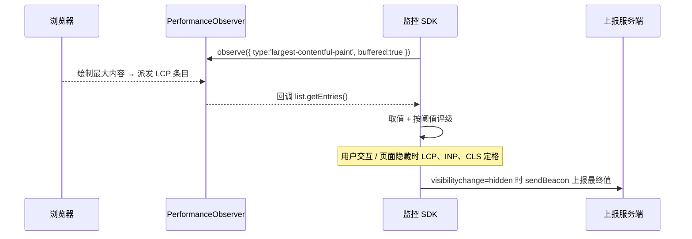
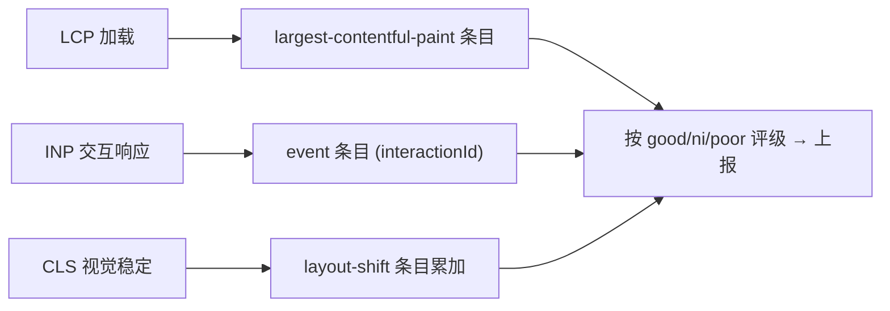

# 05 · Performance API + Web Vitals（性能采集与核心 Web 指标）

> 一句话说明：用浏览器原生的 `PerformanceObserver` 采集 TTFB / FCP / LCP / CLS / INP，并按 web.dev 官方阈值把每个指标评成「优 / 待改进 / 差」。

## 📖 知识讲解

### 1）Web Vitals 是什么

Google 提出的一组**以用户为中心**的性能指标，其中三个是「核心（Core Web Vitals）」：

| 指标 | 全称 | 衡量什么 | good ≤ | 待改进 ≤ | poor > |
| --- | --- | --- | --- | --- | --- |
| **LCP** | Largest Contentful Paint | **加载**：最大内容元素何时绘制完 | 2.5s | 4.0s | 4.0s |
| **INP** | Interaction to Next Paint | **交互响应**：点击到下一帧绘制的时延（2024 取代 FID） | 200ms | 500ms | 500ms |
| **CLS** | Cumulative Layout Shift | **视觉稳定**：内容意外跳动的累积分值 | 0.1 | 0.25 | 0.25 |

另两个常用辅助指标：

| 指标 | 全称 | 衡量什么 | good ≤ |
| --- | --- | --- | --- |
| **TTFB** | Time to First Byte | 服务器首字节耗时 | 800ms |
| **FCP** | First Contentful Paint | 首次绘制出内容 | 1.8s |

### 2）核心 API：`PerformanceObserver`

不用轮询 `performance.getEntries()`，而是**注册观察者**：浏览器一产生新的性能条目（entry）就回调你。

```js
new PerformanceObserver((list) => {
  for (const entry of list.getEntries()) { /* 处理条目 */ }
}).observe({ type: 'largest-contentful-paint', buffered: true });
```

- `type`：要观察的条目类型（`paint` / `largest-contentful-paint` / `layout-shift` / `event` / `navigation` / `resource` …）；
- `buffered: true`：**补发**订阅之前就已经产生的条目（否则会漏掉页面早期的 FCP/LCP）。

### 3）各指标怎么算（本 demo 的口径）

- **TTFB**：`performance.getEntriesByType('navigation')[0].responseStart`。
- **FCP**：`paint` 条目里 `name === 'first-contentful-paint'` 的 `startTime`。
- **LCP**：`largest-contentful-paint` 条目**可能多次触发**，每次是「目前最大」的元素，取**最后一次**；在首次交互或页面隐藏后定格。
- **CLS**：`layout-shift` 条目的 `value` **累加**，但跳过 `hadRecentInput`（用户交互 500ms 内的偏移属预期，不计）。官方严谨口径是「会话窗口最大值」，demo 简化为累加以讲清概念。
- **INP**：`event` 条目里有 `interactionId` 的交互，取 `duration` **最大**的那次（从输入到下一帧绘制）。

## 🔄 流程图 / 原理图

**PerformanceObserver 采集链路：**



**三大核心指标各观察什么条目：**



## 💻 代码说明

- `index.html`：铺一个指标卡片网格，两个按钮分别制造布局偏移（拉高 CLS）和卡顿交互（拉高 INP）。
- `demo.js`：
  - `THRESHOLDS`：内置官方阈值表，`rate()` 据此把值评成 good/ni/poor。
  - 分别用 5 个 `PerformanceObserver`（+ navigation 条目）采集 TTFB/FCP/LCP/CLS/INP，全部带 `buffered:true`。
  - **LCP** 取最后一条、**CLS** 累加并跳过 `hadRecentInput`、**INP** 取最大 `duration`——这些正是官方 web-vitals 库的关键处理。
  - 「制造卡顿交互」按钮用 `while` 空转约 220ms 阻塞主线程，直观演示 INP 变差。

## ▶️ 运行方式

直接用浏览器打开 `index.html`（推荐 Chrome，指标支持最全）：

1. 打开即看到 TTFB / FCP / LCP 有值并评级；
2. 点「制造一次布局偏移」→ CLS 卡片数值上升，评级可能变「待改进/差」；
3. 点「制造一次卡顿交互」→ INP 卡片升到 200ms+，变「待改进」；
4. F12 控制台打印每个指标的更新与评级。

> `file://` 下大多数指标可用；若某指标显示「采集中」，多为该浏览器暂不支持对应条目类型（demo 已做降级）。

## ⚠️ 常见坑 / 最佳实践

- **别用 `load` 事件当性能指标**：`load` 不代表用户「看到/能用」，要用以用户为中心的 LCP/INP/CLS。
- **`buffered: true` 不能漏**：不加会错过页面早期的 FCP/LCP 条目，导致采集不到值。
- **指标要在「定格时机」上报**：LCP/INP/CLS 会持续变化，应在 `visibilitychange` 变 `hidden`（或 `pagehide`）时取最终值，用 `sendBeacon` 上报（见 10 模块）。
- **CLS 的会话窗口**：严谨实现要按「会话窗口取最大值」，本 demo 用累加只为教学；生产建议直接用官方 [`web-vitals`](https://github.com/GoogleChrome/web-vitals) 库。
- **看分位而非平均**：线上要看 **P75**（75 分位），因为平均值会被少数极端值/极好值掩盖真实体验（详见 06 RUM）。
- **实验室 ≠ 真实**：Lighthouse 是合成/实验室数据，真实用户指标（RUM）才是 Core Web Vitals 的评判依据。

## 🔗 官方文档

- [web.dev · Web Vitals（定义与阈值）](https://web.dev/articles/vitals)
- [web.dev · LCP](https://web.dev/articles/lcp) · [INP](https://web.dev/articles/inp) · [CLS](https://web.dev/articles/cls)
- [Google · web-vitals 库](https://github.com/GoogleChrome/web-vitals)
- [MDN · PerformanceObserver](https://developer.mozilla.org/zh-CN/docs/Web/API/PerformanceObserver)
- [MDN · Performance API](https://developer.mozilla.org/zh-CN/docs/Web/API/Performance_API)
- [MDN · LayoutShift / LargestContentfulPaint 条目](https://developer.mozilla.org/zh-CN/docs/Web/API/LayoutShift)
