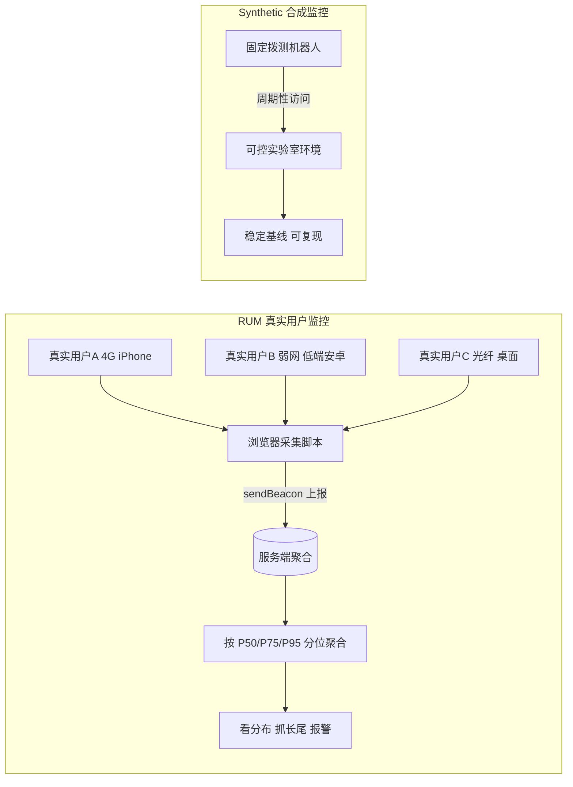

# 06 · 真实用户监控（Real User Monitoring, RUM）

> 采集真实用户在真实设备与网络下的表现数据，用「分布」而非「单点」还原线上真实体验。

## 📖 知识讲解

**RUM（Real User Monitoring，真实用户监控）** 指的是：在真实用户的浏览器里植入采集脚本，收集他们在**真实设备、真实网络、真实操作路径**下产生的性能、错误与行为数据，再上报到服务端聚合分析。

它和 **Synthetic Monitoring（合成监控 / 拨测）** 是一对互补方案：

| 维度 | RUM 真实用户监控 | Synthetic Monitoring 合成监控 |
| --- | --- | --- |
| 数据来源 | 真实用户、真实设备/网络 | 实验室/机房里的固定拨测机器人 |
| 环境 | 千差万别、不可控 | 固定、可控、可复现 |
| 覆盖 | 覆盖长尾设备与弱网用户 | 只覆盖你配置的少量固定环境 |
| 噪声 | 有噪声（网络抖动、插件、低端机） | 干净、稳定 |
| 能否复现问题 | 难复现（环境已过去） | 可随时复现 |
| 发版前能否用 | 不能（要有真实流量） | 能（无需真实用户即可拨测） |
| 典型用途 | 看真实体验分布、抓长尾、报警 | 可用性拨测、回归基线、竞品对比 |

**为什么 RUM 要看分布 / 分位数，而不是看平均值？**

真实用户数据噪声大、长尾长：极少数弱网/低端机用户会产生非常大的耗时。若用**平均值**，会被长尾拉高或被大量快速样本掩盖，既不稳定也不代表典型用户。因此业界普遍看**分位数**：

- **P50（中位数）**：一半用户比它快，代表「典型用户」。
- **P75**：Google Web Vitals 官方推荐的评级口径，兼顾大多数用户又不被极端值绑架。
- **P95 / P99**：代表「最差的那批用户」，用来抓长尾、定报警阈值。

**典型 RUM 上报字段（本 demo 已全部采集）：** `sessionId`、`pageUrl`、`referrer`、`userAgent`/设备信息、屏幕分辨率与 DPR、网络 `navigator.connection.effectiveType`、Web Vitals / Navigation Timing 性能值、错误信息、时间戳。

## 🔄 流程图 / 原理图

## 💻 代码说明

`demo.js` 实现了一个**迷你 RUM 采集器**，全部数据都取自你当前会话的真实值：

- `getSessionId()`：用 `sessionStorage` 生成并复用会话 id，保证同一会话多次上报可关联。
- `getNetworkInfo()`：读取 `navigator.connection` 的 `effectiveType`/`downlink`/`rtt`，并对不支持的浏览器（Safari/Firefox）做兜底。
- `getPerformanceMetrics()`：用 **Navigation Timing v2**（DNS/TCP/TTFB/DOMContentLoaded/load）和 **Paint Timing**（FP/FCP）取真实加载耗时。
- `collectRUMPayload()`：把会话、页面、设备、网络、性能五大维度组装成一条标准 payload。
- `renderPayload()`：格式化 JSON 渲染进 `#panel`，同时 `console.log`；真实项目此处会用 `navigator.sendBeacon('/rum/collect', ...)` 上报（代码中已注释示范）。

## ▶️ 运行方式

1. 直接双击用浏览器打开 `index.html`（`file://` 即可，无需服务器）。
2. 页面加载后，捕获面板会自动显示一条 RUM payload JSON。
3. 点击「重新采集并上报一条 RUM 数据」按钮可再次采集。
4. 打开开发者工具 Console，可看到 `[RUM]` 打印的完整对象。
5. 试试用手机、或切换 Chrome DevTools 的网络限速（Network 面板 → Throttling），再看 `network` 与 `performance` 字段如何变化——这就是「真实用户数据千人千面」。

## ⚠️ 常见坑 / 最佳实践

- **navigator.connection 不是全平台支持**：Safari、Firefox 基本不支持，必须兜底，别直接 `.effectiveType` 取值否则报错。
- **别在 DOMContentLoaded 里读 loadEventEnd**：`load` 事件尚未结束时该值为 0，需在 `load` 后（甚至 `setTimeout` 一帧）再读。
- **不要看平均值**：一定要按分位数聚合，平均值会被长尾污染，也会掩盖弱网用户。
- **采样与隐私**：大流量站点需按比例采样降低成本；UA、URL 可能含敏感信息，上报前要脱敏并遵守合规（GDPR / 个保法）。
- **上报要用 sendBeacon**：页面卸载时用 `navigator.sendBeacon` 或 `fetch(keepalive:true)`，普通 XHR 会被浏览器中断丢数据。
- **RUM 与合成监控要一起用**：RUM 看真实体验分布，合成监控做发版前基线与可用性拨测，互补而非替代。

## 🔗 官方文档

- MDN Navigation Timing：https://developer.mozilla.org/zh-CN/docs/Web/API/Performance_API/Navigation_timing
- MDN Network Information API（navigator.connection）：https://developer.mozilla.org/zh-CN/docs/Web/API/Navigator/connection
- MDN navigator.sendBeacon：https://developer.mozilla.org/zh-CN/docs/Web/API/Navigator/sendBeacon
- web.dev 为什么用 P75 评级 Web Vitals：https://web.dev/articles/vitals
