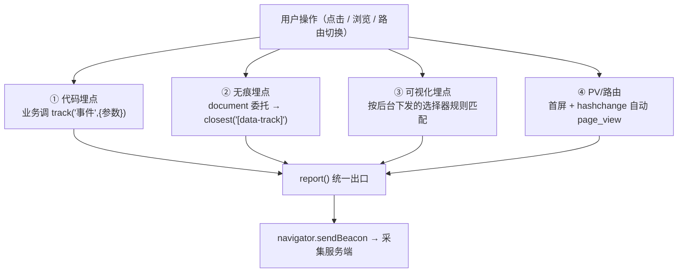
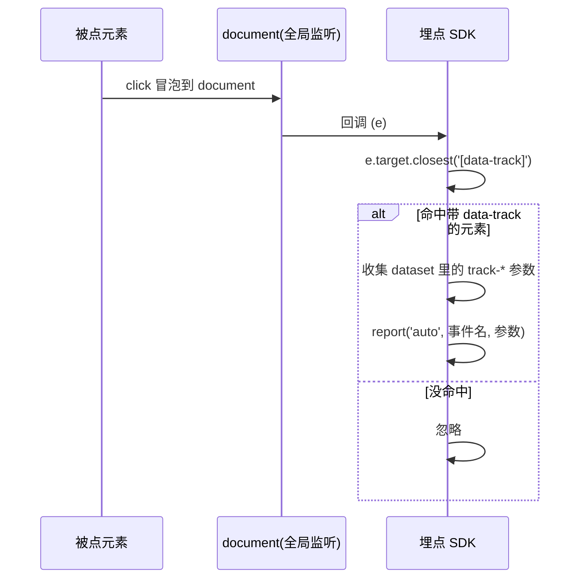

# 07 · 埋点方案（Event Tracking）

> 一句话说明：把「用户做了什么」采集回来。三种主流方式——**代码埋点（手动最准）/ 无痕全埋点（自动不漏）/ 可视化埋点（配置化的无痕）**——加上 PV/路由采集，本模块一次讲清并各给可运行 demo。

## 📖 知识讲解

### 三种埋点方式对比

| 方式 | 怎么采 | 优点 | 缺点 | 适用 |
| --- | --- | --- | --- | --- |
| **代码埋点**（手动/命令式） | 业务代码里显式 `track('事件', {业务参数})` | 最精准、可带任意业务字段、语义清晰 | 要逐处写、改埋点要发版、易漏埋 | 关键转化路径（下单、支付、注册） |
| **无痕/全埋点**（自动/声明式） | 全局委托监听所有点击/曝光，按规则或属性自动采 | 一次接入全站自动采、几乎不漏、无需业务写代码 | 数据泛、语义弱、量大、噪音多 | 全站点击热力、探索性分析 |
| **可视化埋点** | 运营在后台**圈选**页面元素生成规则（选择器），SDK 拉规则后匹配上报 | 不发版即可加埋点、非技术也能配 | 依赖稳定的选择器、页面改版易失效 | 运营频繁调整的活动/落地页 |

> 可视化埋点本质是「**配置化的无痕埋点**」：都是全局监听，区别只是无痕按代码内写死的规则/属性匹配，可视化按后台下发的规则匹配。

### 关键技术点

- **事件委托（无痕的基石）**：不给每个元素单独绑事件，而是在 `document` 上监听一次，利用**冒泡**，用 `e.target.closest('[data-track]')` 找到目标。动态新增的元素也自动生效。
- **声明式参数**：元素上写 `data-track="事件名" data-track-xxx="值"`，SDK 从 `dataset` 自动收集参数。
- **PV / 路由采集**：首屏上报一次 `page_view`；单页应用（SPA）路由切换不会触发整页刷新，需监听 `hashchange`（hash 模式）或劫持 `pushState` + 监听 `popstate`（history 模式）补发 PV。
- **上报出口统一**：所有埋点最终走一个 `report()`，内部用 `navigator.sendBeacon`（见 10 模块）保证页面卸载时也能可靠发出。

## 🔄 流程图 / 原理图

**三种方式汇入同一上报出口：**

**无痕埋点的事件委托原理：**

## 💻 代码说明

- `index.html`：左「代码埋点」按钮、右「无痕」的 `data-track` 元素、下「PV/路由」的 hash 链接，底部上报面板。
- `demo.js`：
  - `report(channel, event, payload)`：统一出口，用 `navigator.sendBeacon` 模拟上报并渲染面板。
  - `track()`：**代码埋点**，业务里手动调用、可带 `skuId/price` 等精确业务字段。
  - **无痕埋点**：`document.addEventListener('click')` 全局委托，`closest('[data-track]')` 找目标，从 `dataset` 自动收集 `track-*` 参数 + 元素文本/标签。
  - **可视化埋点**：内置 `visualRules`（选择器规则数组）模拟后台圈选，点击时按选择器匹配上报。
  - **PV/路由**：`trackPV()` 首屏调用一次 + 监听 `hashchange` 自动补发。

## ▶️ 运行方式

直接用浏览器打开 `index.html`（`file://` 即可）：

1. 点「立即购买」→ 面板出现绿色「代码埋点」记录，带 `skuId/price` 业务参数；
2. 点右侧 Banner/分享/首页/购物车 → 出现黄色「无痕埋点」记录，参数是自动从 `data-track-*` 收集的；
3. 点「立即购买」你会同时看到一条「可视化规则」命中的记录；
4. 点 `#/home` `#/product` `#/order` → 每次切换自动出现紫色「PV/路由」记录；
5. F12 控制台同步打印每条上报。

## ⚠️ 常见坑 / 最佳实践

- **代码埋点靠手动，最容易漏埋**：关键转化点建议**代码埋点 + 无痕兜底**双保险。
- **无痕数据量爆炸**：全站点击都采，量极大且噪音多，要做**采样、聚合、白名单**，别全量上报。
- **可视化埋点依赖选择器稳定性**：页面改版后 CSS 选择器失效导致埋点丢失，建议配合稳定的 `data-*` 标识而非纯 `nth-child`。
- **SPA 路由要手动补 PV**：单页应用切路由不刷新页面，忘了监听 `hashchange`/`popstate` 会导致只统计到首屏一次 PV。
- **曝光埋点用 `IntersectionObserver`**：「元素被看到」（曝光）不是点击，应该用交叉观察器判断进入视口才上报。
- **隐私合规**：埋点涉及用户行为，需遵守 GDPR/个人信息保护法，敏感字段脱敏、提供同意机制。
- **事件命名规范**：统一 `模块_动作`（如 `cart_click`）便于后续分析，避免各写各的。

## 🔗 官方文档

- [MDN · 事件委托（Event delegation）](https://developer.mozilla.org/zh-CN/docs/Learn/JavaScript/Building_blocks/Events#事件委托)
- [MDN · HTMLElement.dataset（data-* 属性）](https://developer.mozilla.org/zh-CN/docs/Web/API/HTMLElement/dataset)
- [MDN · Navigator.sendBeacon()](https://developer.mozilla.org/zh-CN/docs/Web/API/Navigator/sendBeacon)
- [MDN · IntersectionObserver（曝光埋点）](https://developer.mozilla.org/zh-CN/docs/Web/API/Intersection_Observer_API)
- [MDN · History API / popstate（SPA 路由）](https://developer.mozilla.org/zh-CN/docs/Web/API/History_API)
