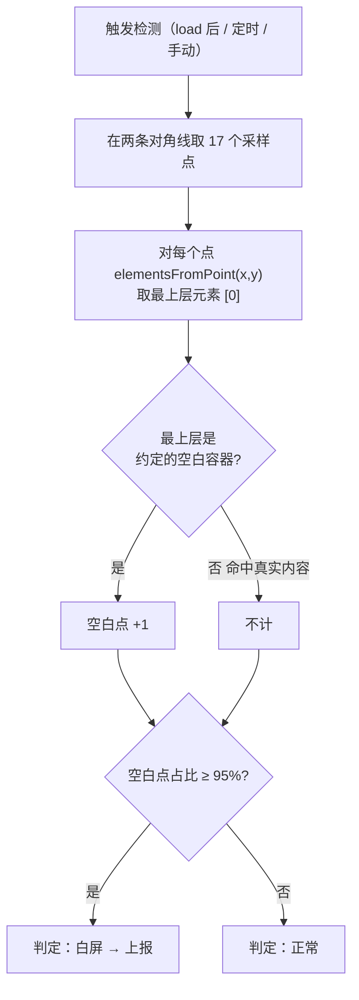
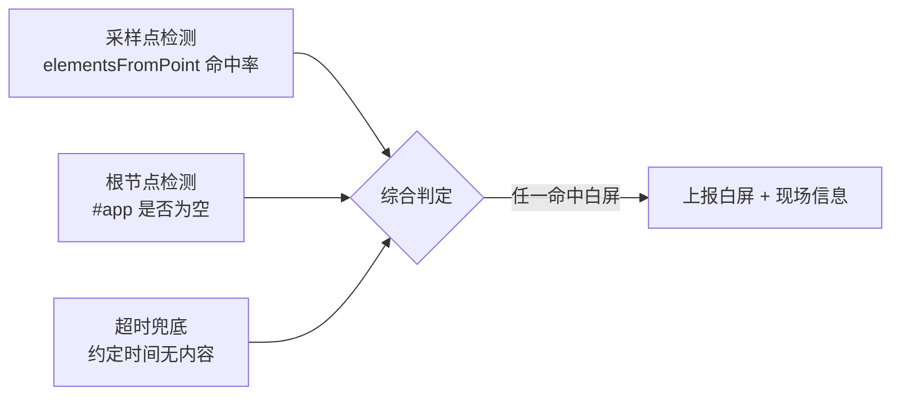

# 08 · 白屏检测（White Screen Detection）

> 一句话说明：页面加载后一片空白（JS 挂了、资源丢了、接口全失败、框架没挂载成功），却往往**不抛错**——普通错误监控抓不到。白屏检测靠**主动探测页面到底有没有渲染出内容**：采样点检测 + 根节点检测 + 超时兜底。

## 📖 知识讲解

### 1）为什么白屏难被发现

白屏常见成因：核心 JS 加载失败、运行时错误导致框架没 `mount`、CDN 挂掉、首屏接口全 500、模板渲染异常。它们的共同点是——**页面结构还在，但没有可见内容**，很多时候连一个 JS 错误都不抛（比如框架静默失败）。所以需要一种「不管为什么，只看结果」的探测手段。

### 2）方法一：采样点检测（业界主流）

思路：**在屏幕上取若干采样点，看每个点最上层是不是「真实内容」还是「空白容器」。**

- 取点：通常在屏幕**两条对角线**上均匀取十几个点（本 demo 取 17 个），覆盖面广且成本低；
- 探测：对每个点调 `document.elementsFromPoint(x, y)`，它返回该坐标处**从上到下堆叠的所有元素**，`[0]` 是最上层元素；
- 判空白：预先约定一批「算作空白」的容器选择器（如 `html`、`body`、根容器 `#app`）。若某点最上层命中的是这些容器，说明该处**没有内容盖在上面** → 记一个「空白点」；
- 判定：若**空白点占比超过阈值**（如 95%），判为白屏。

> 关键点：`elementsFromPoint`（复数）比 `elementFromPoint`（单数）好用——能拿到整个堆叠，便于判断内容是否真的覆盖了容器。

### 3）方法二：根节点检测

直接看框架挂载点：`#app`（或 `#root`）的 `children.length === 0` 或 `innerHTML` 为空，说明框架根本没渲染出东西。简单直接，但只能判「完全没渲染」，对「渲染了一半/骨架屏残留」不敏感——所以和采样点法**互补**。

### 4）方法三：超时兜底

约定一个时间（如 `load` 后 1s），若首屏还没渲染出内容就上报「疑似白屏」。真实项目里，首屏渲染完成的回调要负责 `clearTimeout` 取消这个兜底，避免误报。

### 5）综合判定

三种方法结合：**采样点判白 OR 根节点为空**即判白屏，再叠加超时兜底。命中后上报（可附加截图、当前 URL、资源加载情况）帮助排查。

## 🔄 流程图 / 原理图

**采样点检测流程：**

**三种手段互补：**

## 💻 代码说明

- `index.html`：`#app` 是被监控的「页面主体」，正常时有商品卡片；「制造白屏」按钮会清空它并把背景刷白模拟真实白屏。
- `demo.js`：
  - `wrapperSelectors`：约定的「空白容器」选择器列表，采样点命中它们即算空白。
  - `detectBySamplePoints()`：在两条对角线取 17 个点，对每个点 `document.elementsFromPoint()` 取最上层，`isWrapper()` 判是否空白，统计占比与阈值（0.95）。
  - `detectByRoot()`：检查 `#app.children.length` / `innerHTML` 是否为空。
  - `runDetection()`：综合两法判定并渲染结果；`load` 后 1s 的 `setTimeout` 做超时兜底。

## ▶️ 运行方式

直接用浏览器打开 `index.html`（`file://` 即可）：

1. 打开约 1 秒后，超时兜底自动跑一次检测 → 面板显示「✅ 页面正常」（采样点大多命中内容）；
2. 点「💥 制造白屏」清空 `#app`，再点「🔍 立即执行一次白屏检测」→ 面板显示「⚠️ 白屏！」，空白点占比接近 100%、根节点为空；
3. 点「恢复页面内容」后再检测 → 又回到正常；
4. F12 控制台打印每次检测的采样点命中明细。

## ⚠️ 常见坑 / 最佳实践

- **检测时机很重要**：太早（首屏还没渲染完）会误报，应放在 `load` 之后 + 留出缓冲，或在框架渲染完成回调里做。
- **采样点数量与分布**：太少易误判，一般十几个点、走对角线覆盖面最好；纯色大背景页面要额外结合根节点检测。
- **`wrapperSelectors` 要准**：把「算作空白」的容器列全（`html/body/根容器/骨架屏容器`），漏了会导致白屏判不出；多了会误判正常页为白屏。
- **别和骨架屏冲突**：如果用骨架屏占位，要把骨架容器也纳入「空白」判定，否则骨架会被当成"有内容"而漏报白屏。
- **误报要能容忍**：单次判白别急着报，可**连续检测 N 次**都白再上报，降低偶发误报。
- **上报要带现场**：白屏上报时附带 URL、资源加载失败列表（结合 03 模块）、可选首屏截图，才好定位根因。
- **首屏兜底 UI**：检测到白屏后，除了上报，最好给用户一个「加载失败，点击重试」的兜底界面，而不是干瞪白屏。

## 🔗 官方文档

- [MDN · Document.elementsFromPoint()](https://developer.mozilla.org/zh-CN/docs/Web/API/Document/elementsFromPoint)
- [MDN · Document.elementFromPoint()](https://developer.mozilla.org/zh-CN/docs/Web/API/Document/elementFromPoint)
- [MDN · Window：load 事件](https://developer.mozilla.org/zh-CN/docs/Web/API/Window/load_event)
- [MDN · Element.matches()](https://developer.mozilla.org/zh-CN/docs/Web/API/Element/matches)
- [Sentry · JavaScript SDK（配合上报白屏事件）](https://docs.sentry.io/platforms/javascript/)
