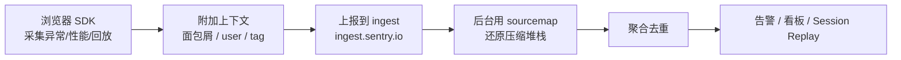

# 09 · Sentry 接入示例（Sentry Integration）

> 一句话说明：用一体化平台 Sentry，把前端的错误、性能、会话回放集中采集与告警，本 demo 用 mock Sentry 还原「初始化 → 面包屑 → 捕获异常 → 上报」的完整数据流。

## 📖 知识讲解

**Sentry 是什么？** 一个「错误监控 + 性能追踪（Tracing）+ 会话回放（Session Replay）」三合一的可观测性平台。前端接入官方 Browser SDK 后，页面上未捕获的异常、Promise rejection、手动上报的消息、性能指标都会被采集并上报到 Sentry 后台，在看板里聚合、去重、告警。

**接入步骤（真实项目）：**

1. 安装 SDK：`npm install @sentry/browser`
2. 应用入口初始化：

```js
import * as Sentry from "@sentry/browser";

Sentry.init({
  dsn: "https://<key>@o<orgId>.ingest.sentry.io/<projectId>", // 项目唯一上报地址
  release: "my-project@1.0.0",                                // 版本号，用于关联 sourcemap
  integrations: [
    Sentry.browserTracingIntegration(), // 性能追踪
    Sentry.replayIntegration(),         // 会话回放
  ],
  tracesSampleRate: 1.0,                 // 性能追踪采样率（1.0 = 全采）
  tracePropagationTargets: ["localhost", /^https:\/\/yourserver\.io\/api/],
  replaysSessionSampleRate: 0.1,         // 普通会话回放采样 10%
  replaysOnErrorSampleRate: 1.0,         // 出错的会话 100% 回放
});
```

**不想用打包工具？** 用官方 CDN Loader，引入后全局就有 `Sentry`：

```html
<script src="https://browser.sentry-cdn.com/10.63.0/bundle.tracing.min.js" crossorigin="anonymous"></script>
```

**常用 API：**

- `Sentry.captureException(err)` — 上报一个异常对象（自动解析堆栈）
- `Sentry.captureMessage(msg, level)` — 上报一条自定义消息
- `Sentry.setUser({ id })` — 绑定当前用户，事件按用户可查
- `Sentry.setTag(key, value)` — 打标签，后台按维度筛选
- `Sentry.addBreadcrumb({ category, message })` — **面包屑**：记录错误发生前的用户操作轨迹（点击、导航、网络请求等），异常上报时自动附带，帮你还原「用户是怎么一步步走到出错」的现场

**Source Map 与堆栈还原：** 生产代码是压缩混淆的，堆栈里全是 `a.b.c` 无法阅读。构建时生成 sourcemap 并上传到 Sentry（用 `sentry-cli sourcemaps upload`，或构建插件 `@sentry/vite-plugin`），Sentry 后台会用 `release` 版本号匹配 sourcemap，**自动把压缩堆栈还原成源码级别的文件名/行号/列号**。注意：sourcemap 只上传给 Sentry，不要随生产资源公开发布。

## 🔄 流程图 / 原理图



## 💻 代码说明

- `index.html`：捕获面板 `#panel` + 三个按钮（触发异常 / captureMessage / 记录面包屑），经典 `<script src="demo.js">` 引入。
- `demo.js`：
  - 定义 **mock Sentry** stub 挂到 `window.Sentry`，实现 `init / captureException / captureMessage / addBreadcrumb / setUser / setTag`，把「本应上报的事件」渲染到面板并 `console.log`。
  - `breadcrumbs` 数组模拟面包屑缓冲：`addBreadcrumb` 只入队，`captureException` 时把轨迹一起带走再清空。
  - 监听全局 `error` 事件做兜底，未 try/catch 的错误也会被 `captureException`。
  - 三个按钮分别演示：埋面包屑后抛真实 `TypeError`、手动上报消息、单独记录面包屑。

真实接入时，把 mock 换成官方 SDK 即可，业务侧调用一模一样。

## ▶️ 运行方式

直接用浏览器打开 `index.html`（`file://` 即可，无需服务器）。依次点击三个按钮：

1. 先点几次「记录一条面包屑」，面板出现黄色轨迹；
2. 再点「触发一个异常」，面板出现红色异常事件，并带上之前的面包屑；
3. 点「手动 captureMessage」上报一条绿色消息。

同时打开控制台可看到 `[mock Sentry]` 前缀的日志。

## ⚠️ 常见坑 / 最佳实践

- **DSN 不是密钥**：DSN 可以出现在前端代码里（它只用于上报，不能读数据），但不要把后台 auth token 泄露到前端。
- **release 必须和 sourcemap 上传时的版本号一致**，否则后台无法匹配 sourcemap，堆栈还原失败。
- **sourcemap 不要随生产资源一起公开发布**，只上传给 Sentry。
- **采样率要按量级调**：高流量站点 `tracesSampleRate`/`replaysSessionSampleRate` 设小值（如 0.1）控制成本与配额。
- **面包屑要有意义**：过多噪音面包屑会淹没关键操作；`replaysOnErrorSampleRate: 1.0` 保证出错会话必回放，性价比高。
- **先 init 再有业务代码**：`Sentry.init` 要尽量早执行，才能捕获到早期异常。

## 🔗 官方文档

- Sentry Browser JS SDK：https://docs.sentry.io/platforms/javascript/
- 上传 Source Maps：https://docs.sentry.io/platforms/javascript/sourcemaps/
- 面包屑 Breadcrumbs：https://docs.sentry.io/platforms/javascript/enriching-events/breadcrumbs/
