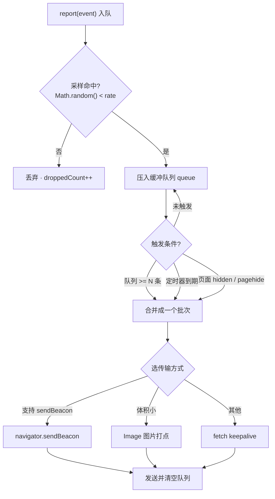

# 10 · 上报策略（Report Strategy）

> 一句话说明：埋点数据怎么可靠、省量地发出去——对比三种传输方式，配合采样、批量合并与正确的上报时机，本 demo 用 mini Reporter 让你看到「多条合并成一次、部分被采样丢弃」。

## 📖 知识讲解

前端监控采集到数据后，**怎么把数据发出去** 是一门工程。核心目标：不丢、不阻塞页面、不打爆后端、页面卸载时也能发出。

### 三种上报传输方式对比

| 方式 | 能否跨域 | 卸载时能否发 | 方法 | 大小限制 | 是否阻塞 |
| --- | --- | --- | --- | --- | --- |
| `navigator.sendBeacon(url, data)` | 能（受 CORS，简单请求不预检） | **能**，浏览器后台发送 | 只能 POST | 有限制（数据量不宜大） | 不阻塞卸载 |
| 图片打点 `new Image().src = url+'?data='` | **能**，天然跨域、不触发 CORS 预检 | 一般能（GET 短请求） | 只能 GET | 受 URL 长度限制 | 不阻塞 |
| `fetch(url, { keepalive: true })` | 能（受 CORS） | **能**，页面卸载也能发 | 任意（可自定义 header/方法） | 有 keepalive 体积上限 | 不阻塞 |

- **sendBeacon**：异步 POST，返回 `boolean`（是否成功入队）；即使页面正在卸载也能可靠发出，浏览器在后台发送、不阻塞卸载。首选。
- **图片打点**：兼容性最好，天然跨域不触发预检，但只能 GET、受 URL 长度限制。老浏览器兜底。
- **fetch keepalive**：类似 sendBeacon，页面卸载也能发，且能自定义 header/方法，适合需要复杂请求头的场景。

### 采样（Sampling）

高流量下全量上报会打爆后端和配额。按比例丢弃：`Math.random() < rate` 命中才上报，`rate=0.1` 约保留 10%。错误类事件通常全采，PV/性能类可降采样。

### 合并 / 批量（Batching）

不要一条事件发一个请求。把多条事件放进队列，**达到阈值条数 / 定时到期 / 页面隐藏时**，合并成一个请求发出，大幅减少请求数。

### 上报时机

监听 `document` 的 `visibilitychange`（`visibilityState === 'hidden'`）或 `pagehide` 事件，在其中 flush 队列——比 `unload`/`beforeunload` 更可靠，尤其在移动端（切后台/锁屏/杀进程时 unload 常不触发）。

## 🔄 流程图 / 原理图

## 💻 代码说明

- `index.html`：网络日志面板 `#panel` + 状态栏 `#status`（实时显示缓冲条数、丢弃条数、采样率）+ 按钮（产生事件 / 一次 5 个 / 手动 flush / 切换采样率）。
- `demo.js` 的 mini Reporter：
  - `report(event)`：先按 `sampleRate` 采样，命中丢弃并计数；否则入队，队列达 `BATCH_SIZE`（默认 5）自动 `flush`。
  - `flush(reason)`：把队列快照合并成一批，清空队列，交给 `transport`。
  - `transport(batch)`：能力探测——优先 `navigator.sendBeacon`，回退图片打点（体积小），再回退 `fetch keepalive`，并把「模拟发出的请求」渲染到面板（用不同颜色区分传输方式）。
  - 自动 flush 时机：`setInterval` 定时、`visibilitychange` 到 hidden、`pagehide`。

## ▶️ 运行方式

用浏览器打开 `index.html`（`file://` 即可）。建议这样体验：

1. 连点「产生一个事件」到第 5 条——看到自动合并成一次 `sendBeacon` 上报（面板一条绿色请求含 5 个事件）。
2. 点「一次产生 5 个」——立即凑满阈值触发合并。
3. 产生 1~2 条后点「手动 flush」——不足阈值也能立即发出。
4. 点「切换采样率」到 `0.2`，再猛点「产生事件」——状态栏「已丢弃」计数上涨，只有少部分进入缓冲。
5. 切到别的标签页再切回来——`visibilitychange` 触发，隐藏瞬间把剩余事件 flush。

配合控制台看 `[Reporter]` 日志更清楚。

## ⚠️ 常见坑 / 最佳实践

- **别用 `unload`/`beforeunload` 上报**：移动端和 bfcache 下常不触发，用 `visibilitychange(hidden)` + `pagehide`。
- **sendBeacon 有体积上限**，大 payload 会返回 `false` 发送失败，需回退 fetch 或拆分。
- **图片打点只能 GET**，数据要 `encodeURIComponent` 且注意 URL 长度上限（约 2KB 安全）。
- **flush 前先取队列快照再清空**，避免上报期间新事件被误删或重复发送。
- **采样要分级**：错误全采，PV/性能降采样；采样决策尽量在客户端做以省流量。
- **合并要有兜底定时器**：只靠阈值触发，低频页面的事件可能长时间攒着发不出去。
- **fetch keepalive 也有体积限制**（各浏览器约 64KB 级别），批次别攒太大。

## 🔗 官方文档

- Navigator.sendBeacon()：https://developer.mozilla.org/zh-CN/docs/Web/API/Navigator/sendBeacon
- fetch keepalive：https://developer.mozilla.org/zh-CN/docs/Web/API/Window/fetch
- Page Visibility API：https://developer.mozilla.org/zh-CN/docs/Web/API/Page_Visibility_API
- pagehide 事件：https://developer.mozilla.org/zh-CN/docs/Web/API/Window/pagehide_event
