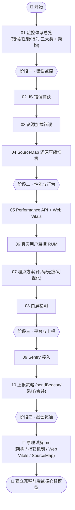
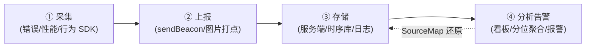

# 21 · 前端监控 · 埋点 · 性能监控（Frontend Monitoring）

> 代码上线只是开始。用户在什么设备、什么网络下用你的页面，哪里报了错、哪里卡了、哪里白了屏、点了什么又流失在哪一步——这些线上真相，**只有前端监控能告诉你**。本工程系统讲解「错误监控 / 性能监控 / 行为埋点」三大体系，从捕获、还原到上报，配套可运行 demo（浏览器直接打开就能看到捕获效果），并对照 Sentry、web.dev/Web Vitals、MDN Performance API 等权威文档。

## 📚 这个工程讲什么

一套前端监控系统，本质是把「用户端发生的事」可靠地采集回来、还原出来、聚合成可决策的数据：

- **采什么**：错误（JS 错误 / 资源加载失败 / 接口失败 / 白屏）、性能（Web Vitals / 资源耗时 / 接口耗时）、行为（PV/UV / 点击 / 路由 / 停留）。
- **怎么采**：全局错误钩子、捕获阶段监听、`PerformanceObserver`、埋点 SDK。
- **怎么还原**：压缩代码靠 SourceMap 还原到源码行列。
- **怎么送回来**：`sendBeacon` / 图片打点 / `fetch keepalive`，配合采样、合并、在页面隐藏时机上报。
- **用什么平台**：以 Sentry 为例串起「采集 → 上报 → 存储 → 告警」全链路。

配套的《[原理详解.md](./原理详解.md)》深入讲透**监控系统架构、错误捕获机制、Web Vitals 计算原理、SourceMap 还原原理**（多图）。

## 🗂 模块索引

| 模块 | 知识点 | 你将学会 | 运行方式 |
| --- | --- | --- | --- |
| [01](./01-monitoring-overview/) | 监控体系总览 | 错误/性能/行为三大类分别抓什么、监控系统整体架构 | 浏览器打开 |
| [02](./02-error-capture/) | JS 错误捕获 | `onerror` / `unhandledrejection` / try-catch / 框架错误边界 | 浏览器打开 |
| [03](./03-resource-error/) | 资源加载错误 | 为何要用**捕获阶段** `addEventListener('error', fn, true)` | 浏览器打开 |
| [04](./04-sourcemap-restore/) | SourceMap 还原 | 压缩堆栈如何靠 `.map`（VLQ mappings）还原到源码 | 浏览器打开 |
| [05](./05-performance-api-web-vitals/) | 性能采集 | Performance API + LCP/CLS/INP 原生采集与评级 | 浏览器打开 |
| [06](./06-rum/) | 真实用户监控 RUM | RUM vs 合成监控、采集维度、为何看分位 | 浏览器打开 |
| [07](./07-tracking/) | 埋点方案 | 代码埋点 / 无痕埋点 / 可视化埋点对比 | 浏览器打开 |
| [08](./08-white-screen-detection/) | 白屏检测 | 采样点检测、根节点检测、超时兜底 | 浏览器打开 |
| [09](./09-sentry-integration/) | Sentry 接入 | DSN/init/集成/采样/面包屑/SourceMap 上传 | 浏览器打开 |
| [10](./10-report-strategy/) | 上报策略 | `sendBeacon`/图片打点/采样/合并/上报时机 | 浏览器打开 |

> 所有 demo 均为**免构建**，直接用浏览器打开对应目录的 `index.html` 即可看到捕获效果（页面内置「捕获面板」实时展示采集到的数据）。个别涉及 ESM/CDN 的示例在模块 README 里注明需本地服务器。

## 🧭 学习路线

建议按编号顺序学习，整体分四个阶段：**建立认知 → 错误监控 → 性能与行为 → 上报落地**。

监控系统的核心链路（贯穿全工程）：

## 🔗 官方 / 权威文档

- [web.dev · Web Vitals](https://web.dev/articles/vitals)（LCP / INP / CLS 定义与阈值）
- [Google · web-vitals 库](https://github.com/GoogleChrome/web-vitals)
- [MDN · Performance API](https://developer.mozilla.org/zh-CN/docs/Web/API/Performance_API)
- [MDN · PerformanceObserver](https://developer.mozilla.org/zh-CN/docs/Web/API/PerformanceObserver)
- [MDN · Navigator.sendBeacon()](https://developer.mozilla.org/zh-CN/docs/Web/API/Navigator/sendBeacon)
- [MDN · GlobalEventHandlers.onerror](https://developer.mozilla.org/zh-CN/docs/Web/API/Window/error_event)
- [Sentry · JavaScript SDK 文档](https://docs.sentry.io/platforms/javascript/)
- [Source Map v3 规范](https://tc39.es/ecma426/)
