# 前端监控 · 原理详解（How & Why）

> 本文不讲「怎么用某个 API」，而是讲透前端监控背后的**机制与原理**：一套监控系统的整体架构如何流转，浏览器到底是怎么把一个错误「捕获」到的，Web Vitals 这些指标是**怎么算出来的**，以及压缩后的报错堆栈又是如何靠 SourceMap 一步步**还原**回源码行列的。对照 web.dev / MDN / Sentry 官方整理。

---

## 目录

1. [监控系统整体架构：采集 → 上报 → 存储 → 告警](#一监控系统整体架构)
2. [错误捕获机制：浏览器是怎么抓到错误的](#二错误捕获机制)
3. [Web Vitals 计算原理：指标是怎么算出来的](#三web-vitals-计算原理)
4. [SourceMap 还原原理：压缩堆栈如何变回源码](#四sourcemap-还原原理)
5. [上报的可靠性原理：为什么用 sendBeacon](#五上报的可靠性原理)
6. [常见误区](#六常见误区)

---

## 一、监控系统整体架构

一套前端监控系统（不管是自研还是 Sentry / 阿里 ARMS / 腾讯 RUM），本质都是同一条数据管道。理解这条管道，是理解一切细节的前提。

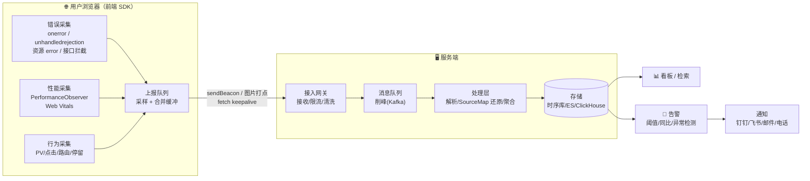

### 四个环节各解决什么问题

| 环节 | 核心职责 | 关键难点 |
| --- | --- | --- |
| **① 采集** | 在浏览器端「无侵入、少性能损耗」地抓到错误/性能/行为 | 不能拖慢页面、不能自己再抛错、要兼容各端 |
| **② 上报** | 把数据「可靠」送回服务端，哪怕页面正在关闭 | 页面卸载时请求会被杀、量大要削峰、跨域 |
| **③ 存储** | 抗住高并发写入、支持按时间/维度快速查询 | 削峰（消息队列）、冷热分层、成本 |
| **④ 分析告警** | 把海量原始数据聚合成「可决策」的指标与报警 | 分位聚合、SourceMap 还原、降噪、防误报 |

### 为什么采集端要「队列 + 采样 + 合并」

采集端不能来一条发一条：一次点击可能触发几十个埋点，网络请求本身也有开销。所以 SDK 内部普遍是一个**生产者-消费者队列**：

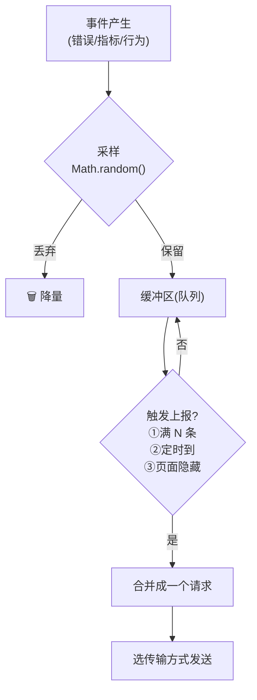

这套设计在模块 10（上报策略）里有可运行的 mini Reporter 实现。

---

## 二、错误捕获机制

「捕获错误」听起来简单，但浏览器里错误来源不同、传播路径不同，用错 API 就会**漏抓**。这是前端监控最容易踩坑的地方。

### 2.1 四种错误来源，四种抓法

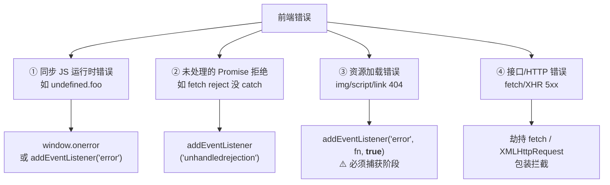

### 2.2 事件传播三阶段：资源错误为什么必须走「捕获阶段」

这是全篇最关键的原理之一。浏览器里一个事件从 `window` 传到目标元素、再传回来，分三个阶段：

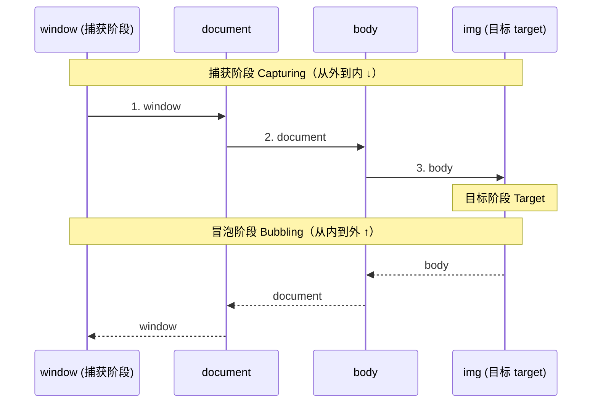

**关键事实（MDN）**：资源加载错误（``/`<script>`/`<link>` 加载失败触发的 `error` 事件）**不会冒泡**。这意味着：

- `window.onerror`（等价于 window 上的冒泡监听）**抓不到**资源错误——因为它根本冒泡不上来。
- `window.addEventListener('error', fn)`（默认第三参 `false`，冒泡阶段）**也抓不到**。
- 只有 `window.addEventListener('error', fn, true)`（第三参 `true`，**捕获阶段**）能抓到——因为捕获阶段是「从 window 往下传」，资源元素的 error 事件在下行过程中会经过 window 的捕获监听器。

所以监控 SDK 的标配是：

```js
// 捕获阶段监听：既能抓 JS 错误，也能抓资源错误
window.addEventListener('error', (e) => {
  // 资源错误：e.target 是出错的元素（有 tagName），且没有 e.message
  if (e.target && (e.target.src || e.target.href)) {
    report({ type: 'resource', tag: e.target.tagName, url: e.target.src || e.target.href });
  } else {
    // JS 运行时错误：有 message / filename / lineno / colno / error(含 stack)
    report({ type: 'js', message: e.message, stack: e.error && e.error.stack });
  }
}, true); // ← 这个 true 是灵魂
```

### 2.3 onerror vs addEventListener('error')

| 维度 | `window.onerror` | `addEventListener('error', fn, true)` |
| --- | --- | --- |
| 参数 | `(message, source, lineno, colno, error)` | 一个 `ErrorEvent` 对象 |
| 抓 JS 错误 | ✅ | ✅ |
| 抓资源错误 | ❌（不冒泡） | ✅（捕获阶段） |
| 阻止默认行为 | `return true` | `e.preventDefault()` |
| 可注册多个 | ❌（后者覆盖前者） | ✅ |

结论：监控 SDK 用 `addEventListener('error', fn, true)` + `unhandledrejection`，覆盖面最全。

### 2.4 框架错误边界补位

全局钩子抓不到框架**渲染过程**中被框架吞掉的错误，需要框架级错误边界补位：

- **React**：类组件的 `static getDerivedStateFromError()` + `componentDidCatch(error, info)`（或用 `react-error-boundary`）。
- **Vue3**：`app.config.errorHandler = (err, instance, info) => { report(err) }`。

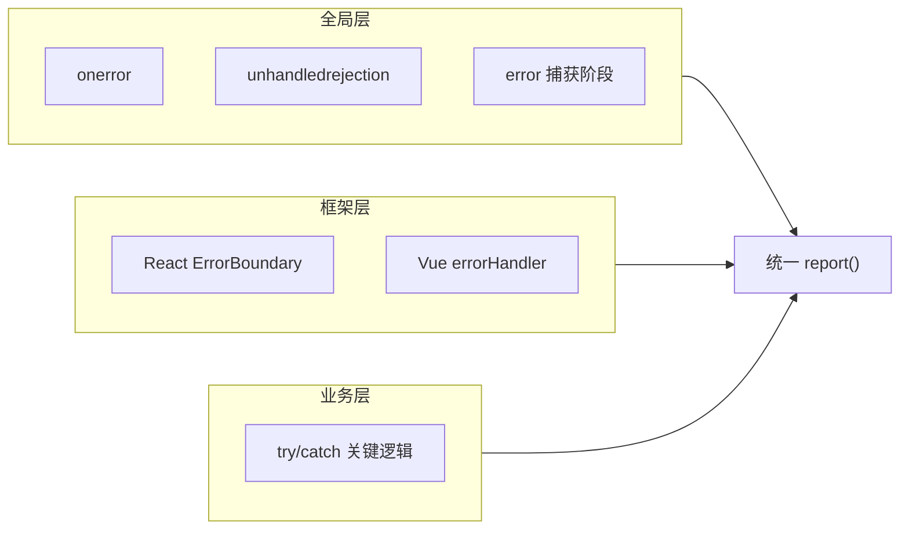

三层互补：`try/catch` 精准兜关键逻辑，框架边界兜渲染错误，全局钩子兜漏网之鱼。

---

## 三、Web Vitals 计算原理

Web Vitals 是 Google 定义的一组「以用户为中心」的体验指标。理解它们**怎么算**，才知道监控里采到的数是什么含义。

### 3.1 三大核心指标（Core Web Vitals，2024/2025）

| 指标 | 全称 | 衡量 | 好 | 需改进 | 差 |
| --- | --- | --- | --- | --- | --- |
| **LCP** | Largest Contentful Paint | 加载速度 | ≤ 2.5s | 2.5–4.0s | > 4.0s |
| **INP** | Interaction to Next Paint | 交互响应 | ≤ 200ms | 200–500ms | > 500ms |
| **CLS** | Cumulative Layout Shift | 视觉稳定 | ≤ 0.1 | 0.1–0.25 | > 0.25 |

> **INP 在 2024 年 3 月正式取代 FID** 成为核心 Web 指标。判定统一取**第 75 百分位**，并分「移动端 / 桌面端」。辅助指标：**FCP** 好 ≤1.8s / 差 >3.0s，**TTFB** 好 ≤0.8s / 差 >1.8s。

### 3.2 页面加载时间线：这些指标发生在何时

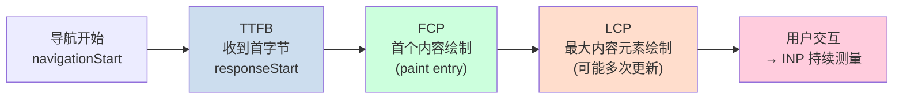

### 3.3 LCP 是怎么算的

- 浏览器在渲染过程中，持续记录「视口内**最大的**内容元素（图片/文本块/背景图等）」的渲染时间。
- 每出现更大的候选元素，就派发一个新的 `largest-contentful-paint` 条目——所以 LCP 会**多次更新**，以「用户第一次交互之前的**最后一个**候选」为最终值。
- 采集：`PerformanceObserver` 监听 `type: 'largest-contentful-paint'`，取最后一条的 `startTime`。

```js
new PerformanceObserver((list) => {
  const entries = list.getEntries();
  const last = entries[entries.length - 1]; // 取最后一个候选
  lcp = last.startTime; // 单位 ms
}).observe({ type: 'largest-contentful-paint', buffered: true });
```

### 3.4 CLS 是怎么算的（累积布局偏移）

CLS 不是时间，而是一个**无量纲分数**，衡量页面「元素乱跳」的程度。单次偏移分：

> **layout shift score = impact fraction（受影响面积占比）× distance fraction（移动距离占比）**

- `impact fraction`：本帧发生位移的所有元素，其「前后并集」占视口的面积比例。
- `distance fraction`：这些元素移动的最大距离 ÷ 视口对应边长。

CLS 取一系列「会话窗口（session window）」中**得分最高**的那个窗口之和（而非全程简单累加）。关键：**用户交互 500ms 内引起的位移不计入**——通过 `LayoutShift` 条目的 `hadRecentInput` 字段过滤。

```js
let cls = 0;
new PerformanceObserver((list) => {
  for (const entry of list.getEntries()) {
    if (!entry.hadRecentInput) cls += entry.value; // 排除用户交互引起的偏移
  }
}).observe({ type: 'layout-shift', buffered: true });
```

### 3.5 INP 是怎么算的（交互到下一次绘制）

- 每次交互（点击/点按/按键）从「用户输入」到「浏览器画出下一帧反馈」的**完整延迟**，由 `event` 条目（`PerformanceEventTiming`）测量。
- INP 取整个页面生命周期内**几乎最差的一次交互延迟**（长会话下取高分位、忽略极少数离群值），代表「这个页面用起来最卡的时候有多卡」。
- 它比旧的 FID 更全面：FID 只测「第一次交互的**输入延迟**」，INP 测「所有交互的**完整**响应（输入延迟 + 处理 + 渲染）」。

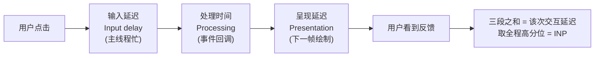

### 3.6 为什么生产环境推荐用 web-vitals 库

自己用 `PerformanceObserver` 采集能理解原理（见模块 05），但 LCP/CLS/INP 有大量边界（bfcache 恢复、tab 切后台、session window 归并、离群值处理），Google 官方的 [`web-vitals`](https://github.com/GoogleChrome/web-vitals) 库已封装好，回调返回统一的 `Metric` 对象：`{ name, value, rating, delta, id, entries, navigationType }`，直接 `onLCP/onINP/onCLS(cb)` 即可，`rating` 已按上表评级。

---

## 四、SourceMap 还原原理

生产代码是压缩混淆过的，报错堆栈只有 `app.min.js:1:24817` 这种「压缩后行列」。要定位到源码的 `UserList.jsx:42:8`，靠的就是 **SourceMap**。

### 4.1 SourceMap 是什么

构建工具（Vite/Webpack/esbuild）在压缩代码时会额外产出一个 `.map` 文件（JSON），记录「压缩后位置 ↔ 源码位置」的映射。核心字段：

```jsonc
{
  "version": 3,
  "sources": ["src/UserList.jsx"],   // 源文件列表
  "names": ["render", "user"],       // 源码里的符号名列表
  "mappings": "AAAA,SAASA,QAAT..."   // 关键：Base64 VLQ 编码的映射
}
```

### 4.2 mappings 的结构：VLQ 编码

`mappings` 是整个 SourceMap 的精华，也是最烧脑的部分。

- 用 `;` 分隔——每个 `;` 代表压缩产物里的**一行**。
- 用 `,` 分隔——每个 segment 代表这一行里的一个映射点。
- 每个 segment 是 **1、4 或 5 个** VLQ 编码的数字，含义依次是：
  1. 压缩产物中的**列号**
  2. 源文件在 `sources` 数组的**索引**
  3. 源码**行号**
  4. 源码**列号**
  5. （可选）符号在 `names` 数组的**索引**

**关键：这些数字都是「相对上一个」的增量（delta）**，不是绝对值——这样数值小，编码短。解码时要逐段累加还原成绝对值。

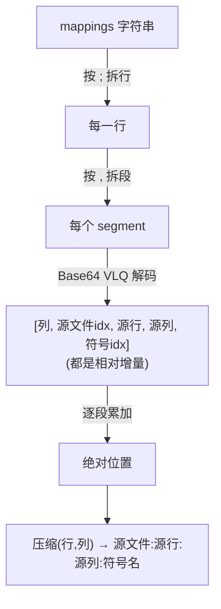

### 4.3 Base64 VLQ 到底怎么解码

VLQ（Variable-Length Quantity）用变长的 Base64 字符表示一个整数：

- Base64 字符表：`ABCDEFGHIJKLMNOPQRSTUVWXYZabcdefghijklmnopqrstuvwxyz0123456789+/`（`A`=0 … `/`=63）。
- 每个 Base64 字符解出 6 bit：**最高位（第 6 位，值 32）是 continuation 位**——为 1 表示「后面还有字符属于同一个数」。
- 拼接时低位在前（小端）。最终拼出的整数：**最低位是符号位**（0 正 1 负），其余右移一位得到数值大小。

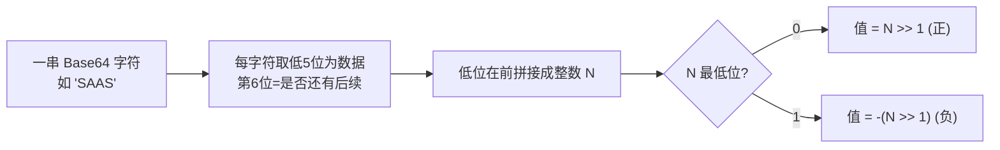

模块 04 里手写了一个**可运行**的 Base64 VLQ 解码器，能真正把一段 `mappings` 解析成一串 `[列, 源idx, 源行, 源列, 名idx]`，并按增量累加还原出源码位置——建议对照代码看本节。

### 4.4 还原发生在哪里：一定在服务端

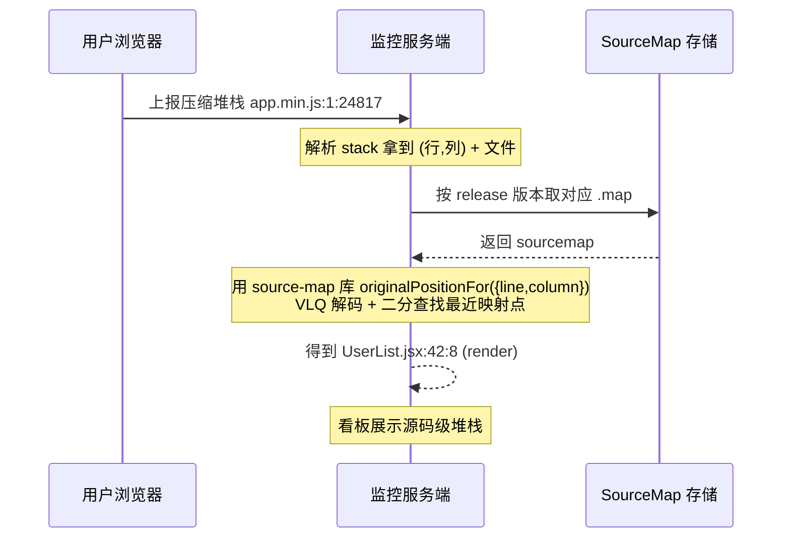

**为什么必须在服务端还原**：`.map` 文件包含完整源码，绝不能部署到线上让用户下载（否则源码泄露、包体变大）。正确做法是构建时把 `.map` 单独**上传到监控平台**（如 Sentry 用 `sentry-cli sourcemaps upload` 或 `@sentry/vite-plugin`），线上产物只保留一行 `//# sourceMappingURL=` 注释或干脆去掉，还原由服务端按 `release` 版本匹配 `.map` 完成。生产实现通常直接用 Mozilla 的 `source-map` npm 库的 `originalPositionFor()`，它内部就是「VLQ 解码 + 按列二分查找最近的映射段」。

---

## 五、上报的可靠性原理

上报最难的不是「发请求」，而是**页面正在关闭时还能把最后一批数据发出去**。用普通 `fetch/XHR`，浏览器会在页面卸载时直接杀掉未完成的请求，导致「用户离开前的关键数据丢失」。

| 传输方式 | 卸载时可靠发出 | 跨域 | 方法 | 说明 |
| --- | --- | --- | --- | --- |
| `navigator.sendBeacon(url, data)` | ✅ | ✅ | POST | 浏览器后台异步发送、不阻塞卸载，**首选** |
| `fetch(url, {keepalive:true})` | ✅ | ✅ | 任意 | 可自定义 header，大小有限制 |
| 图片打点 `new Image().src=url` | ✅ | ✅（天然） | GET | 兼容性最好、不触发 CORS 预检，但受 URL 长度限、只能 GET |
| 普通 `fetch` / `XHR` | ❌ | 需 CORS | 任意 | 卸载时会被中断，不能用于离开上报 |

**上报时机**：不要监听已不可靠的 `unload`/`beforeunload`（移动端常不触发），而是监听 `visibilitychange`（`document.visibilityState === 'hidden'`）或 `pagehide`，在此刻 flush 队列。这是模块 10 的核心实践。

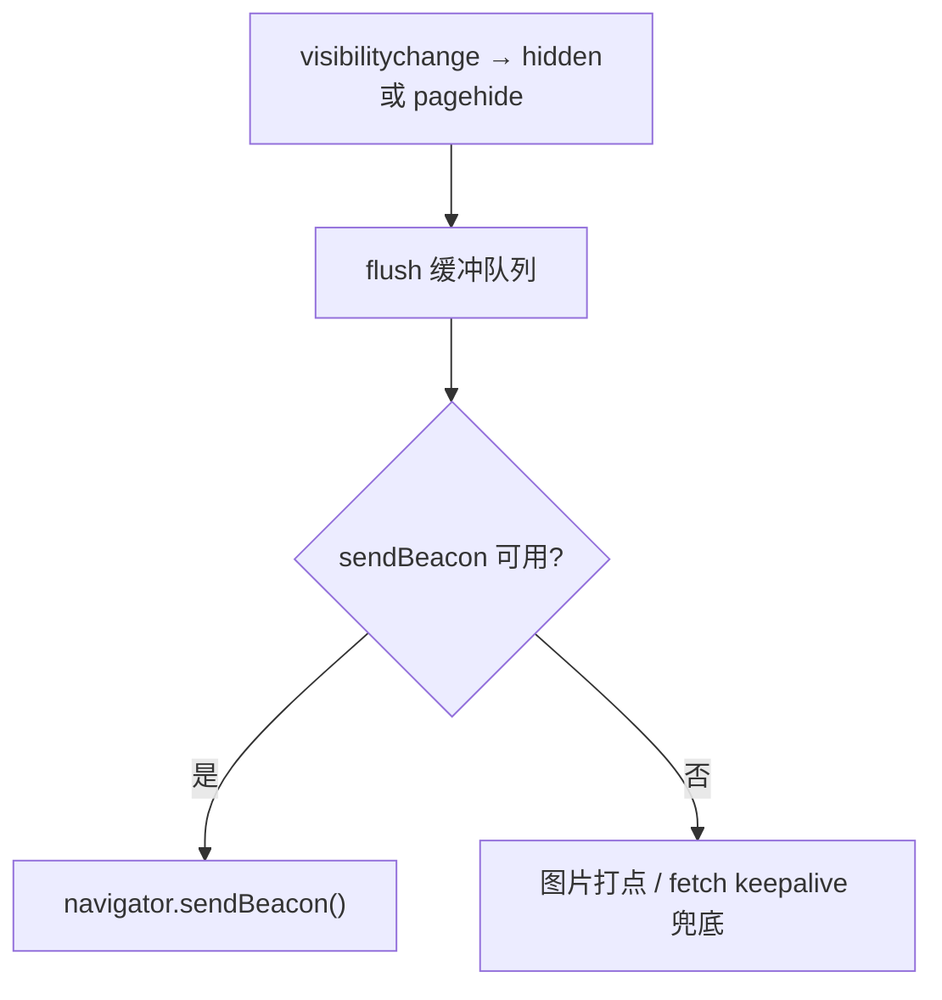

---

## 六、常见误区

- ❌ **只用 `window.onerror` 就以为万事大吉**：抓不到资源错误、抓不到未处理 Promise、抓不到跨域脚本细节（跨域脚本的 onerror 只给 `Script error.`，需给 `<script>` 加 `crossorigin` 且服务端配 CORS）。
- ❌ **把 `.map` 部署到线上**：等于公开源码。应上传到监控平台服务端还原。
- ❌ **CLS 把用户主动交互引起的位移也算进去**：必须用 `hadRecentInput` 过滤。
- ❌ **INP 当成 FID**：FID 只测首次交互输入延迟，INP 测所有交互的完整响应，2024 起 INP 才是核心指标。
- ❌ **性能指标只看平均值**：真实用户数据是长尾分布，必须看 **75 分位**（甚至 P90/P99），平均值会掩盖卡顿人群。
- ❌ **离开页面用 `fetch` 上报**：会被卸载中断而丢数据，应用 `sendBeacon`。
- ❌ **监控 SDK 自己抛错拖慢页面**：采集代码必须 `try/catch` 包裹、异步化、采样降量，绝不能反过来影响业务。

---

## 🔗 官方 / 权威文档

- [web.dev · Web Vitals](https://web.dev/articles/vitals) ｜ [LCP](https://web.dev/articles/lcp) ｜ [INP](https://web.dev/articles/inp) ｜ [CLS](https://web.dev/articles/cls)
- [Google · web-vitals 库](https://github.com/GoogleChrome/web-vitals)
- [MDN · Performance API](https://developer.mozilla.org/zh-CN/docs/Web/API/Performance_API) ｜ [PerformanceObserver](https://developer.mozilla.org/zh-CN/docs/Web/API/PerformanceObserver) ｜ [LayoutShift](https://developer.mozilla.org/zh-CN/docs/Web/API/LayoutShift)
- [MDN · Navigator.sendBeacon()](https://developer.mozilla.org/zh-CN/docs/Web/API/Navigator/sendBeacon)
- [MDN · Window: error event](https://developer.mozilla.org/zh-CN/docs/Web/API/Window/error_event) ｜ [unhandledrejection](https://developer.mozilla.org/zh-CN/docs/Web/API/Window/unhandledrejection_event)
- [Source Map 规范（TC39 ECMA-426）](https://tc39.es/ecma426/)
- [Sentry · JavaScript SDK](https://docs.sentry.io/platforms/javascript/) ｜ [Source Maps 上传](https://docs.sentry.io/platforms/javascript/sourcemaps/)
