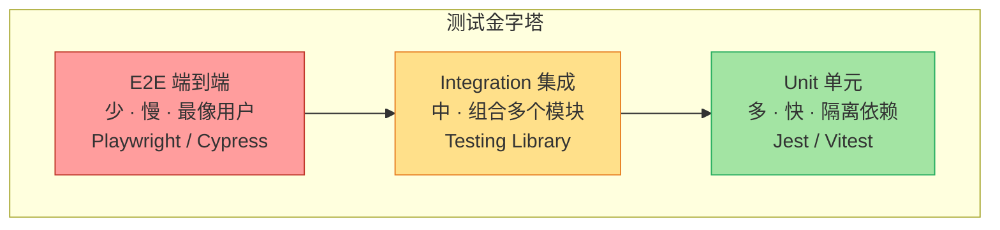
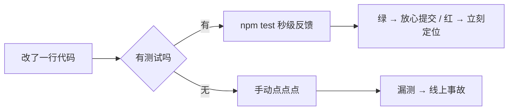

# 01 · 测试金字塔（Testing Pyramid）

> 为什么要写测试？该写哪种测试、各写多少？测试金字塔是回答这两个问题的经典模型：**底层单元测试多而快，顶层 E2E 测试少而慢**。

## 📖 知识讲解

### 一、为什么要测试
- **回归保护**：改动代码后一键验证旧功能没被改坏，替代“手点一遍”。
- **活文档**：测试用例描述了“这段代码到底该干什么”，比注释更可信（因为会被执行）。
- **设计反馈**：难测的代码往往是耦合过重的代码，测试倒逼你解耦。
- **重构底气**：有测试兜底，才敢大胆重构。

### 二、三个层级（自底向上）
| 层级 | 测什么 | 依赖 | 速度 | 数量 | 本合集对应模块 |
|------|--------|------|------|------|------|
| **Unit 单元** | 单个函数/组件的输入输出 | 无（或全部 mock） | 毫秒级 | 最多（70%） | 02~07 |
| **Integration 集成** | 多个模块组合、真实调用 | 部分真实依赖 | 秒级 | 中等（20%） | 06 组件、10 |
| **E2E 端到端** | 用户真实操作完整流程 | 真实浏览器/后端 | 秒~分钟级 | 最少（10%） | 08 Playwright、09 Cypress |

### 三、金字塔的核心取舍
- **越往上越像真实用户**（信心高），但**越慢、越脆、越贵**（浏览器启动、网络、易 flaky）。
- **越往下越快越稳**，但离真实使用越远，可能“单元全绿、一集成就崩”。
- 结论：**用大量单元测试守住逻辑正确性，用少量 E2E 守住关键用户路径**，中间用集成测试补缝。
- 反模式：**冰淇淋甜筒（Ice-cream Cone）**——E2E 一大堆、单元很少，导致 CI 又慢又不稳。

## 🔄 流程图 / 原理图





## 💻 代码说明

`src/user.js` 提供两个函数：
- `discountRate(level)` —— 纯函数，**单元测试**目标（无任何依赖，输入定则输出定）。
- `finalPrice(price, level)` —— 组合了参数校验 + `discountRate`，是**集成测试**目标（验证多个单元拼装后的整体行为）。

`src/user.test.js` 用两个 `describe` 块分别演示这两层测试同源、写法一致，差别只在“测的粒度”。

## ▶️ 运行方式

```bash
cd 01-testing-pyramid
npm install
npm test
```

## ⚠️ 常见坑 / 最佳实践
- 不要追求 100% E2E 覆盖：慢且 flaky，把 E2E 留给“下单、登录”等关键路径。
- 单元测试要**隔离依赖**（下节 mock 讲），否则就退化成慢速集成测试。
- 覆盖率不是目标而是手段：100% 覆盖率也可能一个断言都没写对。

## 🔗 官方文档
- Jest 官网：https://jestjs.io
- Martin Fowler《The Practical Test Pyramid》：https://martinfowler.com/articles/practical-test-pyramid.html
- Testing Library 指导原则：https://testing-library.com/docs/guiding-principles
