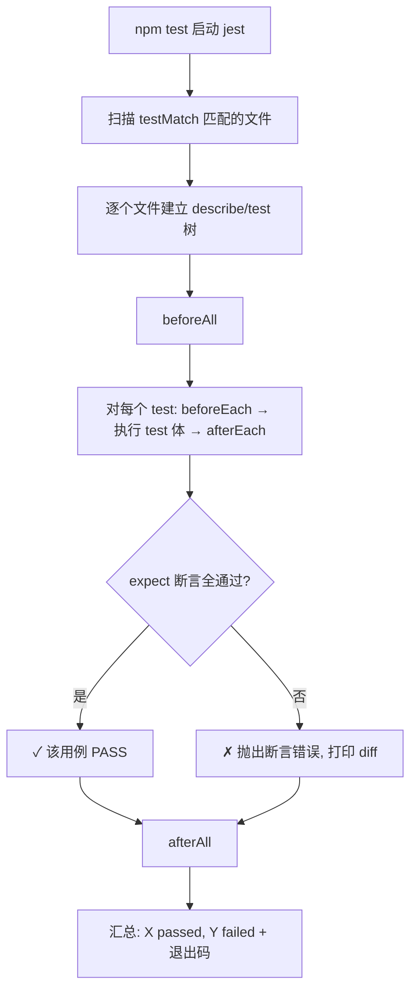

# 02 · Jest 基础（Jest Basics）

> Jest 是 Meta 出品、前端最主流的“开箱即用”测试框架：**测试运行器 + 断言库 + mock + 覆盖率**四合一，零配置即可跑。

## 📖 知识讲解

### 一、安装
```bash
npm install --save-dev jest
```
`package.json` 里加脚本 `"test": "jest"`，然后 `npm test`。Jest 会自动找 `*.test.js` / `*.spec.js` / `__tests__/` 下的文件。

### 二、三大核心 API
- `describe(name, fn)`：把相关用例分组（可嵌套），只用于组织，不影响断言。
- `test(name, fn)` / `it(name, fn)`：定义一个用例（`it` 是 `test` 的别名，读起来像 “it should …”）。
- `expect(value).matcher(expected)`：断言，`expect` 拿到实际值，matcher 描述期望。

### 三、常用 Matcher 速查
| 类别 | Matcher | 说明 |
|------|---------|------|
| 相等 | `toBe` / `toEqual` / `toStrictEqual` | 严格相等 / 递归值相等 / 更严格（含 undefined、类型） |
| 真值 | `toBeNull` `toBeUndefined` `toBeTruthy` `toBeFalsy` | 特殊真值判断 |
| 数字 | `toBeGreaterThan` `toBeCloseTo` | 大小比较 / 浮点近似（避坑 0.1+0.2） |
| 字符串 | `toMatch` | 正则匹配 |
| 集合 | `toContain` `toContainEqual` `toHaveLength` `toMatchObject` | 包含 / 深包含 / 长度 / 部分匹配 |
| 异常 | `toThrow` | 断言抛错 |
| 取反 | `.not.xxx` | 任意 matcher 前加 `.not` |

### 四、生命周期钩子
`beforeAll` / `afterAll`（文件级各一次）、`beforeEach` / `afterEach`（每个用例前后）。常用于建/清测试数据。

## 🔄 流程图 / 原理图



## 💻 代码说明
`src/matchers.test.js` 按“相等 / 真值数字 / 集合 / 异常 / 生命周期”五组，每组一个 `describe`，逐个演示 matcher 的语义差异，重点标注了三个易错点：
- `toBe` vs `toEqual`（引用 vs 值）；
- `toEqual` vs `toStrictEqual`（是否忽略 `undefined` 字段）；
- 浮点用 `toBeCloseTo` 而非 `toBe`。

`jest.config.js` 展示最常改的三项：`testEnvironment`、`testMatch`、`verbose`。

## ▶️ 运行方式
```bash
cd 02-jest-basics
npm install
npm test          # 跑一次
npm run test:watch  # 监听改动自动重跑
```

## ⚠️ 常见坑 / 最佳实践
- `toThrow` 必须传**函数引用** `expect(() => fn())`，直接 `expect(fn())` 会先执行抛错导致断言拿不到。
- 比较对象别用 `toBe`（永远不等），用 `toEqual`。
- Jest 30 需要 Node 18+；ESM 项目需额外配置（见 07 Vitest，对 ESM/TS 更友好）。

## 🔗 官方文档
- 入门：https://jestjs.io/docs/getting-started
- Expect / Matchers：https://jestjs.io/docs/expect
- 配置：https://jestjs.io/docs/configuration
