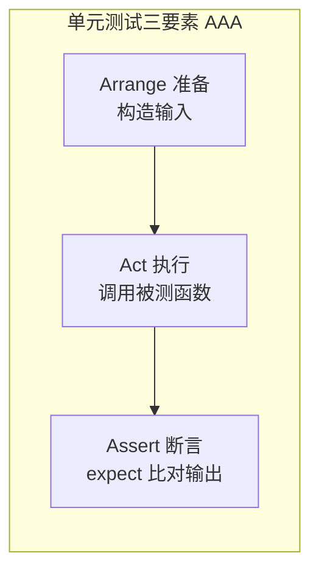
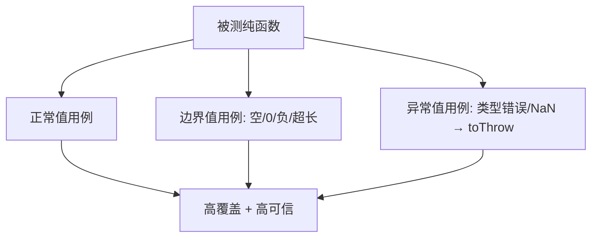

# 03 · 单元测试（Unit Testing）

> 单元测试针对“最小可测单元”（通常是一个纯函数），它是金字塔的底座：**又多又快又稳**。本节聚焦“怎么给工具函数写高质量单测”。

## 📖 知识讲解

### 一、什么样的代码最好测
**纯函数**——同样输入必得同样输出、无副作用、不依赖外部状态。它天然可测：给输入、断言输出即可，无需 mock、无需环境。写不好测的代码，先想能不能抽出纯函数（如把“防抖判定”从“定时器副作用”里剥离出来，见 `shouldTrigger`）。

### 二、一个函数该测哪些输入
黄金三分类：
1. **Happy path 正常值**：典型合法输入。
2. **Edge case 边界值**：空数组、0、负数、超长、不足位数……
3. **异常输入**：类型错误、`NaN`，断言它**按约定抛错**（`toThrow`）。

### 三、数据驱动测试：`it.each`
同一逻辑、多组输入输出时，用 `it.each([...])` 表格化，避免复制粘贴一堆 `it`，报错时还能定位到具体那一行。

## 🔄 流程图 / 原理图





## 💻 代码说明
`src/utils.js` 提供四个纯函数：千分位 `formatThousands`、驼峰转短横 `kebabCase`、去重 `unique`、防抖判定 `shouldTrigger`。
`src/utils.test.js` 对每个函数覆盖“正常/边界/异常”：
- `formatThousands` 测了整数、不足四位、小数、负数、非数字抛错；
- `kebabCase` 用 `it.each` 表格化四组数据；
- 都遵循 **AAA（Arrange-Act-Assert）** 结构。

## ▶️ 运行方式
```bash
cd 03-unit-testing
npm install
npm test
npm run test:cov   # 看覆盖率报告（覆盖率原理见 10 模块）
```

## ⚠️ 常见坑 / 最佳实践
- 一个 `it` 只测一个行为，失败时才能一眼定位。
- 别在单测里连数据库/网络——那属于集成测试；有依赖就 mock（见 04）。
- 覆盖率高 ≠ 测得好：可能覆盖了代码但没断言到关键行为。
- 把副作用（定时器、随机数、时间）从核心逻辑里剥离成纯函数，可测性立刻提升。

## 🔗 官方文档
- Jest `it.each`：https://jestjs.io/docs/api#testeachtablename-fn-timeout
- Testing Library 指导原则（避免测实现细节）：https://testing-library.com/docs/guiding-principles
