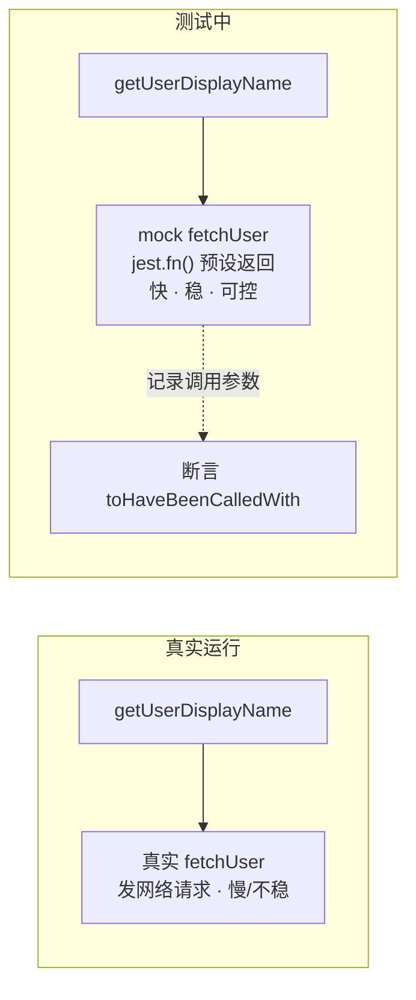
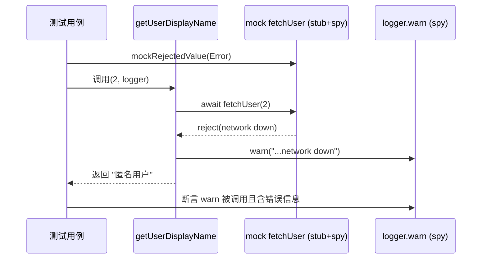

# 04 · Mock / Stub / Spy（测试替身）

> 单元测试要“隔离依赖”：不能真发网络、不能真写数据库。**测试替身（Test Double）**就是用假对象顶替真实依赖，让测试快、稳、可控。

## 📖 知识讲解

### 一、四种测试替身（概念）
| 替身 | 作用 | Jest 对应 |
|------|------|-----------|
| **Dummy** | 只为占位、不被使用 | 随便传个值 |
| **Stub 桩** | 预设**返回值**，喂给被测代码 | `mockReturnValue` / `mockResolvedValue` |
| **Spy 间谍** | 记录**被如何调用**（次数/参数），可放行原实现 | `jest.fn()` / `jest.spyOn()` |
| **Mock 模拟** | Stub + Spy 合体：既设返回值又断言调用 | `jest.mock()` + 断言 |

> 口诀：**Stub 管“进来什么”（喂输入），Spy 管“出去怎么调”（验交互）**，Mock 两者都干。

### 二、Jest 三把工具
- `jest.fn(impl?)`：造一个假函数，天生带调用记录，可链式 `.mockReturnValue()` / `.mockResolvedValue()` / `.mockImplementation()`。
- `jest.mock('./api')`：把**整个模块**自动替换成 mock 版（每个导出函数都变 `jest.fn()`），用于切断真实依赖。
- `jest.spyOn(obj, 'method')`：包裹**真实对象**上的方法，默认放行原实现同时记录调用，也可 `.mockReturnValue()` 临时改写；用 `mockRestore()` 还原。

### 三、常用断言 matcher
`toHaveBeenCalled` / `toHaveBeenCalledTimes(n)` / `toHaveBeenCalledWith(args)` / `toHaveBeenLastCalledWith(args)`，配合 `expect.stringContaining` / `expect.objectContaining` 做模糊匹配。

## 🔄 流程图 / 原理图





## 💻 代码说明
- `src/api.js`：真实网络模块（`setTimeout` 模拟异步），测试时被整体 mock。
- `src/userService.js`：被测逻辑，依赖 `fetchUser`，`logger` 用**依赖注入**便于 spy。
- `src/userService.test.js`：
  - `jest.fn()` 段演示 spy 断言 + stub 返回值 + 自定义实现；
  - `jest.mock('./api')` 段演示成功/失败两条路径，`mockResolvedValue` / `mockRejectedValue` 控制依赖行为，`beforeEach(jest.clearAllMocks)` 清状态；
  - `jest.spyOn()` 段演示“监视真实方法 + 还原”。

## ▶️ 运行方式
```bash
cd 04-mock-spy
npm install
npm test
```

## ⚠️ 常见坑 / 最佳实践
- **每个用例前清 mock**：`jest.clearAllMocks()`（清调用记录）/ `resetAllMocks()`（连实现一起清），否则用例间互相污染。
- `spyOn` 用完 `mockRestore()` 还原真实实现。
- 别过度 mock：把所有东西都 mock 掉，测的其实是“mock 配得对不对”，失去意义——只 mock **跨边界**依赖（网络、时间、随机、文件）。
- `jest.mock` 有提升（hoist）行为，写在文件顶部即可，Jest 会自动提到 import 之前。

## 🔗 官方文档
- Mock Functions：https://jestjs.io/docs/mock-functions
- `jest.mock` / `spyOn` API：https://jestjs.io/docs/jest-object
