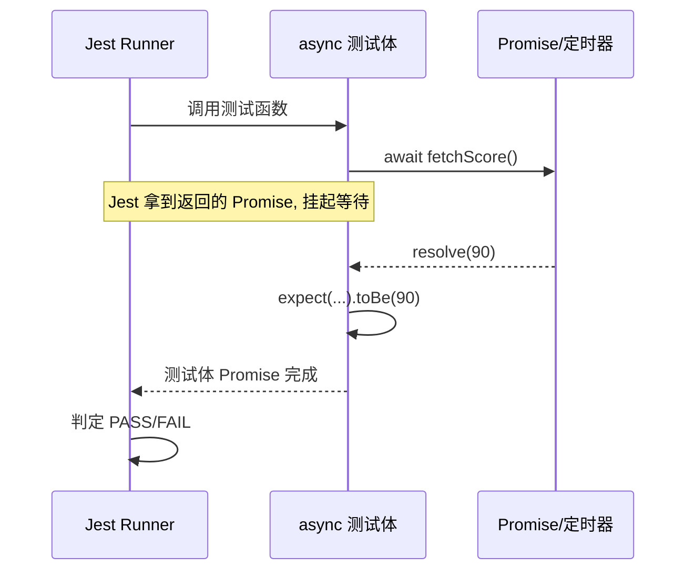
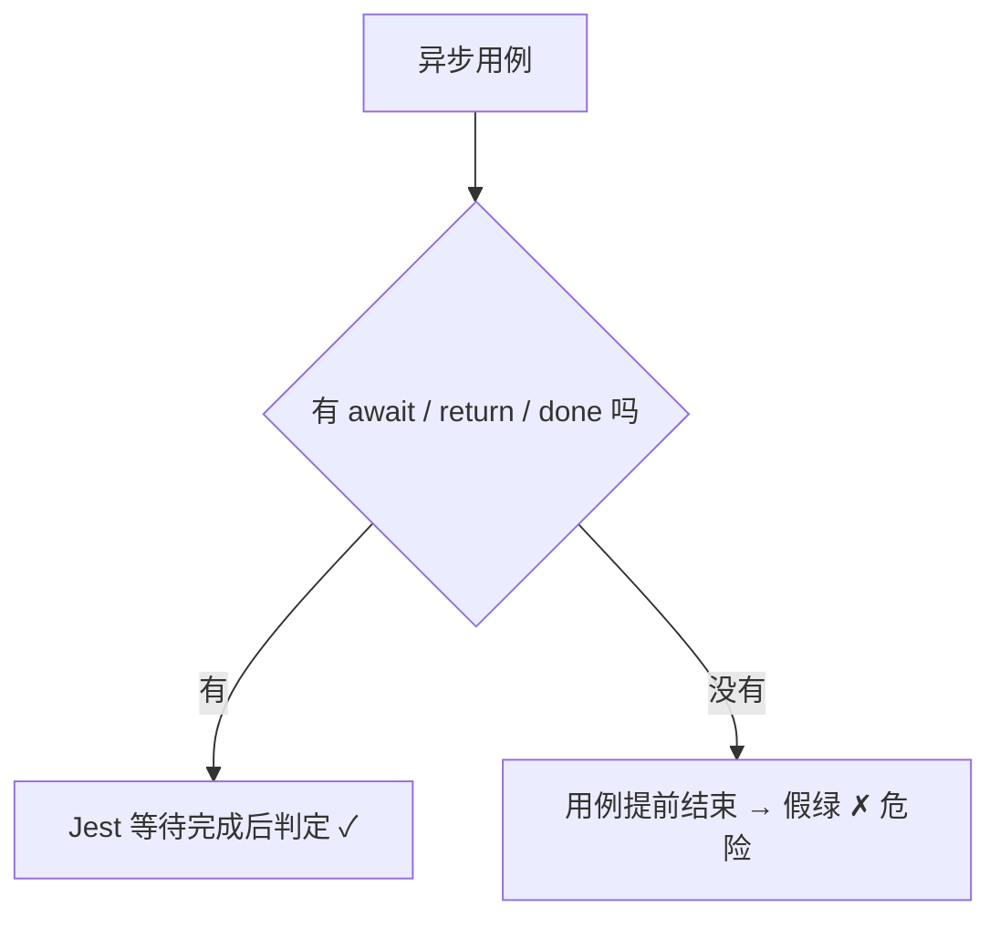

# 05 · 异步测试（Async Testing）

> 前端到处是异步：请求、定时器、动画。异步测试的核心只有一句话：**必须让测试框架“等”异步完成再判断**，否则用例会提前结束、假绿。

## 📖 知识讲解

### 一、三种写法
1. **async/await（首选）**：测试函数标 `async`，`await` 异步结果，读起来像同步。
   - 断言 reject：`await expect(p).rejects.toThrow(...)`。
2. **return Promise + `resolves`/`rejects`**：`return expect(p).resolves.toBe(x)`。**必须 `return`**，否则 Jest 不会等。
3. **`done` 回调**：用于老式回调 API。调用 `done()` 表示结束；断言失败要 `done(e)` 传错，否则报的是超时而非真实原因。

### 二、假定时器（Fake Timers）
`jest.useFakeTimers()` 把 `setTimeout/setInterval/Date` 换成可控版本，用 `jest.advanceTimersByTime(ms)` **瞬间快进**，测“2 秒后执行”不用真等 2 秒。用完 `jest.useRealTimers()` 还原。

### 三、最常见的坑
- **忘了 await / return**：用例秒过变绿，其实断言根本没跑。
- Jest 会在异步用例挂起时**超时报错**（默认 5s），这是提醒你“异步没被正确等待”。

## 🔄 流程图 / 原理图





## 💻 代码说明
`src/async.js` 提供 Promise 版 `fetchScore`、回调版 `loadConfig`、带定时器的 `delayGreet`。
`src/async.test.js` 分别演示三种等待写法，以及用 `jest.useFakeTimers()` + `advanceTimersByTime(2000)` 把“2 秒延时”瞬间跑完。

## ▶️ 运行方式
```bash
cd 05-async-testing
npm install
npm test
```

## ⚠️ 常见坑 / 最佳实践
- 优先 `async/await`，代码最清晰。
- 用 `resolves/rejects` 时别忘 `await` 或 `return`。
- 有定时器/轮询/防抖的逻辑，用假定时器，别 `setTimeout` 真等（慢且 flaky）。
- `done` 回调里的断言要包 try/catch，把错误交给 `done(e)`。

## 🔗 官方文档
- 异步测试：https://jestjs.io/docs/asynchronous
- 定时器 Mock：https://jestjs.io/docs/timer-mocks
