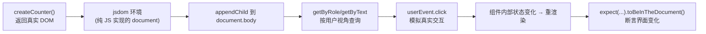
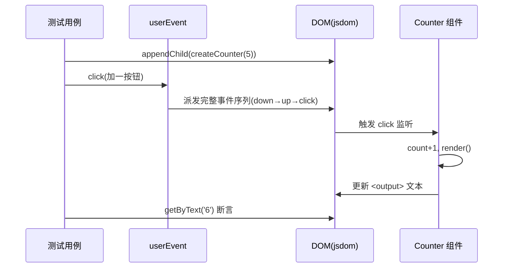

# 06 · 组件测试（Component Testing · Testing Library + jsdom）

> 单元测试测“纯函数”，组件测试测“会渲染、有交互的 UI 单元”。核心理念：**像用户一样测组件**——用「看得到的文本 / 角色」查询元素，模拟「点击 / 输入」，断言「界面变化」，而不去碰组件内部实现。

## 📖 知识讲解

### 一、为什么需要 jsdom
组件依赖 `document` / `window` / DOM API，但 Node 里没有这些。**jsdom** 用纯 JavaScript 实现了一套浏览器 DOM/HTML 标准，让测试能在 Node 里“渲染”并操作 DOM——快（无需真浏览器）、可控。Jest 里只需把 `testEnvironment` 从 `node` 改成 `jsdom`。

### 二、Testing Library 的核心原则
> The more your tests resemble the way your software is used, the more confidence they give you.（测试越接近软件被使用的方式，越有信心）

落到写法上，就是**查询优先级**（从最推荐到最不推荐）：

| 优先级 | 查询方式 | 例子 | 说明 |
|------|---------|------|------|
| ⭐ 最推荐 | `getByRole` | `getByRole('button', {name:'加一'})` | 贴近无障碍/真实语义 |
| 推荐 | `getByLabelText` / `getByPlaceholderText` | 表单控件 | 用户靠 label 找输入框 |
| 推荐 | `getByText` | `getByText('提交')` | 用户看到的文字 |
| ⚠️ 兜底 | `getByTestId` | `getByTestId('cart')` | 无语义可用时才用 |
| ❌ 避免 | 按 class/id 选 | `container.querySelector('.btn')` | 实现细节，易碎 |

### 三、query / get / find 三类前缀
| 前缀 | 找不到时 | 用于 |
|------|---------|------|
| `getBy...` | **抛错** | 断言元素“应该存在” |
| `queryBy...` | 返回 `null` | 断言元素“不存在” |
| `findBy...` | 返回 Promise（默认等 1s） | 断言“异步出现”的元素 |

### 四、user-event vs fireEvent
- `fireEvent.click(el)`：只派发**单个** click 事件。
- `userEvent.click(el)`：模拟**真实用户**——依次触发 pointerdown/mousedown/focus/click 等完整序列，更接近真实。**优先用 user-event**（v14 起需 `userEvent.setup()`）。

## 🔄 流程图 / 原理图





## 💻 代码说明
- `src/counter.js`：计数器“组件”工厂，返回真实 DOM 节点，内部封装 `count` 状态、`加一/重置` 交互与 `render()`。用 `<output aria-label>` 让它可被 role 查询。
- `src/counter.test.js`：三个用例演示——初始渲染断言、`userEvent.click` 后状态更新、连点+重置回到**初始值**（不是 0，验证真实业务语义）。全程用 `getByRole/getByText` 而非选择器。
- `jest.config.js`：`testEnvironment: 'jsdom'` 是组件测试与单元测试配置上的**唯一关键差别**。
- `jest.setup.js`：加载 `@testing-library/jest-dom`，提供 `toBeInTheDocument()` 等 DOM 语义断言。

> React 对照：`render(<Counter/>)` + `screen.getByRole(...)` + `await userEvent.click(...)`，理念完全一致；Vue 用 `@testing-library/vue` 或 `@vue/test-utils`。

## ▶️ 运行方式
```bash
cd 06-component-testing
npm install   # 装 jest + jest-environment-jsdom + @testing-library/*
npm test
```

## ⚠️ 常见坑 / 最佳实践
- **不要测实现细节**：别断言内部变量/私有方法/class 名，只断言用户可感知的输出，重构才不会误报。
- **别忘了 `testEnvironment: 'jsdom'`**，否则 `document is not defined`。
- `userEvent` v14 起是**异步**的，务必 `await`，并先 `userEvent.setup()`。
- 断言“不存在”用 `queryBy*`（返回 null），用 `getBy*` 会直接抛错。
- 断言“异步出现”用 `findBy*` 或 `waitFor`，不要手写 `setTimeout`。
- 每个用例前清理 DOM（`document.body.innerHTML = ''`），避免用例间污染。

## 🔗 官方文档
- Testing Library 指导原则：https://testing-library.com/docs/guiding-principles
- 查询优先级：https://testing-library.com/docs/queries/about/#priority
- user-event：https://testing-library.com/docs/user-event/intro
- jest-dom 断言：https://github.com/testing-library/jest-dom
- jsdom：https://github.com/jsdom/jsdom
