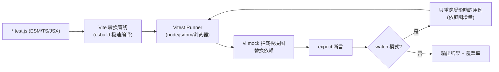
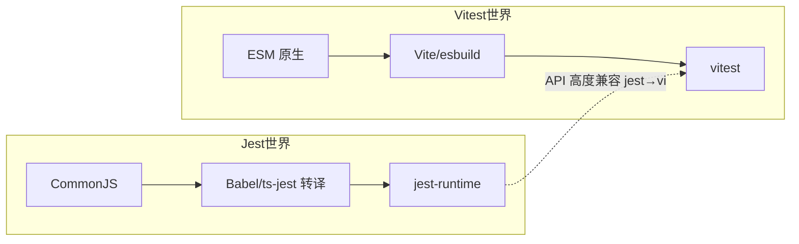

# 07 · Vitest（现代测试框架）

> Vitest 是构建在 **Vite** 之上的测试框架：**ESM 原生、TS/JSX 开箱即用、极快（复用 Vite 的转换与 HMR）**，且 API 与 Jest 高度兼容——把 `jest` 换成 `vi` 基本就能跑。Vite 项目（Vue/React/Svelte）的首选测试方案。

## 📖 知识讲解

### 一、为什么会出现 Vitest
Jest 诞生于 CommonJS 时代，测 ESM/TS 需要 Babel/ts-jest 转译，配置重、启动慢。现代前端普遍用 Vite，Vitest **直接复用项目的 `vite.config` 与转换管线**：一份配置、原生 ESM、按需编译、watch 下增量重跑，速度与体验大幅提升。

### 二、和 Jest 的对应关系（迁移几乎零成本）
| 能力 | Jest | Vitest |
|------|------|--------|
| 假函数 | `jest.fn()` | `vi.fn()` |
| 模块 mock | `jest.mock()` | `vi.mock()` |
| 监视方法 | `jest.spyOn()` | `vi.spyOn()` |
| 假定时器 | `jest.useFakeTimers()` | `vi.useFakeTimers()` |
| 全局 API | 默认全局 | 默认需 `import`（或配 `globals:true`） |
| 断言 | `expect` | `expect`（同款 API，兼容 jest-dom） |
| 配置 | `jest.config` | 复用 `vite.config` / `vitest.config` |

> `describe / it / test / expect / beforeEach` 全部同名，断言 matcher 也基本一致，所以本工程 02~05 的 Jest 用例几乎能原样搬到 Vitest。

### 三、几个 Vitest 特色
- `globals: false`（默认）：需显式 `import { describe, it, expect } from 'vitest'`，更符合 ESM 直觉；想要 Jest 那样的全局就设 `globals: true`。
- 内置 **v8 覆盖率**（`--coverage`），无需 Babel 插桩。
- 内置 **UI 面板**（`--ui`）、浏览器模式、快照、并发用例（`it.concurrent`）。
- `environment: 'jsdom' | 'happy-dom'` 一行切到 DOM 环境测组件。

## 🔄 流程图 / 原理图





## 💻 代码说明
- `src/taxApi.js`：模拟外部依赖（异步查税率），测试中被 `vi.mock('./taxApi.js')` 整体替换。
- `src/cart.js`：`subtotal`（纯函数）+ `checkout`（依赖 `getTaxRate` 并触发回调）。
- `src/cart.test.js`：
  - `it.each` 参数化批量测 `subtotal`；
  - `vi.mock` + `mockResolvedValue/mockRejectedValue` 控制依赖成功/失败两条路径，`toHaveBeenCalledWith` 断言交互；
  - `vi.spyOn(Math,'random').mockReturnValue` 让随机可测，`mockRestore` 还原；
  - `vi.useFakeTimers/advanceTimersByTime` 快进时间。
- `vitest.config.js`：`environment`、`globals`、内置 `v8` 覆盖率配置。

## ▶️ 运行方式
```bash
cd 07-vitest
npm install
npm test          # vitest run，跑一次
npm run test:watch # 开发时监听
npm run coverage  # 生成覆盖率
```

## ⚠️ 常见坑 / 最佳实践
- `vi.mock` 与 `jest.mock` 一样会**提升到文件顶部**，写在 import 后也没关系。
- 默认非全局：忘记 `import { describe }` 会报 `describe is not defined`；要么 import，要么 `globals:true` 并加 `/// <reference types="vitest/globals" />`。
- 测 DOM 组件记得把 `environment` 设为 `jsdom` 或 `happy-dom`（happy-dom 更快、覆盖略少）。
- ESM 下 `package.json` 建议 `"type":"module"`（本模块已设），否则要用 `.mjs` 或额外配置。
- 与 Jest **不要混跑**：一个项目选一个测试框架即可。

## 🔗 官方文档
- Vitest 官网：https://vitest.dev
- 从 Jest 迁移：https://vitest.dev/guide/migration.html
- vi 工具 API：https://vitest.dev/api/vi.html
- 覆盖率：https://vitest.dev/guide/coverage.html
