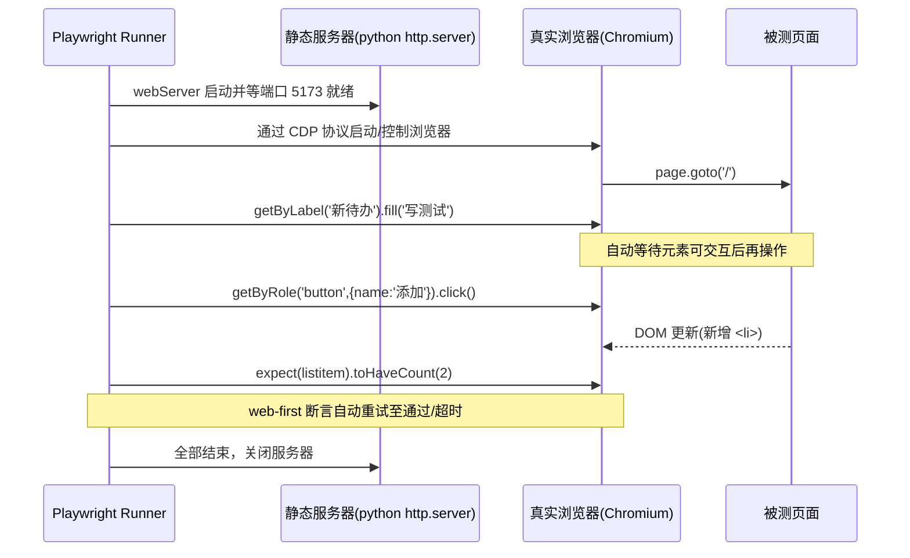
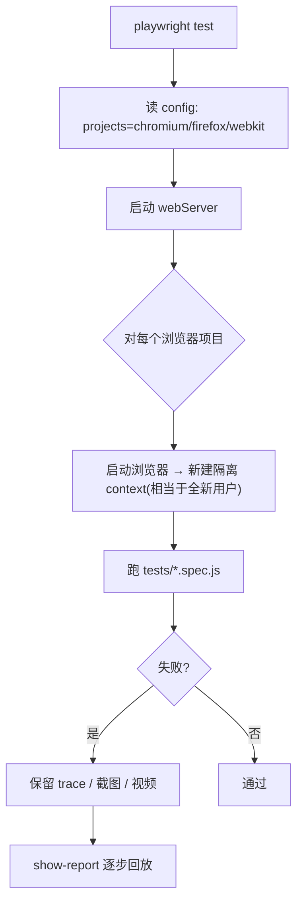

# 08 · 端到端测试 · Playwright（E2E · Playwright）

> E2E（End-to-End）测试驱动**真实浏览器**，像真人一样打开页面、点击、输入、跳转，验证**完整用户流程**跑得通。Playwright 是微软出品的现代 E2E 框架：**跨浏览器（Chromium/Firefox/WebKit）、自动等待、内置重试断言、trace 回放**。

## 📖 知识讲解

### 一、E2E 在金字塔顶端
它离真实用户最近（信心最高），但也最慢最脆。所以只用来守**关键路径**（登录、下单、搜索），而不是覆盖所有分支。

### 二、Playwright 的三大杀手锏
1. **自动等待（auto-waiting）**：`locator.click()` 会自动等元素「存在→可见→稳定→可交互」才点，从根源消灭大部分 `sleep` 与 flaky。
2. **Web-first 断言**：`await expect(locator).toHaveText(...)` 会**自动重试**直到通过或超时，不像普通断言一次判死。
3. **真跨浏览器**：一套用例在 Chromium/Firefox/WebKit 三种内核跑（`projects` 配置），一份代码验三端。

### 三、定位器（Locator）优先级——同 Testing Library 理念
| 推荐度 | API | 例子 |
|------|-----|------|
| ⭐ | `getByRole` | `getByRole('button', {name:'添加'})` |
| ⭐ | `getByLabel` / `getByPlaceholder` | `getByLabel('新待办')` |
| 推荐 | `getByText` | `getByText('写测试')` |
| 兜底 | `getByTestId` | `getByTestId('remaining')` |
| 避免 | CSS/XPath 选择器 | `page.locator('.item > span')` |

> Locator 是**惰性**的：定义时不查 DOM，执行动作/断言那一刻才查，所以能配合自动等待。

### 四、webServer：跑测试前自动起服务
`playwright.config.js` 里的 `webServer` 会在测试前启动被测站点、等端口就绪，跑完自动关闭。本模块用系统自带的 `python3 -m http.server` 托管 `public/`，**无需额外 npm 依赖**。

## 🔄 流程图 / 原理图





## 💻 代码说明
- `public/index.html`：被测的“待办清单”页面（原生 JS），带 `aria-label` / `data-testid`，方便按语义定位。
- `tests/todo.spec.js`：四个用例覆盖完整流程——初始状态、添加（点击 + 回车两种）、点击标记完成、删除；全程用 `getByRole/getByLabel/getByText` + web-first 断言 `toHaveCount/toHaveText/toHaveClass`。
- `playwright.config.js`：`baseURL`、`webServer`（自动起站）、`projects`（三浏览器矩阵）、`trace`（失败回放）。

## ▶️ 运行方式
```bash
cd 08-e2e-playwright
npm install
npx playwright install   # ⭐ 首次需下载浏览器内核（chromium/firefox/webkit）
npm test                 # 无头模式跑全部
npm run test:headed      # 看着浏览器跑
npm run test:ui          # 打开交互式 UI 面板调试
npm run report           # 查看上次报告 / trace 回放
```
> `webServer` 用到 `python3`（macOS/Linux 自带）；若无 python，可改成任意静态服务器命令。

## ⚠️ 常见坑 / 最佳实践
- **别用固定 `waitForTimeout` 睡等**，交给自动等待与 web-first 断言，否则又慢又脆。
- 断言一定 `await`：`await expect(locator).toHaveText(...)`，漏 await 会静默失效。
- 每个 test 用**独立 browser context**（默认如此）→ 天然隔离 cookie/storage，用例互不干扰。
- 首次必须 `npx playwright install` 下浏览器，否则报找不到浏览器。
- 定位优先 role/label，少用易碎的 CSS 选择器。
- CI 上用 `trace: 'on-first-retry'` + 上传报告，排查线上失败极方便。

## 🔗 官方文档
- Playwright 官网：https://playwright.dev
- 编写测试：https://playwright.dev/docs/writing-tests
- Locators：https://playwright.dev/docs/locators
- 自动等待：https://playwright.dev/docs/actionability
- 断言：https://playwright.dev/docs/test-assertions
