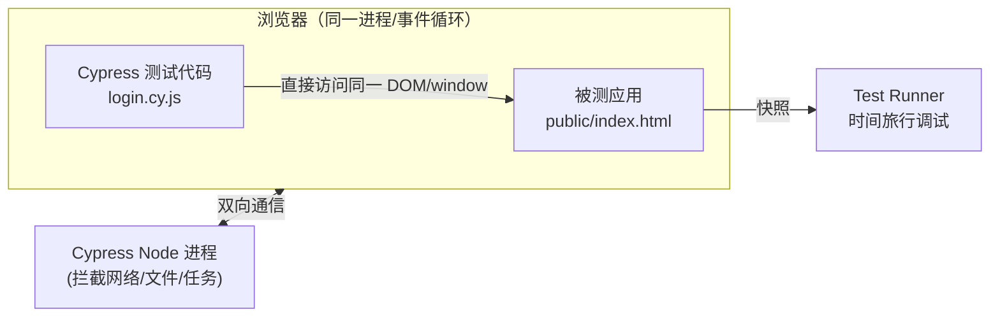
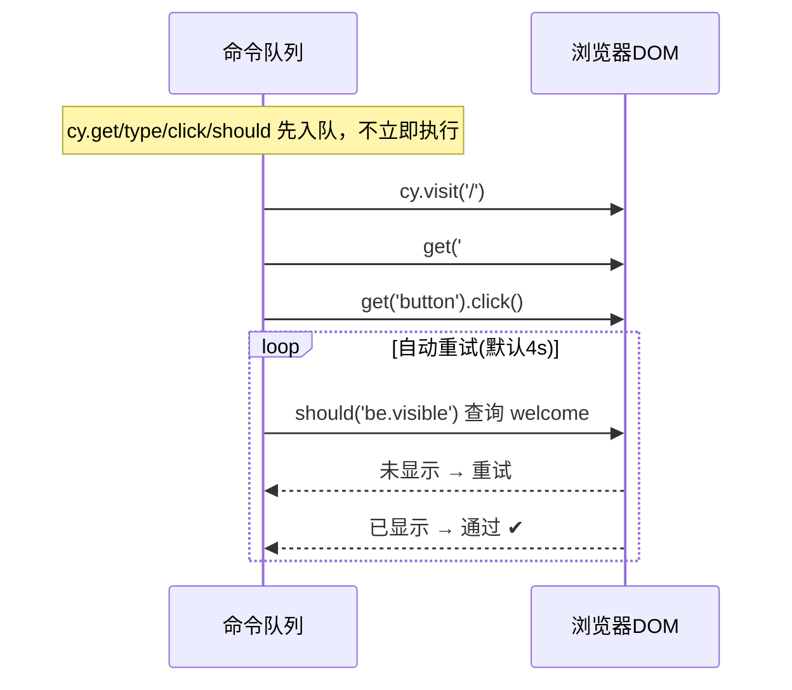

# 09 · 端到端测试 · Cypress（E2E · Cypress）

> Cypress 是另一款主流 E2E 框架，最大特点是**测试代码运行在浏览器内部**、与被测应用同一事件循环，配上**时间旅行（Time-Travel）调试**——在可视化 Runner 里回看每一步命令时的页面快照，调试体验极佳。

## 📖 知识讲解

### 一、Cypress 的架构与众不同
传统工具（Selenium/Playwright）从**外部**通过驱动协议远程操控浏览器；Cypress 把测试代码**注入浏览器内部**运行，直接访问同一个 `window`/`document`/DOM，因此对应用的可见性更强、延迟更低，但也带来限制（见下）。

### 二、链式命令 + 自动重试（无需 async/await）
Cypress 命令 `cy.get().click().should()` 不是立即执行，而是**排入队列**依次异步执行；`.should()` 断言**自动重试**（默认 4s）直到通过或超时。所以几乎不用手写等待，也不用 `await`。

```js
cy.get('#username').type('admin');       // 自动等元素出现、可见、可输入
cy.get('[data-cy="welcome"]').should('be.visible'); // 自动重试到可见
```

### 三、选择器：官方推荐 `data-cy`
Cypress 官方建议用**专门的测试属性** `data-cy` / `data-test`，与样式/结构解耦，重构 class 不影响测试：
```html
<p data-cy="error"></p>
```
```js
cy.get('[data-cy="error"]')
```

### 四、Cypress vs Playwright（选型）
| 维度 | Cypress | Playwright |
|------|---------|-----------|
| 运行位置 | 浏览器**内部** | 浏览器**外部**驱动 |
| 浏览器 | Chromium系/Firefox/Electron/WebKit(实验) | Chromium/Firefox/WebKit **全一等公民** |
| 多标签/多域 | 受限（同源模型强） | 原生支持 |
| 并行/多语言 | 需 Dashboard/付费或插件 | 内置并行、多语言绑定 |
| 调试体验 | ⭐ 时间旅行 Runner 极佳 | Trace Viewer + UI mode |
| async 心智 | 命令队列，无 await | 显式 async/await |

> 结论：**都很优秀**。喜欢可视化调试、单一 SPA → Cypress；要真跨浏览器、多标签、CI 并行 → Playwright。

## 🔄 流程图 / 原理图





## 💻 代码说明
- `public/index.html`：被测“登录页”（原生 JS），`admin/123456` 登录成功、否则报错，带 `data-cy` 稳定选择器。
- `cypress/e2e/login.cy.js`：四个用例覆盖——空表单校验、错误密码、成功登录显示欢迎语、退出重置；用 `.should('be.visible'/'have.text'/'contain')` 隐式重试断言。
- `cypress.config.js`：`baseUrl`（配合 `cy.visit('/')`）、`specPattern`。

## ▶️ 运行方式
Cypress 自身**不托管**静态资源，需先起被测站点，开**两个终端**：
```bash
cd 09-cypress
npm install

# 终端 1：启动被测站点（python3 系统自带）
npm run serve            # http://localhost:5173

# 终端 2：跑测试
npm run cy:run           # 无头模式跑全部（== npm test）
npm run cy:open          # 打开可视化 Runner，享受时间旅行调试
```

## ⚠️ 常见坑 / 最佳实践
- **忘了先起服务** → `cy.visit` 连接被拒。真实项目常用 `start-server-and-test` 把两步合一。
- **不要用 `async/await` 包 cy 命令**：它们是队列命令，不是 Promise；需要值就用 `.then()`。
- 选择器优先 `data-cy`，别依赖会变的 class/文案。
- 用**隐式重试断言** `.should()` 代替手动 `cy.wait(ms)`；只有等接口时用 `cy.intercept()` + 别名等待。
- Cypress 对**跨域/多标签页**支持弱（源于其架构），这类场景更适合 Playwright。

## 🔗 官方文档
- Cypress 官网：https://www.cypress.io
- 写第一个测试：https://docs.cypress.io/guides/end-to-end-testing/writing-your-first-test
- 最佳实践（选择器等）：https://docs.cypress.io/guides/references/best-practices
- 重试机制：https://docs.cypress.io/guides/core-concepts/retry-ability
