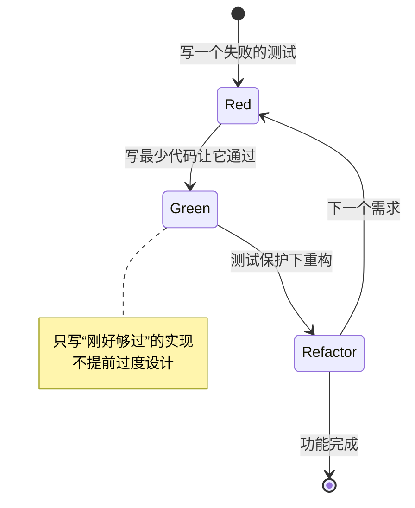
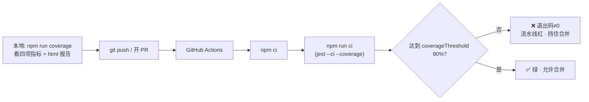

# 10 · 覆盖率 · TDD · CI 集成（Coverage · TDD · CI）

> 把测试落到工程流程里的三件事：**覆盖率**（量化“测了多少”并设红线）、**TDD**（测试驱动开发，先写测试再写实现）、**CI**（每次提交自动跑测试，不达标就拦下）。三者合起来，测试才真正成为质量护栏。

## 📖 知识讲解

### 一、覆盖率（Coverage）的四个指标
覆盖率工具（Jest 用 istanbul/v8）给源码“插桩”，统计运行时到底跑到了哪些地方：

| 指标 | 含义 | 例子 |
|------|------|------|
| **Statements 语句** | 有多少条语句被执行 | 每一行赋值/调用 |
| **Branches 分支** | `if/else`、`? :`、`&&/||` 的每个分叉是否都走过 | `if(a)` 的真/假两支 |
| **Functions 函数** | 有多少函数被调用过 | 每个 function |
| **Lines 行** | 有多少物理行被执行 | 近似 statements |

> **Branches 最关键也最难满**：语句全覆盖，也可能有条件分支从没走到。

### 二、覆盖率不是目标，是手段
- 100% 覆盖率 ≠ 没 bug：**执行到 ≠ 断言对**（一行跑过但没断言结果照样算覆盖）。
- 但**覆盖率红线**很有用：`coverageThreshold` 设 90%，低于就让 CI 失败，防止“新代码不写测试”。
- 实践：核心逻辑高标准（90%+），配置/入口文件适当排除。

### 三、TDD：红-绿-重构（Red-Green-Refactor）
先写测试、再写实现的开发循环：

1. 🔴 **Red**：写一个会失败的测试（因为功能还没实现）。
2. 🟢 **Green**：写**最少**的代码让它通过。
3. 🔵 **Refactor**：在测试保护下重构代码，保持全绿。

好处：测试即规格、逼你想清楚接口、天然高覆盖、永远有回归网。本模块的 `password.test.js` 就是“规格先行”的产物。

### 四、CI：让机器每次都替你跑
把 `npm run ci`（测试 + 覆盖率）接到 GitHub Actions：每次 push/PR 自动在干净环境跑，红了就挡住合并。`jest --ci` 会用更严格的行为（如快照不自动新建）。

## 🔄 流程图 / 原理图





## 💻 代码说明
- `src/password.js`：密码强度校验器，含多个**分支**（无效输入、长度、四类字符、长度加分），是覆盖率演示的好素材。
- `src/password.test.js`：以 TDD “规格”的方式组织，用 `it.each` 参数化，逐一钉死每个分支 → 四项覆盖率 ≥ 90%。
- `jest.config.js`：`collectCoverageFrom` 指定统计范围，`coverageThreshold` 设 90% 红线，`coverageReporters` 输出 text/lcov/html。
- `.github/workflows/ci.yml`：示例 GitHub Actions——checkout → setup-node(带缓存) → `npm ci` → `npm run ci`，覆盖率不达标即失败。

## ▶️ 运行方式
```bash
cd 10-coverage-tdd-ci
npm install
npm test           # 只跑测试
npm run coverage   # 生成覆盖率（命令行表格 + coverage/index.html）
npm run ci         # 模拟 CI：--ci --coverage，低于阈值退出码非 0
```
生成后用浏览器打开 `coverage/lcov-report/index.html` 可逐行查看红/绿覆盖。

## ⚠️ 常见坑 / 最佳实践
- **别把覆盖率当 KPI 刷数字**：为凑覆盖率写无断言的“假测试”毫无意义，重点是 branches 与有效断言。
- 覆盖率红线设在**核心目录**，对入口/配置/类型声明用 `collectCoverageFrom` 的 `!` 排除，避免虚低。
- TDD 的 Green 阶段**只写够过的代码**，别提前过度设计。
- CI 用 `npm ci`（按 lockfile 精确安装、可复现）而非 `npm install`。
- 覆盖率报告 `coverage/` 应加进 `.gitignore`，不提交产物。
- `jest --ci` 在 CI 环境更严格；本地调试用普通 `jest --watch`。

## 🔗 官方文档
- Jest 覆盖率配置：https://jestjs.io/docs/configuration#collectcoverage-boolean
- Jest CLI（--coverage/--ci）：https://jestjs.io/docs/cli
- GitHub Actions：https://docs.github.com/actions
- Kent Beck《Test-Driven Development》理念：https://martinfowler.com/bliki/TestDrivenDevelopment.html
