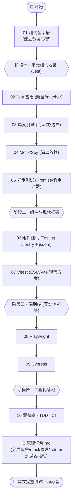
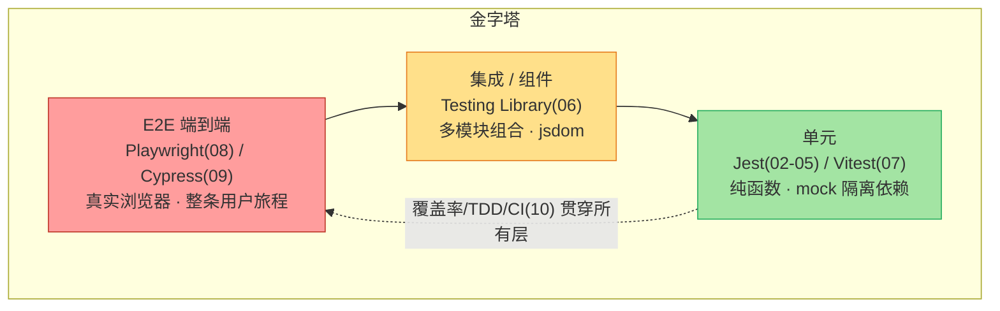

# 22 · 前端测试（Frontend Testing）

> 代码写完怎么证明它是对的？靠“手点一遍”不可靠、不可重复。**自动化测试**把“它应该怎么工作”写成可执行、可回归的用例：改一行代码，一条命令告诉你有没有改坏。本工程从**测试金字塔**建立心智，依次讲透 **Jest 单元测试 / Mock / 异步测试 / 组件测试(Testing Library) / Vitest / E2E(Playwright & Cypress) / 覆盖率·TDD·CI**，每个模块都是**可运行**的真实代码，并对照 jestjs.io、vitest.dev、playwright.dev、testing-library.com 等官方文档。

## 📚 这个工程讲什么

一条从“测一个纯函数”到“测一整条用户旅程”的完整链路：

- **测什么粒度**：金字塔——大量单元、适量集成、少量 E2E。
- **用什么工具**：单元/集成用 Jest 或 Vitest；组件用 Testing Library + jsdom；E2E 用 Playwright / Cypress。
- **怎么隔离依赖**：mock / stub / spy 把网络、时间、随机变得可控。
- **怎么测异步**：async/await、Promise、假定时器。
- **怎么保证质量入库**：覆盖率红线 + TDD + CI 自动拦截。

配套《[原理详解.md](./原理详解.md)》深入讲透 **测试分层与取舍、断言与 mock 的实现原理、jsdom 环境如何工作、E2E 浏览器驱动原理**（多图）。

## 🗂 模块索引

| 模块 | 知识点 | 你将学会 | 运行方式 |
| --- | --- | --- | --- |
| [01](./01-testing-pyramid/) | 测试金字塔 | 为什么测、各层测多少、反模式甜筒 | `npm test`（Jest） |
| [02](./02-jest-basics/) | Jest 基础 | `describe/it/expect` 与常用 matcher | `npm test` |
| [03](./03-unit-testing/) | 单元测试 | 纯函数、边界、参数化 `it.each` | `npm test` |
| [04](./04-mock-spy/) | Mock/Stub/Spy | `jest.fn/mock/spyOn` 隔离依赖 | `npm test` |
| [05](./05-async-testing/) | 异步测试 | async/Promise/done + 假定时器 | `npm test` |
| [06](./06-component-testing/) | 组件测试 | Testing Library + jsdom，按用户视角查询 | `npm test`（jsdom） |
| [07](./07-vitest/) | Vitest | Vite 原生、ESM、与 Jest 对照迁移 | `npm test`（Vitest） |
| [08](./08-e2e-playwright/) | E2E · Playwright | 真实浏览器、自动等待、跨浏览器 | `npx playwright install` 后 `npm test` |
| [09](./09-cypress/) | E2E · Cypress | 浏览器内运行、时间旅行调试 | `npm run serve` + `npm run cy:run` |
| [10](./10-coverage-tdd-ci/) | 覆盖率·TDD·CI | 四项覆盖率红线、红-绿-重构、GitHub Actions | `npm run coverage` / `npm run ci` |

> 01~07、10 是 Node/jsdom 下的 Jest/Vitest 用例，`npm install && npm test` 即可；08/09 是真实浏览器 E2E，需额外下载浏览器内核 / 起静态服务器（见各模块 README）。**本合集统一不预装依赖**，按各模块说明 `npm install` 后运行。

## 🧭 学习路线

各层工具与被测对象的对应关系（贯穿全工程）：

## 🔧 技术栈与版本

- **Jest** 30 —— 单元/集成主力（jestjs.io）
- **Vitest** 2 —— Vite 生态现代方案（vitest.dev）
- **Testing Library**（@testing-library/dom、user-event、jest-dom）—— 组件测试（testing-library.com）
- **jsdom** —— Node 中的 DOM 环境
- **Playwright** 1.47 —— 跨浏览器 E2E（playwright.dev）
- **Cypress** 13 —— 浏览器内 E2E（cypress.io）

## 🔗 权威文档

- Jest：https://jestjs.io
- Vitest：https://vitest.dev
- Testing Library：https://testing-library.com
- Playwright：https://playwright.dev
- Cypress：https://docs.cypress.io
- 测试金字塔（Martin Fowler）：https://martinfowler.com/articles/practical-test-pyramid.html
