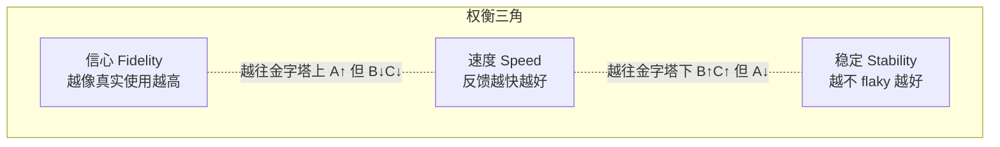
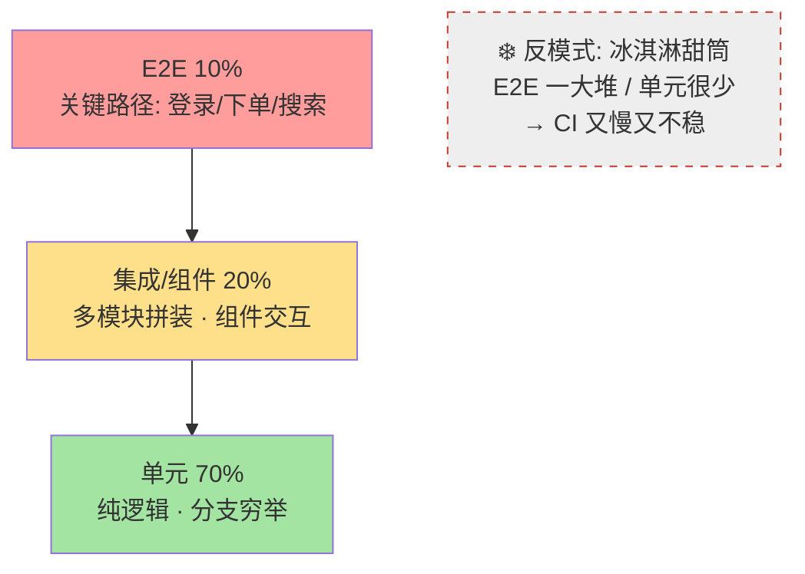
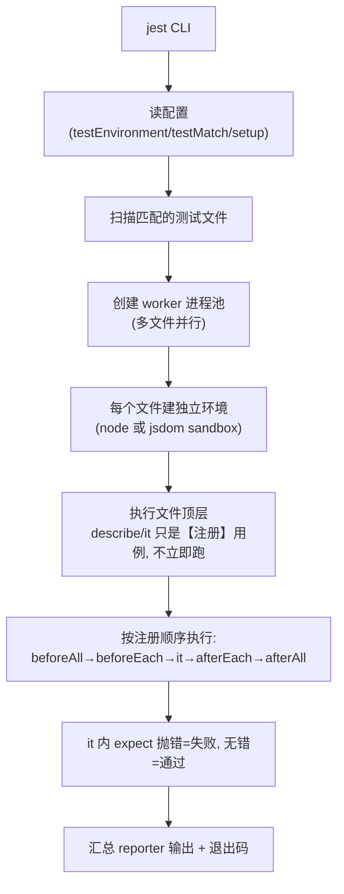
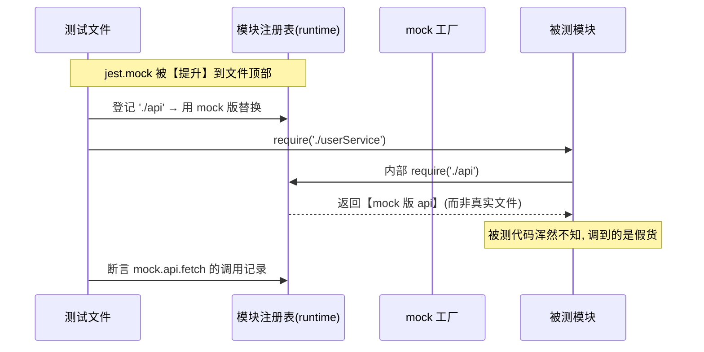
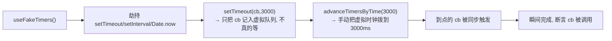
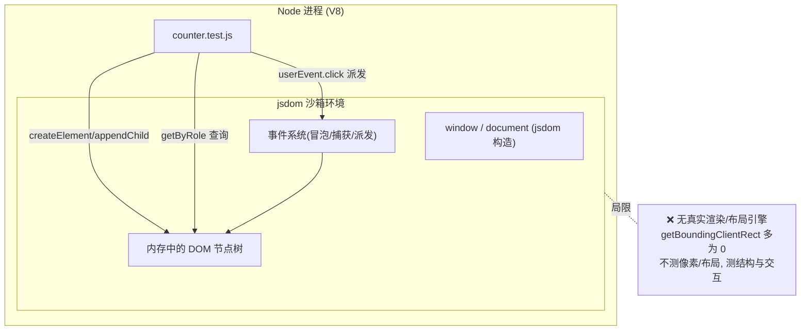
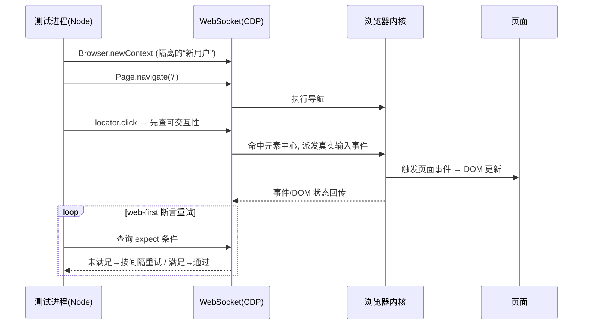
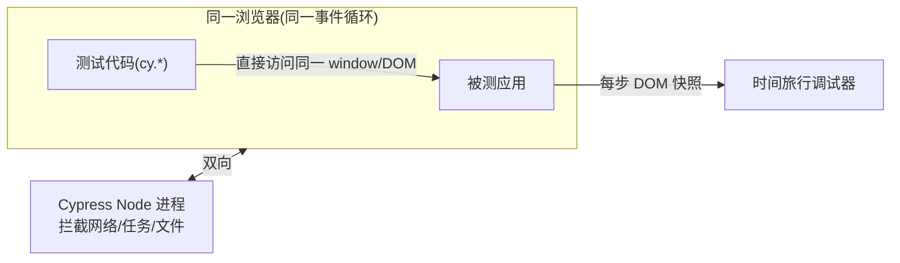
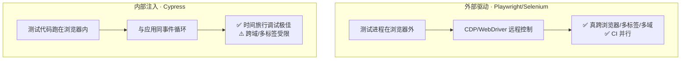
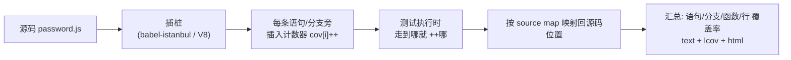

# 前端测试 · 原理详解（How & Why）

> 本文不讲“某个 API 怎么调”，而是讲透测试背后的**机制与原理**：为什么要分层、每层怎么取舍；`expect(x).toBe(y)` 这一句断言内部到底做了什么；`jest.mock` 是怎么在运行时把一个模块“掉包”的；jsdom 凭什么能让 Node 里跑 DOM；以及 Playwright/Cypress 这类 E2E 工具是**怎么驱动一个真实浏览器**的。对照 jestjs.io / vitest.dev / testing-library.com / playwright.dev 官方整理。

---

## 目录

1. [测试分层与取舍：金字塔到底在权衡什么](#一测试分层与取舍)
2. [一个测试是怎么跑起来的：Runner 的内部流程](#二一个测试是怎么跑起来的)
3. [断言原理：expect(...).toBe(...) 内部发生了什么](#三断言原理)
4. [Mock 原理：模块系统层面的“偷梁换柱”](#四mock-原理)
5. [假定时器与异步测试原理](#五假定时器与异步测试原理)
6. [jsdom 环境原理：Node 里哪来的 document](#六jsdom-环境原理)
7. [E2E 浏览器驱动原理：CDP vs 浏览器内注入](#七e2e-浏览器驱动原理)
8. [覆盖率原理：插桩是怎么数出覆盖率的](#八覆盖率原理)
9. [常见误区](#九常见误区)

---

## 一、测试分层与取舍

### 1.1 为什么必须分层
测试有三个此消彼长的属性：**信心（像不像真实用户）**、**速度**、**稳定性**。没有一种测试能同时最大化三者，于是只能分层，让不同层承担不同职责。



- **越往上**（E2E）：真浏览器、真网络、真渲染 → **信心高**，但要启动浏览器、跨进程、依赖网络 → **慢、贵、易 flaky**。
- **越往下**（单元）：函数直调、依赖全 mock → **毫秒级、极稳**，但离“用户真实体验”远 → **可能单元全绿、集成就崩**。

### 1.2 金字塔的数量结构与反模式



**取舍原则**：用大量单元测试守**逻辑正确性**（穷举分支，本工程 02~05、07、10），用少量 E2E 守**关键用户路径**（08、09），中间用组件/集成测试补“模块拼装”的缝（06）。近年也有人主张“**测试奖杯（Testing Trophy）**”——把重心放在集成/组件层，因为它性价比最高（Kent C. Dodds 观点）。金字塔 vs 奖杯不是对立，而是**根据项目形态调分层比例**。

### 1.3 该测行为，不该测实现
一条贯穿所有层的铁律：**断言用户/调用者可观测的行为，不断言内部实现细节**。
- 测组件：断言“点了按钮，页面显示 1”，不断言“内部 `count` 变量变成 1”。
- 测函数：断言“输入 → 输出”，不断言“内部走了哪个 if”。

原因：实现会重构，行为是契约。测实现 → 一重构就红（假失败）；测行为 → 重构安全，只有真的坏了才红。这正是 Testing Library 的立身之本。

---

## 二、一个测试是怎么跑起来的

以 Jest 为例，`npm test` 之后发生的事：



关键点：
- **`describe`/`it` 是“注册”而非“执行”**：Jest 先跑一遍文件收集所有用例（collection 阶段），再统一调度执行（run 阶段）。这解释了为什么不能在 `describe` 里写会立即依赖运行时状态的逻辑。
- **文件级隔离**：每个测试文件跑在**全新的模块注册表和环境**里，模块缓存不共享，避免互相污染。这也是 mock 能“按文件”生效的基础。
- **并行**：默认多 worker 进程并行跑不同文件（`--runInBand` 关掉并行，CI 调试时用）。

---

## 三、断言原理

`expect(actual).toBe(expected)` 看着神奇，本质是**朴素的比较 + 抛错**。伪代码：

```js
function expect(actual) {
  return {
    toBe(expected) {
      // Object.is：区分 +0/-0、正确处理 NaN 的严格相等
      if (!Object.is(actual, expected)) {
        throw new JestAssertionError(
          `期望 ${format(actual)} === ${format(expected)}`
        );
      }
    },
    toEqual(expected) {
      // 递归深比较（结构相等），而非引用相等
      if (!deepEqual(actual, expected)) throw new JestAssertionError(/* diff */);
    },
    not: /* 把上面所有判断取反 */,
  };
}
```

- **`toBe` vs `toEqual`**：`toBe` 用 `Object.is`（≈ `===`）比**引用/基本值**；`toEqual` 递归比**结构**。对象/数组几乎总用 `toEqual`。
- **断言即“不满足就 throw”**：`it` 回调执行时若某个 `expect` 抛异常，该用例被标记失败；跑到底没抛就算通过。所以**测异步时必须让框架“等到”断言真正执行**（见第五节），否则用例提前结束会误判 PASS。
- **匹配器可扩展**：`expect.extend({...})` 往这张“方法表”里加自定义匹配器；jest-dom 的 `toBeInTheDocument()` 就是这样注入的——它内部无非是 `actual.ownerDocument.contains(actual)` 之类的 DOM 检查再抛错。
- **Web-first 断言（Playwright/Cypress）**：把“判断一次就抛错”升级为“**轮询重试**直到通过或超时”，用来抵抗异步 UI 的时序不确定性（见第七节）。

---

## 四、Mock 原理

Mock 的本质是：**在被测代码拿到依赖之前，把真实依赖替换成一个可控的假货**。分两个层次。

### 4.1 假函数 `jest.fn()` / `vi.fn()`：带记录的闭包
一个 mock 函数就是包了一层“记账”的普通函数：

```js
function fn(impl) {
  const mockFn = (...args) => {
    mockFn.mock.calls.push(args);          // 记录每次调用的入参
    const ret = (impl ? impl(...args) : mockFn._returnValue);
    mockFn.mock.results.push({ value: ret });
    return ret;
  };
  mockFn.mock = { calls: [], results: [] };
  mockFn.mockReturnValue = (v) => (mockFn._returnValue = v, mockFn);
  return mockFn;
}
```
`toHaveBeenCalledWith(...)` 不过是去 `mockFn.mock.calls` 里查有没有匹配的记录。**Stub（预设返回）= 写 `_returnValue`；Spy（记录调用）= 读 `mock.calls`**——同一个对象兼具两职。

### 4.2 模块 mock `jest.mock('./api')`：劫持模块系统
真正的“魔法”在这里——它拦截的是**模块加载**本身：



- Jest 有自己的 **module runtime**（不是直接用 Node 的 `require`）。它维护一张模块注册表，`jest.mock('./api')` 就是往表里写一条“**这个路径解析到 mock 版**”的规则。
- **提升（hoisting）**：Jest 用 babel 插件把 `jest.mock(...)` 提到所有 `import` 之前，保证“被测模块首次 require 依赖时，注册表里已经是 mock 版”。这就是为什么 `jest.mock` 写在哪行都行。
- Vitest 用 **Vite 的模块图 + 转换钩子**实现同样效果，API 命名对齐（`vi.mock`），因此心智完全一致。

### 4.3 spyOn：包裹真实方法
`jest.spyOn(obj, 'm')` 把 `obj.m` 换成一个**默认转发到原实现**的 mock，并保存原引用；`mockRestore()` 再装回去。所以它能“既监视又放行”，也能临时 `mockReturnValue` 改写。

> **只 mock 跨边界依赖**（网络/时间/随机/文件/第三方），别把自己的业务逻辑也 mock 掉——否则测的是“mock 配得对不对”，失去意义。

---

## 五、假定时器与异步测试原理

### 5.1 为什么异步测试要“告诉框架等它”
`it` 回调一旦同步返回，Jest 就认为用例结束。若里面发了个没被 await 的 Promise，断言还没跑用例就“通过”了。三种“让框架等”的机制：
- 返回 **Promise**（`return`/`async` 函数）→ 框架 await 它 resolve/reject。
- `done` 回调 → 框架等你调用 `done()`，超时则失败。
- `resolves/rejects` 匹配器 → 内部就是 await 那个 Promise 再断言。

### 5.2 假定时器：把时间“虚拟化”
真等 3 秒太慢。`jest.useFakeTimers()` 把全局 `setTimeout/setInterval/Date` 替换成**受控的假实现**：回调不进真实计时，而是排进一个“虚拟时间队列”。



`advanceTimersByTime(ms)` 把虚拟时钟往前拨，触发所有“到点”的回调——3 秒的等待瞬间完成且**确定性**十足（不受机器快慢影响）。Vitest 的 `vi.useFakeTimers/advanceTimersByTime` 原理一致。

---

## 六、jsdom 环境原理

### 6.1 问题：Node 没有 DOM
组件依赖 `document`、`window`、`HTMLElement`、事件系统，而 Node 只有 JS 引擎和 Node API，**没有这些浏览器全局**。

### 6.2 jsdom：用纯 JS 实现 Web 标准
jsdom 是一个**纯 JavaScript 实现的 DOM/HTML 标准库**：它在内存里建一棵符合 WHATWG DOM 规范的节点树，并实现了 `document.createElement`、`querySelector`、`addEventListener`、事件冒泡/捕获、`classList`、ARIA 等。Jest 的 `testEnvironment:'jsdom'`（或 Vitest 的 `environment:'jsdom'`）会在每个测试文件的沙箱里，把 jsdom 造出来的 `window/document` 挂成全局。



### 6.3 能测什么、不能测什么
- ✅ **能**：DOM 结构、文本、属性、类、事件触发与处理、可访问性角色/label（Testing Library 查询正是基于这些）。
- ❌ **不能**：真实**布局与像素**——jsdom 没有排版/渲染引擎，`getBoundingClientRect` 常返回 0，CSS 视觉效果测不了。要测真实渲染/视觉，得上 E2E（真浏览器）或视觉回归工具。
- **happy-dom** 是更快但覆盖略少的替代实现，Vitest 常用。

> 所以“组件测试（jsdom）”与“E2E（真浏览器）”不是二选一：前者快、测逻辑与结构；后者慢、测真实渲染与整链路。分工协作。

---

## 七、E2E 浏览器驱动原理

E2E 要操作**真实浏览器**。两条主流技术路线，架构差异决定了各自的能力边界。

### 7.1 路线 A：外部驱动（Playwright / Selenium）
测试进程在浏览器**外部**，通过**调试协议**远程指挥浏览器。Playwright 主要走 **CDP（Chrome DevTools Protocol）**（对 Firefox/WebKit 用其打过补丁的协议），用**双向 WebSocket** 收发命令与事件。



- **自动等待（actionability）**：`click` 前 Playwright 会检查元素是否“存在→可见→稳定(不在动画)→可接收事件→ enabled”，全满足才操作，从根上消灭大量 flaky。
- **BrowserContext = 隐身用户**：每个 test 用独立 context，cookie/storage 全隔离且创建极快，用例天然互不干扰。
- **真跨浏览器**：因为直接对接三大内核的协议，Chromium/Firefox/WebKit 都是一等公民。

### 7.2 路线 B：浏览器内注入（Cypress）
Cypress 把测试代码**注入到被测页面所在的浏览器里**，与应用共享同一个事件循环，另有一个 Node 进程在旁处理网络拦截/文件等。



- **命令队列 + 自动重试**：`cy.get().should()` 入队异步执行，断言重试到通过或超时——所以不写 `await`。
- **代价**：因与应用同源同循环，**跨域、多标签页**支持受限；这正是架构选择带来的取舍。

### 7.3 两条路线对比



> 选型：要真跨浏览器、多标签、CI 大规模并行 → Playwright；重可视化调试、单一 SPA、团队上手快 → Cypress。二者都远比“手点”可靠。

---

## 八、覆盖率原理

覆盖率不是“猜”出来的，而是**给源码插桩（instrumentation）后统计运行轨迹**。



- **两种实现**：① Babel 插件（istanbul）在编译期往代码里塞计数器；② **V8 内置覆盖率**（Node/Chromium 提供），无需改代码、更快，Vitest 默认、Jest 也支持。
- **四指标**里 **branches 最难满**：`if/三元/&&/||` 的每个分叉都要被走到。所以测试要**穷举分支**（本工程 10 号模块的 `password.test.js` 就是逐分支钉死）。
- **红线机制**：`coverageThreshold` 让 Jest 在低于阈值时**退出码非 0**，CI 据此判失败——这才把覆盖率从“看看而已”变成“真的能拦住劣质提交”。
- ⚠️ 覆盖率高 ≠ 质量高：**执行到 ≠ 断言对**。一行被跑到但没有任何 `expect` 校验它的结果，照样计入覆盖。覆盖率是**下限护栏**，不是**质量证明**。

---

## 九、常见误区

| 误区 | 纠正 |
|------|------|
| E2E 越多越好 | E2E 慢且 flaky，只守关键路径；逻辑正确性交给单元测试（金字塔） |
| 测内部实现（私有变量/class 名） | 测行为/输出，重构才不会误报（Testing Library 原则） |
| 把所有依赖都 mock | 只 mock 跨边界依赖；全 mock 等于测“mock 配置” |
| 追求 100% 覆盖率 | 执行到≠断言对；重点是 branches 与有效断言，覆盖率是护栏非目标 |
| 异步测试忘了 await / return | 用例会在断言前提前 PASS（假绿）；务必让框架等到异步完成 |
| 用 sleep 等 UI | 用自动等待 / web-first 重试断言，别写死等待时间 |
| jsdom 里测像素/布局 | jsdom 无渲染引擎，视觉/布局要用真浏览器 E2E 或视觉回归 |
| 测试之间共享状态 | 每个用例 `beforeEach` 重置（清 mock、清 DOM、独立 context），保证可独立、可乱序运行 |

---

## 参考

- Jest：https://jestjs.io/docs/getting-started
- Vitest：https://vitest.dev/guide/
- Testing Library 指导原则：https://testing-library.com/docs/guiding-principles
- jsdom：https://github.com/jsdom/jsdom
- Playwright 架构与 actionability：https://playwright.dev/docs/actionability
- Cypress 核心概念：https://docs.cypress.io/guides/core-concepts/introduction-to-cypress
- istanbul 覆盖率：https://istanbul.js.org
- Martin Fowler《The Practical Test Pyramid》：https://martinfowler.com/articles/practical-test-pyramid.html
