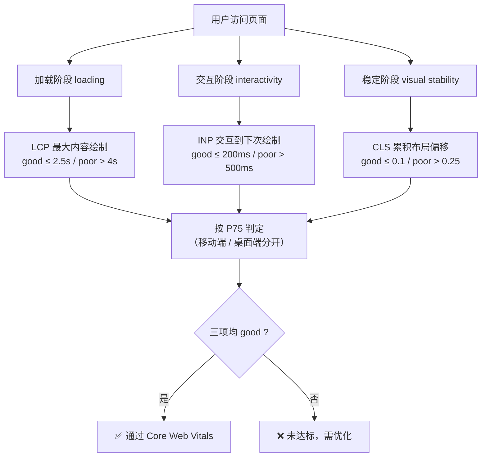

# 01 · 核心 Web 指标（Core Web Vitals）

> Core Web Vitals 是 Google 定义的一组「以用户为中心」的性能指标，用 LCP / INP / CLS 三个可量化数值分别刻画页面的**加载速度、交互响应、视觉稳定性**，是衡量真实用户体验的行业标准。

## 📖 知识讲解

### 一、三大核心指标（2024+ 版本）

| 指标 | 全称 | 衡量什么 | 所属阶段 |
| --- | --- | --- | --- |
| **LCP** | Largest Contentful Paint（最大内容绘制） | 视口内**最大**的图片/文本块完成绘制的时间 | 加载 loading |
| **INP** | Interaction to Next Paint（交互到下次绘制） | 页面对用户交互（点击/按键/点按）响应的整体延迟 | 交互 interactivity |
| **CLS** | Cumulative Layout Shift（累积布局偏移） | 页面生命周期内非预期的布局跳动累计程度 | 稳定 visual stability |

> ⚠️ **INP 已于 2024 年 3 月正式取代 FID**（First Input Delay）成为交互性核心指标。FID 只测「第一次交互的输入延迟」，INP 则考察**整个页面周期内所有交互**里最慢的一批，更贴近真实体验。

### 二、阈值三档（good / needs improvement / poor）

全部按**第 75 百分位（P75）** 统计，且**移动端与桌面端分开**评估。「达标」要求 P75 落在 good 档。

| 指标 | 🟢 good（良好） | 🟠 needs（需改进） | 🔴 poor（较差） |
| --- | --- | --- | --- |
| **LCP** | ≤ 2.5s | 2.5s – 4s | > 4s |
| **INP** | ≤ 200ms | 200ms – 500ms | > 500ms |
| **CLS** | ≤ 0.1 | 0.1 – 0.25 | > 0.25 |

辅助指标：**FCP**（First Contentful Paint，首次内容绘制）good ≤ 1.8s；**TTFB**（Time To First Byte）good ≤ 800ms。它们不是核心指标，但常用来诊断 LCP 慢在哪一环。

### 三、为什么是「P75」？

用「所有用户中第 75 快」的那次访问作为代表值：既不像平均值那样被极端值拉偏，又能保证**四分之三的用户体验都不差于这个数**。追平均值会掩盖长尾用户的糟糕体验，因此 Google 选择 P75。

### 四、Field data（现场数据）vs Lab data（实验室数据）

- **Field data / RUM（真实用户监测）**：来自真实用户的真实设备与网络，是 CrUX（Chrome 用户体验报告）和 Search Console 的评分依据。**INP、CLS 只有在真实交互中才测得准**。
- **Lab data（实验室数据）**：在固定环境下用工具（Lighthouse、WebPageTest）模拟测量，可复现、便于调试，但无法反映真实用户的交互（Lighthouse 给的是「LCP、TBT」而非 INP）。
- 结论：**用 Lab 数据定位和调试问题，用 Field 数据做最终评判**。

### 五、如何测量

**方式 A：官方 `web-vitals` 库（推荐用于线上上报）**，CDN 免构建用法：

```html
<script type="module">
  import { onLCP, onINP, onCLS } from 'https://unpkg.com/web-vitals@4?module';
  onLCP(console.log);  // {name:'LCP', value: 1234, rating:'good', ...}
  onINP(console.log);
  onCLS(console.log);
  // 实战中把回调换成 navigator.sendBeacon('/analytics', ...) 上报到自己的后端
</script>
```

**方式 B：原生 `PerformanceObserver`（本 demo 采用，零依赖，帮助理解底层）**：

```js
new PerformanceObserver((list) => {
  for (const entry of list.getEntries()) console.log(entry.startTime);
}).observe({ type: 'largest-contentful-paint', buffered: true });
```

常用 `entryTypes`：`largest-contentful-paint`（LCP）、`layout-shift`（CLS）、`event`（INP，即 Event Timing）、`paint`（FCP）、`navigation`、`resource`、`longtask`。`buffered: true` 会回放 observer 创建前就产生的条目，避免漏测早期指标。

### 六、易错点

- **LCP 只取「最后一次」上报**：更大的元素绘制会不断刷新 LCP，直到首次用户交互或页面隐藏才定格。
- **CLS 不是简单求和**：按「会话窗口」（相邻偏移间隔 < 1s、窗口时长 < 5s）分组累加，取**最大窗口**的分值；`hadRecentInput` 为 true 的偏移不计入。
- **INP 要真实交互才有值**：光加载页面不点击，INP 无数据；官方取近似 P98（交互多时每 50 次允许忽略 1 次最慢）。

## 🔄 流程图 / 原理图

指标归属到三个体验阶段：



## 💻 代码说明

- **`vitals.js`（共用测量脚本）**：被三个页面共同引入。
  - `observeLCP()`：监听 `largest-contentful-paint`，每次回调都刷新为最新值。
  - `observeCLS()`：实现「会话窗口」算法，跳过 `hadRecentInput`，取最大窗口分值。
  - `observeINP()`：监听 `event`（`durationThreshold: 0` 上报所有事件），只统计带 `interactionId` 的真实交互，排序后取近似 P98。
  - `observeFCP()`：从 `paint` 条目里挑出 `first-contentful-paint`。
  - `rate()` + `render()`：按阈值表判定 good/needs/poor，给徽章上色（绿/橙/红）。
- **`index.html`**：实时仪表盘。含一张 CSS 渐变「主视觉」作为 LCP 候选元素、两个按钮分别跑轻/重任务观察 INP 变化。
- **`bad.html` vs `good.html`（核心对比）**：两页内嵌**同一段 `vitals.js`**，数值差异全来自写法：

| 问题 | bad.html（优化前） | good.html（优化后） | 影响指标 |
| --- | --- | --- | --- |
| 首屏脚本 | `<head>` 里同步 busy-wait **1.2s** 阻塞渲染 | 改用 `<script defer>`，不阻塞首屏 | LCP / FCP ⬆️ 变好 |
| 图片尺寸 | 图片**不写** width/height，加载时挤动内容 | 显式写 `width`/`height`，提前占位 | CLS 从偏高 → ≈ 0 |
| 交互任务 | 点击后主线程空转 **300ms** | 切成 30 片 × 8ms，每片 `await scheduler.yield()` 让出主线程 | INP 从 poor → good |

打开两页分别操作，能直观看到同样的指标卡片：bad 页 LCP/CLS/INP 徽章偏橙/红，good 页保持绿色。

## ▶️ 运行方式

浏览器**直接打开** `index.html`、`bad.html`、`good.html` 即可（免构建，`file://` 协议下 PerformanceObserver 正常工作）。

- 建议用 **Chrome / Edge**（对 `event`/INP、`layout-shift`、`largest-contentful-paint` 支持最完整；Safari/Firefox 部分 entryType 可能缺失，脚本已做兜底不报错）。
- 若想更贴近真实网络，可起本地服务器：`npx serve` 或 `python3 -m http.server`，再访问对应 HTML。
- 测 INP 记得**真的去点击**按钮；测 LCP/CLS 可刷新页面观察。

## ⚠️ 常见坑 / 最佳实践

- **别只在本地看数字**：本机太快，LCP 往往都是 good。真实评判要看线上 Field 数据（CrUX / Search Console / 自建 RUM）。
- **INP 无值 ≠ 好**：没交互就没有 INP，别误以为 0 就是满分。
- **CLS 排查**：优先给一切「尺寸未知的媒体」（img/video/iframe/广告/字体回退）预留空间；避免在已有内容上方动态插入元素。
- **LCP 优化顺序**：先看 TTFB → 再看资源加载（预加载 LCP 图片、`fetchpriority="high"`）→ 最后看渲染阻塞（关键 CSS 内联、脚本 defer）。
- **上报要用 `visibilitychange` + `sendBeacon`**：指标在页面隐藏时才定终值，用 `web-vitals` 库会自动处理这个时机。

## 🔗 官方文档

- Core Web Vitals 总览：https://web.dev/articles/vitals
- LCP：https://web.dev/articles/lcp
- INP：https://web.dev/articles/inp
- CLS：https://web.dev/articles/cls
- `web-vitals` 库：https://github.com/GoogleChrome/web-vitals
- PerformanceObserver（MDN）：https://developer.mozilla.org/zh-CN/docs/Web/API/PerformanceObserver
- Event Timing / INP 测量（MDN）：https://developer.mozilla.org/en-US/docs/Web/API/PerformanceEventTiming
- Layout Instability API（MDN）：https://developer.mozilla.org/en-US/docs/Web/API/LayoutShift
