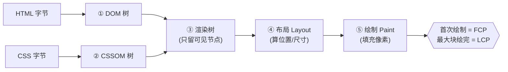
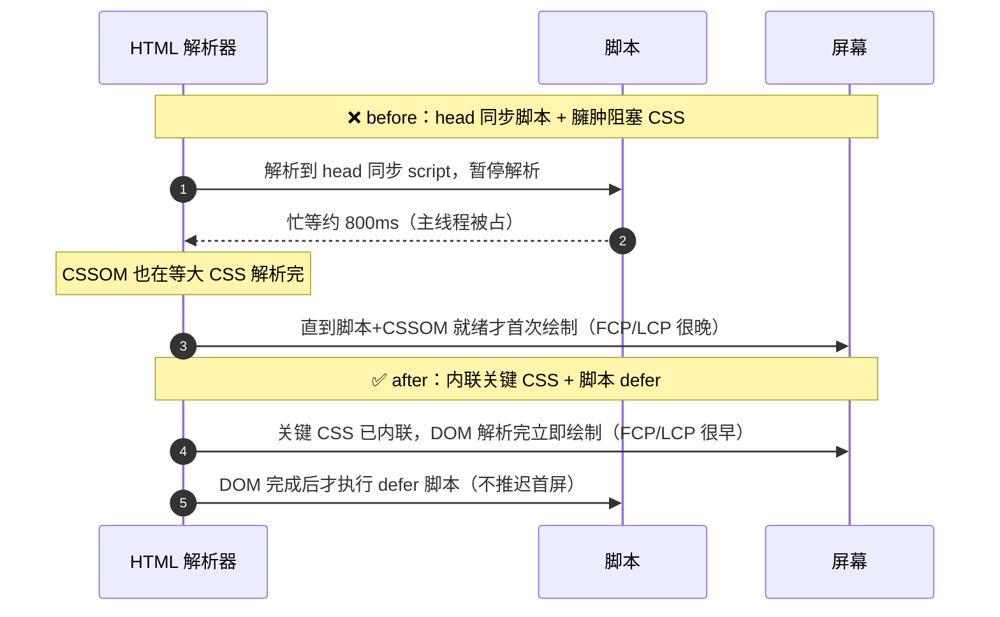

# 02 · 关键渲染路径（Critical Rendering Path）

> 关键渲染路径（CRP）是浏览器把 HTML/CSS/JS 字节「变成屏幕像素」必经的一条流水线：DOM → CSSOM → 渲染树 → 布局 → 绘制。搞懂它，才知道**什么在阻塞首屏**，以及为什么要「内联关键 CSS + 脚本 defer」——直接决定 FCP 与 LCP。

## 📖 知识讲解

### 一、五步流水线：字节是怎么变成像素的

浏览器拿到响应后，按固定顺序把内容渲染出来：

| 步骤 | 名称 | 做什么 | 输入 |
| --- | --- | --- | --- |
| 1 | **DOM 树**（Document Object Model） | 解析 HTML 标签，构建节点树 | HTML 字节 |
| 2 | **CSSOM 树**（CSS Object Model） | 解析 CSS，构建带层叠/继承的样式树 | CSS 字节 |
| 3 | **渲染树**（Render Tree） | 把 DOM 和 CSSOM 合并，只保留**可见**节点（`display:none` 不进树） | DOM + CSSOM |
| 4 | **布局 Layout**（Reflow） | 计算每个节点的**几何位置与尺寸**（盒模型、坐标） | 渲染树 |
| 5 | **绘制 Paint** | 把节点填成实际像素（文字、颜色、边框、阴影） | 布局结果 |

（其后还有 **合成 Composite**：把多个图层合并上屏。）第一次绘制完成，用户就看到了内容——这一刻就是 **FCP（First Contentful Paint）**；其中最大的那块内容画完，就是 **LCP（Largest Contentful Paint）**。

### 二、两个「阻塞」是首屏慢的根因

**1. CSS 阻塞渲染（render-blocking）**
渲染树需要 CSSOM，而 **CSSOM 没构建完，浏览器什么都不画**（否则会出现无样式内容闪烁 FOUC）。所以一份又大又晚的 CSS 会把整个首屏卡住。
→ 解法：**内联首屏「关键 CSS」**（首屏首次绘制需要的最小样式），其余非关键 CSS **异步加载**。

**2. JS 阻塞解析（parser-blocking）**
遇到没有 `defer`/`async` 的 `<script>`，浏览器会**暂停 DOM 构建**，先下载并执行脚本才继续。而且脚本可能读写样式，还要等前面的 CSSOM 就绪。放在 `<head>` 的重同步脚本，会把首屏整体推迟。
→ 解法：给脚本加 `defer` 或 `async`，或干脆放 `<body>` 末尾。

### 三、`defer` vs `async` vs 同步

| 写法 | 是否阻塞 HTML 解析 | 执行时机 | 是否保证顺序 | 适用 |
| --- | --- | --- | --- | --- |
| `<script>`（同步） | ✅ 阻塞（下载+执行都停解析） | 立即 | 按文档序 | 少用；只在必须尽早执行时 |
| `<script defer>` | ❌ 不阻塞（并行下载） | **DOM 解析完、DCL 之前**按序执行 | ✅ 保证 | 依赖 DOM、需保持顺序的主脚本 |
| `<script async>` | ❌ 不阻塞（并行下载） | **下载完立即执行**（可能打断解析） | ❌ 不保证 | 独立第三方脚本（统计等） |

> ⚠️ `defer` 脚本在 **DOMContentLoaded 之前**执行，所以它**本身若很重，一样会拖后 DCL**。首屏初始化脚本要保持轻量，重活拆分或丢给 Web Worker。

### 四、缩短关键渲染路径的三个方向

1. **减少关键资源数**：内联关键 CSS、延迟非关键 CSS/JS。
2. **减少关键字节数**：压缩、抽取 critical CSS、按需加载。
3. **缩短关键路径长度**：减少串行网络往返（preload 提前发现关键资源）。

## 🔄 流程图 / 原理图

**图 1：关键渲染路径五步流水线**



**图 2：before / after 阻塞时间线对比（sequenceDiagram）**



## 💻 代码说明

两个页面用**同一段** FCP/LCP/DCL 测量脚本（`PerformanceObserver` 监听 `paint` 取 FCP、`largest-contentful-paint` 取 LCP，`PerformanceNavigationTiming.domContentLoadedEventEnd` 取 DCL），数值差异**全部来自阻塞写法不同**。

- `before.html`：`<head>` 里一个**同步 `<script>`** 用忙等（`while` 循环卡 `performance.now`）阻塞主线程约 800ms，模拟解析器阻塞脚本；再把一大段样式当作**渲染阻塞 CSS** 全量内联。首屏被整体推迟。
- `after.html`：只**内联首屏关键 CSS**，非关键样式拆到 `noncritical.css` 用 `media="print" onload="this.media='all'"` 异步加载；脚本改成 `<script defer src="heavy-defer.js">`，且 `heavy-defer.js` 保持轻量。
- `noncritical.css`：首屏用不到的样式（占位块、工具类），异步加载不阻塞渲染。
- `heavy-defer.js`：被 `defer` 引入的轻量初始化脚本，验证「defer 在 DOM 解析完后才执行、不推迟首屏」。

**优化前 vs 优化后 差异表**

| 维度 | `before.html`（优化前） | `after.html`（优化后） | 对应指标 |
| --- | --- | --- | --- |
| 脚本位置 / 阻塞方式 | `<head>` 同步脚本，**parser-blocking**，忙等 800ms | `<script defer>` 放 `<head>` 但不阻塞解析，DOM 完成后才执行 | FCP / LCP / DCL |
| CSS 处理 | 一大段 CSS 全量内联，**render-blocking** | 只内联关键 CSS，非关键 CSS `media` 异步加载 | FCP / LCP |
| DOM 构建 | 被同步脚本暂停约 800ms | 不中断，连续解析 | DCL |
| FCP / LCP | 被推迟约 800ms+（明显偏晚） | 首屏立即绘制（明显更早） | FCP / LCP |
| DCL | 被 head 忙等直接拖后 | 脚本 defer 且轻量，DCL 提前 | DCL |

打开两页看仪表盘：`before` 的 FCP/LCP/DCL 数值明显大于 `after`。

## ▶️ 运行方式

免构建，浏览器**直接双击打开**即可（`file://` 下 `PerformanceObserver` 与 Navigation Timing 均正常工作）：

```bash
cd 23-performance-optimization/02-critical-rendering-path
# 直接双击 before.html / after.html；或起本地服务器更贴近真实网络：
python3 -m http.server 8080
# 打开 http://localhost:8080/before.html 与 after.html
```

观察方法：
1. 分别打开 `before.html` 和 `after.html`，看页面上的 **FCP / LCP / DCL** 三个数值。
2. `before` 因 head 忙等 800ms，三项都明显更晚；`after` 三项都更早。
3. 打开 **DevTools → Console** 看两页打印的时序日志；打开 **Performance** 面板录制，能看到 `before` 首帧被一大段脚本执行推后。
4. 建议用 **Chrome / Edge**（对 `largest-contentful-paint` 支持最完整）。

## ⚠️ 常见坑 / 最佳实践

- **`defer` 不等于「不占主线程」**：defer 脚本在 DCL 之前执行，脚本本身重仍会拖后 DCL 与可交互时间。首屏脚本要轻，重活拆分。
- **别把关键 CSS 也异步化**：首屏首次绘制需要的样式必须尽早就位，否则会出现无样式闪烁（FOUC）或首屏空白。异步的只应是「非关键」样式。
- **`media="print" onload` 技巧要配 `<noscript>` 兜底**：JS 被禁用时保证样式仍能加载。
- **`async` 用于独立第三方脚本**：它下载完立即执行、可能打断解析且不保证顺序；有 DOM 依赖或相互依赖的主脚本用 `defer`。
- **关键 CSS 别手抄**：生产环境用工具自动抽取（Critical、critters 等），避免和真实首屏样式脱节。
- **LCP 优化顺序**：先 TTFB → 再资源加载（预加载 LCP 图、`fetchpriority="high"`）→ 最后渲染阻塞（内联关键 CSS、脚本 defer）。本模块聚焦最后一环。
- **`buffered: true` 必写**：否则 observer 创建前产生的早期 `paint`/LCP 条目会漏测。

## 🔗 官方文档

- 关键渲染路径（web.dev）：https://web.dev/articles/critical-rendering-path
- 优化 LCP（web.dev）：https://web.dev/articles/optimize-lcp
- LCP 指标（web.dev）：https://web.dev/articles/lcp
- 消除渲染阻塞资源（web.dev）：https://web.dev/articles/render-blocking-resources
- 抽取关键 CSS（web.dev）：https://web.dev/articles/extract-critical-css
- Critical rendering path（MDN）：https://developer.mozilla.org/zh-CN/docs/Web/Performance/Guides/Critical_rendering_path
- `<script>` 的 defer / async（MDN）：https://developer.mozilla.org/zh-CN/docs/Web/HTML/Element/script
- PerformanceObserver（MDN）：https://developer.mozilla.org/zh-CN/docs/Web/API/PerformanceObserver
