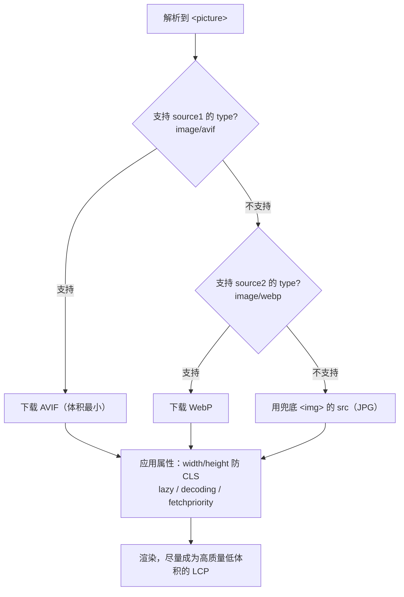
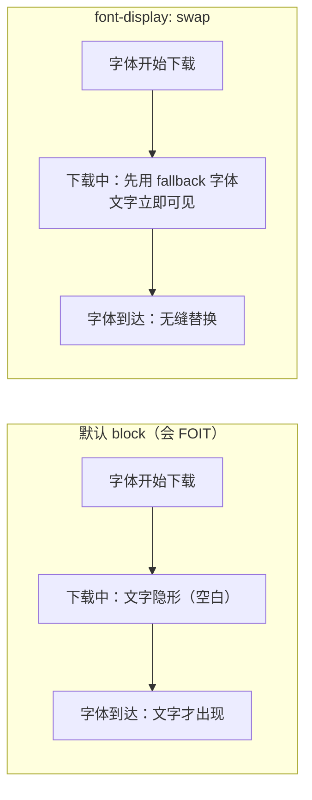

# 03 · 资源优化：压缩 / 图片格式 / 字体优化（Resource Optimization）

> 从「传输更少字节」入手：文本资源压缩（gzip/brotli）、图片选对格式（AVIF/WebP）+ 响应式 + 懒加载、字体避免 FOIT（swap/preload/子集化），直接改善 LCP 与 CLS。

## 📖 知识讲解

页面加载慢，本质是**下载的字节太多、太晚、或阻塞了渲染**。资源优化就是围绕这三点做文章。

### 1. 文本资源压缩（HTML / CSS / JS，服务器层）

HTML、CSS、JS 都是文本，重复度高，非常适合压缩。压缩发生在**服务器层**（Nginx / CDN / Node 中间件），浏览器通过请求头 `Accept-Encoding: gzip, br` 声明支持，服务器用响应头 `Content-Encoding: br` 告知实际编码。

| 算法 | 说明 | 相对体积（越小越好） | 场景 |
|------|------|------|------|
| 不压缩 | 原始文本 | 100% | — |
| gzip | 通用、CPU 便宜、兼容所有浏览器 | 约 30%~40% | 动态内容默认选它 |
| brotli (br) | Google 出品，压缩率更高（尤其静态文本），压缩慢但可预压缩 | 约 25%~30%（比 gzip 再小约 15%~20%） | 静态资源首选（构建期预压缩成 `.br`） |

> 要点：**brotli 静态资源预压缩**（构建时生成 `.br` 文件，运行时直接发）性价比最高；动态响应用 gzip 兼顾 CPU。图片/视频/字体（woff2）已是压缩格式，**不要再套 gzip/br**（几乎无收益还费 CPU）。

### 2. 图片为什么是首屏体积大头

一个典型页面里，图片常占总传输体积的 **50% 以上**。而首屏最大的那张图往往就是 **LCP（Largest Contentful Paint）元素**——它下载得快不快，直接决定 LCP 指标（目标 ≤ 2.5s，第 75 百分位）。所以「图片优化」几乎等价于「首屏优化」。

### 3. 图片格式怎么选（体积对比 · 量级参考）

以一张 1600×900 的照片为例（真实体积随内容浮动，这里给**量级**）：

| 格式 | 类型 | 典型体积（同一张照片） | 相对 JPG | 透明 | 兼容性 | 适用场景 |
|------|------|------|------|------|------|------|
| PNG | 无损 | ~1.5 MB | 约 300%+ | ✅ | 全部 | 图标 / 线条 / 需无损透明 |
| JPG | 有损 | ~500 KB | 100%（基准） | ❌ | 全部 | 照片兜底格式 |
| WebP | 有损/无损 | ~300 KB | 约 60%（省 25%~35%） | ✅ | 很广（现代浏览器全支持） | 照片/图形主力，兼容优先 |
| AVIF | 有损/无损 | ~200 KB | 约 40%（省 50%+） | ✅ | 较新（新版主流浏览器） | 压缩率最高，追求极致体积 |

选型策略：**AVIF 优先，WebP 次之，JPG/PNG 兜底**——用 `<picture>` 让浏览器自动降级，无需你判断 UA。

### 4. 响应式图片：`srcset` / `sizes`

手机屏幕不需要 1600px 宽的图。用 `srcset` 提供多种分辨率，`sizes` 告诉浏览器图片显示宽度，浏览器结合 DPR（设备像素比）挑最合适的一张，避免「给手机发大图」：

```html

```

`srcset` 按**格式**降级用 `<picture>`；按**分辨率**选择用 `srcset` + `sizes`。两者可组合。

### 5. `<picture>` 按 type 降级（本 demo 重点）

```html
<picture>
  <source type="image/avif" srcset="hero.avif" />  <!-- 首选 -->
  <source type="image/webp" srcset="hero.webp" />  <!-- 次选 -->
    <!-- 兜底 -->
</picture>
```

浏览器**从上往下**匹配 `<source>` 的 `type`，选中「第一个自己支持的」；都不支持则用最后的 ``。

配套属性：
- `loading="lazy"`：首屏外图片进入视口附近才下载（首屏 LCP 图**不要**加 lazy，会拖慢 LCP）。
- `decoding="async"`：图片解码不阻塞主线程。
- `fetchpriority="high"`：给首屏 LCP 图提优先级，让它更早开始下载。
- `width` / `height`（或 CSS `aspect-ratio`）：**提前预留空间，消除 CLS**（目标 ≤ 0.1）。

### 6. 字体优化：避免 FOIT，尽早开始

- **`font-display: swap`**：字体下载期间先用 fallback 字体显示文字，字体到了再替换。避免 **FOIT（Flash Of Invisible Text，文字隐形）**。默认行为（`auto`/`block`）会让文字在字体到达前一片空白。
- **`<link rel="preload" as="font" crossorigin>`**：字体默认要等 CSS 解析、匹配到用它的元素后才开始下载，很晚。preload 让它尽早被发现。**必须写 `crossorigin`**，否则会重复下载。
- **字体子集化（subset）**：中文字体动辄几 MB，只保留页面用到的字符（或按 `unicode-range` 拆包），体积可从 MB 级降到几十 KB。
- **`size-adjust` / fallback 字体调优**：让 fallback 字体的字形尺寸接近真字体，减小替换瞬间的行高/宽度跳动（CLS）。

## 🔄 流程图 / 原理图

浏览器按 `<source>` 顺序选图的决策流程：



字体 FOIT vs swap 的时间线对比：



## 💻 代码说明（优化前 vs 优化后差异）

| 维度 | `before.html`（未优化） | `after.html`（已优化） |
|------|------|------|
| 图片格式降级 | 单一 ``，无多格式 | `<picture>` + AVIF→WebP→JPG 三级 `<source type>` |
| 尺寸预留 | 无 width/height → **CLS 抖动** | 写 `width/height` + CSS `aspect-ratio` → 无抖动 |
| 首屏外图片 | 立即下载，抢带宽 | `loading="lazy"` 进视口才下载 |
| LCP 首屏图 | 普通优先级 | `fetchpriority="high"` + `decoding="async"` |
| 字体显示 | 无 `font-display` → **FOIT 文字隐形** | `font-display: swap` → 文字立即可见 |
| 字体发现时机 | 等 CSS 解析后才下载 | `<link rel="preload" as="font" crossorigin>` 尽早下载 |

> 说明：demo 为保证「离线双击即可运行」，`<source>` 的 `srcset` 用**内联 SVG（data URI）占位图**演示 `<picture>` 的**结构与属性**是否正确；真实体积对比见上方表格。字体部分用不存在的字体文件配合 JS，演示 `font-display` 的差异；打开控制台可看到 `document.fonts.ready` 时序日志。

关键差异代码（after 的 picture 结构）：

```html
<picture>
  <source type="image/avif" srcset="hero.avif" />   <!-- 1. 首选，压缩率最高 -->
  <source type="image/webp" srcset="hero.webp" />   <!-- 2. 次选，兼容更广 -->
  
       fetchpriority="high" decoding="async" alt="…" />
</picture>
```

## ▶️ 运行方式

免构建，浏览器直接打开即可：

```bash
# 直接双击，或用任意静态服务器（推荐，能在 Network 面板看真实请求）
cd 23-performance-optimization/03-resource-optimization
python3 -m http.server 8080
# 打开 http://localhost:8080/before.html 和 after.html
```

观察方法：
1. 打开 **DevTools → Network**，勾选「Disable cache」，节流选 **Slow 4G**。
2. 对比 `before.html` 与 `after.html`：滚动页面，看首屏外图片是否「进视口才请求」。
3. 打开 **Console**，看字体 `document.fonts.ready` 的时序日志。
4. 打开 **Performance / Lighthouse**，对比 CLS、LCP 分数差异。

## ⚠️ 常见坑 / 最佳实践

- **首屏 LCP 图别加 `loading="lazy"`**：lazy 会延迟它的下载，反而拖慢 LCP。lazy 只给「首屏外」图片。
- **一定要写 `width`/`height`**（或 `aspect-ratio`）：这是消除图片 CLS 最简单有效的一招。
- **preload 字体必须写 `crossorigin`**：漏写会导致字体被下载两次。
- **别对图片/视频/woff2 再套 gzip/br**：它们已压缩，二次压缩几乎无收益且费 CPU。
- **`<picture>` 的兜底一定放在最后的 `` 上**：`alt`、`width/height`、`src` 都写在 `` 而非 `<source>`。
- **中文字体务必子集化或按 `unicode-range` 分包**：整包中文字体几 MB，直接 preload 反而是灾难。
- **AVIF 编码慢**：构建期生成、CDN 缓存；不要在请求时实时转码。
- **brotli 用静态预压缩**（构建生成 `.br`），动态内容用 gzip。

## 🔗 官方文档

- Web Vitals（LCP / CLS 指标）：https://web.dev/articles/vitals
- 优化 LCP：https://web.dev/articles/optimize-lcp
- 现代图片格式（AVIF/WebP）：https://web.dev/articles/serve-images-webp
- 响应式图片 `srcset`/`sizes`：https://developer.mozilla.org/zh-CN/docs/Web/HTML/Responsive_images
- MDN `<picture>`：https://developer.mozilla.org/zh-CN/docs/Web/HTML/Element/picture
- `loading="lazy"` 浏览器级懒加载：https://web.dev/articles/browser-level-image-lazy-loading
- 字体最佳实践 `font-display`：https://web.dev/articles/font-best-practices
- MDN `font-display`：https://developer.mozilla.org/zh-CN/docs/Web/CSS/@font-face/font-display
- 预加载关键资源：https://web.dev/articles/preload-critical-assets
