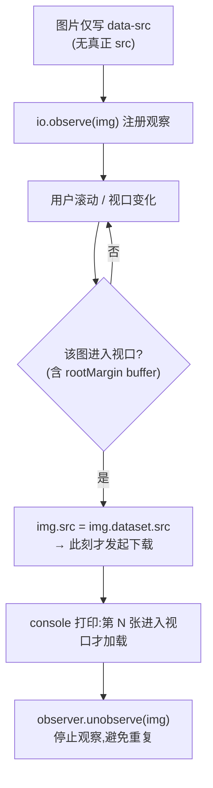
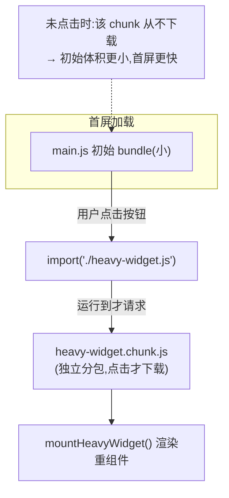

# 04 · 懒加载与代码分割（Lazy Loading & Code Splitting）

> 一句话原则：**不为「看不见的东西」付费**。首屏只加载首屏需要的图片和代码——图片进视口才下载（懒加载），非首屏功能点了才请求（代码分割），从而减小初始体积、加快 LCP。

## 📖 知识讲解

### 一、图片懒加载：两种方式

**方式 A：原生 `loading="lazy"`（首选）**
给 `` 即可，浏览器自动在图片**接近视口**时才发起下载，零 JS、零依赖。首屏内、尤其是 **LCP 图片绝不能加 lazy**（会延迟它下载、拖慢 LCP）。

**方式 B：`IntersectionObserver`（手写版，可控性强）**
图片先只写 `data-src`，用观察器监听它是否进入视口，进入时把 `data-src` 赋给 `src`，此刻才真正加载。相比原生 lazy，可自定义 **buffer 距离**（`rootMargin`）、触发比例（`threshold`），也能懒加载背景图、组件等非 `` 场景。

| 对比 | 原生 `loading="lazy"` | `IntersectionObserver` |
| --- | --- | --- |
| 依赖 | 无，浏览器内置 | 需写 JS |
| 触发距离 | 浏览器内部启发式，不可调 | `rootMargin` 自定义 |
| 适用 | `` / `<iframe>` | 图片 / 背景图 / 组件 / 无限滚动等 |
| file:// 观察 | data URI 难在 Network 看出 | 靠 `data-src→src` + 日志清晰可见 |

### 二、代码分割：动态 `import()`

静态 `import` 在打包时被合进主 bundle；而**动态 `import('./x.js')` 返回一个 Promise**，构建工具（Vite/Rollup/webpack）在这里「切一刀」，把该模块及其依赖打成**独立 chunk**，**运行到才请求**。

典型用法：路由级分包、点击才展开的重组件（图表、编辑器、地图）、命中条件才用的 polyfill。

```js
button.addEventListener("click", async () => {
  const mod = await import("./heavy-widget.js"); // 点击此刻才下载 chunk
  mod.default(container);                          // 用它的 export default
});
```

效果：**初始 bundle 变小 → 首屏 JS 下载/解析/执行更少 → 更快可交互**；重组件的成本推迟到「真正需要」时才付。

### 三、为什么这两招都直指首屏

首屏字节越少、越不阻塞，FCP/LCP 越快。图片常占页面体积一半以上，JS 是主线程成本大头——把「首屏外图片」和「非首屏代码」都延后，就把预算留给了真正的首屏内容。

## 🔄 流程图 / 原理图

**图 1：IntersectionObserver 懒加载判定流程**



**图 2：动态 import() 按需分包（初始 bundle vs 按需 chunk）**



## 💻 代码说明

- `before.html`：JS 批量生成 8 张 `data:` URI 的 SVG 图，**全部用普通 `` eager 加载**——首屏就把 8 张全请求，无懒加载、无分包。
- `after.html`：三部分演示
  - **① 代码分割**：按钮 `click` 时 `await import('./heavy-widget.js')`，拿到 `mod.default` 渲染重组件；`try/catch` 对 `file://` 的 CORS 拦截做友好提示。
  - **② 原生懒加载**：`img.loading = "lazy"` + `decoding = "async"`。
  - **③ IntersectionObserver 懒加载**：图片先写 `data-src`，观察器 `rootMargin:"200px"` 提前触发，进视口把 `data-src` 换成 `src`，打印「第 N 张进入视口才加载」，随后 `unobserve`。
- `heavy-widget.js`：ES module，`export default` 一个 `mountHeavyWidget(container)`，向页面插入一张渐变卡片；顶层 `console.log` 证明「chunk 此刻才被下载求值」。

**优化前 vs 优化后 差异表**

| 维度 | `before.html`（优化前） | `after.html`（优化后） | 影响指标 |
| --- | --- | --- | --- |
| 图片加载 | 8 张全部 **eager**，首屏即请求全部 | 原生 `loading="lazy"` + `IntersectionObserver`，**进视口才加载** | LCP / 带宽 |
| JS 加载 | 全部功能一开始就加载 | 重组件动态 `import()`，**点击才下载 chunk** | 首屏 JS 成本 |
| 初始体积 | 大（图片 + 全部代码） | 小（仅首屏图 + 主 bundle） | FCP / LCP / TTI |
| 首屏指标 | LCP 偏慢，带宽被首屏外资源抢占 | LCP 更快，预算留给首屏内容 | LCP / FCP |

## ▶️ 运行方式

⚠️ **两部分打开方式不同**：

| 演示 | 打开方式 | 原因 |
| --- | --- | --- |
| 图片懒加载（②③） | `file://` **双击直接可看** | `IntersectionObserver` 在 file:// 正常工作 |
| 代码分割（①动态 import） | **需本地服务器** | file:// 下 Chrome 因 **CORS 拦截**本地 ES module 的动态 import |

```bash
cd 23-performance-optimization/04-lazy-loading-splitting
# 代码分割那部分要用本地服务器（二选一）：
python3 -m http.server 8080     # 打开 http://localhost:8080/after.html
# 或：npx serve
```

观察方法：
1. 打开 `after.html` 的 **Console**，向下滚动 → 看到「第 N 张进入视口才加载」逐条打印。
2. 打开 **DevTools → Network**（勾 Disable cache）：对比 `before.html`（8 张请求几乎同时发出）与 `after.html`（滚动到才逐张出现）。
3. 用本地服务器打开 `after.html`，点击「按需加载重组件」按钮 → Network 里此刻才新增 `heavy-widget.js` 请求，页面插入紫色卡片。
4. 若直接 `file://` 打开点按钮，会看到友好提示，请改用本地服务器。

## ⚠️ 常见坑 / 最佳实践

- **首屏 LCP 图别加 `loading="lazy"`**：最典型的坑。lazy 会推迟 LCP 图下载，反而让 LCP 变慢。lazy 只给「首屏外」图片。
- **懒加载图片一定要预留尺寸**：写 `width/height` 或 `aspect-ratio`，否则图片到达时挤动内容产生 **CLS**（本 demo 用 `aspect-ratio:16/9`）。
- **`IntersectionObserver` 记得 `unobserve`**：加载后停止观察，避免回调反复触发。
- **`rootMargin` 给点提前量**（如 `200px`）：让图片在「快进视口」时就开始加载，用户滚到时已就绪，体验更顺。
- **动态 import 在 file:// 会失败**：Chrome 对本地 ES module 施加 CORS 限制，必须用 `http(s)` 服务器；生产环境无此问题。
- **分包别太碎**：每个 chunk 都是一次网络往返，过度分割反而增加请求数；按「路由/交互边界」切分最合适。
- **动态 import 要处理加载失败**：网络波动会让 chunk 请求失败，用 `try/catch` + 重试/兜底 UI。

## 🔗 官方文档

- 浏览器级图片懒加载（web.dev）：https://web.dev/articles/browser-level-image-lazy-loading
- 用代码分割减少 JS 负载（web.dev）：https://web.dev/articles/reduce-javascript-payloads-with-code-splitting
- 代码分割与 Suspense（web.dev）：https://web.dev/articles/code-splitting-suspense
- IntersectionObserver API（MDN）：https://developer.mozilla.org/zh-CN/docs/Web/API/Intersection_Observer_API
- 动态 import()（MDN）：https://developer.mozilla.org/zh-CN/docs/Web/JavaScript/Reference/Operators/import
- `` 懒加载（MDN）：https://developer.mozilla.org/zh-CN/docs/Web/HTML/Element/img#loading
