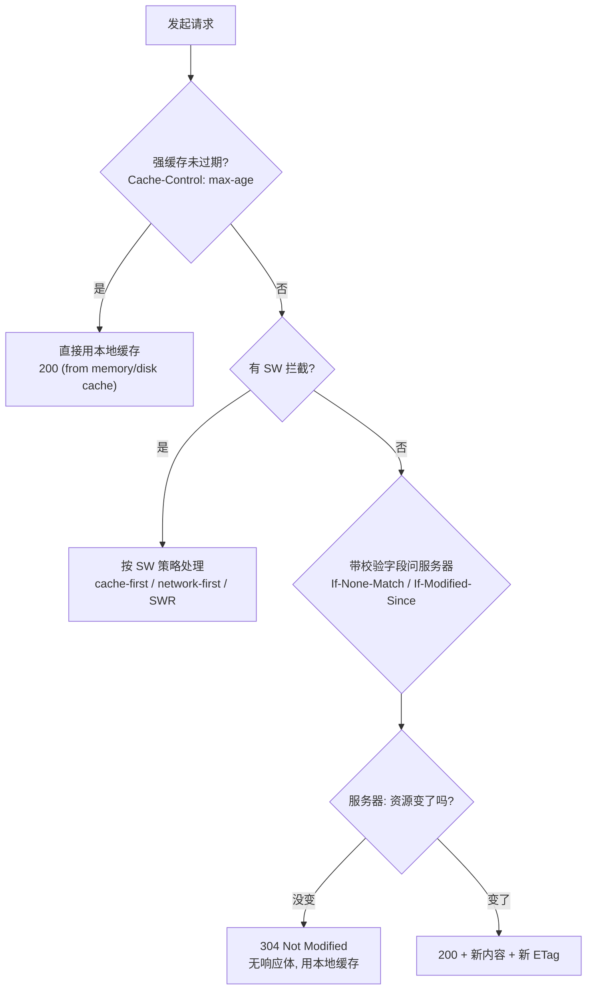
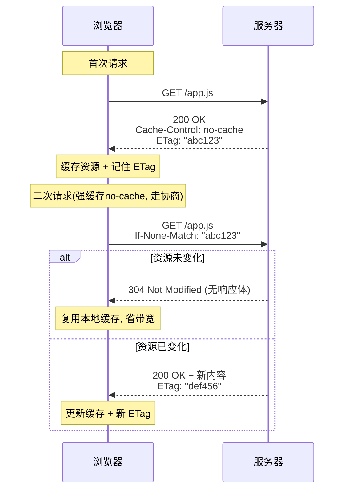

# 05 · 缓存策略组合（Caching Strategy）

> 用「HTTP 缓存 + Service Worker 缓存」组合，让静态资源秒开、数据接口尽量新，并做到断网也能访问。

## 📖 知识讲解

### 一、浏览器缓存的层次（从快到慢）

浏览器拿一个资源时，会按顺序找这些"仓库"，命中就不往下走：

| 层次 | 说明 | 特点 |
|------|------|------|
| **Memory Cache**（内存缓存） | 存在标签页进程内存里 | 最快，秒开；标签页关闭即失效 |
| **Service Worker Cache** | 你用 Cache API 手动控制 | 可编程、可离线、跨会话持久 |
| **Disk Cache**（磁盘缓存） | 存在磁盘，受 HTTP 缓存头控制 | 持久，容量大，比内存慢 |
| **Push Cache** | HTTP/2 Server Push，会话级 | 少用，只在当前连接有效 |
| 网络请求 | 以上都没命中才真正发请求 | 最慢 |

> DevTools 的 Network 面板里，`Size` 列显示 `(memory cache)` / `(disk cache)` / `(ServiceWorker)` 就能看出命中的是哪一层。

### 二、HTTP 缓存：强缓存 vs 协商缓存

浏览器发请求前，先判定**强缓存**；强缓存失效再走**协商缓存**：

1. **强缓存（不发请求，直接用本地）**
   - `Cache-Control: max-age=31536000`：资源在 N 秒内都算新鲜，直接用缓存，**不发请求**（状态码 200 from cache）。
   - `Cache-Control: immutable`：告诉浏览器"这文件永不改变"，连刷新都不重新校验（配合内容 hash 文件名）。
   - 旧的 `Expires`（绝对时间）已被 `Cache-Control`（相对时间）取代。

2. **协商缓存（发请求问服务器"变了没"）**
   - 强缓存过期后，浏览器带上校验字段问服务器：
     - `If-None-Match: "<ETag 值>"`（对应响应头 `ETag`，内容指纹，最准）
     - `If-Modified-Since: <时间>`（对应响应头 `Last-Modified`，精度到秒）
   - 服务器若发现没变 → 返回 **304 Not Modified**（**无响应体**，省带宽），浏览器继续用本地缓存。
   - 若变了 → 返回 **200 + 新内容 + 新 ETag**。

### 三、`Cache-Control` 常用指令

| 指令 | 含义 |
|------|------|
| `max-age=秒` | 强缓存有效期 |
| `no-cache` | **每次都走协商缓存**（可以存，但用前必须问服务器） |
| `no-store` | 完全不缓存（敏感数据用） |
| `immutable` | 有效期内连协商都免了，永不校验 |
| `must-revalidate` | 一旦过期，必须去服务器校验，不能用陈旧副本 |
| `public` / `private` | 是否允许 CDN 等中间代理缓存 |

### 四、带 hash 文件名的长缓存策略（cache busting）

工程化构建（Webpack/Vite）会给文件名加内容 hash：`app.3f9a2b.js`。

- 对这类文件设 `Cache-Control: max-age=31536000, immutable`（缓存一年）。
- 内容一变，hash 变，文件名变，浏览器把它当成**全新 URL** 去请求 → 天然避免"改了没更新"。
- 而 `index.html` 用 `no-cache`（每次协商），保证它引用的永远是最新的 hash 文件名。这就是"HTML 不缓存、带 hash 资源永久缓存"的经典组合。

### 五、Service Worker 三种运行时缓存策略

Service Worker 拦截请求后，可以自己决定去缓存还是去网络：

| 策略 | 流程 | 适用 |
|------|------|------|
| **cache-first**（缓存优先） | 先查缓存，命中就返回；没有再走网络并写回 | 静态资源（带 hash，几乎不变），追求秒开 + 离线 |
| **network-first**（网络优先） | 先走网络，成功就返回并更新缓存；断网再退回缓存 | 数据接口，要尽量新，但断网也能看旧数据 |
| **stale-while-revalidate**（陈旧内容 + 后台更新） | 立即返回缓存（快），同时后台悄悄请求网络更新缓存，下次用新的 | 头像、列表等"允许短暂陈旧"的内容，兼顾速度与新鲜 |

## 🔄 流程图 / 原理图

### 图 1：一个请求命中缓存的决策流程



### 图 2：协商缓存 304 时序（sequenceDiagram）



## 💻 代码说明（优化前 vs 优化后）

**优化前：没有缓存策略**
- 每次访问、每个资源都真正走网络（哪怕内容没变）。
- 断网 = 白屏，什么都打不开。

**优化后：SW 分流缓存**（见 `sw.js`）
- `install` 时预缓存应用外壳（`index.html` / `app.js` / `style.css`）。
- `fetch` 拦截里按 URL 分流：
  - 路径含 `/api/` → `networkFirst()`：在线拿最新数据并更新缓存，断网退回缓存。
  - 其余静态资源 → `cacheFirst()`：命中缓存秒开，未命中才走网络。
- `activate` 时按 `CACHE_VERSION` 清理旧缓存桶。

关键差异点在 `sw.js`：

```js
// cache-first：先缓存后网络
const cached = await cache.match(request);
if (cached) return cached;              // 命中 → 秒开、离线可用

// network-first：先网络后缓存
try {
  const response = await fetch(request); // 在线 → 拿最新
  cache.put(request, response.clone());
  return response;
} catch {
  return cache.match(request, { ignoreSearch: true }); // 断网 → 退回缓存
}
```

`app.js` 里 `response.clone()` 是必须的——`Response` 的 body 是流，只能读一次，一份返回给页面、一份写进缓存。

## ▶️ 运行方式

> ⚠️ Service Worker 要求**同源 + http(s) 协议**（localhost 例外允许 http）。**用 `file://` 直接双击打开 HTML 会注册失败**，必须起一个本地服务器。

在本模块目录下任选一条命令：

```bash
# 方式一：Node（需要装 Node）
npx serve .
# 然后浏览器打开终端提示的地址，如 http://localhost:3000

# 方式二：Python3（Mac 自带）
python3 -m http.server 8080
# 浏览器打开 http://localhost:8080
```

**体验步骤：**
1. 打开页面 → 看到 "Service Worker 注册成功"。
2. **刷新一次**页面（让 SW 开始接管请求）。
3. 点「请求数据（/api/time）」→ 日志显示在线拿到数据。
4. 打开 DevTools → Network → 勾选 **Offline**（模拟断网）。
5. 再点「请求数据」→ 日志显示"离线退回"上次缓存的数据。
6. 再点「刷新页面」→ 页面样式/脚本仍在，**离线依然能访问**（cache-first 生效）。

## ⚠️ 常见坑 / 最佳实践

- **`file://` 注册不了 SW**：必须 http(s) 或 localhost。忘了这点会一直报注册失败。
- **SW 更新不生效**：浏览器对 `sw.js` 本身也有缓存/更新机制，新 SW 默认要等旧页面全部关闭才激活。开发时用 `skipWaiting()` + `clients.claim()`，或 DevTools → Application → Service Workers 勾 "Update on reload"。
- **改了缓存内容要升版本号**：改 `CACHE_VERSION`，让 `activate` 清掉旧桶，否则用户一直吃旧缓存。
- **`no-cache` ≠ 不缓存**：它是"每次都协商校验"；真正不缓存是 `no-store`。别记混。
- **只缓存 GET**：POST/PUT 有副作用，不要放进 Cache API。
- **带 hash 的资源才配 `immutable` 长缓存**；`index.html` 千万别设长强缓存，否则用户永远拿不到新版本。
- **HTTPS 才有意义**：生产环境 SW 只在 HTTPS 下可用（localhost 除外）。

## 🔗 官方文档

- [MDN · HTTP 缓存](https://developer.mozilla.org/zh-CN/docs/Web/HTTP/Caching)
- [MDN · Cache-Control](https://developer.mozilla.org/zh-CN/docs/Web/HTTP/Headers/Cache-Control)
- [MDN · Service Worker API](https://developer.mozilla.org/zh-CN/docs/Web/API/Service_Worker_API)
- [MDN · Cache API](https://developer.mozilla.org/zh-CN/docs/Web/API/Cache)
- [web.dev · Service Worker 缓存策略](https://web.dev/articles/offline-cookbook)
- [web.dev · HTTP 缓存](https://web.dev/articles/http-cache)
