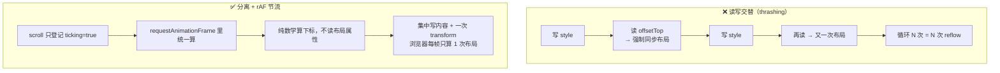

# 06 · 渲染性能（Rendering Performance）

> 页面「加载完之后」的流畅度问题：DOM 节点太多、滚动/交互时反复触发布局，会让主线程忙于回流重绘，动画卡顿、点击迟钝。核心手段是**长列表虚拟化**、**避免 Layout Thrashing（强制同步布局）**、以及**防抖节流 + 只改合成层属性**。渲染卡顿主要拖累 **INP**。

## 📖 知识讲解

### 一、先分清：回流 Reflow vs 重绘 Repaint vs 仅合成 Composite

浏览器把 DOM 变成像素要走一条流水线：**布局 Layout → 绘制 Paint → 合成 Composite**。你改动了什么，决定要从哪一步开始重来，成本天差地别：

| 改动的属性 | 触发 | 成本 | 例子 |
| --- | --- | --- | --- |
| 几何属性（宽高、位置、字体） | **回流 Reflow**（重算布局）→ 重绘 → 合成 | 🔴 最贵 | `width`、`top`、`left`、`height`、`display` |
| 仅外观属性 | **重绘 Repaint**（跳过布局）→ 合成 | 🟠 中 | `color`、`background`、`box-shadow` |
| 变换/透明度 | **仅合成 Composite**（走 GPU，不碰布局绘制） | 🟢 最便宜 | `transform`、`opacity` |

> ⚠️ 这就是「用 `transform: translate` 做动画，而不是改 `top/left`」的本质：把动画从「布局+绘制+合成」**降级到只有合成**。本 demo 的虚拟列表就用 `transform: translateY` 定位可见窗口。

### 二、Layout Thrashing（布局抖动 / 强制同步布局）

浏览器很聪明：它会把你连续的多次样式修改**攒起来，在一帧里只算一次布局**。但如果你「写一下样式，紧接着读一个布局属性」，浏览器为了返回**正确**的值，被迫**立即同步重算布局**——这叫 forced synchronous layout。在循环里「写→读→写→读」，就是 N 次布局，性能雪崩。

会触发强制同步布局的「读」操作（部分）：`offsetTop/Left/Width/Height`、`clientWidth/Height`、`scrollTop`、`getComputedStyle()`、`getBoundingClientRect()`。

**修复：先集中读、再集中写**（读写分离），或把写操作放进 `requestAnimationFrame` 对齐到下一帧。

### 三、长列表虚拟化（Virtual List）

一万个 DOM 节点，成本在**内存 + 布局 + 绘制**三重。虚拟化的核心洞察：**用户一次只能看到十几行**，所以只渲染「可视区 + 上下 buffer」约 20~30 个真实节点即可：

- 用一个**撑高的占位元素**（高度 = 总条数 × 行高）撑出正确的滚动条比例，让浏览器以为「真的有一万条」。
- 滚动时用纯数学 `startIndex = floor(scrollTop / 行高)` 算出该显示哪一段，**复用**同一批节点、只替换内容，再用 `transform: translateY` 把这批节点平移到正确位置。

DOM 节点数从 10000 降到约 30，布局/绘制成本几乎与数据量无关（近似恒定）。

### 四、防抖 Debounce vs 节流 Throttle

`scroll`/`resize`/`input` 是高频事件，一次滚动能触发几十次回调。若每次都干重活会淹没主线程：

| 手段 | 行为 | 适用 |
| --- | --- | --- |
| **防抖 Debounce** | 只在「停止触发 N ms 后」执行**一次** | 搜索联想、`resize` 结束后重算 |
| **节流 Throttle** | 固定间隔最多执行一次（本 demo 用 `requestAnimationFrame` 节流，对齐到每帧约 16.6ms） | 滚动位置计算、按钮防连点 |

本质都是**降低高频回调对主线程的占用频率**，间接改善 INP。

### 五、为什么主要影响 INP

主线程是单线程：JS、样式计算、布局、绘制、响应交互都排在同一个队列，每帧只有约 **16.6ms** 预算。一次大量 reflow 或一次性插入上万节点，会形成 **长任务（>50ms）** 霸占主线程——这期间用户的点击只能排队，输入延迟飙升，**INP 变差**。减少节点、消除强制同步布局、节流高频回调，就是在给主线程「减负」。

## 🔄 流程图 / 原理图

**虚拟化：只渲染可视区**

```mermaid
flowchart TD
    A["10000 条数据"] --> B["占位元素撑高<br/>height = 10000 × 行高<br/>（撑出正确滚动条）"]
    B --> C["监听 scroll"]
    C --> D["纯数学算起点<br/>startIndex = floor(scrollTop / 行高) - buffer"]
    D --> E["只更新可视区 + buffer<br/>约 20~30 个复用节点的内容"]
    E --> F["window 整体 transform: translateY(startIndex × 行高)<br/>（走合成层，不触发布局）"]
    F --> C
```



**Layout Thrashing vs 批量读写**



## 💻 代码说明

三个共用文件：`probe.css`（外壳 + 探针样式）、`probe.js`（计数器 + FPS 探针）、以及 `before.html` / `after.html` 各自的业务脚本。探针固定在左上角：**旋转方块** 由 CSS 动画驱动、**计数器**每 100ms +1、**FPS** 用 `requestAnimationFrame` 统计——主线程被阻塞时三者一起「僵住」，直观暴露卡顿。

**优化前 vs 优化后差异**

| 维度 | `before.html`（未优化） | `after.html`（已优化） | 影响 |
| --- | --- | --- | --- |
| DOM 节点数 | 一次性插入 **10000** 个 | 始终只有 **~30** 个（可视区 + buffer），复用 | 内存/布局/绘制成本 |
| 长列表策略 | 全量渲染 | 虚拟化，占位元素撑高 + `translateY` 定位 | 长任务 → INP |
| 滚动处理 | **无节流**，每次 scroll 全量跑 | `requestAnimationFrame` 节流，每帧最多一次 | 回调频率 → INP |
| 读写方式 | 循环内「写→读 `offsetTop`→写」→ **强制同步布局** | 纯数学算下标，读写分离，不读布局属性 | Reflow 次数 |
| 定位方式 | `class` 高亮触发布局 | `transform: translateY` 走**合成层** | 回流 → 合成 |
| 滚动时 FPS | 掉到个位数、方块僵住 | 稳定约 **60**、方块照转 | 体感流畅度 |

关键差异（`after.html` 的节流与纯数学定位）：

```js
// rAF 节流：一帧内多次 scroll 只渲染一次
let ticking = false;
listWrap.addEventListener('scroll', () => {
  if (ticking) return;
  ticking = true;
  requestAnimationFrame(() => { render(); ticking = false; });
});

// 纯数学算起点，不读任何布局属性（零 reflow）
const startIndex = Math.max(0, Math.floor(scrollTop / ROW_H) - BUFFER);
viewport.style.transform = `translateY(${startIndex * ROW_H}px)`; // 走合成层
```

## ▶️ 运行方式

免构建，浏览器**直接双击**打开即可（`file://` 下正常工作）：

```bash
cd 23-performance-optimization/06-rendering-performance
# 直接双击 before.html / after.html，或起本地服务器：
python3 -m http.server 8080
# 打开 http://localhost:8080/before.html 和 after.html
```

观察方法：
1. 打开 `before.html`，点「渲染 10000 条」→ 插入瞬间探针卡一下；随后**快速滚动**列表，方块几乎僵住、FPS 掉到个位数。
2. 打开 `after.html`，同样操作，探针全程约 60 FPS。打开 **DevTools → Elements** 看列表容器，里面**始终只有约 30 个 `.row` 节点**。
3. 进阶：**DevTools → Performance** 录制滚动过程，`before` 会看到大量紫色 `Layout` 长条和红色长任务标记，`after` 几乎没有。

## ⚠️ 常见坑 / 最佳实践

- **在写操作后读布局属性 = 强制同步布局**：循环里读 `offsetHeight`/`getBoundingClientRect()` 是头号杀手。要读就**先一次性读完**再统一写。
- **动画用 `transform`/`opacity`，别用 `top/left`/`width`**：前者只走合成层，后者每帧回流。
- **虚拟列表定高最简单**：不定高需要测量每行高度并缓存（动态虚拟化），复杂度陡增；能定高就定高。
- **buffer 太小会露白**：快速滚动时可视区还没来得及填充。上下各留几行 buffer 兜底。
- **别忘了 `resize`**：窗口变化会改变可视区行数，需重新计算（同样节流）。
- **节流别用固定 `setTimeout`**：`requestAnimationFrame` 天然对齐浏览器绘制节奏，比拍脑袋定的间隔更贴合渲染。
- **减少节点本身也是优化**：不止长列表，深层嵌套、大量隐藏节点都增加布局成本。
- **`will-change: transform` 适度用**：提示浏览器提前提升合成层，但滥用会吃显存，只给真正频繁变换的元素加。

## 🔗 官方文档

- INP（交互到下次绘制）：https://web.dev/articles/inp
- 优化长任务：https://web.dev/articles/optimize-long-tasks
- 避免大型复杂布局与布局抖动：https://web.dev/articles/avoid-large-complex-layouts-and-layout-thrashing
- 只用合成层属性做动画：https://web.dev/articles/animations-guide
- 浏览器渲染原理（MDN）：https://developer.mozilla.org/en-US/docs/Web/Performance/How_browsers_work
- 回流 Reflow（MDN 术语表）：https://developer.mozilla.org/en-US/docs/Glossary/Reflow
- 重绘 Repaint（MDN 术语表）：https://developer.mozilla.org/en-US/docs/Glossary/Repaint
- requestAnimationFrame（MDN）：https://developer.mozilla.org/zh-CN/docs/Web/API/Window/requestAnimationFrame
- 防抖与节流（MDN 术语表 Debounce）：https://developer.mozilla.org/en-US/docs/Glossary/Debounce
