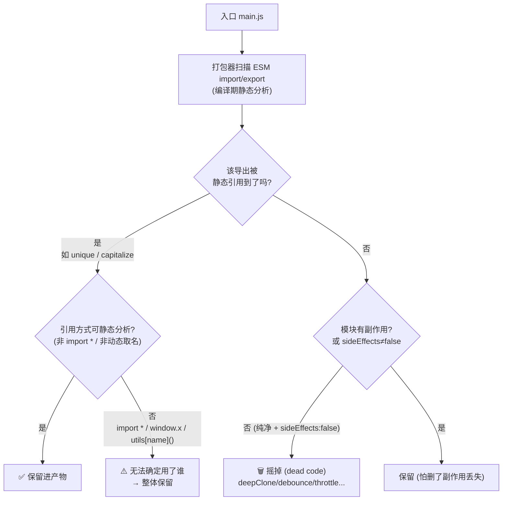

# 07 · 打包体积优化：Tree-Shaking / 按需引入 / 体积分析（Bundle Optimization）

> 从「打进产物的字节」入手：靠 Tree-Shaking 摇掉没用到的代码、用「按需引入」替代整包引入、再用体积可视化工具量化每个模块的真实网络成本，直接减小 JS 传输体积、改善 LCP 与首屏可交互时间。

## 📖 知识讲解

页面下载的 JS 越多，浏览器解析 / 编译 / 执行的时间越长，主线程越容易被拖住。**打包体积优化 = 只把「真正会跑到的代码」发给用户**。核心有三招：Tree-Shaking、按需引入、体积分析。

### 一、Tree-Shaking 的静态本质：为什么它依赖 ESM

Tree-Shaking（摇树）指打包器从入口出发，标记「活着的」导出，把**没有任何人引用**的导出当作**死代码（dead code）删除**。它能成立的前提，是 **ES Module（`import` / `export`）的静态结构**：

- **ESM 是静态的**：`import { a } from './lib'` 里，引入了谁、在哪一行引入，**编译期就能确定**，无需运行代码。于是打包器可以画出精确的「谁用了谁」的依赖图，安全地删掉没被指到的分支。
- **CommonJS 是动态的**：`const lib = require('./lib')` 的 `require` 是一个**运行时函数调用**，`require(变量)`、`module.exports = 条件 ? A : B` 这些写法都要等真正执行才知道结果。打包器无法在编译期静态分析，**只能整包保留**，摇不动。

> 结论：想让代码可被 Tree-Shake，源码和依赖库都要用 **ESM**。这也是社区推 `lodash-es`、各库出 `esm` 构建产物的根本原因。

### 二、副作用（side effects）与 `"sideEffects": false`

即使某个导出没被引用，打包器也**不敢**贸然删除——因为这个模块**被 import 的动作本身**可能产生「副作用」：

- 典型副作用：全局样式 `import './global.css'`、注册 polyfill、给 `window`/`prototype` 打补丁、执行了带 I/O 的顶层语句。
- 打包器的顾虑：万一删了这个模块，副作用也没了，程序行为就变了。所以**默认保守，倾向保留**。

`package.json` 里的 `"sideEffects": false` 就是开发者给打包器的**一句承诺**：「本包所有模块都是纯净的、无副作用的，未被引用的尽管删」。本 demo 的 `package.json` 正是这么声明的。

如果包里确实有个别带副作用的文件，就用**白名单数组**列出来，其余仍可安全摇树：

```jsonc
{
  // 只有这两类文件有副作用，别删；其余模块随便摇
  "sideEffects": ["*.css", "./src/polyfill.js"]
}
```

### 三、按需引入 vs 整包引入（以 lodash 为例）

对「聚合式大库」（lodash / antd / element-plus / rxjs 等），**引入方式**直接决定体积能不能被裁掉：

| 写法 | 代码 | 结果 |
| --- | --- | --- |
| ❌ 整包引入 | `import _ from 'lodash'` → `_.debounce(fn)` | lodash 是 **CommonJS**、默认导出是一个巨大聚合对象。很多配置下即使只用 `debounce`，也会把 **~70KB(min)** 的整个 lodash 打进来 |
| ✅ 子路径按需引入 | `import debounce from 'lodash/debounce'` | 只引入 `debounce` 这一个模块文件，体积从 ~70KB 降到 **~2KB** 量级 |
| ✅ ESM 版替代 | `import { debounce } from 'lodash-es'` | `lodash-es` 是天生 ESM，配合 `"sideEffects": false` 可被打包器**精确裁剪** |

> 记忆点：**大库优先用「子路径导入」或其 ESM 版本 + 官方按需插件**，避免 `import _ from 'lodash'` 这种整包引入。

### 四、体积可视化分析：gzip / brotli 才是真实网络成本

优化不能靠猜，要**量化**。本 demo 用 `rollup-plugin-visualizer` 在 build 后生成一张交互式 treemap（`dist/stats.html`），每个模块占多大一目了然。

一个关键认知：**磁盘上的原始体积没有意义**。浏览器通过网络下载的是**压缩后**的字节——服务器一般用 gzip 或 brotli 压缩文本资源，这才是「网络真实成本」，也是我们真正要盯的数字。所以 visualizer 配置里开了 `gzipSize: true` 和 `brotliSize: true`，让体积图直接显示压缩后的大小。

## 🔄 流程图 / 原理图

Tree-Shaking 的「保留 / 裁剪」判定（对照本 demo 的 `utils.js`）：



## 💻 代码说明

demo 提供两个入口，`utils.js` 导出 7 个函数（`unique` / `capitalize` / `deepClone` / `debounce` / `throttle` / `formatThousands` / `randomColor`），但业务其实只用到前两个。区别只在**引入写法**：

- **`main-bad.js`（未优化）**：`import * as utils from './utils.js'` 命名空间导入，然后 `window.utils = utils` 挂全局、`utils[dynamicName]()` 动态取名调用。打包器无法确定哪些成员会被 `utils[x]()` 用到，只能**全部保留**——7 个函数全进产物。
- **`main-good.js`（已优化）**：`import { unique, capitalize } from './utils.js'` 具名按需导入，不挂全局、不动态取名。一切都是编译期可分析的静态引用，剩下 5 个未引用函数被**彻底 tree-shake**。

### 优化前 vs 优化后 差异表

| 维度 | `main-bad.js`（优化前） | `main-good.js`（优化后） | 影响 |
| --- | --- | --- | --- |
| 引入方式 | `import * as utils`（命名空间整包） | `import { unique, capitalize }`（具名按需） | 决定可否静态分析 |
| 是否挂全局 | `window.utils = utils`（暴露整个命名空间） | 不挂全局 | 挂全局 → 打包器必须假设都会被用 |
| 是否动态取名 | `utils[dynamicName]()`（运行期才知调谁） | 全为静态直接调用 | 动态取名 → 无法裁剪 |
| 未用函数命运 | `deepClone/debounce/throttle/...` **全部保留** | 5 个未用函数**被摇掉** | 产物体积拉开差距 |
| `stats.html` 表现 | utils 模块整块进产物 | utils 只剩 `unique`+`capitalize` | gzip/brotli 后仍能看出差 |

> 说明：`vite.config.js` 里特意设了 `minify: false`，方便你在 `dist` 里用肉眼确认「未用函数是否真的被删掉了」；真实项目请保持默认 `minify: 'esbuild'`，否则体积偏大。两个入口 `bad` / `good` 各自独立打包，便于对比。

## ▶️ 运行方式

本模块用 **Vite 5.x** 脚手架，需要构建（以下命令只需照抄执行，勿在本仓库自动跑）：

```bash
cd 23-performance-optimization/07-bundle-optimization
npm install
npm run build          # 生产构建，底层用 Rollup 做 tree-shaking
# 构建完成后，用浏览器打开体积可视化图：
open dist/stats.html   # 对比 bad / good 两个产物里 utils 各自占多大
```

- 也可以 `npm run dev` 起开发服务器，浏览器打开 `index-bad.html` / `index-good.html` 看页面效果。
- 看 `stats.html` 时切换到 **gzip / brotli** 视图，关注**压缩后**体积——那才是网络真实成本。
- 在 `bad` 产物里能找到 `deepClone`/`debounce` 等函数体，`good` 产物里则**找不到**它们，这就是 tree-shaking 生效的直接证据。

## ⚠️ 常见坑 / 最佳实践

- **`import * as x` 会阻断摇树**：一旦把命名空间整体传给别处、挂全局或动态 `x[name]()`，打包器只能整包保留。优先具名按需导入。
- **CommonJS 包摇不动**：`require` 是运行时动态的，无法静态分析。想被裁剪就用库的 **ESM 版本**（如 `lodash-es`）。
- **副作用没声明就删不掉**：库作者应正确设置 `"sideEffects"`；有全局 CSS / polyfill 的文件要用白名单数组列出，别一刀切写 `false`。
- **别看磁盘原始体积**：要看 **gzip / brotli 压缩后**的大小，那才是用户实际下载的字节。
- **大库整包引入是体积杀手**：`import _ from 'lodash'`、`import antd` 全量引入动辄几十上百 KB，改用子路径导入或官方按需方案。
- **minify 会掩盖差异观察**：教学时关掉 minify 好用肉眼验证；上线务必开启压缩，否则产物虚大。
- **动态 `import()` 是另一回事**：那是「代码分割 / 懒加载」（见模块 04），把代码切成按需下载的 chunk；tree-shaking 是「删掉根本不用的代码」，两者互补。

## 🔗 官方文档

- 用 Tree-Shaking 减少 JS 体积（web.dev）：https://web.dev/articles/reduce-javascript-payloads-with-tree-shaking
- Rollup Tree-Shaking 文档：https://rollupjs.org/introduction/#tree-shaking
- Vite · 构建生产版本（底层用 Rollup）：https://vitejs.dev/guide/build.html
- MDN · `import` 语句：https://developer.mozilla.org/zh-CN/docs/Web/JavaScript/Reference/Statements/import
- MDN · `export` 语句：https://developer.mozilla.org/zh-CN/docs/Web/JavaScript/Reference/Statements/export
- webpack · `sideEffects` 说明：https://webpack.js.org/guides/tree-shaking/#mark-the-file-as-side-effect-free
- rollup-plugin-visualizer：https://github.com/btd/rollup-plugin-visualizer
