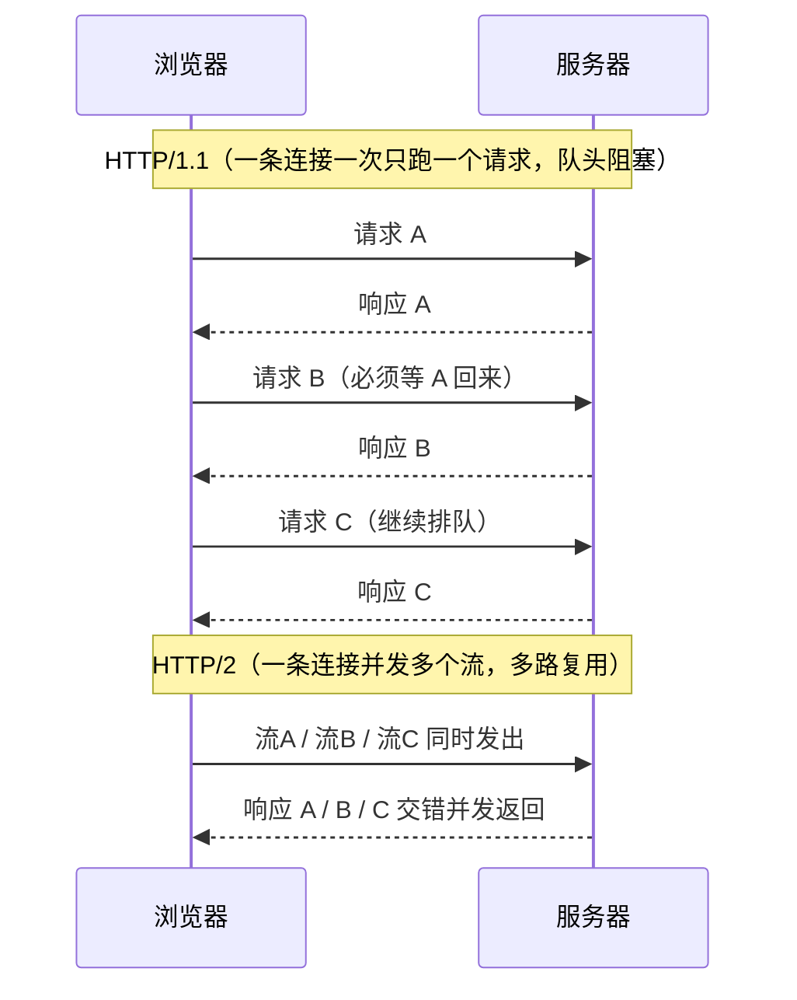
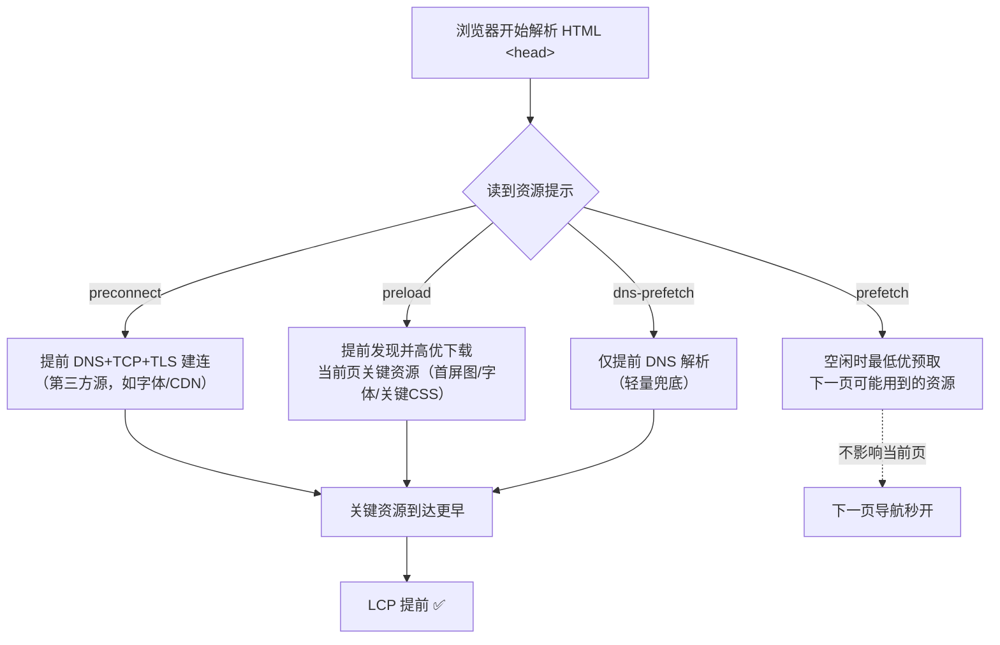

# 08 · 网络优化（Network Optimization）

> 加载阶段的「传输层」优化：用 **HTTP/2 多路复用**消除队头阻塞、用 **CDN** 就近分发、用 **四种资源提示（Resource Hints）**把「建连」和「资源发现」提前。目标是让关键资源更早、更快地到达浏览器——直接改善 **LCP**。

## 📖 知识讲解

### 一、HTTP/1.1 队头阻塞 vs HTTP/2 多路复用

- **HTTP/1.1**：一条 TCP 连接同一时刻只能处理**一个**请求-响应，后面的请求必须排队（**队头阻塞 Head-of-Line Blocking**）。浏览器为此对同一域名最多开 **6 条**连接，还催生了「域名分片」这种把资源拆到多个子域来骗取更多连接的做法。
- **HTTP/2**：在**一条** TCP 连接上用「流（stream）」并发传输多个请求，互不阻塞（**多路复用 Multiplexing**）。还带来头部压缩（HPACK）、服务端推送（已基本废弃）、请求优先级。**此时域名分片反成反优化**——多连接反而增加建连成本、削弱多路复用。
- **HTTP/3 (over QUIC)**：把传输层从 TCP 换成基于 **UDP 的 QUIC**。HTTP/2 虽解决了「应用层」队头阻塞，但一旦 TCP 丢包，整条连接的所有流都要等重传（**TCP 层队头阻塞**）。QUIC 的流相互独立，一个流丢包不拖累其他流；还把 TLS 握手并入连接建立，`0-RTT`/`1-RTT` 更快建连、且支持连接迁移（切 Wi-Fi/4G 不断连）。

### 二、CDN：就近 + 边缘缓存

CDN（内容分发网络）在全球部署边缘节点。用户请求被调度到**地理/网络上最近**的节点：

- **就近**：缩短物理距离 → 更低 RTT（往返时延）→ 更快建连和传输。
- **边缘缓存**：静态资源缓存在边缘节点，命中则直接由边缘返回，不回源站，既快又减轻源站压力。
- 叠加 HTTP/2、TLS 会话复用、Brotli 等，CDN 是「首字节时间 TTFB」优化的关键一环。

### 三、四种资源提示（Resource Hints）

浏览器默认要「解析到用它的地方」才发现一个资源、才现用现建连。资源提示让你**提前**做这两件事：

| 提示 | 作用 | 何时用 | 优先级 |
| --- | --- | --- | --- |
| `preconnect` | 提前完成 **DNS + TCP + TLS** 建连 | 确定会用的第三方源（字体、CDN、API） | 建连，不下资源 |
| `dns-prefetch` | 只提前做 **DNS 解析**（preconnect 的轻量兜底） | 不确定是否会用、或作老浏览器降级 | 最轻 |
| `preload` | 提前**发现并下载**当前页**关键**资源 | 被 CSS/JS 藏起来的关键资源（字体、首屏图、关键 CSS） | 高 |
| `prefetch` | 预取**下一页/下一步**可能用的资源 | 预测用户下一步导航 | 最低（空闲时） |

> ⚠️ **preload vs prefetch 是最容易混的**：`preload` = **当前页**马上要用，高优先级、必然下载；`prefetch` = **未来**可能用，最低优先级、浏览器空闲才下、不影响当前页。用错会适得其反（prefetch 当前页关键资源会太晚，preload 未来资源会抢首屏带宽）。

### 四、preload 的写法要点

- 必须写 **`as`**（`image`/`style`/`script`/`font`…）：它决定请求的优先级和 `Accept` 头，写错或不写会被浏览器忽略甚至重复下载。
- **字体的 preload 必须加 `crossorigin`**：字体是匿名跨源请求，漏写会导致下载两次。
- 可配合 **`fetchpriority="high"`** 进一步抬高首屏 LCP 图/资源的优先级；`fetchpriority="low"` 则给非关键资源让路。
- preload 了就要**真的用**，否则控制台会警告「资源被 preload 但未使用」，纯属浪费带宽。

### 五、Resource Timing API

`PerformanceObserver` 监听 `'resource'` 条目（`PerformanceResourceTiming`），能拿到每个资源的完整时间线：`domainLookup(DNS)` → `connect(TCP/TLS)` → `request` → `response`，以及 `transferSize`（实际传输字节，命中缓存为 0）。本 demo 用它把资源耗时列成表格。

## 🔄 流程图 / 原理图

**HTTP/1.1 队头阻塞 vs HTTP/2 多路复用**



**四种资源提示在加载时间线上的作用**



## 💻 代码说明

`before.html` 不用任何提示；`after.html` 在 `<head>` 演示四种提示 + `fetchpriority`。两页都动态加载同一组本地资源（`assets/hero.svg`、`assets/theme.css`、`assets/widget.js`），并用共用的 `net-observer.js`（`PerformanceObserver('resource')`）把每个资源的 DNS/TCP/TTFB/总耗时列到页面表格里。

**优化前 vs 优化后差异**

| 维度 | `before.html`（未优化） | `after.html`（已优化） | 影响指标 |
| --- | --- | --- | --- |
| 连接建立 | 现用现建（解析到才 DNS+TCP+TLS） | `preconnect`/`dns-prefetch` **提前建连** | LCP / TTFB |
| 关键资源发现时机 | 等 CSS/JS 解析到才发现 | `preload` 在 `<head>` **提前发现** | LCP |
| 首屏图优先级 | 默认优先级、发现晚 | `preload as=image` + `fetchpriority="high"` | LCP |
| 未来资源 | 无 | `prefetch` 空闲时低优预取下一页 | 下一页导航 |
| 字体 preload | — | 演示 `as=font` + **`crossorigin`**（避免重复下载） | LCP / CLS |

关键差异（`after.html` 的 `<head>` 提示）：

```html
<link rel="preconnect" href="https://fonts.gstatic.com" crossorigin />   <!-- 提前建连 -->
<link rel="dns-prefetch" href="https://fonts.gstatic.com" />             <!-- 轻量兜底 -->
<link rel="preload" as="image" href="./assets/hero.svg" fetchpriority="high" /> <!-- 首屏图，高优先级 -->
<link rel="preload" as="style" href="./assets/theme.css" />              <!-- 关键 CSS 提前发现 -->
<link rel="prefetch" href="./assets/widget.js" as="script" />            <!-- 下一页可能用，空闲预取 -->
```

## ▶️ 运行方式

免构建，浏览器直接打开即可：

```bash
cd 23-performance-optimization/08-network-optimization
# 推荐用本地服务器（Network 面板能看到真实请求与优先级）：
python3 -m http.server 8080
# 打开 http://localhost:8080/before.html 和 after.html
```

观察方法：
1. **资源提示**：可在 `file://` 或本地服务器打开后，于 **DevTools → Network** 面板观察——对比 `before`/`after` 里 `hero.svg` 的 **Priority** 列与发起时机；`after` 的 `theme.css`/`widget.js` 因被 preload 更早出现；preconnect 的第三方源在连接阶段提前完成握手。
2. **Resource Timing**：页面底部表格实时列出每个资源的 DNS/TCP/TTFB/总耗时（`file://` 下 `transferSize` 可能为 0，用本地服务器更准）。
3. **HTTP/2 多路复用**：**无法离线真实复现**——需把站点部署到支持 h2 的服务器/CDN，才能在 Network 面板右键调出 **Protocol** 列看到 `h2`（HTTP/3 则显示 `h3`），并观察同一连接上多请求并发。本地 `python3 -m http.server` 是 HTTP/1.1。

## ⚠️ 常见坑 / 最佳实践

- **别混淆 preload / prefetch**：preload = 当前页关键资源（高优、必下）；prefetch = 未来资源（最低优、空闲下）。
- **字体 preload 必须 `crossorigin`**：漏写会下载两次，白白浪费。
- **preload 必须写正确的 `as`**：写错优先级不对，甚至被忽略或重复请求。
- **preload 了就要用**：未使用会触发控制台警告并浪费带宽。
- **preconnect 别滥用**：每个 preconnect 都占用建连资源，只给「确定会用」的少数关键第三方源用（一般 ≤ 4 个）。
- **HTTP/2 下别再做域名分片**：多连接反而削弱多路复用、增加建连开销。
- **首屏 LCP 图别 `loading="lazy"`**：lazy 只给首屏外资源；首屏图要 `fetchpriority="high"`。
- **资源提示不是银弹**：它只优化「发现/建连时机」，减小体积（模块 03）、缓存（模块 05）同样重要。

## 🔗 官方文档

- 预加载关键资源 `preload`：https://web.dev/articles/preload-critical-assets
- `preconnect` 与 `dns-prefetch`：https://web.dev/articles/preconnect-and-dns-prefetch
- 用 `prefetch` 预取资源：https://web.dev/articles/link-prefetch
- `fetchpriority` 资源优先级：https://web.dev/articles/fetch-priority
- MDN `rel=preload`：https://developer.mozilla.org/zh-CN/docs/Web/HTML/Attributes/rel/preload
- MDN `rel=preconnect`：https://developer.mozilla.org/zh-CN/docs/Web/HTML/Attributes/rel/preconnect
- MDN Resource Timing API：https://developer.mozilla.org/zh-CN/docs/Web/API/Performance_API/Resource_timing
- HTTP/2（MDN 术语表）：https://developer.mozilla.org/zh-CN/docs/Glossary/HTTP_2
- HTTP/3（MDN 术语表）：https://developer.mozilla.org/en-US/docs/Glossary/HTTP_3
