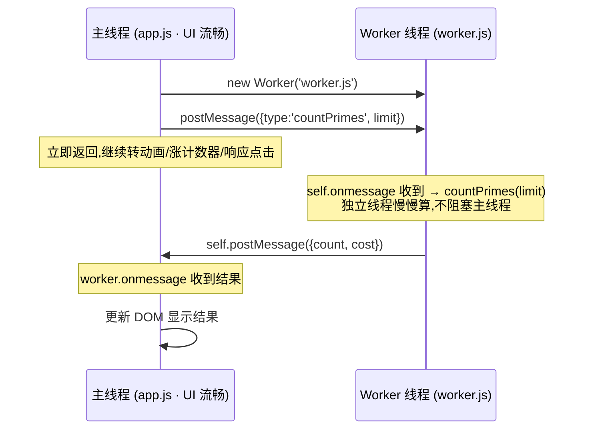
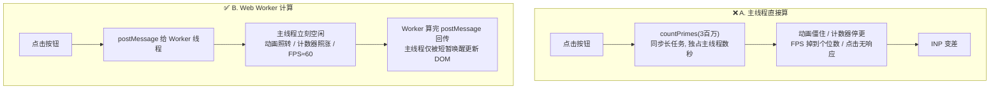

# 09 · 运行时优化：Web Worker 卸载长任务（Runtime · Web Worker）

> JS 主线程是单线程的，一段 CPU 密集计算会变成「长任务」霸占主线程，让动画卡死、点击不响应、INP 飙升。Web Worker 把这类计算搬到**独立线程**执行，主线程彻底解放，UI 始终流畅。

## 📖 知识讲解

### 一、单线程 + 事件循环：长任务为什么会拖垮 INP

JS 主线程是**单线程**的：执行 JS、样式计算、布局、绘制、响应用户交互，全都排在**同一个队列**里，靠**事件循环（Event Loop）**一个一个取出来跑。60fps 意味着每帧只有约 **16.6ms** 预算。

一旦某段同步 JS 跑得太久（**W3C 定义：单个任务执行 > 50ms 即为「长任务 Long Task」**），它就会**独占主线程**。这期间：

- 动画无法更新 → 画面**僵住**；
- `setInterval` / `requestAnimationFrame` 回调无法按时执行 → 计数器停更、FPS 骤降；
- 用户点击 / 按键事件**只能排队等待** → 输入延迟 = 长任务的剩余时间，直接推高 **INP（Interaction to Next Paint）**。

> INP 已于 2024 年取代 FID 成为交互性核心指标（good ≤ 200ms）。FID 只测「第一次交互的排队延迟」，INP 覆盖**整个页面生命周期所有交互的完整延迟**，把优化重心牢牢指向了「消灭主线程长任务」。

单次交互延迟 = **输入延迟 + 处理时间 + 呈现延迟**，长任务会同时拉长前两段。

### 二、Web Worker：浏览器给 JS 的「多线程」

Web Worker 允许你在**后台开一条独立线程**跑脚本，与主线程真正并行。它的模型有几个硬性特点：

- **独立执行上下文**：Worker 有自己的全局作用域，全局对象是 `self`（相当于主线程的 `window`）。
- **无 DOM 访问**：Worker 里**没有** `window` / `document` / DOM，也访问不了主线程的变量。它能用 `performance`、`fetch`、`postMessage` 等，但碰不到界面。这正是它安全并行的前提——不共享可变 UI 状态。
- **靠消息通信**：主线程 `worker.postMessage(data)` 发消息，Worker 里 `self.onmessage` 收；Worker `self.postMessage(result)` 回传，主线程 `worker.onmessage` 收。

### 三、数据怎么过去：结构化克隆 vs Transferable

主线程和 Worker **不共享内存**，`postMessage` 传的数据默认走**结构化克隆（structured clone）**：

- **结构化克隆**：把数据**深拷贝**一份送到对面，两侧各持一份、互不共享引用。能拷贝对象 / 数组 / Map / Set / ArrayBuffer 等，但**函数、DOM 节点、带方法的类实例拷不过去**。数据越大，拷贝开销越大。
- **Transferable Objects（可转移对象）**：对 `ArrayBuffer`、`MessagePort`、`ImageBitmap` 等，可用 `postMessage(buf, [buf])` **转移所有权**——不拷贝，直接把内存「交」给对面（**零拷贝**），但转移后原线程就**用不了**它了。适合传大块二进制（图像像素、音频）。
- **SharedArrayBuffer**：一块**两线程共享**的内存，真正并行读写（配合 `Atomics` 同步）。能力最强但有跨源隔离（COOP/COEP 响应头）等安全约束，用于高性能并行场景。

### 四、classic worker vs module worker

| 类型 | 创建方式 | Worker 内部能否用 `import` |
| --- | --- | --- |
| classic（经典） | `new Worker('worker.js')` | 不能用 ESM `import`，只能 `importScripts()` |
| module（模块） | `new Worker('worker.js', { type: 'module' })` | 可以用 ESM `import` |

本 demo 用 **classic worker**，因为它兼容性最好、免构建能直接跑。

### 五、适用与不适用场景

- ✅ **适合**：CPU 密集且不碰 DOM 的活——**图像处理**、**加解密**、**大数据解析 / 排序**、复杂几何 / 物理计算、大 JSON 解析。
- ❌ **不适合**：需要频繁访问 DOM 的逻辑；或**通信 / 克隆开销 > 计算收益**的小任务（来回 postMessage 反而更慢）。只把「真正重的那块」卸载出去。

## 🔄 流程图 / 原理图

主线程 → Worker 的通信时序（对照本 demo 的 B 方案）：



「主线程直接算」阻塞 vs「Worker 卸载」空闲的对比：



## 💻 代码说明

demo 用**同一个 CPU 密集函数** `countPrimes(3_000_000)`（朴素试除法统计 300 万以内素数，故意不优化以放大耗时），对比两种跑法。左侧「主线程流畅度探针」是关键观测器：一个 CSS 旋转方块 + 每 100ms 自增的计数器 + 用 `requestAnimationFrame` 统计的 FPS。主线程一旦被阻塞，这三者会同时僵住。

- **A. 主线程直接算（`app.js` 的 `btnMain`）**：直接在主线程 `countPrimes(LIMIT)`，形成同步长任务，独占主线程数秒——探针全冻结。（代码里用 `setTimeout(…, 50)` 只是为了让「计算中…」这句提示先渲染出来，不改变阻塞本质。）
- **B. Web Worker 计算（`app.js` 的 `btnWorker` + `worker.js`）**：`new Worker('worker.js')` 后 `worker.postMessage({type:'countPrimes', limit})` 把任务发给 Worker；`worker.js` 里 `self.onmessage` 收到、算完用 `self.postMessage` 回传，主线程 `worker.onmessage` 收结果更新 DOM。整个计算在 Worker 线程，主线程只在收发消息的一瞬被短暂唤醒——探针全程流畅。

### 优化前 vs 优化后 差异表

| 维度 | A. 主线程直接算（优化前） | B. Web Worker 计算（优化后） |
| --- | --- | --- |
| 计算所在线程 | 主线程 | 独立 Worker 线程 |
| 计算期间旋转方块 | 僵住不动 | 照常旋转 |
| 计数器（每 100ms +1） | 停更（卡住） | 持续自增 |
| FPS | 掉到个位数（红色警示） | 保持约 60（绿色） |
| 计算期间点击 | 无响应（事件排队） | 正常响应 |
| 对 INP 的影响 | 长任务 → INP 变差 | 主线程空闲 → INP 不受影响 |
| 数据传递 | 无（同进程直接调用） | `postMessage` + 结构化克隆 |

## ▶️ 运行方式

⚠️ Web Worker 受**同源策略**限制：直接用 `file://` 双击打开时，**部分浏览器会拦截 `new Worker('worker.js')`**（报同源 / 安全错误）。所以要起一个本地服务器（以下命令只需照抄执行，勿在本仓库自动跑）：

```bash
cd 23-performance-optimization/09-runtime-web-worker
npx serve                     # 方式一：Node 静态服务器
# 或
python3 -m http.server 8080   # 方式二：Python 自带
```

然后浏览器访问对应地址（如 `http://localhost:8080/`）。观察方法：

1. 盯住左侧探针（旋转方块 / 计数器 / FPS）。
2. 点 **「主线程直接算」** → 方块僵住、计数器停更、FPS 掉到个位数，页面卡死几秒。
3. 点 **「Web Worker 计算」** → 方块照转、计数器照涨、FPS 保持约 60，主线程毫无阻塞。
4. 可在 DevTools **Performance** 面板录制，对比两种方式下主线程是否出现红角标的 **Long Task**。

## ⚠️ 常见坑 / 最佳实践

- **`file://` 下 Worker 常被拦**：务必用本地服务器（`npx serve` / `python3 -m http.server`），别双击 HTML。
- **Worker 里没有 DOM**：`self` 里访问不到 `window` / `document`。要更新界面，得把结果 `postMessage` 回主线程，由主线程改 DOM。
- **别什么都塞进 Worker**：`postMessage` 的结构化克隆有拷贝开销。小任务的通信成本可能盖过收益，只卸载**真正 CPU 密集**的部分。
- **大数据用 Transferable 零拷贝**：传大 `ArrayBuffer`（图像 / 音频）时用 `postMessage(buf, [buf])` 转移所有权，避免深拷贝；注意转移后原线程不能再用它。
- **Worker 要复用、记得回收**：频繁 `new Worker` 有创建开销；长期任务可常驻复用，用完 `worker.terminate()` 释放线程。
- **切片 ≠ 卸载**：任务切片（`setTimeout(0)` / `await` / `scheduler.yield()`）是把长任务拆小让出主线程，仍在主线程跑，适合「必须访问 DOM」的活；Web Worker 是真正搬到别的线程。两者按场景选。
- **要用 ESM `import` 就开 module worker**：`new Worker(url, { type:'module' })`，否则 classic worker 只能用 `importScripts()`。

## 🔗 官方文档

- INP（Interaction to Next Paint，web.dev）：https://web.dev/articles/inp
- 优化长任务（web.dev）：https://web.dev/articles/optimize-long-tasks
- MDN · Web Workers API：https://developer.mozilla.org/zh-CN/docs/Web/API/Web_Workers_API
- MDN · Using Web Workers：https://developer.mozilla.org/zh-CN/docs/Web/API/Web_Workers_API/Using_web_workers
- MDN · 结构化克隆算法（The structured clone algorithm）：https://developer.mozilla.org/zh-CN/docs/Web/API/Web_Workers_API/Structured_clone_algorithm
- MDN · `Worker.postMessage()`：https://developer.mozilla.org/en-US/docs/Web/API/Worker/postMessage
- MDN · Transferable objects：https://developer.mozilla.org/zh-CN/docs/Web/API/Web_Workers_API/Transferable_objects
