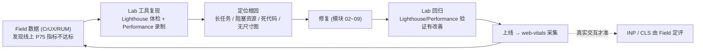
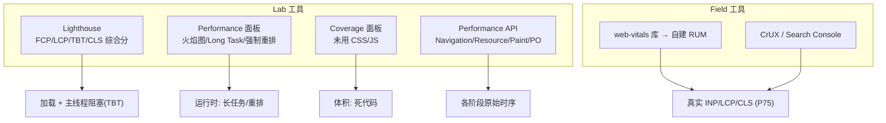

# 10 · 测量工具实操（Measure & Tools）

> 性能优化的第一步不是「改」，而是「量」。本模块把四类测量手段串成一条闭环：用 **Lab 工具**（Lighthouse / DevTools Performance / Coverage / Performance API）定位与调试问题，用 **Field 数据**（CrUX / RUM）做最终评判——两类数据各司其职，绝不能混用。

## 📖 知识讲解

### 一、Lab data vs Field data：两种数据，别混用

这是整个「衡量」阶段最重要的心智。

| | Lab data（实验室数据） | Field data（现场数据 / RUM） |
| --- | --- | --- |
| 来源 | Lighthouse / DevTools 在**固定设备 + 模拟网络**下跑一次 | 真实用户的真实设备/网络采集，汇入 **CrUX**、Search Console 或自建 RUM |
| 特点 | **可复现、能调试**，一次冷加载 | 千万次真实访问的 **P75 分布**，反映真实体验 |
| 能测的指标 | LCP、FCP、**TBT**、CLS（用 TBT 作 INP 的实验室代理） | LCP、**INP**、CLS 全都准（INP/CLS 只有真实交互才测得到） |
| 角色 | 定位问题、验证修复 | **Core Web Vitals 达标的唯一裁判**，也是 SEO 依据 |

> ⚠️ 关键陷阱：**Lighthouse 100 分 ≠ 用户体验好**。Lab 只跑一次冷加载，且**测不出 INP**（没有真实交互，改用 TBT 代理）。开发机永远是性能分布曲线最左端的幸运儿。结论：**用 Lab 定位调试，用 Field 评判达标**。

### 二、Lighthouse（Lab 综合评分）

Chrome DevTools 内置的自动化审计工具（DevTools → **Lighthouse** 面板 → 勾选 Performance → Analyze）。

- 给的是 **Lab 指标**：Performance 分由 **FCP、LCP、TBT、CLS、Speed Index** 等按权重加权得出（**TBT 权重最高**，因为它是 INP 的实验室代理）。**注意它给的是 TBT 而非 INP**。
- 输出还包含具体优化建议（如"移除阻塞渲染的资源""图片未指定尺寸"），是快速体检的首选。
- 局限：单次冷加载、模拟环境，分数会波动；真实达标仍看 Field。

### 三、Chrome DevTools · Performance 面板（火焰图 / 找长任务）

DevTools → **Performance** → 点录制 → 操作页面 → 停止。它给出一条完整的主线程时间轴：

- **火焰图（Flame Chart）**：看每个函数的调用栈与耗时，定位「谁占了主线程」。
- **Long Task**：主线程上执行 > 50ms 的任务会被标**红色三角**，是 INP 变差的元凶（对应模块 06/09）。
- **强制同步布局（Forced reflow / Layout Thrashing）**：读写交替触发的同步布局会被标出紫色警告（对应模块 06）。
- 可配合 **CPU throttling / Network throttling** 模拟低端设备与弱网。

### 四、Coverage 面板（找未用的 CSS/JS）

DevTools → 命令菜单（`Cmd/Ctrl+Shift+P`）→ 输入 "Coverage" → 录制并刷新。它按红/绿标出每个 CSS/JS 文件里**加载了但没执行到**的字节比例，帮你发现该做**代码分割 / Tree-Shaking**（模块 04/07）的死代码。

### 五、Performance API（本 demo 的核心，零依赖）

浏览器原生暴露的一组测量 API，是所有 RUM 上报库（含 `web-vitals`）的底座：

- **Navigation Timing**：`performance.getEntriesByType('navigation')[0]`，拿到导航条目，各阶段耗时 = 相邻时间戳相减：
  - DNS = `domainLookupEnd − domainLookupStart`
  - TCP = `connectEnd − connectStart`
  - **TTFB** = `responseStart − requestStart`（good ≤ 800ms）
  - DOMContentLoaded = `domContentLoadedEventEnd − startTime`
  - Load = `loadEventEnd − startTime`
- **Resource Timing**：`performance.getEntriesByType('resource')`，逐个资源的 `duration`、`transferSize`、`initiatorType`。
- **Paint Timing**：`paint` 条目里的 `first-contentful-paint` 即 **FCP**。
- **PerformanceObserver**：订阅式监听，`observe({ type, buffered: true })`，`buffered:true` 会回放创建前的条目避免漏测。常用 `type`：`paint`（FCP）、`largest-contentful-paint`（LCP）、`longtask`（长任务）、`event`（INP 的 Event Timing）、`layout-shift`（CLS）、`navigation`、`resource`。

### 六、web-vitals 库（Field 上报的标准做法）

Google 官方库，封装了上面这些 API 的正确用法（含 INP/CLS 的会话窗口、页面隐藏时定终值等细节），一行订阅、`sendBeacon` 上报到自己后端，汇成 Field 数据：

```html
<script type="module">
  import { onLCP, onINP, onCLS } from 'https://unpkg.com/web-vitals@4?module';
  onLCP(sendToAnalytics); onINP(sendToAnalytics); onCLS(sendToAnalytics);
</script>
```

## 🔄 流程图 / 原理图

测量闭环：Lab 定位调试 → 修复 → Field 评判：



各工具覆盖的指标与阶段矩阵：



## 💻 代码说明

本模块含三个可直接打开的页面：

- **`index.html`（性能测量仪表盘）**：零依赖，用原生 Performance API 现场演示：
  - 顶部**卡片**实时显示 TTFB / FCP / LCP / DOMContentLoaded / Load / Long Task 次数，并按 web.dev 阈值上色（good 绿 / needs 橙 / poor 红）。
  - **① Navigation Timing 表**：把导航各阶段（DNS/TCP/TTFB/响应下载/DOM 解析/DCL/Load）连同计算方式列出来。
  - **② Long Task 演示**：一个按钮同步空转 ~300ms 制造长任务，`PerformanceObserver({type:'longtask'})` 捕获后追加到列表，直观看到「> 50ms 的任务被上报」。
  - **③ Resource Timing 表**：`getEntriesByType('resource')` 列出每个资源的类型 / 传输大小 / 耗时。
  - FCP、LCP 用 `PerformanceObserver` + `buffered:true` 订阅，个别浏览器不支持时静默兜底不报错。
- **`bad.html` / `good.html`（Lighthouse 对比）**：内容相同、只差三处写法，用来在 Lighthouse 里看分数差异。

### 优化前 vs 优化后 差异表（bad.html vs good.html · 在 Lighthouse 下）

| 问题 | `bad.html`（优化前） | `good.html`（优化后） | Lighthouse 体现 |
| --- | --- | --- | --- |
| head 同步脚本 | busy-wait 阻塞渲染 **900ms** | 改 `<script defer>` 不阻塞首屏 | FCP / LCP 变好，"移除阻塞渲染资源"消失 |
| 图片尺寸 | 大图**不写** width/height → 加载时挤动内容 | 显式 `width/height` + `fetchpriority` | CLS 从偏高 → ≈ 0，"图片未指定尺寸"消失 |
| 点击任务 | 主线程空转 **250ms**（长任务） | 切成 30 片 × 8ms，每片 `await scheduler.yield()` 让出 | TBT 下降（INP 的实验室代理改善） |

> 用法：在 DevTools **Lighthouse** 面板分别对 `bad.html` 和 `good.html` 跑一次 Performance 审计，对比 Performance 总分与 FCP/LCP/TBT/CLS 各项——good 页各项明显更优。

## ▶️ 运行方式

**免构建，浏览器直接打开即可**（推荐 Chrome / Edge，对 `longtask`/`largest-contentful-paint` 支持最完整）：

```bash
cd 23-performance-optimization/10-measure-tools
# 方式一：直接双击 index.html（file:// 下 Navigation Timing 的网络阶段多为 0）
# 方式二（推荐，能看到真实 DNS/TCP/TTFB 与资源请求）：起本地服务器
python3 -m http.server 8080     # 或 npx serve
# 打开 http://localhost:8080/index.html
```

操作与观察：

1. 打开 `index.html`，看卡片与 Navigation Timing 表；点「制造一个长任务」按钮，观察 **② Long Task** 列表出现新条目、卡片计数 +1。
2. 打开 **DevTools → Performance**，录制后点按钮，确认时间轴上出现红角标 **Long Task**。
3. 打开 **DevTools → Lighthouse**，分别对 `bad.html`、`good.html` 跑 Performance 审计，对比分数（见上方差异表）。
4. 打开 **Coverage** 面板（命令菜单搜 "Coverage"）录制刷新，看未用 CSS/JS 比例。

## ⚠️ 常见坑 / 最佳实践

- **别拿 Lab 分数当达标凭据**：Lighthouse 是一次冷加载的模拟，**测不出 INP**（用 TBT 代理）。真实达标看 **Field（CrUX / RUM）的 P75**。
- **别只在本机看数字**：开发机太快，LCP/TTFB 往往都是 good；线上弱网低端机才是真实分布。
- **`file://` 下 Navigation Timing 网络阶段为 0**：DNS/TCP/TTFB 需要真实 HTTP，请用本地服务器打开。
- **INP/CLS 要真实交互才有值**：光加载不点击就没有 INP；`layout-shift` 也要页面真的发生偏移才上报。
- **`PerformanceObserver` 要加 `buffered:true`**：否则会漏掉 observer 创建前就产生的早期条目（如 FCP）。
- **Safari/Firefox 部分 entryType 缺失**：`longtask`、`largest-contentful-paint` 主要在 Chromium 系可靠，脚本要做兜底不报错。
- **上报时机**：指标在页面隐藏时才定终值，应在 `visibilitychange` 里用 `navigator.sendBeacon` 上报——用 `web-vitals` 库会自动处理。
- **别过度依赖单一工具**：Lighthouse 体检 + Performance 找长任务 + Coverage 找死代码 + Performance API/RUM 收真实数据，四者配合才完整。

## 🔗 官方文档

- Lighthouse 概览：https://developer.chrome.com/docs/lighthouse/overview
- DevTools · Performance 面板：https://developer.chrome.com/docs/devtools/performance
- DevTools · Coverage 面板：https://developer.chrome.com/docs/devtools/coverage
- MDN · Performance API：https://developer.mozilla.org/en-US/docs/Web/API/Performance_API
- MDN · PerformanceObserver：https://developer.mozilla.org/zh-CN/docs/Web/API/PerformanceObserver
- Web Vitals 指标总览：https://web.dev/articles/vitals
- web-vitals 库：https://github.com/GoogleChrome/web-vitals
