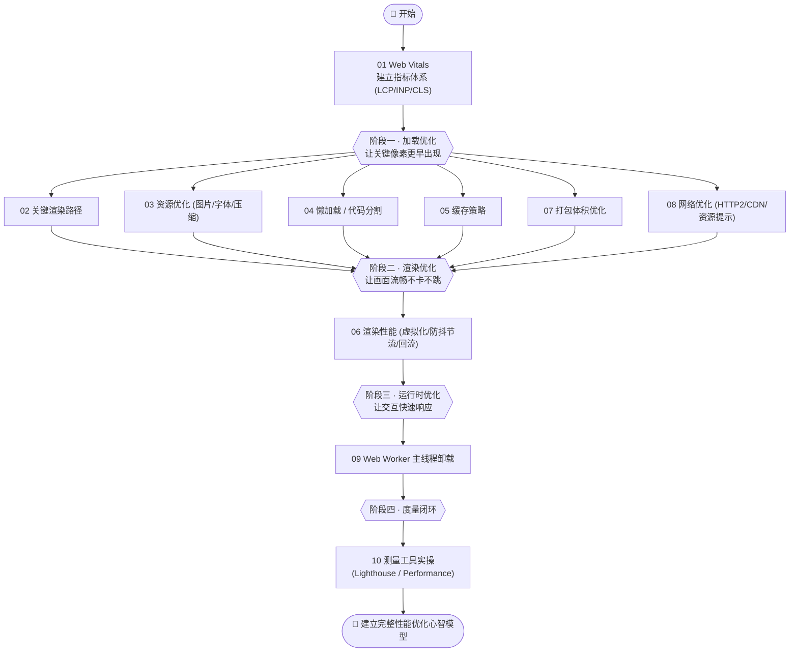
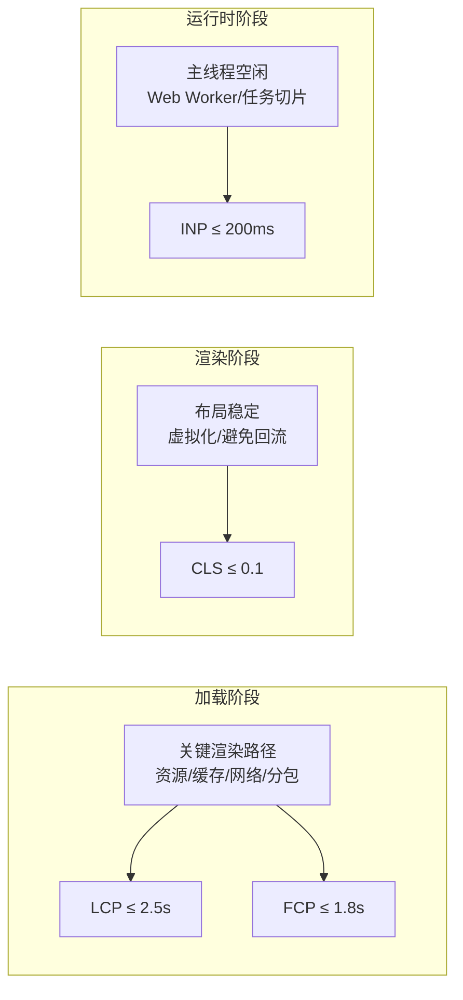

# 23 · 前端性能优化（Performance Optimization）

> 性能不是"上线后再调"的收尾工作，而是贯穿加载、渲染、运行时全过程的**系统工程**。本工程以 Google **web.dev 的 Core Web Vitals**（LCP / INP / CLS）为北极星指标，用 **10 个可运行的「优化前 vs 优化后」对比 demo**，把"慢在哪、为什么慢、怎么变快"讲透，并配套一篇《原理详解.md》讲清背后的浏览器机制。

## 📚 这个工程讲什么

前端性能优化要回答三个问题：

1. **怎么衡量？** —— 没有量化就没有优化。先建立指标体系（Core Web Vitals + 辅助指标）和测量手段（Lab / Field 数据、Performance API、Lighthouse）。
2. **慢在哪？** —— 把性能问题归到**加载 / 渲染 / 运行时**三个阶段，每个阶段有各自的瓶颈与优化杠杆。
3. **怎么变快？** —— 针对每个瓶颈给出可落地、可对比验证的手段。

一句话心智模型：

```
性能优化 = 让「关键像素」更早出现（LCP）
         + 让「交互」更快响应（INP）
         + 让「画面」不要乱跳（CLS）
```

技术栈与运行：绝大多数模块**免构建**，浏览器直接打开 HTML 即可看效果；涉及 Service Worker / Web Worker 的模块用本地静态服务器（`npx serve` 或 `python3 -m http.server`）；`07-bundle-optimization` 用 **Vite 5.x** 演示真实 tree-shaking。所有指标对照 **web.dev（2024+）** 与 **MDN**，确保不过时（**INP 已于 2024 年取代 FID**）。

## 🗂 模块索引

| 模块 | 知识点 | 你将学会 | 阶段 | 运行方式 |
| --- | --- | --- | --- | --- |
| [01](./01-web-vitals/) | 核心 Web 指标 | LCP/INP/CLS 定义、阈值三档、75 分位、用原生 API 实时测量 | 衡量 | 浏览器直开 |
| [02](./02-critical-rendering-path/) | 关键渲染路径 | DOM→CSSOM→渲染树→布局→绘制、CSS/JS 阻塞、内联关键 CSS + defer | 加载 | 浏览器直开 |
| [03](./03-resource-optimization/) | 资源优化 | 压缩、AVIF/WebP 图片格式、响应式图片、字体 swap/preload/子集化 | 加载 | 浏览器直开 |
| [04](./04-lazy-loading-splitting/) | 懒加载与代码分割 | `loading=lazy`、IntersectionObserver、动态 `import()` 按需加载 | 加载 | 浏览器直开 |
| [05](./05-caching-strategy/) | 缓存策略组合 | 强缓存/协商缓存、ETag、hash 长缓存、Service Worker 三策略 | 加载 | 本地服务器 |
| [06](./06-rendering-performance/) | 渲染性能 | 长列表虚拟化、防抖节流、避免 layout thrashing 回流 | 渲染 | 浏览器直开 |
| [07](./07-bundle-optimization/) | 打包体积优化 | tree-shaking、按需引入、`sideEffects`、可视化体积分析 | 加载 | `npm run build` |
| [08](./08-network-optimization/) | 网络优化 | HTTP/2 多路复用、CDN、preload/prefetch/preconnect | 加载 | 浏览器直开 |
| [09](./09-runtime-web-worker/) | Web Worker 卸载 | 多线程、postMessage、把 CPU 密集任务移出主线程改善 INP | 运行时 | 本地服务器 |
| [10](./10-measure-tools/) | 测量工具实操 | Lighthouse、Performance 面板、Coverage、Lab vs Field 数据 | 衡量 | 浏览器直开 |

> 进阶必读：工程根目录的 **[《原理详解.md》](./原理详解.md)** —— 讲透指标计算公式、加载/渲染/运行时三阶段优化模型、以及每种优化手段背后的浏览器机制（关键渲染路径、合成层、事件循环与长任务、缓存决策树等），配多张原理图。

## 🧭 学习路线

先学"怎么衡量"，再按"加载 → 渲染 → 运行时"三阶段逐个击破，最后回到"工具实操"闭环。



三阶段优化模型与指标的对应关系：



## ▶️ 运行说明

多数模块免构建，进入模块目录用浏览器打开对应 HTML 即可：

```bash
# 免构建模块（01/02/03/04/06/08/10）：直接打开
open 23-performance-optimization/01-web-vitals/index.html

# 需本地服务器模块（05 Service Worker、09 Web Worker）：
cd 23-performance-optimization/05-caching-strategy
npx serve            # 或 python3 -m http.server 8080
# 然后浏览器访问终端提示的 http://localhost:xxxx

# 需构建模块（07）：
cd 23-performance-optimization/07-bundle-optimization
npm install
npm run build        # 看终端 chunk 体积 + 生成的 visualizer 体积图
```

每个模块 README 都有独立的"▶️ 运行方式"。建议全程打开 **Chrome DevTools 的 Network / Performance / Lighthouse 面板**边看数值边学。

## 🔗 官方文档

- Core Web Vitals：https://web.dev/articles/vitals
- LCP：https://web.dev/articles/lcp ｜ INP：https://web.dev/articles/inp ｜ CLS：https://web.dev/articles/cls
- 关键渲染路径：https://web.dev/articles/critical-rendering-path
- Performance API（MDN）：https://developer.mozilla.org/en-US/docs/Web/API/Performance_API
- Lighthouse：https://developer.chrome.com/docs/lighthouse/overview
- web-vitals 库：https://github.com/GoogleChrome/web-vitals
