# 前端性能优化 · 原理详解（How / Why / 底层机制）

> 本文是 `23-performance-optimization` 工程的**核心交付物**。模块 README 讲"怎么做"，本文讲"**为什么这么做、浏览器内部到底发生了什么**"。读完你应当能回答：一个像素从"服务器上的字节"到"屏幕上的光"要走哪些路？每一步慢在哪？我们的每种优化手段，究竟撬动了浏览器的哪个环节？
>
> 全文对照 **web.dev（Core Web Vitals，2024+）** 与 **MDN**。关键结论：**INP 已于 2024 年成为稳定的 Core Web Vital，取代了 FID**。

---

## 一、性能指标体系与计算

### 1.1 为什么是 Core Web Vitals

用户对"快"的感知不是单一维度，Google 把它拆成三个正交的用户体验问题，每个对应一个可量化指标：

| 用户的问题 | 指标 | 衡量什么 | "Good" 阈值 | "Poor" 阈值 |
| --- | --- | --- | --- | --- |
| "内容加载出来了吗？" | **LCP** (Largest Contentful Paint) | 加载性能 | ≤ **2.5s** | > 4s |
| "我点它有反应吗？" | **INP** (Interaction to Next Paint) | 交互响应 | ≤ **200ms** | > 500ms |
| "画面怎么乱跳？" | **CLS** (Cumulative Layout Shift) | 视觉稳定 | ≤ **0.1** | > 0.25 |

三档之间（good 与 poor 之间）为 "Needs Improvement"。

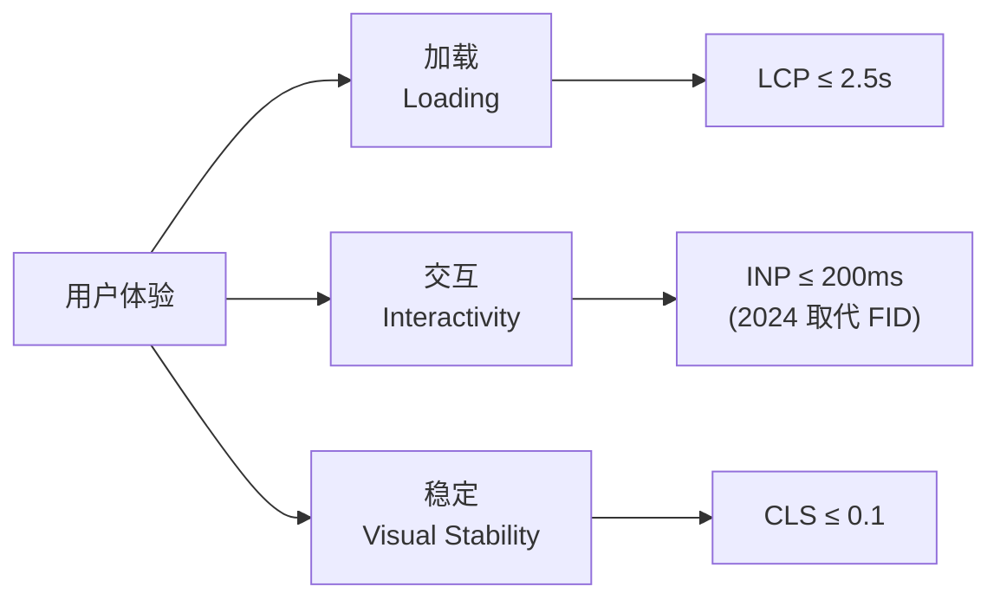

### 1.2 关键：为什么是"第 75 百分位"

Core Web Vitals 的达标判定，**不是看平均值，而是看你所有页面加载中第 75 百分位（P75）的那一次**，并且移动端 / 桌面端**分开统计**。

- **为什么不用平均值？** 平均值会被少量极端值拉偏，且掩盖了长尾用户的痛苦。一个"平均 2s"的站点可能有 30% 用户在 5s。
- **为什么是 75 而不是 95/99？** 75 分位意味着"四分之三的访问都达标"，是一个兼顾"覆盖大多数真实用户"与"目标可达"的工程折中。

> 心智：优化性能是在**优化一条分布曲线的右尾**，而不是优化一个数字。这也是"实验室里很快、线上还是慢"的根源——你的开发机是这条曲线最左端的幸运儿。

### 1.3 三个指标的计算细节

**LCP** —— 视口内"最大内容元素"（``、背景图、块级文本等）完成渲染的时间点。浏览器边加载边更新候选，用户首次交互后停止取值。

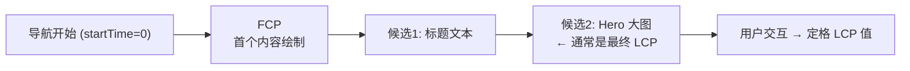

LCP 可拆成四段子指标，优化就是**压缩这四段**（对应模块 02/03/05/08）：

```
LCP = TTFB(首字节)  +  资源加载延迟  +  资源加载时间  +  元素渲染延迟
       └网络/缓存┘      └发现资源早晚┘   └体积/带宽┘      └CSS/JS 阻塞┘
```

**CLS** —— 累计布局偏移分数。每次"非用户预期"的位移贡献一个 `layout shift score`：

```
layout shift score = impact fraction（受影响视口面积比） × distance fraction（位移距离比）
CLS = 一次会话窗口内偏移分数之和（取最大的会话窗口）
```

关键点：**用户交互后 500ms 内的位移不计**（因为那通常是用户预期的，如展开手风琴）。CLS 的元凶几乎总是：无尺寸的图片/广告、动态插入的内容、异步字体导致的重排（对应模块 03）。

**INP** —— 观察整个页面生命周期内**所有交互**（点击/点按/键盘）的延迟，取其中一个高分位代表值（通常近似最差交互）。单次交互延迟 = 输入延迟 + 处理时间 + 呈现延迟：

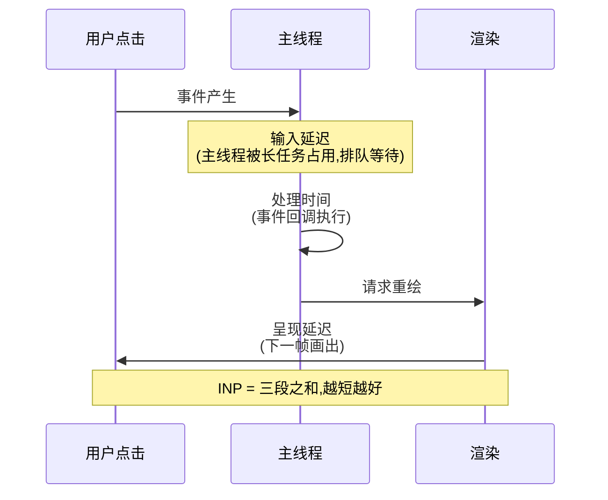

**INP 为什么取代 FID？** FID（First Input Delay）只测"第一次交互的输入延迟"，且只算排队等待、不算回调执行和渲染——太片面。INP 覆盖**全生命周期所有交互的完整延迟**，才是真实"点了有多卡"。这直接把优化重心指向了**主线程长任务**（对应模块 06/09）。

### 1.4 Lab vs Field：两种数据，别混用

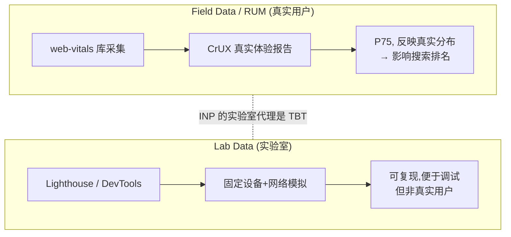

- **Field（现场）**：真实用户浏览器采集，是 Core Web Vitals 达标的**唯一裁判**，也是 SEO 依据。用 `web-vitals` 库或 CrUX。
- **Lab（实验室）**：Lighthouse / Performance 面板在受控环境跑，**可复现、能调试**，但测不出 INP（没有真实交互），用 **TBT（Total Blocking Time）**作为 INP 的实验室代理。
- 陷阱：Lab 分数高 ≠ Field 达标。Lab 只跑一次冷加载，Field 是千万次真实访问的 P75（对应模块 10）。

---

## 二、加载 / 渲染 / 运行时 —— 三阶段优化模型

一切前端性能问题都能归到这三个阶段。这是本工程的总纲：

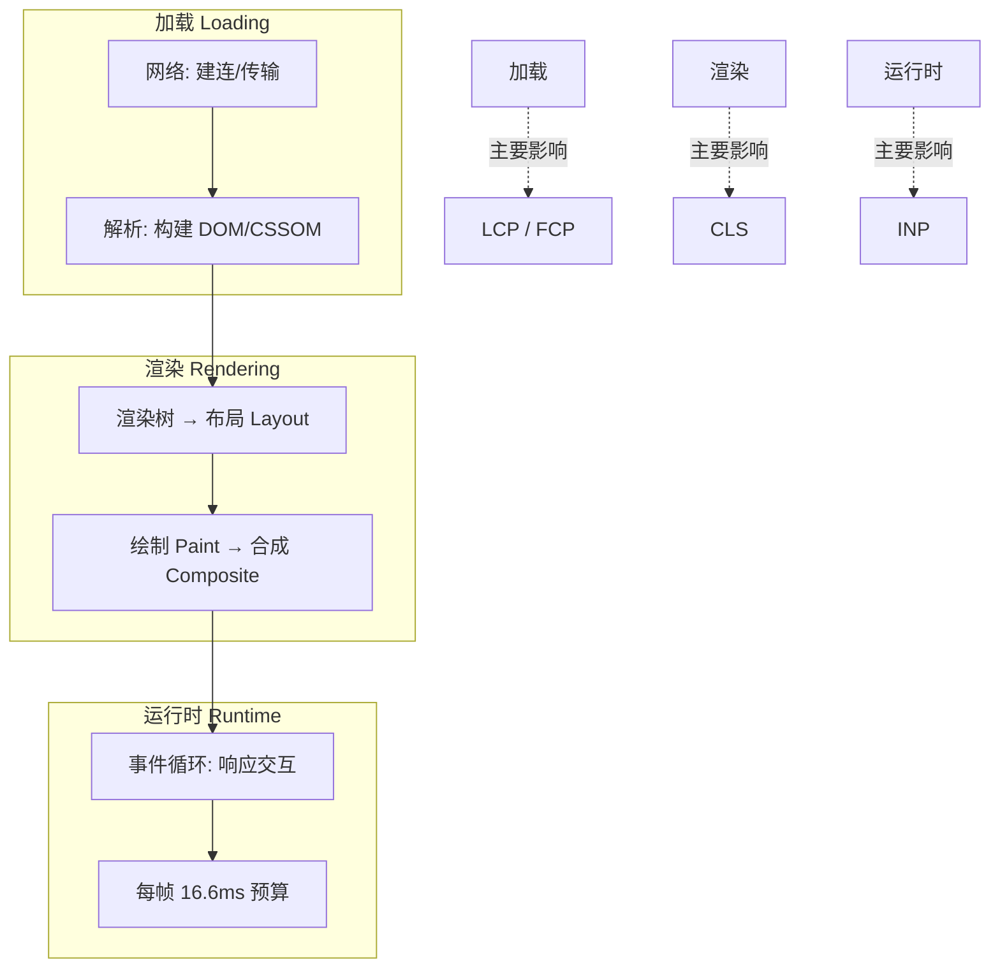

| 阶段 | 瓶颈本质 | 优化杠杆 | 对应模块 |
| --- | --- | --- | --- |
| **加载** | 关键字节太多 / 发现太晚 / 传输太慢 | 减小体积、提前发现、就近缓存、并发传输 | 02/03/04/05/07/08 |
| **渲染** | 布局/绘制太重 / 布局抖动 | 减少节点、避免回流、稳定布局 | 06 |
| **运行时** | 主线程长任务阻塞 | 任务切片、Web Worker 卸载 | 06/09 |

---

## 三、加载阶段的底层机制

### 3.1 关键渲染路径（Critical Rendering Path）

浏览器把字节变成像素，要走一条固定流水线。理解它，才知道"什么在阻塞首屏"：

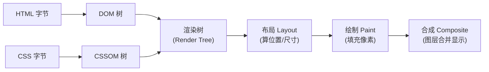

两个"阻塞"是首屏慢的根因：

1. **CSS 阻塞渲染**：渲染树需要 CSSOM，所以**CSSOM 没构建完，浏览器什么都不画**（避免无样式内容闪烁 FOUC）。→ 于是有了"内联关键 CSS、其余异步加载"（模块 02）。
2. **JS 阻塞解析**：`<script>`（无 `defer`/`async`）会**暂停 DOM 构建**，且因为脚本可能读写样式，还要等前面的 CSSOM。→ 于是有了 `defer`（延到 DOM 完成后按序执行）和 `async`（下载完就执行，不保证顺序）。

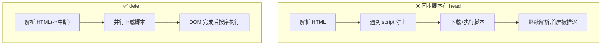

**优化 = 缩短关键路径**：减少关键资源数、减少关键字节、缩短关键路径长度（串行往返次数）。

### 3.2 资源优化：为什么图片和字体是重点

- **图片是首屏体积的大头**。现代格式按压缩率排序 **AVIF > WebP > JPEG/PNG**。用 `<picture>` + `<source type>` 让浏览器**从上到下选第一个支持的格式**，实现"新浏览器用 AVIF、旧的降级 JPEG"：

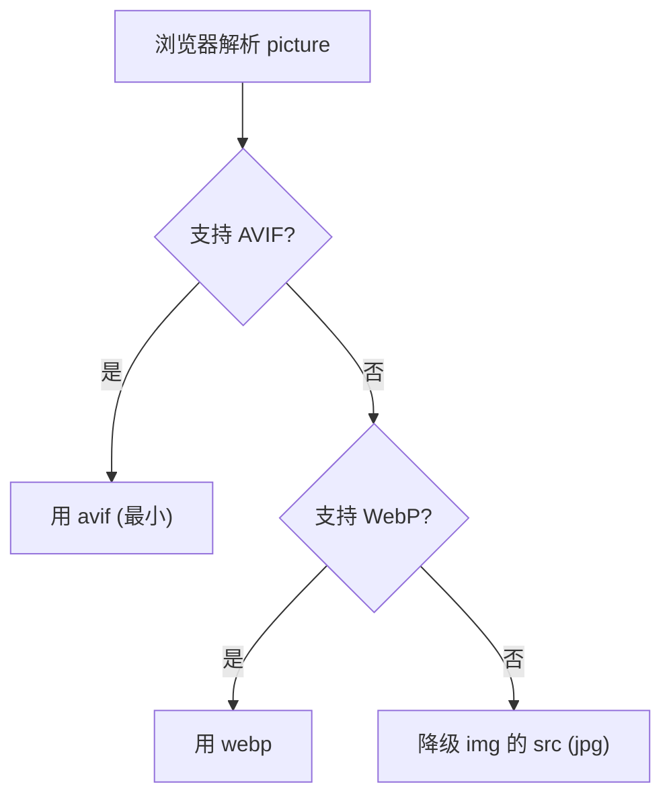

- **字体导致 CLS/FOIT**：默认字体加载策略是"block 期"——文字先隐形（FOIT），字体到了再显示，若尺寸不同还会重排（CLS）。`font-display: swap` 让文字**先用后备字体显示**，字体到了再换（FOUT，可接受）；配合 `<link rel="preload" as="font">` 提前发现字体、`size-adjust` 对齐后备字体尺寸减少跳动（模块 03）。

### 3.3 懒加载与代码分割：不为看不见的东西付费

首屏只需要首屏的资源。**代码分割**基于动态 `import()`——它返回 Promise，构建工具（Rollup/webpack）在此处**切一刀**，把该模块及其依赖打成独立 chunk，**运行到才请求**：

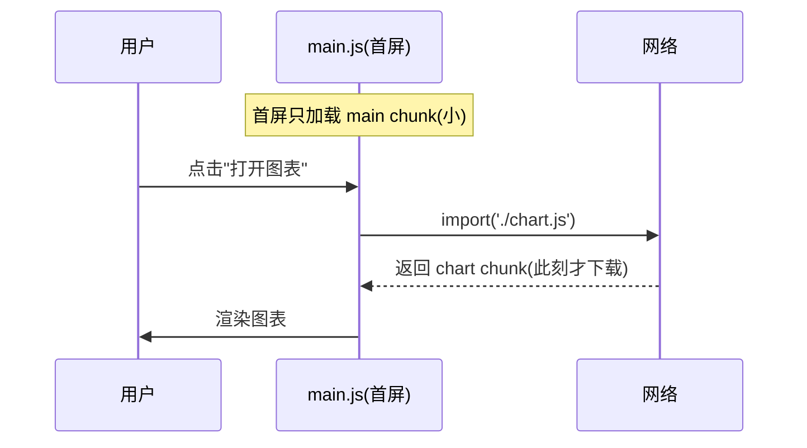

图片懒加载同理：`loading="lazy"` 让浏览器**只在接近视口时才请求**；`IntersectionObserver` 则是手写版，可控制 buffer 距离（模块 04）。

### 3.4 缓存策略：最快的请求是不发请求

浏览器缓存决策是一棵树。理解**强缓存 vs 协商缓存**的优先级：

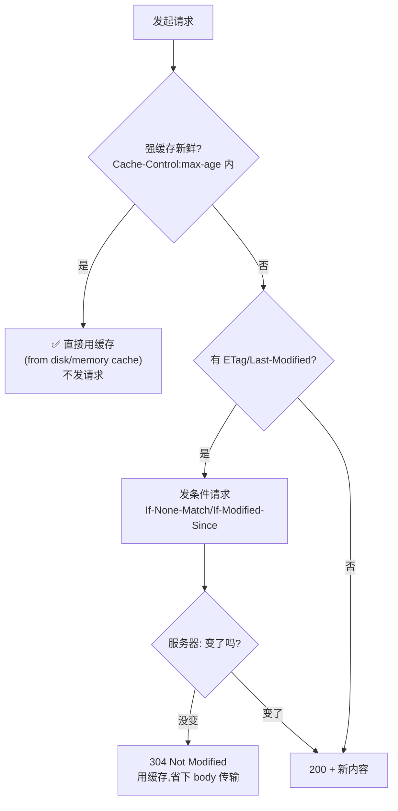

工程实践：**带内容 hash 的静态资源**（`app.4a8f.js`）配 `Cache-Control: max-age=31536000, immutable`——内容变则文件名变，既极致利用缓存又不会拿到旧代码（cache busting，模块 05/07）。HTML 用 `no-cache`（每次协商）作为"入口"。

**Service Worker** 把缓存权交给 JS：cache-first（静态资源，秒开+离线）、network-first（数据，保证新鲜）、stale-while-revalidate（先给缓存再后台更新，兼顾快与新）。

### 3.5 打包体积：Tree-Shaking 的静态本质

Tree-shaking 能"摇掉"未用代码，**前提是 ESM 的静态可分析性**——`import`/`export` 在编译期就能确定依赖关系（不像 CommonJS 的 `require` 是运行时动态的）。打包器从入口出发标记"活"的导出，其余作为死代码消除：

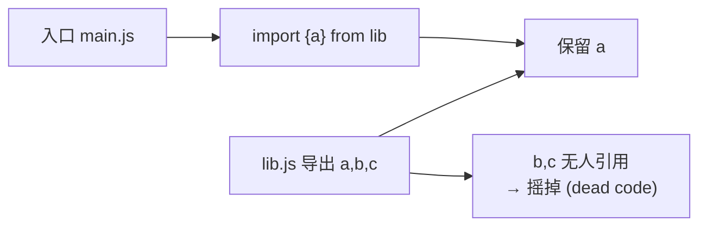

陷阱：`import * as _ from 'lib'` 或有**副作用**的模块会阻断摇树。`package.json` 的 `"sideEffects": false` 是给打包器的承诺——"我的模块纯净，放心删"。按需引入（`import debounce from 'lodash/debounce'`）比整包引入体积小一个数量级（模块 07）。

### 3.6 网络优化：并发与提前

- **HTTP/2 多路复用**：HTTP/1.1 每个连接同时只能处理一个请求（队头阻塞），浏览器只好开 6 个连接 + 域名分片。HTTP/2 在**一个连接上并发多个流**，彻底消除队头阻塞，域名分片反成反优化：

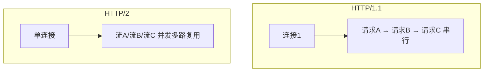

- **资源提示**四件套（模块 08）：

| 提示 | 作用 | 时机 |
| --- | --- | --- |
| `preload` | 当前页**关键**资源，高优先级立即取 | 提前发现被 CSS/JS 藏起来的关键资源（字体/首屏图） |
| `prefetch` | **下一页**可能用的资源，空闲时低优取 | 预测用户下一步 |
| `preconnect` | 提前完成 DNS + TCP + TLS 建连 | 已知要用的第三方源 |
| `dns-prefetch` | 仅提前 DNS 解析（preconnect 的轻量版） | 兼容性兜底 |

---

## 四、渲染阶段的底层机制

### 4.1 回流（Reflow）与重绘（Repaint）

- **回流/重排 Reflow**：几何属性（尺寸/位置）变化 → 重新**布局** → 昂贵。
- **重绘 Repaint**：仅外观（颜色）变化 → 跳过布局直接**绘制**。
- **仅合成**：`transform`/`opacity` 变化可只在**合成层**处理，走 GPU，不碰布局和绘制 → 最便宜。

所以"用 `transform: translate` 做动画而非 `top/left`"的本质是：**把动画从"布局+绘制+合成"降级到只有"合成"**。

### 4.2 Layout Thrashing（强制同步布局）

浏览器本会把多次样式修改**批量**在一帧里算一次布局。但如果你"写一下、立刻读一个布局属性（`offsetHeight`/`getBoundingClientRect`）"，浏览器为了给你正确的值，**被迫立即同步重算布局**——循环里这么干就是布局抖动，性能雪崩：

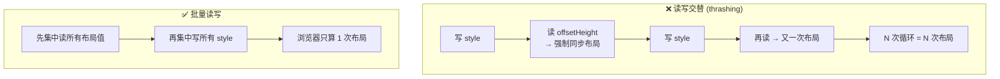

修复：**先批量读、再批量写**，或用 `requestAnimationFrame` 把写操作对齐到下一帧（模块 06）。

### 4.3 长列表虚拟化

渲染一万个 DOM 节点，代价在**内存 + 布局 + 绘制**三重。虚拟列表只渲染可视区 + 上下 buffer 的少量节点，用一个撑高的容器（padding 或占位元素）保持滚动条比例，滚动时**回收并复用**节点：

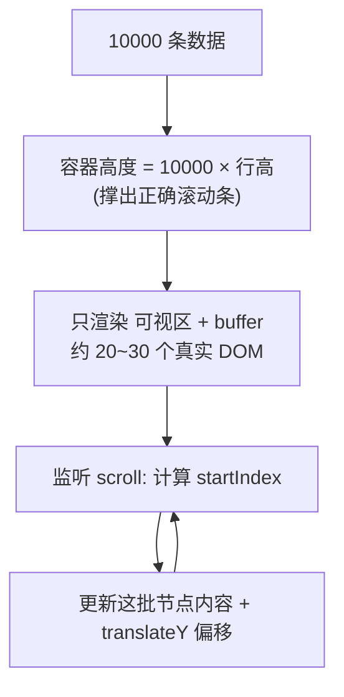

DOM 节点数从 10000 降到 ~30，布局/绘制成本近乎恒定（模块 06）。

### 4.4 防抖与节流

高频事件（`input`/`scroll`/`resize`）若每次都触发重活，会淹没主线程：

- **防抖 Debounce**：只在"停止触发 N ms 后"执行一次——适合搜索联想、resize 结束。
- **节流 Throttle**：固定间隔最多执行一次——适合滚动位置计算、按钮防连点。

本质都是**降低高频回调对主线程的占用频率**，间接改善 INP（模块 06）。

---

## 五、运行时阶段的底层机制

### 5.1 单线程、事件循环与 16.6ms 预算

JS 主线程单线程：执行 JS、样式计算、布局、绘制、响应事件**都排在同一个队列**。60fps 意味着每帧只有 **16.6ms** 预算。一个跑了 200ms 的 JS 任务（长任务，>50ms 即算）会**霸占主线程**——这期间：动画卡住、点击不响应（输入延迟飙升 → INP 变差）。

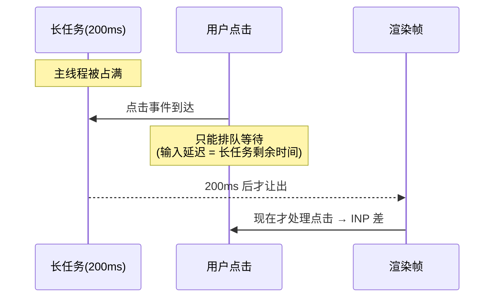

### 5.2 两条解法

1. **任务切片 / 让出主线程**：把长任务拆成小块，用 `setTimeout(0)`、`await` 微任务边界、`scheduler.yield()` 或 `requestIdleCallback` 在块之间**让浏览器插空处理交互与渲染**。
2. **Web Worker 卸载**：把 CPU 密集计算搬到**独立线程**，主线程彻底解放：

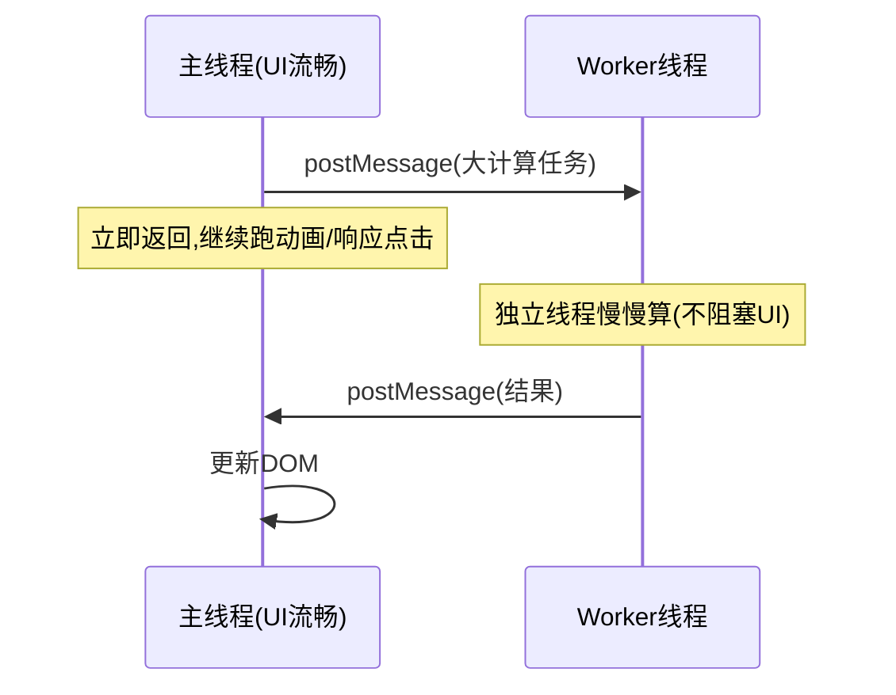

Worker 要点（模块 09）：无 DOM 访问、通过 `postMessage` 通信、数据默认**结构化克隆**（有拷贝开销），大数据用 **Transferable Objects**（如 `ArrayBuffer`）**零拷贝转移**所有权。适合：图像处理、加解密、大数据解析/排序；不适合：需频繁访问 DOM 或通信开销 > 计算收益的场景。

---

## 六、常见误区

1. **"优化平均值"**：Core Web Vitals 看 **P75 分布右尾**，不是平均。开发机永远是最快的那一端。
2. **"Lighthouse 100 分 = 用户体验好"**：那是 Lab 冷加载单次；真实达标看 Field（RUM）。INP 在实验室根本测不出（用 TBT 代理）。
3. **"还在优化 FID"**：FID 已被 INP 取代（2024）。优化重心从"首次输入延迟"转向"所有交互的完整延迟"，即**消灭主线程长任务**。
4. **"图片压缩就够了"**：无 `width/height` 的图片即使很小也会造成 CLS 重排，稳定布局和减小体积是两件事。
5. **"用 `top/left` 做动画"**：触发回流；应改 `transform/opacity` 只走合成层。
6. **"读一下布局属性没关系"**：在写操作之后读 `offsetHeight` 会强制同步布局，循环中即 layout thrashing。
7. **"什么都塞进 Web Worker"**：通信/克隆开销可能�amortize 不掉；只卸载真正 CPU 密集的部分。
8. **"域名分片提升并发"**：HTTP/2 下这是反优化，多连接反而增加建连成本、削弱多路复用。

---

## 七、一页速查

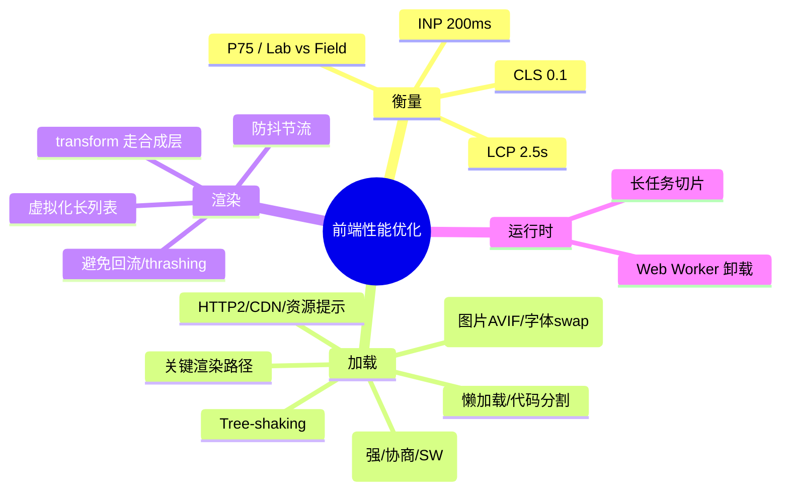

## 🔗 权威来源

- Core Web Vitals：https://web.dev/articles/vitals
- LCP / INP / CLS：https://web.dev/articles/lcp ｜ https://web.dev/articles/inp ｜ https://web.dev/articles/cls
- INP 取代 FID 说明：https://web.dev/blog/inp-cwv-launch
- 关键渲染路径：https://web.dev/articles/critical-rendering-path
- 避免大型复杂布局与布局抖动：https://web.dev/articles/avoid-large-complex-layouts-and-layout-thrashing
- Performance API / PerformanceObserver（MDN）：https://developer.mozilla.org/en-US/docs/Web/API/Performance_API
- Web Workers（MDN）：https://developer.mozilla.org/en-US/docs/Web/API/Web_Workers_API
- HTTP 缓存（MDN）：https://developer.mozilla.org/en-US/docs/Web/HTTP/Caching
- Lighthouse：https://developer.chrome.com/docs/lighthouse/overview
