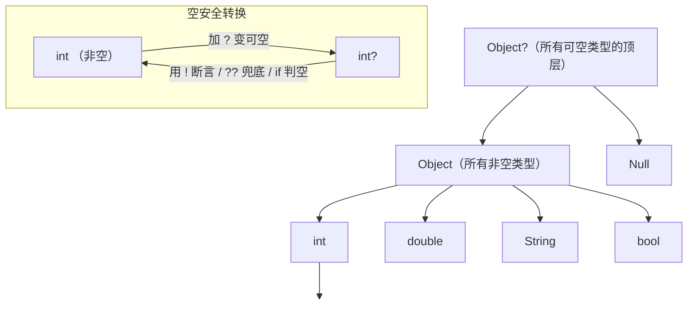

# 01 · 变量 / 类型 / 空安全（Variables, Types & Null Safety）
> Dart 的变量声明方式、内置类型、类型推断，以及内置的健全空安全（sound null safety）与一整套 null 操作符。

## 📖 知识讲解

### 变量声明
- `var`：不写类型，由初始值**推断**类型；类型一旦定下不可改，但值可以重新赋。
- `final`：**单次赋值**，值可以来自运行期计算（如 `DateTime.now()`）。
- `const`：**编译期常量**，声明时值必须能在编译阶段确定；`const` 对象是深度不可变的。

一句话区分：`final` 是"运行期常量"，`const` 是"编译期常量"。

### 内置类型
- 数字：`int`、`double`，两者共同父类为 `num`。
- 文本：`String`（单/双引号皆可，`'''...'''` 为多行）。
- 布尔：`bool`（只有 `true` / `false`，条件表达式必须是 `bool`，不能像 JS 那样用真假值）。
- Dart **没有隐式 int→double 转换**，但整数**字面量**可直接赋给 `double`（`double x = 3;` 会补成 `3.0`）。

### 类型推断
右侧字面量决定类型：`var list = [1,2,3];` 推断为 `List<int>`。写不写类型注解不影响性能，只影响可读性。

### 健全空安全（Sound Null Safety）
- 默认所有类型**非空**：`int x` 永远不会是 `null`。
- 类型后加 `?` 表示**可空**：`int?` 可以是整数或 `null`。
- "健全"意味着编译器能静态保证：一个非空变量在运行期绝不会是 null。

### null 操作符
| 操作符 | 含义 | 例子 |
|--------|------|------|
| `?.` | 空安全调用：对象为 null 则整体返回 null | `text?.length` |
| `??` | 空合并：左侧为 null 时取右侧 | `nickname ?? '匿名'` |
| `??=` | 空赋值：变量为 null 时才赋值 | `nickname ??= '小明'` |
| `!` | 非空断言：把 `T?` 当作 `T`，为 null 时运行期抛错 | `boxed!` |
| `late` | 延迟初始化的非空变量，承诺"用前必赋值" | `late String config;` |

### 字符串插值
`$变量` 插入简单变量；`${表达式}` 插入任意表达式，如 `${name.length}`。

## 🔄 流程图 / 原理图



## 💻 代码说明

`main.dart` 关键片段：

- **var/final/const 区别**
  ```dart
  var count = 10; count = 20;          // 值可变，类型固定为 int
  final now = DateTime.now();          // 运行期常量
  const pi = 3.14159;                  // 编译期常量
  ```
- **可空 vs 非空**：`int? maybeNull;` 默认即 `null`；`int notNull = 1;` 永不为 null。
- **null 操作符链**：
  ```dart
  String display = nickname ?? '匿名用户'; // 兜底
  nickname ??= '小明';                     // 为空才赋值
  int? len = text?.length;                 // 安全调用
  int unboxed = boxed!;                     // 断言非空
  ```
- **late**：`late String config;` 声明时不赋值，保证首次访问前 `config = loadConfig();` 已执行。
- **字符串插值**：`'$name 的长度是 ${name.length}'`。

## ▶️ 运行方式

```bash
cd 01-dart-basics
dart run main.dart
# 或
dart main.dart
```

## ⚠️ 常见坑 / 最佳实践
- **`!` 是"炸弹"**：只有在你 100% 确定非空时使用，否则运行期 `Null check operator used on a null value` 崩溃。优先用 `??` / `if (x != null)`。
- **`const` vs `final`**：能用 `const` 就用 `const`（编译期可复用同一实例）；值来自运行期就用 `final`。
- **`late` 未初始化就访问**会抛 `LateInitializationError`，而不是返回 null。
- **条件必须是 `bool`**：`if (count)` 在 Dart 里非法，必须写 `if (count != 0)`。
- **int 不会自动转 double**：`double d = someInt;` 报错，需 `someInt.toDouble()`；但字面量 `3` 例外。
- 优先用**类型推断**（`var`）让代码简洁，公共 API 边界处再写明类型注解。

## 🔗 官方文档
- 变量：https://dart.dev/language/variables
- 内置类型：https://dart.dev/language/built-in-types
- 空安全：https://dart.dev/null-safety
- 理解空安全：https://dart.dev/null-safety/understanding-null-safety
