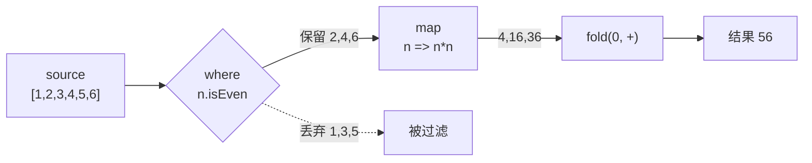

# 02 · 集合与函数（Collections & Functions）
> Dart 的 List/Set/Map 三大集合、展开与集合内控制流，以及函数的多种参数形式、箭头函数、闭包与一等函数特性。

## 📖 知识讲解

### 三大集合
- `List<T>`：有序、可重复，字面量 `[1, 2, 3]`。
- `Set<T>`：无序、**自动去重**，字面量 `{1, 2}`。
- `Map<K, V>`：键值对，字面量 `{'k': v}`。
- **坑**：`{}` 默认是空 **Map**；空 Set 必须写 `<int>{}`。

### 展开操作符
- `...`：把一个集合的元素"摊平"进另一个集合。
- `...?`：空安全展开，被展开对象为 `null` 时安全跳过（普通 `...` 遇 null 会抛错）。

### 集合内 if / for（collection-if / collection-for）
在集合字面量内部直接写 `if` 和 `for`，按条件/循环生成元素，避免先建空集合再 `add`。

### 高阶方法
| 方法 | 作用 | 备注 |
|------|------|------|
| `map(f)` | 逐元素变换 | 返回**惰性** `Iterable`，需 `.toList()` 物化 |
| `where(test)` | 过滤 | 保留 `test` 为真的元素 |
| `reduce(combine)` | 无初值累积 | 结果类型同元素；**空集合抛异常** |
| `fold(init, combine)` | 带初值累积 | 结果类型可不同；空集合安全返回初值 |

`reduce` 与 `fold` 的核心差别：`fold` 有初始值、结果类型可变、空集合安全，因此更通用。

### 函数参数四种形式
- 位置参数（必填）：`int add(int a, int b)`。
- 可选位置参数 `[]`：`greet(name, [greeting = '你好'])`，可省略，需默认值或可空类型。
- 命名参数 `{}`：`buildUser({required name, age, city = '未知'})`，调用时写参数名。
- `required`：标记命名参数为必填。

### 箭头函数 / 匿名函数 / 闭包 / 一等函数
- 箭头函数 `=> expr` 是 `{ return expr; }` 的语法糖（只能单表达式）。
- 匿名函数：没有名字的函数字面量，常直接作参数。
- 闭包：函数捕获其**定义处**的变量，即使离开作用域仍然有效（如计数器）。
- 一等函数：函数可**存入变量、作参数、作返回值**。

## 🔄 流程图 / 原理图



## 💻 代码说明

`main.dart` 关键片段：

- **集合与去重**
  ```dart
  Set<String> tags = {'dart', 'flutter', 'dart'}; // 结果只剩 2 个
  var emptySet = <int>{};                          // 空 Set 必须带类型
  ```
- **spread / 空安全 spread**
  ```dart
  var merged = [...head, 1, 2, 3, ...tail, ...?maybeMore];
  ```
- **collection if / for**
  ```dart
  var menu = ['首页', '商品', if (promoMode) '限时促销',
              for (var i = 1; i <= 3; i++) '分类$i'];
  ```
- **reduce vs fold**
  ```dart
  var sum   = source.reduce((acc, n) => acc + n);           // 21
  var total = source.fold<int>(100, (acc, n) => acc + n);   // 121
  ```
- **参数形式**：`greet('Bob', '晚上好')`（可选位置）、`buildUser(name: 'Cara', age: 28)`（命名 + required）。
- **闭包计数器**
  ```dart
  int Function() makeCounter() { int count = 0; return () => ++count; }
  ```
- **一等函数**：`int Function(int,int) op = add;`、`makeAdder(10)` 返回函数。

## ▶️ 运行方式

```bash
cd 02-dart-collections-functions
dart run main.dart
# 或
dart main.dart
```

## ⚠️ 常见坑 / 最佳实践
- **`map`/`where` 是惰性的**：不 `.toList()` / 不遍历就不会执行；且每次遍历都会重新计算。
- **`reduce` 遇空集合抛 `Bad state: No element`**，不确定非空时用 `fold`。
- **`{}` 是空 Map 不是空 Set**——这是最常见的类型误判。
- **`fold` 建议显式写泛型** `fold<int>(...)` / `fold<String>(...)`，否则类型可能被推断成 `dynamic`。
- 命名参数配 `required` 让调用处更可读，超过 2~3 个参数时优先用命名参数。
- 闭包捕获的是**变量本身**而非快照，`for` 循环里用 `var`/`final` 声明循环变量可避免共享同一变量的经典坑。

## 🔗 官方文档
- 集合：https://dart.dev/language/collections
- 函数：https://dart.dev/language/functions
- Iterable 库教程：https://dart.dev/libraries/collections/iterables
