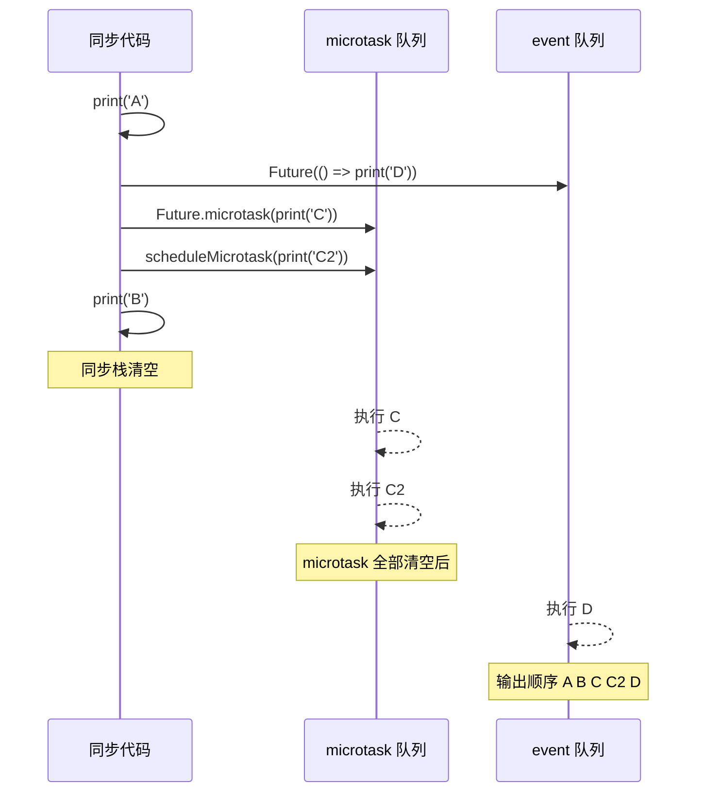

# 03 · 异步编程（Asynchronous Programming）
> Dart 单线程事件循环下的异步模型：Future、async/await、Future.wait、Stream（单订阅/广播）、async*/yield、await for 与错误处理。

## 📖 知识讲解

### Future：一次性的异步结果
`Future<T>` 表示"未来某刻会有一个 T 值（或一个错误）"。两种消费方式：
- **async/await**：`final u = await fetchUser(1);` —— 同步风格写异步，可读性最好。
- **then/catchError**：`fetchUser(2).then(...).catchError(...)` —— 回调风格，返回值沿链传递。

### 并发：Future.wait
`await Future.wait([f1, f2, f3])` 让多个 Future **同时进行**，全部完成后一次性拿到结果列表。三个各 300ms 的请求总耗时约 300ms 而非 900ms。

### 事件循环：microtask vs event queue
Dart 单线程，靠事件循环调度。优先级：
1. 先跑完当前所有**同步代码**；
2. 再清空 **microtask 队列**（`scheduleMicrotask` / `Future.microtask`）；
3. 最后处理 **event 队列**（`Future(() => ...)`、I/O、定时器）。
microtask 永远优先于 event。

### Stream：多次的异步序列
`Stream<T>` 是"随时间陆续到来的多个 T"。
- **单订阅流（single-subscription）**：只能被 `listen` 一次，适合文件/网络读取。`async*` 生成的就是单订阅流。
- **广播流（broadcast）**：`StreamController.broadcast()`，可被多个监听者同时订阅。
- **消费方式**：`await for (final x in stream)` 逐个取值；或 `stream.listen(onData, onError:, onDone:)`。

### async* 与 yield
用 `async*` 声明的函数返回 `Stream`，用 `yield` **逐个产出**元素（`yield*` 可展开另一个流）。惰性：下游消费一个才产出一个。

### 错误处理
- Future：`try { await ... } catch (e) { } finally { }`，`finally` 一定执行。
- Stream：`listen` 的 `onError` 回调，或 `await for` 外包 `try/catch`。

## 🔄 流程图 / 原理图



## 💻 代码说明

`main.dart` 关键片段：

- **await 消费 Future**
  ```dart
  final user = await fetchUser(1); // 暂停到 Future 完成
  ```
- **then 链 + catchError**
  ```dart
  fetchUser(2).then((u) => '欢迎, $u').then(print).catchError((e) => print(e));
  ```
- **并发 Future.wait**
  ```dart
  final results = await Future.wait([fetchUser(10), fetchUser(11), fetchUser(12)]);
  ```
- **事件循环顺序**：`demoEventLoop()` 输出 `A → B → C → C2 → D`。
- **async* 生成流**
  ```dart
  Stream<int> fibStream(int n) async* { yield a; /* ... */ }
  await for (final f in fibStream(6)) stdout.write('$f ');
  ```
- **流错误处理**：`riskyStream().listen(onData, onError:, onDone:)`，第 3 个元素抛错走 `onError`。
- **广播流**：`StreamController<int>.broadcast()` 允许 A、B 两个监听者同时收到 `add` 的值。

> 用 `Completer` + `done.future` 等待基于 `listen` 的流结束，保证 `main` 不提前退出。

## ▶️ 运行方式

```bash
cd 03-dart-async
dart run main.dart
# 或
dart main.dart
```

## ⚠️ 常见坑 / 最佳实践
- **忘记 `await`**：`fetchUser(1);`（漏 await）会得到一个未消费的 Future，程序可能提前结束、异常也不会被捕获。
- **`async` 函数一定返回 `Future`**：即使函数体没写 return，返回类型也是 `Future<void>`。
- **单订阅流不能 listen 两次**，会抛 `Bad state: Stream has already been listened to`；需要多监听者请用 `.broadcast()`。
- **未处理的流错误会崩溃**：务必提供 `onError` 或用 `try/catch` 包住 `await for`。
- **`Future.wait` 只要有一个失败就整体失败**，需要"全部结果含错误"时给每个 Future 加 `.catchError` 或用 `eagerError`/单独 try。
- **记得 `controller.close()`**，否则监听者的 `onDone` 不会触发，可能造成资源泄漏。
- 关注调度顺序：`Future.microtask` 优先于 `Future(...)`，误用会导致执行顺序和直觉不符。

## 🔗 官方文档
- 异步编程总览：https://dart.dev/language/async
- Future 教程：https://dart.dev/libraries/async/using-streams（Stream）与 https://dart.dev/libraries/async/futures-error-handling
- 深入理解异步/事件循环：https://dart.dev/articles/archive/event-loop
