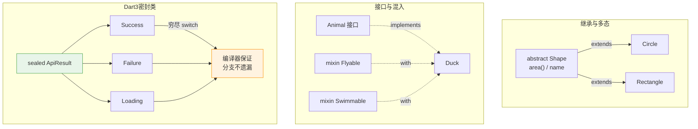

# 04 · 面向对象与 Dart 3 新特性（OOP & Dart 3 Features）
> Dart 是纯面向对象语言（连 `int`、`null` 都是对象）。本模块讲透类/构造/继承/接口/mixin/泛型，并覆盖 Dart 3 的 sealed 类 + 模式匹配、增强枚举、extension 扩展方法。

## 📖 知识讲解

### 1. 类与四种构造函数
- **普通构造** `Point(this.x, this.y)`：`this.x` 形参简写，自动把实参赋给字段。
- **命名构造** `Point.origin()`：一个类可有多个命名构造，常用 `: this(...)` **重定向**到主构造。
- **初始化列表** `: x = ..., y = ...`：在构造体运行**之前**给 `final` 字段赋值（`final` 字段不能在构造体里赋值）。
- **const 构造**：字段全 `final` 且构造用 `const` 修饰 → 可作**编译期常量**。相同实参的 const 实例会被**规范化（canonicalize）为同一个对象**，`identical` 返回 `true`。
- **factory 工厂构造**：不强制新建实例，可返回**缓存实例**或**子类实例**（如单例、对象池、按 JSON 决定具体子类）。

### 2. getter / setter
用 `get`/`set` 定义**计算属性**，调用端像访问字段一样（无括号）。setter 里可做**校验或副作用**。字段以 `_` 开头表示**库私有**（Dart 没有 `private` 关键字，私有性以库为边界）。

### 3. 继承 / 抽象类 / 多态
- `extends` 单继承，`super` 调父类，`@override` 覆写。
- `abstract class` 不能实例化，可含**抽象方法/抽象 getter**（无方法体），子类必须实现。
- **多态**：把子类实例装进父类型集合，调用同名方法在运行时分派到各自实现。

### 4. 接口 implements 与 mixin with
- Dart **没有 `interface` 关键字**：任何类都能被 `implements`，但要实现其**全部成员**（继承 `extends` 才继承实现）。
- **mixin** 用 `with` 混入，横向复用行为，避免多继承的菱形问题。一个类可 `with A, B` 混入多个。

### 5. 泛型与约束
`Box<T>` 用类型参数 `T` 复用逻辑并保留类型安全；`sumAll<T extends num>` 用 **`extends` 约束**限定 `T` 必须是 `num` 子类型，才能用 `+`。

### 6. 增强枚举（Enhanced Enum，Dart 2.17+）
枚举可带 `final` 字段、`const` 构造、方法/getter，让枚举成为「带数据的有限集合」。

### 7. Dart 3 · sealed 类 + 模式匹配
- **`sealed`**（密封类）：所有直接子类必须定义在**同一个库**内。
- 好处：`switch` 时编译器做**穷尽性检查（exhaustiveness）**——漏掉一个子类分支会**编译报错**，无需写 `default`。配合**对象模式解构** `Success(:final data)` 直接取出字段，是替代「手写 union/tagged 类型」的利器。

### 8. extension 扩展方法
`extension on 类型` 能给**已有类型**（包括 `String`/`int`/第三方类）新增方法或 getter，而无需继承或改源码。

## 🔄 流程图 / 原理图

类型关系（继承 / 接口 / mixin / 密封）：



## 💻 代码说明

`main.dart` 分 10 段演示：

- **构造函数（1~3）**：`Point` 展示普通/命名/初始化列表；`ImmutablePoint` 展示 `const` 规范化（`identical(a,b)==true`）；`Logger` 用 `factory` + 静态 `Map` 缓存实现「同名复用同一实例」。
- **getter/setter（4）**：`Account.balance` 的 setter 拦截负数并抛 `ArgumentError`。
- **继承多态（5）**：`Shape` 抽象类，`Circle`/`Rectangle` 各自实现 `area()`，遍历 `List<Shape>` 体现多态分派。
- **接口 + mixin（6）**：`Duck with Flyable, Swimmable implements Animal`，同时拥有混入的 `fly/swim` 与实现的 `describe`。
- **泛型（7）**：`Box<T>` 与 `sumAll<T extends num>`。
- **增强枚举（8）**：`Planet` 带 `label/gravity` 字段和 `isHeavy` getter。
- **sealed + 模式匹配（9）**：`render(ApiResult)` 用 **switch 表达式**覆盖 `Success/Failure/Loading` 三个子类并解构字段——去掉任一分支即编译失败。
- **extension（10）**：给 `String` 加 `repeat`、给 `int` 加 `parityLabel`。

> 为保持 demo 自包含，用牛顿迭代 `_sqrt` 代替 `dart:math` 的 `sqrt`。

## ▶️ 运行方式

```bash
cd 04-dart-oop
dart run main.dart
# 或
dart main.dart
```

需 Dart 3.x（`dart --version` 确认）；sealed 类与模式匹配是 Dart 3 语法，低版本会报错。

## ⚠️ 常见坑 / 最佳实践

- **`final` 字段只能在初始化列表或声明处赋值**，不能在构造体 `{}` 里赋值。
- **`const` 构造要求字段全 `final`**；否则不能 const。想让实例成为编译期常量，创建时也要写 `const`。
- **`implements` 要实现接口的每一个成员**（包括 getter/setter），只想复用实现请用 `extends` 或 `with`。
- **mixin 冲突**：多个 mixin 有同名成员时，**靠后的 `with` 覆盖靠前的**；`super` 调用顺序按线性化规则。
- **sealed 的子类必须同库**：跨库继承 sealed 类会报错；这正是穷尽检查能成立的前提。
- **私有靠库不靠类**：`_field` 在**同一个 `.dart` 文件/库**内可互相访问，并非「类私有」。
- **别滥用 extension 覆盖同名成员**：实例本身已有的成员优先，extension 只在没有同名成员时生效。

## 🔗 官方文档

- 类 Classes：https://dart.dev/language/classes
- 构造函数 Constructors：https://dart.dev/language/constructors
- 扩展方法 Extension methods：https://dart.dev/language/extension-methods
- 泛型 Generics：https://dart.dev/language/generics
- Mixin：https://dart.dev/language/mixins
- 枚举 Enums：https://dart.dev/language/enums
- 模式 Patterns：https://dart.dev/language/patterns
- 分支 · switch 与穷尽性：https://dart.dev/language/branches
- sealed 类与 class modifiers：https://dart.dev/language/class-modifiers
