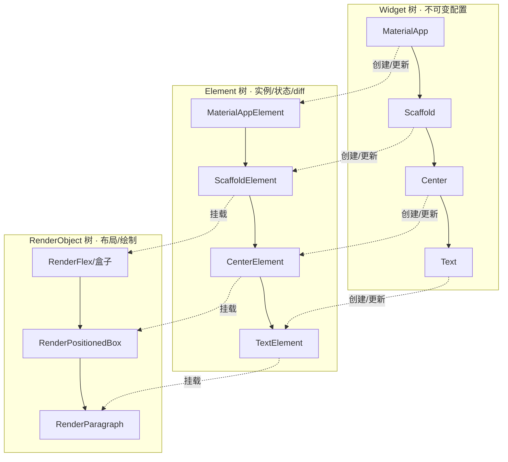
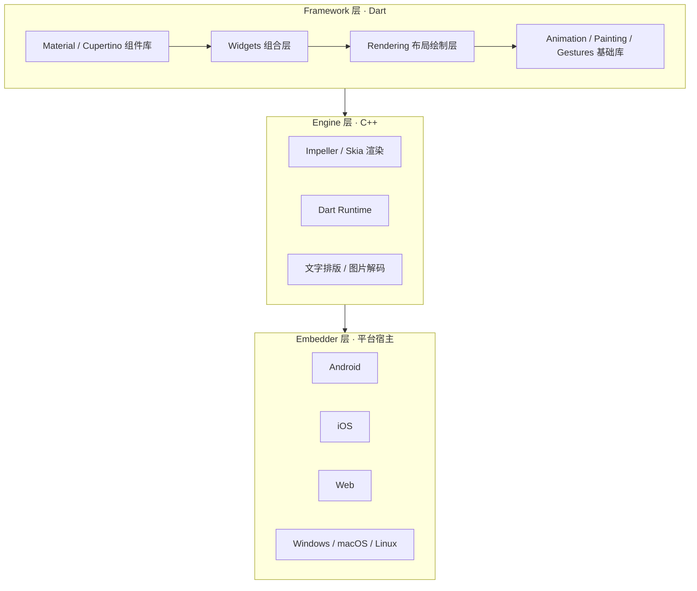

# 05 · Flutter 架构入门（Flutter Intro）
> 用一个 Hello World 讲透 Flutter 的核心心智模型：一切皆 Widget、声明式 UI、三棵树与自绘引擎。

## 📖 知识讲解

### 1. 一切皆 Widget（Everything is a Widget）
在 Flutter 里，结构（Scaffold、Row）、样式（Padding、Center、Theme）、甚至手势（GestureDetector）与动画，几乎都是 Widget。你通过**组合（composition）**而非继承来搭建界面——把小 Widget 嵌套成一棵大树。Widget 本身是**不可变的（immutable）配置描述**，非常轻量，随时可以被重建、丢弃。

### 2. 声明式 UI（Declarative UI）
传统命令式 UI（如原生 Android/iOS、jQuery）是「找到某个控件，手动改它的属性」。Flutter 是声明式：你写一个 `build` 方法，**根据当前状态描述「界面应该长什么样」**，状态一变就重新 `build`，框架负责算出最小差异并更新屏幕。公式可记为：`UI = f(state)`。这与 React 的思路完全一致。

### 3. 三棵树（Three Trees）
Flutter 运行时同时维护三棵相互对应的树，这是理解性能与 `key` 的关键：

| 树 | 是什么 | 生命周期 | 职责 |
|---|---|---|---|
| **Widget 树** | 不可变的配置蓝图 | 极短，频繁重建 | 描述「想要什么」 |
| **Element 树** | Widget 的实例化节点，持有状态、连接上下两层 | 较长，尽量复用 | 管理生命周期、做 diff |
| **RenderObject 树** | 真正负责布局、绘制、命中测试 | 长，代价大故复用 | 算尺寸、画像素 |

每次 `setState` 后，框架用**新 Widget 树**和旧 Element 树逐节点比对：类型与 `key` 相同则复用 Element（只更新配置），否则销毁重建。RenderObject 昂贵，因此能复用就复用——这就是「Widget 便宜、Element/RenderObject 贵」的由来。

### 4. 自绘引擎：Skia / Impeller
Flutter **不使用平台原生控件**，而是自带渲染引擎，直接把像素画到一块画布上。老引擎是 **Skia**；新一代默认引擎是 **Impeller**（iOS 已默认，Android 逐步默认），它在应用启动时预编译着色器，消除了 Skia 时代首帧「着色器卡顿（jank）」的问题。因为自绘，Flutter 能做到跨平台像素级一致。

### 5. Dart → AOT 编译
- **Debug 模式**：Dart 用 **JIT**（即时编译）+ VM，支持**有状态热重载（Hot Reload）**，改代码毫秒级见效。
- **Release 模式**：Dart 编译为**原生机器码（AOT）**，没有解释器开销，启动快、运行流畅。

### 6. 分层架构
Flutter 自上而下分三层：**Framework（Dart 写，你日常打交道的层）→ Engine（C++ 写，含渲染、文字排版、Dart 运行时）→ Embedder（各平台的宿主接入层）**。见下方原理图。

## 🔄 流程图 / 原理图

三棵树的对应关系：



Flutter 分层架构（Framework / Engine / Embedder）：



## 💻 代码说明

`main.dart` 是一个可直接编译的最小应用：

- `main()` → `runApp(const MyApp())`：程序入口，把根 Widget 挂载到屏幕，触发三棵树构建。
- `MyApp`（`StatelessWidget`）：返回 `MaterialApp`，提供 Material 3 主题与路由脚手架。`ColorScheme.fromSeed` 是当前推荐的配色写法。
- `HomePage`：用 `Scaffold` 搭页面骨架（`AppBar` + `body`），`Center` 居中，`Text` 显示文字。
- 注意几乎每个节点都是 Widget，且构造函数都能加 `const`——`const` Widget 在重建时会被框架直接复用，是重要的性能习惯。

## ▶️ 运行方式

```bash
flutter create demo          # 生成标准脚手架工程
cd demo
# 用本目录的 main.dart 覆盖 lib/main.dart
cp ../05-flutter-intro/main.dart lib/main.dart
flutter run                  # 选择模拟器/真机运行
```

运行后应看到一个带蓝色主题 AppBar、正中显示「Hello, Flutter!」的页面。改动 `Text` 内容后保存，按 `r` 触发热重载即可秒级看到变化。

## ⚠️ 常见坑 / 最佳实践

- **能加 `const` 就加 `const`**：`const` Widget 在重建时被复用，减少无谓的 Element diff，是最容易被忽略的性能优化。
- **别把 Widget 当「视图对象」缓存**：Widget 是一次性的不可变描述，每帧都可能被重建，代价极低；有状态的东西放在 `State`（下一模块）里。
- **`build` 方法要保持纯粹**：只根据当前状态返回 UI 描述，不要在里面做网络请求、启动定时器等副作用。
- **Hot Reload 有边界**：修改 `main()`、全局静态字段初始值、枚举定义、类继承关系等，热重载可能不生效，需要 **Hot Restart（`R`）** 或重新运行。
- **Impeller 相关渲染差异**：若在 Android 上遇到少见的渲染问题，可临时用 `flutter run --no-enable-impeller` 排查是否引擎相关。

## 🔗 官方文档

- Flutter 架构总览：https://docs.flutter.dev/resources/architectural-overview
- Widget 简介：https://docs.flutter.dev/ui/widgets-intro
- Inside Flutter（三棵树与渲染管线）：https://docs.flutter.dev/resources/inside-flutter
- Impeller 渲染引擎：https://docs.flutter.dev/perf/impeller
