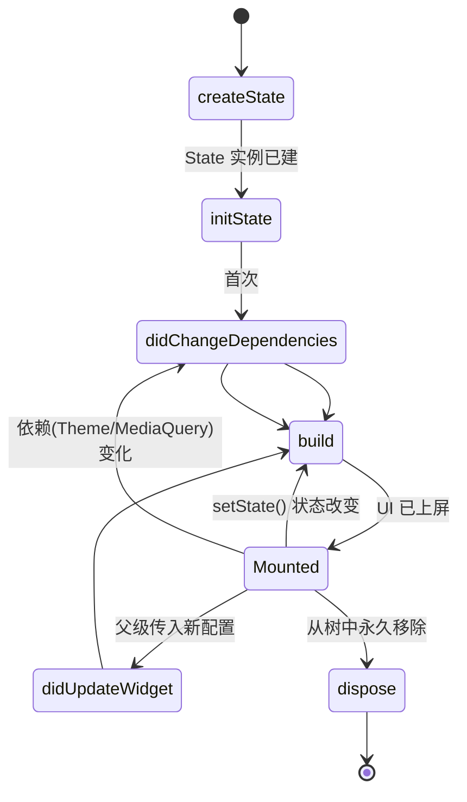

# 06 · 无状态与有状态组件（StatelessWidget vs StatefulWidget）
> 搞清楚「什么时候用哪个」，以及 State 对象在重建之间如何存活、生命周期如何流转。

## 📖 知识讲解

### 1. 两类 Widget 的本质区别

| | StatelessWidget | StatefulWidget |
|---|---|---|
| 有无内部可变状态 | 无 | 有 |
| 渲染依赖 | 仅构造参数 | 构造参数 + 内部 `State` |
| 如何变化 | 只能由父级传新参数并重建 | 自身调用 `setState` 触发重建 |
| 结构 | 一个类，一个 `build` | 两个类：Widget + State |
| 典型场景 | 图标、静态卡片、纯展示 | 表单、计数器、动画、需持有控制器 |

**共同点**：Widget 本身都是**不可变**的，字段必须 `final`。区别只在于「有没有一个能跨重建存活的 State 对象来装可变数据」。

### 2. 为什么 StatefulWidget 要拆成两个类？
因为 **Widget 会被频繁丢弃重建，但状态不能丢**。Flutter 把「不可变配置（Widget）」和「可变状态（State）」分开：Widget 每帧可能重造，而 `State` 对象由 Element 持有、在整个生命周期内**只创建一次并持续存活**。这样 `_count` 这类数据才不会在重建时被清零。

### 3. `setState` 做了什么？
`setState(fn)` 先执行 `fn` 修改状态，然后**把该 Element 标记为 dirty**，框架在下一帧调用它的 `build` 重新生成 Widget 子树，再做最小化 diff 更新屏幕。要点：
- 必须在 `setState` 回调**内部**修改状态；只在外面改、`setState` 传空回调虽然也能触发重建，但语义不清晰、不推荐。
- `setState` 只重建**当前这个 State 的子树**，不会重建整棵应用树。

### 4. State 生命周期（核心）
按调用顺序：
1. **`createState()`** —— StatefulWidget 创建其 State 实例（仅一次）。
2. **`initState()`** —— State 插入树后调用一次。做订阅、初始化控制器、发首屏请求。**不能**在这里用 `Theme.of`/`MediaQuery.of` 等依赖 InheritedWidget 的东西（此时还不安全）。
3. **`didChangeDependencies()`** —— 紧接 initState 调用一次；之后每当依赖的 InheritedWidget 变化会再次调用。适合读取继承数据。
4. **`build()`** —— 构建 UI，可能被调用**很多次**（每次 setState、父级重建、依赖变化）。必须无副作用。
5. **`didUpdateWidget(oldWidget)`** —— 父级用「新的同类型 Widget」重建本节点时调用，可对比新旧配置。
6. **`setState()`** —— 由你主动调用，触发新一轮 build。
7. **`dispose()`** —— State 永久移除时调用一次。**取消订阅、释放控制器**，防止内存泄漏。

## 🔄 流程图 / 原理图

State 生命周期状态图：



## 💻 代码说明

`main.dart` 同时演示两类 Widget：

- **`CounterPage` / `_CounterPageState`（有状态）**：
  - `_count` 是可变状态，存在 State 对象里，跨重建存活。
  - `_increment()` 里用 `setState` 自增并触发重建。
  - 完整重写了 `initState / didChangeDependencies / didUpdateWidget / build / dispose`，每个都用 `debugPrint` 打日志——运行后点按钮、切换主题即可在控制台看到调用顺序。
  - 用 `widget.title` 访问 StatefulWidget 上的 `final` 字段。
- **`InfoCard`（无状态）**：只接收 `label`、`value` 两个参数并渲染；它自己不会变，值变了是因为 `CounterPage` 用新的 `value` 重建了它。这正体现「无状态 Widget 靠父级传参驱动」。

## ▶️ 运行方式

```bash
flutter create demo
cd demo
cp ../06-stateless-stateful/main.dart lib/main.dart
flutter run
```

运行后：点击右下角 `+` 按钮，卡片计数递增；观察 IDE/终端控制台，能看到 `build` 每次点击都打印，而 `initState` 只在首次打印一次。

## ⚠️ 常见坑 / 最佳实践

- **忘记 `dispose` 释放资源**：`AnimationController`、`TextEditingController`、`StreamSubscription`、定时器等必须在 `dispose` 里释放/取消，否则内存泄漏。
- **在 `build` 里做副作用**：`build` 可能一帧调用多次，别在里面发请求、启动定时器；这类逻辑放 `initState`。
- **`setState` 之后组件已卸载**：异步回调返回时 State 可能已 `dispose`，直接 `setState` 会报错。先判断 `if (mounted) setState(...)`。
- **能用 Stateless 就别用 Stateful**：无内部状态时用 StatelessWidget 更轻、更易测。
- **别把状态提得过深**：如果多个兄弟节点要共享状态，考虑「状态提升」到共同父级，或用状态管理（见模块 08）。
- **`initState` 里别用 `context` 读 InheritedWidget**：如 `Theme.of(context)` 应放到 `didChangeDependencies` 或 `build`。

## 🔗 官方文档

- StatefulWidget API：https://api.flutter.dev/flutter/widgets/StatefulWidget-class.html
- StatelessWidget API：https://api.flutter.dev/flutter/widgets/StatelessWidget-class.html
- 状态管理入门 · setState：https://docs.flutter.dev/data-and-backend/state-mgmt/simple
- 交互式添加（教程）：https://docs.flutter.dev/ui/interactivity
